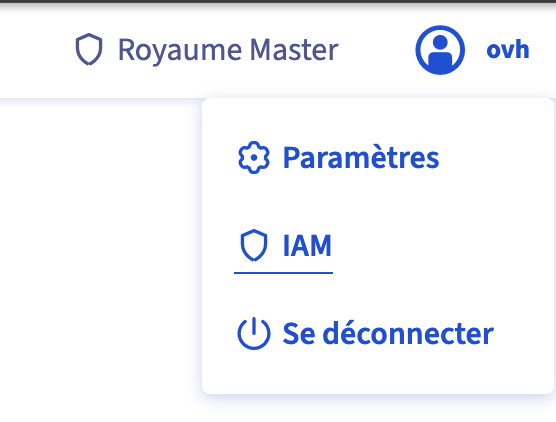

## Objective

This guide explains how to manage rights and access (IAM - Identity and Access Management) on your **On-Prem Cloud Platform (OPCP)**.

All authentication is centralised in **Keycloak** (Realm Master), which serves as the single entry point for:

- Access to the **Dashboard** (unified service dashboard)
- Access to the **OpenStack Horizon** graphical interface
- Access to the **OpenStack APIs** (Keystone, Nova, Neutron, Glance, Ironic...)
- Access to the monitoring tools: **Grafana**, **Netbox**, **Prometheus**

## Requirements

- A delivered and operational **On-Prem Cloud Platform**
- Access to the Keycloak interface with an account holding the `it_admin` role or higher
- Familiarity with the guide [Getting started with your OPCP](/pages/hosted_private_cloud/opcp/opcp-getting-started)

## Instructions

### Authentication architecture

Authentication on the **OPCP** relies on two distinct layers:

- **Control plane access**: SSH access to the controllers that make up the platform infrastructure, provided at service delivery
- **Service access**: centralised in **Keycloak** (Realm Master), the single entry point for the Dashboard, OpenStack, Grafana, Netbox and Prometheus

### Control plane access

When your **OPCP** is made available, you receive credentials to connect via SSH to the various controllers that make up the platform's control plane.

The access scope of the administrator account provided to you varies depending on the chosen management mode.

#### OVHcloud-managed mode

In managed mode, the administrator account provided to you has extended rights to run the platform administration tools:

- `opcp-cli`: command-line tool for platform administration
- `opcp-diag`: control plane diagnostic tool

The deployment and updates of the control plane are handled by OVHcloud.

#### Non-managed mode

In non-managed mode, the administrator account provided to you has **full privileges** over the control plane, allowing you to:

- Deploy the control plane
- Update the control plane
- Access all administration tools

> [!warning]
>
> In non-managed mode, OVHcloud does not handle control plane administration operations. You are responsible for deployment and updates.
>

#### Initial credentials

Two types of credentials are provided when your OPCP is initialised:

**Linux administrator account**: used for SSH connections to the controllers. By default, **password authentication is disabled** on the controllers. During the installation of your OPCP, an SSH public key of your choice can be provided to OVHcloud to be deployed and allow you first access. A password is also provided, useful only for direct server access via the console in the event that SSH access is unavailable.

**Keycloak administrator account**: provided in both managed and non-managed modes, this account has full administration rights over the Realm Master. A temporary password is assigned, which you must **change at first login**.

> [!primary]
>
> These initial credentials are separate from the user accounts you will subsequently create in Keycloak for your teams. Store them securely and change the temporary passwords immediately after delivery.
>

### Accessing the Keycloak administration interface

Two methods are available to access the Keycloak administration interface of your **OPCP**.

**Via the Dashboard**: log in to `admin.dashboard.<domainname>`, then click on your name in the top right corner. A menu appears with an **IAM** link that redirects you directly to the Keycloak interface.

{.thumbnail}

**Direct access**: you can also access Keycloak directly via `admin.keycloak.<domainname>`.

> [!primary]
>
> Replace `<domainname>` with the domain name provided at the delivery of your OPCP.
>

### Role hierarchy

The IAM model of the **OPCP** is based on four distinct roles, from the most restricted to the most privileged. These roles are a starting point — Keycloak gives you full flexibility to compose your own roles and assign them to user groups to match your organisation's needs.

> [!primary]
>
> You can create custom roles in Keycloak by combining available permissions, then assign them to user groups. Refer to the [official Keycloak documentation](https://www.keycloak.org/docs/latest/server_admin/index.html) for advanced role and group management.
>

#### The `reader` role

Supervision and audit profile. This role provides read-only access to the platform's monitoring tools.

It allows you to:

- View your own account settings in Keycloak
- Access **Grafana** in read-only mode (metrics visualisation)
- Access **Netbox** in read-only mode (network inventory)
- Access **Prometheus** in read-only mode
- Access the **Dashboard** and the Grafana, Netbox and Prometheus iframes
- Access the **OpenStack** iframe in the Dashboard
- Access OpenStack projects in **view** mode only, subject to project attributes configured in Keycloak

> [!primary]
>
> The `reader` role's OpenStack access is limited to `view`. It requires project attributes to be configured on the Keycloak account or group. Without a project attribute, no OpenStack resource is visible.
>

#### The `dc_operator` role

Datacenter operator. This role is intended for teams responsible for network and physical infrastructure.

It provides the following additional access compared to `reader`:

- Administer **Grafana**: edit dashboards and manage datasources
- Access **Netbox** as an operator (create and modify network resources)
- Access the **Dashboard** (Grafana, Netbox, Prometheus iframes)

> [!primary]
>
> The `dc_operator` does not have access to **OpenStack** or to Keycloak user administration.
>

#### The `it_admin` role

Main platform operator. This role is intended for IT teams who manage OPCP resources on a daily basis.

It provides the following additional access compared to `dc_operator`:

- Manage Realm Master users in Keycloak (create accounts, assign rights)
- Access **OpenStack** with full rights (`view`, `member`, `admin`)
- Access the **Dashboard** with the OpenStack iframe

> [!warning]
>
> The `it_admin` role does not allow modification of global Keycloak realm settings (password policy, identity federation, etc.). These actions are reserved for `master_admin`.
>

#### The `master_admin` role

Platform administrator. This role has full rights, including complete administration of the Keycloak Realm Master.

It provides the following additional access compared to `it_admin`:

- Modify the Realm Master configuration (security policy, federation, etc.)
- Administer **Netbox** with full rights, including the `admin` role

> [!warning]
>
> The `master_admin` role is assigned by OVHcloud at service delivery. Its use should be limited to platform administration operations that cannot be delegated to an `it_admin`.
>

### Rights matrix

The table below summarises the access for each role across the integrated applications.

**Legend**: ✅ Allowed | ❌ Not allowed | 🟡 Partial (subject to project attributes)

| Application | Permission | `reader` | `dc_operator` | `it_admin` | `master_admin` |
|---|---|:---:|:---:|:---:|:---:|
| **Keycloak** | View own account settings | ✅ | ✅ | ✅ | ✅ |
| **Keycloak** | Manage realm users | ❌ | ❌ | ✅ | ✅ |
| **Keycloak** | Administer realm (policy, federation) | ❌ | ❌ | ❌ | ✅ |
| **OpenStack** | view | 🟡 | ❌ | ✅ | ✅ |
| **OpenStack** | member (edit) | ❌ | ❌ | ✅ | ✅ |
| **OpenStack** | admin | ❌ | ❌ | ✅ | ✅ |
| **Grafana** | view | ✅ | ✅ | ✅ | ✅ |
| **Grafana** | edit (dashboards) | ❌ | ✅ | ✅ | ✅ |
| **Grafana** | admin (datasources) | ❌ | ✅ | ✅ | ✅ |
| **Netbox** | reader | ✅ | ✅ | ✅ | ✅ |
| **Netbox** | operator | ❌ | ✅ | ✅ | ✅ |
| **Netbox** | admin | ❌ | ❌ | ❌ | ✅ |
| **Prometheus** | view | ✅ | ✅ | ✅ | ✅ |
| **Dashboard** | Keycloak — account settings | ✅ | ✅ | ✅ | ✅ |
| **Dashboard** | Keycloak — user administration | ❌ | ❌ | ✅ | ✅ |
| **Dashboard** | OpenStack (iframe) | ✅ | ❌ | ✅ | ✅ |
| **Dashboard** | Grafana (iframe) | ✅ | ✅ | ✅ | ✅ |
| **Dashboard** | Netbox (iframe) | ✅ | ✅ | ✅ | ✅ |
| **Dashboard** | Prometheus (iframe) | ✅ | ✅ | ✅ | ✅ |

> [!primary]
>
> The `reader` role's OpenStack `view` access requires **project attributes** to be configured on the user or their group in Keycloak. Without a configured project attribute, no OpenStack resource is accessible.
>

### Creating a user and assigning a role

#### Creating a user

In the Keycloak interface, make sure you are connected to the **Realm Master**, then go to **Users** > **Add user**.

Fill in the following fields:

- **Username**: the user's login identifier
- **Email**: email address (recommended)
- **First name / Last name**: user's full name

Click **Create**, then open the **Credentials** tab to set a temporary password. Enable the **Temporary** option to force the user to change it at their first login.

#### Assigning a role to a user

In the user's profile, open the **Role mapping** tab, then click **Assign role**.

In the filter, select **Filter by realm roles**, then search for and select the desired role (`reader`, `dc_operator`, `it_admin` or `master_admin`). Click **Assign**.

> [!primary]
>
> A user can be assigned multiple roles. The effective permissions are the union of the rights from all roles assigned to them.
>

#### Assigning a role to a group

It is recommended to assign roles to **groups** rather than individual users, to simplify rights management at scale.

In Keycloak, go to **Groups** > **Create group**, name the group, then open the **Role mapping** tab to assign the desired role.

Then add users to the group via their user profile, **Groups** tab > **Join group**.

### Configuring OpenStack rights via Keycloak attributes

For the `reader` role, access rights to OpenStack projects are defined directly in the **user attributes** (or group attributes) in Keycloak.

#### Adding a project attribute to a user

In the Keycloak interface, navigate to the relevant user, then open the **Attributes** tab.

Add a new attribute with the following values:

- **Key**: `project`
- **Value**: a JSON object describing the project and role to assign

```json
{
    "domain": {
        "name": "Default"
    },
    "name": "project-name",
    "roles": [
        {
            "name": "reader"
        }
    ]
}
```

> [!primary]
>
> For the `reader` role, only the OpenStack `reader` role (read-only) can be assigned via project attributes. The `member` and `admin` roles remain reserved for `it_admin` and `master_admin`.
>

#### Assigning multiple projects to a user

You can add **multiple `project` attributes** to the same user or group. They will automatically be merged into a `projects` attribute in the token sent to Keystone.

#### Configuring attributes on a group

The same configuration can be applied to a **Keycloak group**. All members of the group will automatically inherit the project attributes defined on that group.

In Keycloak, go to **Groups**, select the desired group, then fill in the `project` attributes in the same way as for an individual user.

> [!primary]
>
> Attributes defined on a group and those defined directly on the user are merged. A user can therefore benefit from projects from multiple groups in addition to their own attributes.
>

#### Keycloak as the single source of truth

We recommend not creating users directly in OpenStack, in order to keep Keycloak as the **single source of truth** for platform accounts. Any account created directly in OpenStack would bypass the lifecycle managed by Keycloak and would not benefit from automatic cleanup or centralised rights management.

#### Service accounts for automation

For automation needs (Terraform, OpenTofu, scripts, CI/CD pipelines...), we recommend creating a **dedicated account in Keycloak** with permissions scoped to the automation's requirements, then generating **OpenStack application credentials** associated with that account.

Application credentials allow your automation tools to drive OpenStack without depending on a personal user's credentials. A user connected to OpenStack with their Keycloak account can create their own application credentials from the Horizon interface, via **Identity** > **Application Credentials** > **Create Application Credentials**.

> [!primary]
>
> If the associated Keycloak account is deleted, the OpenStack application credentials will be automatically revoked. Avoid linking critical automation to a personal account.
>

For more details on configuring Keycloak authentication with the OpenStack CLI and obtaining your credentials, refer to the guide [How to use the APIs and obtain the credentials](/pages/hosted_private_cloud/opcp/how-to-use-api-and-get-credentials).

### Automatic account cleanup

The platform reacts to user deletion events in Keycloak: as soon as an account is removed from the Realm Master, the associated OpenStack users and **application credentials** are automatically deleted.

> [!warning]
>
> Deleting an account in Keycloak immediately triggers the revocation of the associated OpenStack application credentials. Consider this impact before deleting any account, particularly if automations or scripts rely on those credentials.
>

### Advanced Keycloak configuration

All official Keycloak features are available on your **OPCP**. For any advanced configuration (password policies, fine-grained role management, client configuration, etc.), refer to the [official Keycloak documentation](https://www.keycloak.org/docs/latest/server_admin/index.html).

#### Multi-factor authentication (MFA / OTP)

We strongly recommend enabling **multi-factor authentication** on your platform accounts, particularly for the `it_admin` and `master_admin` roles. Keycloak natively supports the TOTP (Time-based One-Time Password) protocol, compatible with any authentication application supporting this open standard, such as FreeOTP.

MFA configuration is done at the realm authentication flow level. Refer to the [official Keycloak documentation](https://www.keycloak.org/docs/latest/server_admin/index.html#post-login-flow-examples) to set up a post-login flow with mandatory or conditional OTP based on roles.

#### Identity federation and Identity Providers

Keycloak supports federating external directories (Active Directory, LDAP) or connecting third-party Identity Providers (SAML, OIDC). For example, to set up federation with an Active Directory, refer to the dedicated section of the [official Keycloak documentation](https://www.keycloak.org/docs/latest/server_admin/index.html#_user-storage-federation).

> [!warning]
>
> When setting up Keycloak federation or adding an Identity Provider pointing to an external endpoint, you must allow the corresponding network flows in the OPCP configuration file via the `keycloakAllowedEndpoints` variable.
>

```yaml
keycloakAllowedEndpoints:
    - host: "myactivedirectory.corp.com"
      port: 636
    - host: "keycloak.corp.com"
      port: 443
```

Each entry corresponds to an external endpoint that Keycloak must be authorised to reach. Add as many entries as needed depending on your configuration.

#### Automation with OpenTofu / Terraform

User, group and role management in Keycloak can be automated using Infrastructure as Code tools such as **OpenTofu** or **Terraform**, via the official Keycloak provider.

This allows you to manage your access rights in a declarative, reproducible and version-controlled way.

Example resource to create a user:

```hcl
resource "keycloak_user" "john_doe" {
  realm_id = "master"
  username = "john.doe"
  enabled  = true

  email      = "john.doe@corp.com"
  first_name = "John"
  last_name  = "Doe"

  initial_password {
    value     = "changeme"
    temporary = true
  }
}
```

For all available resources (users, groups, roles, federation, etc.), refer to the [Keycloak provider documentation](https://registry.terraform.io/providers/keycloak/keycloak/latest/docs/resources/user).

### Listing all rights

#### Via opcp-diag (consolidated view)

To get a complete view of all accounts and their rights on the platform, connect via SSH to a controller and run:

```bash
opcp-diag audit
```

This tool displays all accounts declared in **Keycloak**, on the **controllers**, and across the various tools that make up the control plane.

#### Available options

| Option | Description |
|---|---|
| `-o, --format` | Output format: `json` (default) or `text` |
| `--only` | Restrict the audit to one or more comma-separated types |

The available audit types for `--only` are:

| Type | Description |
|---|---|
| `keycloak_master` | Accounts and rights configured in the Keycloak Realm Master |
| `openstack` | OpenStack users and roles |
| `linux` | Accounts present on the controllers |
| `netbox` | Accounts in Netbox, the platform's CMDB |
| `nog` | Accounts in NOG, the component that drives network device configuration to apply Neutron networks |

For example, to audit only Keycloak and OpenStack:

```bash
opcp-diag audit --only keycloak_master,openstack
```

For a human-readable text output:

```bash
opcp-diag audit --format text
```

#### Manipulating the JSON output

The default output is in **JSON** format, making it easy to manipulate and filter with tools like `jq`. For example:

```bash
# Export the full result to a dated file
opcp-diag audit > audit-$(date +%Y%m%d).json

# Audit only Keycloak and filter on a specific user
opcp-diag audit --only keycloak_master | jq '.keycloak_master.users[] | select(.username == "john.doe")'
```

> [!primary]
>
> `opcp-diag audit` is the recommended method for auditing your platform's access. Unlike the OpenStack CLI, it covers all accounts present on the platform, regardless of their connection history.
>

#### Via the OpenStack CLI

To list active role assignments in OpenStack:

```bash
openstack role assignment list --names
```

To list the roles available on the platform:

```bash
openstack role list
```

> [!warning]
>
> These commands only return users who have **already authenticated** at least once via OpenStack. Users present in Keycloak who have never made an OpenStack connection will not appear in these results.
>

## Go further

If you need training or technical assistance with the implementation of our solutions, contact your sales representative or click on [this link](/links/professional-services) to get a quote and request a custom analysis of your project from our Professional Services team experts.

Join our [community of users](/links/community).
