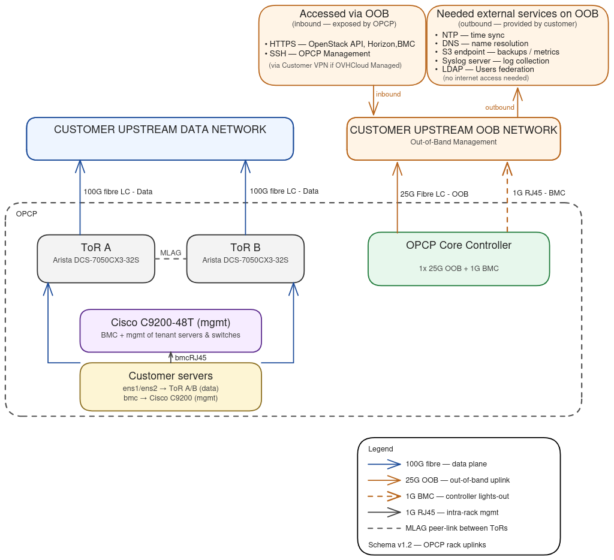
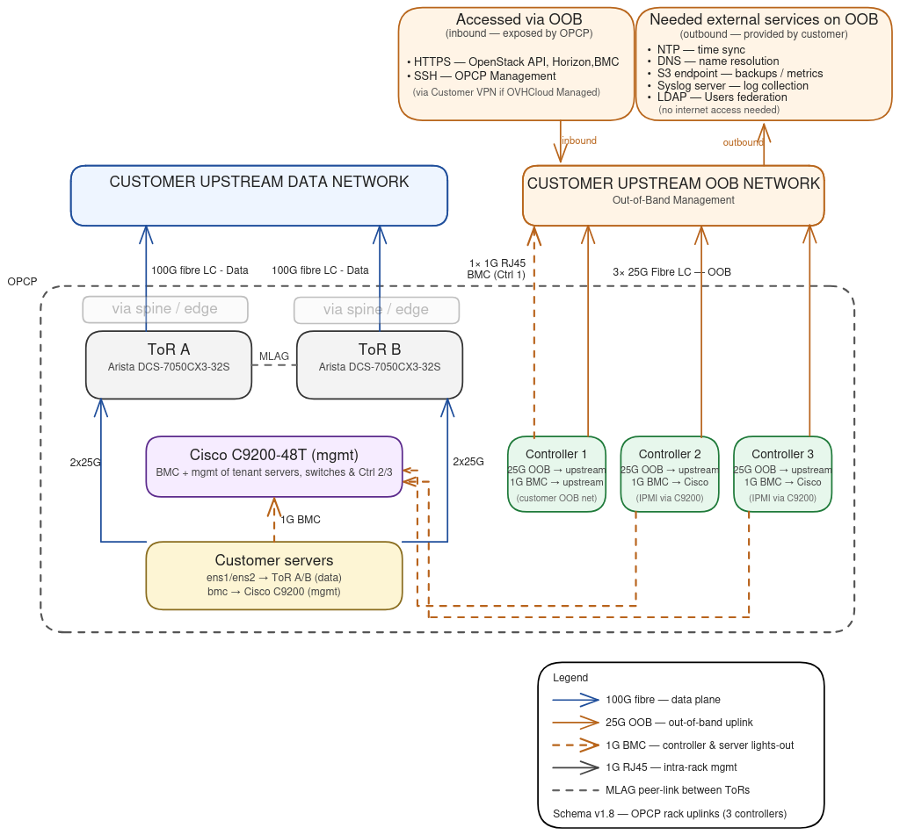

## Objectif

**On-Prem Cloud Platform (OPCP)** est une solution de cloud privé déployée sur vos propres infrastructures, livrée sous forme d'une pile intégrée (serveurs, switches, automation, plan de contrôle). Avant et pendant le déploiement, votre équipe doit comprendre comment OPCP s'interconnecte avec votre réseau d'entreprise : par où il communique, quels flux il émet, quels services il consomme chez vous, et – si vous avez souscrit le mode Fully managed by OVHcloud – comment OVHcloud accède à la plateforme pour l'opérer à distance.

**Ce guide a pour objectif de vous présenter l'architecture réseau d'OPCP**, en distinguant :

- le **réseau d'administration (Out-of-Band, OOB)** utilisé pour piloter la plateforme,
- le **réseau de données (*data plane*)** utilisé par les charges de travail hébergées sur les serveurs OPCP.

Il s'adresse aussi bien aux **architectes** préparant un déploiement qu'aux **administrateurs** prenant en main une plateforme déjà livrée.

## Prérequis

- Une vision générale de votre architecture réseau d'entreprise (VLAN, plan d'adressage, équipements de bordure, firewalls).
- Connaître le **modèle de souscription OPCP** retenu (Self-managed ou Fully managed by OVHcloud).
- Avoir parcouru la liste des [pré-requis techniques OPCP](/links/hosted-private-cloud/opcp-prerequisites) à fournir avant le déploiement.

## En pratique

### 1. Les niveaux de gestion d'OPCP

OPCP est proposé selon deux niveaux de délégation. Le niveau choisi détermine **qui opère** le plan de contrôle (*control plane*) de la plateforme et donc **quels flux d'interconnexion** doivent être ouverts vers OVHcloud.

| Mode | Qui opère le **Core** (*control plane*) ? | Qui opère les **services applicatifs** ? | Interconnexion vers OVHcloud requise ? |
|------|---|---|---|
| **Self-managed** | Le client | Le client | Non |
| **Fully managed by OVHcloud** | OVHcloud | OVHcloud | **Oui** (IPsec) |

Quel que soit le mode, **la gestion de ce que vous déployez au-dessus des services fournis par OPCP reste de votre responsabilité** : machines virtuelles, conteneurs, instances bare-metal, applications, données métier, sauvegardes applicatives, etc. OPCP fournit la plateforme ; vous restez maître de l'usage que vous en faites.

Quel que soit le mode, l'architecture matérielle et la séparation logique entre les réseaux sont **identiques**. Les différences entre Self-managed et Fully managed by OVHcloud portent sur deux points :

1. **Le niveau d'accès aux interfaces d'administration.** En mode Self-managed, vos équipes disposent du contrôle complet des interfaces de gestion d'OPCP : API OpenStack, SSH aux contrôleurs, et deux outils en ligne de commande embarqués sur la plateforme :
    - **`opcp-cli`**, qui permet de **configurer OPCP** (déclaration des ressources de la plateforme, gestion des composants, opérations d'exploitation),
    - **`opcp-diag`**, qui produit un **état de santé de la plateforme** et **extrait les logs** nécessaires à un diagnostic à distance lorsqu'un incident survient.

    En mode Fully managed by OVHcloud, ces interfaces sont opérées par les équipes OVHcloud ; vos équipes conservent un accès en consultation et en exploitation applicative, mais l'administration plateforme est déléguée.
2. **Le besoin d'un lien IPsec entre votre réseau d'administration et OVHcloud.** Indispensable en mode Fully managed by OVHcloud pour que les équipes OVHcloud puissent opérer la plateforme à distance, ce lien n'existe pas en mode Self-managed.

### 2. Les deux plans réseau d'OPCP

OPCP repose sur une séparation stricte entre deux réseaux ayant des rôles, des équipements et des usages très différents. **Cette séparation est structurante** : elle conditionne la sécurité, la résilience et la qualité de service de la plateforme.

#### Le réseau de données (*data plane*)

Le réseau de données est le réseau **emprunté par les charges de travail** hébergées sur les serveurs OPCP (machines virtuelles, conteneurs, instances bare-metal exposées via OpenStack). C'est par lui que transitent :

- le trafic applicatif entrant et sortant des instances,
- les communications entre instances au sein de l'OPCP,
- les flux entre OPCP et le reste de votre système d'information côté production (bases de données, services internes, utilisateurs finaux, etc.).

Côté matériel, le réseau de données s'appuie sur :

- les **interfaces data** des serveurs,
- les **commutateurs Top-of-Rack (ToR)** redondés,
- pour les déploiements multi-baies, deux familles supplémentaires de commutateurs :
    - les commutateurs **edge**, qui assurent la **jonction entre le réseau interne d'OPCP et votre réseau amont** : ce sont eux qui portent la configuration des uplinks vers votre *Customer Upstream Data Network*,
    - les commutateurs **spine**, qui permettent de **croître au-delà de 3 baies** en mutualisant l'interconnexion entre les ToR de plusieurs baies,
- des **liens uplink fibre** vers votre réseau amont (*Customer Upstream Data Network*) en **40 GbE ou 100 GbE**, selon les optiques validées par OVHcloud pour votre déploiement.

Le réseau de données est **piloté de bout en bout par OPCP** via OpenStack Neutron : la création d'un réseau, d'un sous-réseau ou d'une règle de sécurité depuis Horizon ou l'API se propage automatiquement aux switches sous-jacents.

#### Le réseau d'administration (Out-of-Band, OOB)

Le réseau OOB est le réseau **par lequel OPCP s'administre lui-même** et par lequel vous (et, en mode Fully managed by OVHcloud, les équipes OVHcloud) accédez aux interfaces de gestion. Il est **physiquement et logiquement séparé** du réseau de données. Il porte :

- l'accès aux **API OpenStack**, à l'interface **Horizon** et aux outils de gestion d'OPCP (HTTPS),
- l'accès SSH aux **OPCP Core Controllers** (commandes `opcp-cli`, `opcp-diag`),
- les **échanges inter-contrôleurs** qui assurent la **résilience du plan de contrôle** en modes MINIPOD et FABRIC (synchronisation d'état, élection de quorum, bascule de la VIP entre les trois OPCP Core Controllers),
- la collecte de logs et de métriques émise depuis OPCP vers vos services internes,
- les flux sortants d'OPCP vers vos services d'infrastructure (NTP, DNS, S3 de sauvegarde, LDAP, syslog).

Côté matériel, le réseau OOB s'appuie sur :

- un **commutateur de management** dédié, qui agrège les BMC des serveurs, les ports de management des commutateurs data et les liens BMC des contrôleurs,
- les **OPCP Core Controllers**, équipés d'un uplink OOB qui négocie en **25 GbE ou 10 GbE** selon les capacités de votre infrastructure amont, et d'un port 1 GbE BMC,
- des **liens uplink** vers votre réseau OOB amont (*Customer Upstream OOB Network*).

> [!warning]
>
> En modes MINIPOD et FABRIC, les trois OPCP Core Controllers **communiquent entre eux à travers votre réseau OOB amont**. La résilience du plan de contrôle dépend donc directement de la disponibilité de cette connexion réseau : une panne prolongée du réseau OOB client peut perturber le quorum et l'administration de la plateforme. Le mode **NANOPOD** n'est pas concerné, puisqu'il ne dispose que d'un seul contrôleur.
>

> [!warning]
>
> Aucune communication directe n'est possible entre le réseau de données et le réseau OOB depuis l'intérieur d'OPCP. Toute communication transverse passe obligatoirement par votre réseau amont, ce qui vous laisse la maîtrise des règles de sécurité entre les deux périmètres.
>

### 3. Topologies de déploiement

OPCP est livré selon trois modes de déploiement, dimensionnés en fonction du contexte d'usage. Ces modes diffèrent principalement par le nombre de baies supportées et la résilience du plan de contrôle (*control plane*). La présence ou non de commutateurs **spine** et **edge** entre les baies et votre réseau amont en est une conséquence directe.

| Mode | Cas d'usage | Résilience du plan de contrôle | Nombre de baies | Spine / Edge |
|---|---|---|---|---|
| **NANOPOD** | Démonstration, sites distants, infrastructures non résilientes (bureaux, edge) | Non résilient (1 contrôleur) | 1 | Non |
| **MINIPOD** | Infrastructure résiliente compacte | Résilient (3 contrôleurs) | 2 à 3 | Edges uniquement |
| **FABRIC** | Déploiement datacenter avec infrastructure partagée | Résilient (3 contrôleurs) | 3 à 10 (et au-delà avec *megaspine*) | Spine + Edges |

Du point de vue de l'intégration réseau, le point clé à retenir est :

- en **NANOPOD**, le **réseau de données est configuré directement sur les commutateurs Top-of-Rack (ToR)** : ce sont eux qui remontent vers votre *Customer Upstream Data Network* ;
- en **MINIPOD** et **FABRIC**, le **réseau de données est configuré sur les commutateurs edge**, qui s'intercalent entre les ToR et votre réseau amont. La configuration des ToR reste interne à OPCP.

Le nombre d'**OPCP Core Controllers** suit le mode de déploiement : **1 contrôleur en NANOPOD**, **3 contrôleurs en MINIPOD et FABRIC**.

#### Configuration à 1 contrôleur (NANOPOD)

{.thumbnail}

Les éléments clés sont :

- **Customer Servers** : les serveurs hébergeant les charges de travail. Leurs interfaces data sont connectées aux deux ToR ; leur BMC est rattaché au switch de management.
- **ToR A / ToR B** (Arista DCS-7050CX3-32S) : deux commutateurs Top-of-Rack redondés. En mode NANOPOD, **ils portent directement le réseau de données et remontent vers votre *Customer Upstream Data Network*** via des liens fibre en **40 GbE ou 100 GbE**, selon les optiques validées par OVHcloud.
- **Switch de management (mgmt)** : commutateur de management dédié, qui agrège les BMC des serveurs et les ports de management des ToR.
- **OPCP Core Controller** unique, raccordé via un uplink OOB en **25 GbE ou 10 GbE** vers votre *Customer Upstream OOB Network*, plus un port 1 GbE BMC pour son propre lights-out.

> [!warning]
>
> Avec un seul contrôleur, **il n'y a pas de redondance du plan de contrôle** : une panne matérielle ou une opération de maintenance sur ce contrôleur interrompt l'administration de la plateforme (les charges de travail déjà déployées continuent à s'exécuter sur les serveurs). Pour tout environnement de production exigeant une haute disponibilité du plan de contrôle, retenez les modes MINIPOD ou FABRIC.
>

#### Configuration à 3 contrôleurs (MINIPOD et FABRIC)

{.thumbnail}

Par rapport au mode NANOPOD, les différences sont :

- **3 OPCP Core Controllers** au lieu d'un seul, chacun raccordé au réseau OOB amont avec un uplink en **25 GbE ou 10 GbE** et un lien BMC 1 GbE. Une **adresse VIP** (*Virtual IP*) est partagée entre les trois contrôleurs : c'est cette adresse qui est utilisée pour atteindre les API OpenStack et l'interface Horizon, indépendamment du contrôleur actif.
- Les BMC des trois contrôleurs, comme ceux des serveurs, sont exposés sur votre réseau OOB amont. Cela garantit un accès lights-out à l'ensemble des équipements en cas de défaillance d'un composant interne à OPCP.
- Des **commutateurs edge** s'intercalent entre les ToR et votre réseau amont. **Le réseau de données est configuré sur ces edges**, et non plus sur les ToR. En mode **FABRIC**, des équipements **spine** sont également présents pour mutualiser plusieurs baies ; au-delà de dix baies, une couche **megaspine** peut être ajoutée.

### 4. Comment OPCP s'intègre à votre environnement

L'intégration d'OPCP repose sur **deux périmètres réseau** que vous fournissez et que vous gardez sous votre contrôle.

#### Côté réseau de données (*Customer Upstream Data Network*)

C'est votre réseau de production. OPCP s'y raccorde via les liens fibre des ToR (en mode NANOPOD) ou des edges (en mode MINIPOD et FABRIC), à des débits de **40 GbE ou 100 GbE** selon les optiques validées par OVHcloud.

**La configuration du raccordement réseau (uplinks vers votre amont) est pilotée par OPCP**, à travers une API exposée par la plateforme. Selon le mode de déploiement :

- en **NANOPOD**, la configuration est appliquée directement sur les **ToR** ;
- en **MINIPOD** et **FABRIC**, elle est appliquée sur les **edges**.

Au-delà de ce raccordement, le contenu et la segmentation du réseau de données restent **entièrement pilotés par OPCP** via OpenStack Neutron : chaque réseau Neutron est représenté sur les uplinks selon l'un des trois modes ci-dessous.

##### Mode access
Le port uplink est rattaché à **un unique réseau Neutron** et présente le trafic en **802.1Q** classique à votre équipement amont. C'est le mode le plus simple, adapté lorsqu'un port amont est dédié à un seul réseau OPCP.

Si vos instances poussent leurs propres tags VLAN à l'intérieur du réseau Neutron (taggage au niveau de l'hyperviseur, besoins spécifiques des invités, etc.), ces tags internes sont gérés de manière transparente par OPCP et votre équipement amont ne voit toujours que des trames 802.1Q standard — il n'y a rien de plus à configurer de votre côté.

##### Mode trunk
Le port uplink transporte **plusieurs réseaux Neutron** sur une seule interface physique, chacun étant distingué par son propre identifiant VLAN. Comme le tag VLAN défini par OPCP est préservé de bout en bout et jamais décapsulé, l'encapsulation que voit votre équipement amont dépend de ce qui se passe **à l'intérieur** de chaque réseau Neutron :

* **802.1Q** — si vos instances n'utilisent pas de VLAN à l'intérieur du réseau Neutron. Votre équipement amont doit être configuré pour reconnaître les identifiants VLAN attribués par OPCP.
* **802.1ad (QinQ)** — si vos instances poussent leurs propres tags VLAN à l'intérieur du réseau Neutron. Le VLAN attribué par OPCP devient le tag externe et les VLAN des instances deviennent les tags internes. **Votre équipement amont doit être capable de gérer la double encapsulation.**

Les deux peuvent coexister sur un même trunk : chaque réseau Neutron est indépendant, donc certains peuvent être en 802.1Q simple et d'autres en 802.1ad, selon l'usage qui est fait de chacun.

#### Côté réseau d'administration (*Customer Upstream OOB Network*)

C'est le périmètre depuis lequel OPCP est administré. Vous devez y prévoir :

- un **sous-réseau dédié** à OPCP, avec une passerelle par défaut. C'est sur ce sous-réseau que sont positionnés les contrôleurs (et leur VIP en configuration HA),
- une **résolution DNS** : un nom de domaine que vous déléguez à OPCP (par exemple `*.opcp01.exemple.com`), accompagné d'un *forwarder* depuis vos résolveurs DNS internes vers la VIP OPCP,
- des **règles de filtrage** autorisant les flux décrits dans la matrice ci-dessous,
- un **accès à au moins une source de temps NTP** depuis le réseau d'administration d'OPCP (obligatoire) et, selon les options retenues, à vos autres services internes (syslog, S3, LDAP).

### 5. Matrice des flux à autoriser

Tous les flux suivants partent ou arrivent sur le **réseau d'administration (OOB)** d'OPCP. Aucun n'utilise le réseau de données.

#### Flux entrants (vous → OPCP)

| Source | Destination | Service | Protocole / Port |
|--------|-------------|---------|------------------|
| Postes d'administration / utilisateurs OPCP | VIP des contrôleurs OPCP | API OpenStack, Horizon, interfaces de gestion | TCP/443 |
| Administrateurs (mode Self-managed) | Contrôleurs OPCP | SSH (`opcp-cli`, `opcp-diag`) | TCP/22 |

#### Flux sortants (OPCP → vous)

| Source | Destination | Service | Protocole / Port | Obligatoire |
|---|---|---|---|---|
| Réseau d'administration OPCP | Vos serveurs NTP | Synchronisation horaire | UDP/123 | **Obligatoire** |
| Réseau d'administration OPCP | Vos résolveurs DNS | Résolution de noms externes | UDP/53 | Optionnel |
| Réseau d'administration OPCP | Vos serveurs Syslog | Centralisation des logs | UDP/514 ou TCP/514 | Recommandé |
| Réseau d'administration OPCP | Votre endpoint S3 | Backup de l'infrastructure | TCP/443 | Recommandé |
| Réseau d'administration OPCP | Votre endpoint S3 | Stockage long terme des métriques | TCP/443 | Recommandé |
| Réseau d'administration OPCP | Votre Active Directory / IdP | Fédération d'identité LDAP | TCP/636 (LDAPS) | Optionnel |

> [!primary]
>
> OPCP est conçu pour fonctionner en mode **air-gap** : aucun de ces flux n'a besoin d'Internet. Les seules destinations attendues sont les services de votre propre système d'information.
>

### 6. L'interconnexion OVHcloud (mode Fully managed by OVHcloud)

Si vous avez souscrit l'offre **Fully managed by OVHcloud**, OVHcloud doit pouvoir atteindre votre réseau d'administration OPCP pour assurer l'exploitation et le support à distance. Cette interconnexion repose sur un **tunnel IPsec site-à-site** entre un équipement de bordure côté OVHcloud et un équipement de bordure côté client.

Les paramètres par défaut proposés par OVHcloud sont :

- **IKEv2 uniquement** (IKEv1 n'est pas supporté),
- authentification par **PSK** (Pre-Shared Key),
- chiffrement **AES-256**,
- hash **SHA-256**,
- groupe Diffie-Hellman **14**,
- **PFS** (Perfect Forward Secrecy) activé.

> [!warning]
>
> OVHcloud déconseille fortement d'abaisser le niveau de chiffrement en deçà d'AES-256. Si une contrainte de votre côté empêche d'utiliser ces paramètres, contactez votre point de contact OVHcloud pour étudier les alternatives.
>

Pour préparer cette interconnexion, vous devez fournir à OVHcloud :

- l'**IP publique** de votre endpoint IPsec,
- le **sous-réseau** côté client à exposer dans le tunnel (typiquement le sous-réseau d'administration d'OPCP),
- la **PSK** convenue (transmise via un canal sécurisé : voir avec votre point de contact OVHcloud).

Une fois le tunnel établi, les équipes OVHcloud accèdent à votre OPCP **uniquement** via cette interconnexion, sur les mêmes flux que ceux décrits dans la matrice ci-dessus. Aucun accès direct depuis Internet n'est ouvert sur votre plateforme.

### 7. Plan d'adressage et nommage

Lors de la préparation du déploiement, vous fournirez à OVHcloud :

- le **sous-réseau** alloué au réseau d'administration d'OPCP et sa **passerelle par défaut** (exemple : subnet `172.30.1.0/24`, gateway `172.30.1.254`),
- les **noms et adresses IP** des contrôleurs OPCP, ainsi que la **VIP** partagée en configuration HA (exemples : `opcp-controller-0` / `172.30.1.10`, `opcp-controller-1` / `172.30.1.11`, `opcp-controller-2` / `172.30.1.12`, VIP `172.30.1.5`),
- le **nom de domaine** que vous déléguez à OPCP (exemple : `opcp01.exemple.com`).

Le plan d'adressage et la convention de nommage sont **entièrement à votre main** : OVHcloud n'impose pas de format. Reportez-vous au guide [pré-requis techniques OPCP](/links/hosted-private-cloud/opcp-prerequisites) pour la liste exhaustive des éléments à transmettre.

## Aller plus loin

- [OPCP - Pré-requis techniques pour le déploiement](/links/hosted-private-cloud/opcp-prerequisites)
- [Mise en route de votre OPCP](/links/hosted-private-cloud/opcp-getting-started)

Si vous avez besoin d'une formation ou d'une assistance technique pour la mise en œuvre de nos solutions, contactez votre commercial ou cliquez sur [ce lien](/links/professional-services) pour obtenir un devis et demander une analyse personnalisée de votre projet à nos experts de l'équipe Professional Services.

Échangez avec notre [communauté d'utilisateurs](/links/community).
