**Last updated 28th March 2022**

## Overview

OVHcloud provides SAP certified hardware on which to build a SAP HANA solution.

This guide provides you with general guidelines on how to backup a SAP HANA database hosted on OVHcloud hardware.

We will be setting up a SAP HANA backup architecture using the OVHcloud Veeam Backup & Replication Enterprise offer.

Veeam Enterprise is an OVHcloud service that enables you to use Veeam Backup & Replication on your own infrastructure with a Veeam Enterprise Plus level licence.

*** NB: You can use any SAP approved solution to setup your backup infrastructure ***

> [!warning]
>
> While the material contained in this guide has been formulated with all due care, OVHcloud does not warrant or represent that the material constitutes an official SAP guide.
>
> All technical integration, installation and/or administration tasks of SAP solutions shall be validated by a SAP professional.

## Requirements

- SAP HANA database access
- A database user with the backup rights/role

## Instructions

Find below an index of the steps described in this guide:

[1. Setting up the backup user](#backup-user)<br>
[2. Setting up Veeam Backup & Replication](#veeam-setup)<br>
[3. Setting up the backup](#backup-setup)<br>
[4. Housekeeping](#housekeeping)<br>

### Setup of the backup user <a name="backup-user"></a>

#### Creating a user with a password

Through the SQL command line interface or SAP HANA studio, create a backup user with the appropriate backup permissions:

```bash
CREATE USER backup_user PASSWORD enterpasswordhere NO FORCE_FIRST_PASSWORD_CHANGE;
ALTER  USER backup_user DISABLE PASSWORD LIFETIME;
CREATE ROLE BACKUP_ROLE;
GRANT BACKUP ADMIN, CATALOG READ, MONITORING TO BACKUP_ROLE;
GRANT BACKUP_ROLE TO backup_user;
```

#### Creating a user with the secure user store (hdbuserstore)

The secure user store (hdbuserstore) is a tool installed with the SAP HANA client. Use it to store connection information to SAP HANA systems securely on the client so that client applications can connect to SAP HANA without users having to enter this information.

It is typically used by scripts connecting to SAP HANA.

For more information and how to set it up, please refer to the [SAP Documentation](https://help.sap.com/viewer/b3ee5778bc2e4a089d3299b82ec762a7/2.0.05/en-US/dd95ac9dbb571014a7d7f0234d762fdb.html){.external}

### Veeam Backup & Replication Setup <a name="veeam-setup"></a>

For our backup needs, we will use the [OVHcloud Veeam Enterprise product](https://www.ovhcloud.com/pl/storage-solutions/veeam-enterprise/).

You can find the OVHcloud installation guide [here](/pages/storage_and_backup/backup_and_disaster_recovery_solutions/veeam_veeam_backup_replication)

#### Network Flows

|Source Address|Source Port|Destination address|Destination port|Protocol|Comments|
|---|---|---|---|---|---|
|SAP HANA|any|Veeam Backup&Replication|10006|TCP|Default port used for communication with the Veeam Backup & Replication server. Note that data between Veeam Plug-ins and backup repositories is transferred directly, bypassing the Veeam Backup & Replication server.|
|SAP HANA|any|Veeam Backup Repository|2500 to 3300|TCP|Default range of ports used as data transmission channels. For every TCP connection that a backup process uses, one port from this range is assigned.|
|Veeam Backup & Replication|any|Veeam Backup Repository|2500 to 3300|TCP|Default range of ports used as data transmission channels. For every TCP connection that a backup process uses, one port from this range is assigned|
|Veeam Backup & Replication|any|Linux server used as a backup repository or gateway server|22|TCP|Port used as a control channel from the Veeam Plug-in server to the target Linux host|
|Veeam Backup & Replication|any|Microsoft Windows Server used as a backup repository or gateway server|135, 137 to 139, 445|TCP/UDP|Ports used as a management channel from the Veeam Plug-in server to the Repository/Gateway server. Also, the ports are used to deploy Veeam components|
|Veeam Backup & Replication|any|Microsoft Windows Server used as a backup repository or gateway server|6160, 6162|TCP|Default ports used by the Veeam Installer Service and Veeam Data Mover Service|

#### Setting up Backup Repositories

After installation of the Veeam Backup & Replication solution, you may proceed with the Backup Reposistory setup.

A Backup Repository is a storage space where Veeam B&R stores backup files and meta-data for replicated VMs.

To add a new backup repository:

- Launch the New Backup Repository wizard
- Specify a Backup Repository Name and Description
- Specify Server or Shared Folder Settings
- Configure Path and Load Control Settings
- Specify Mount Server Settings
- Review Properties and Components
- Apply Backup Repository Settings
- Review settings of the newly created standard backup repository and click Finish

*** For more information, please check the [Veeam Backup Repository documentation](https://helpcenter.veeam.com/archive/backup/100/vsphere/repo_add.html){.external} ***

#### Setting up Scale Out Backup Repositories

After the setup of your backup repositories, you may want to extend the backup repositories you created.

This step is optional but strongly suggested in order to secure your data in another location.

##### **Using Object Storage (Public Cloud)**

Object storage offers a number of advantages, the main one being reduced costs as your data grows. Your data is stored on one or more servers sized to accommodate terabytes or even petabytes of information, while optimising operational costs.

The environment is also designed to adapt to changing needs, without needing to overhaul the infrastructure or the way it runs

Therefore, we will use the [OVHcloud Object Storage product](https://www.ovhcloud.com/pl/public-cloud/object-storage/) to extend our previously created Scale-Out Backup Repository

> [!primary]
> For the time being, Veeam Backup and Replication only supports object storage as a capacity tier of scale-out backup repositories.
>

Requirements:

- an OVHcloud NIC Handle
- a [Public Cloud Project](/pages/public_cloud/compute/create_a_public_cloud_project)


<ol start="1">
  <li>Log in to the <a class="external-link" href="https://www.ovh.com/auth/?action=gotomanager&from=https://www.ovh.pl/&ovhSubsidiary=pl" rel="nofollow">OVHcloud Control Panel</a>, go to the <code class="action">Public Cloud</code> section, select your project then click <code class="action">Object Storage</code> and finally click on <code class="action">Create an object container</code>.</li>
</ol>

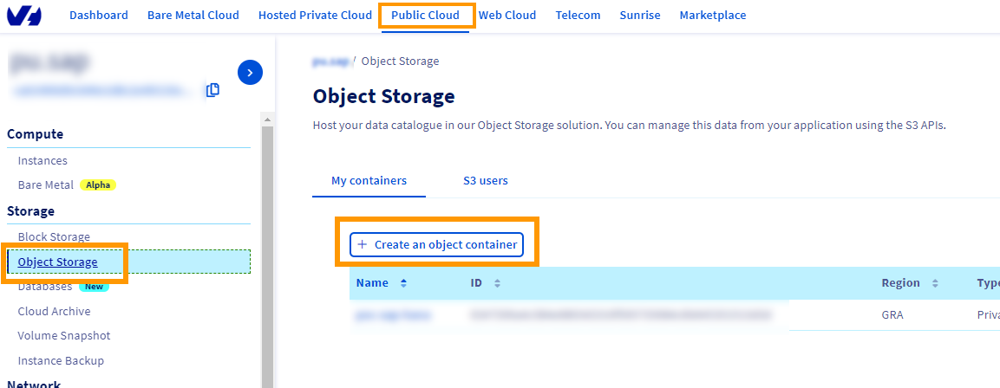{.thumbnail}

<ol start="2">
  <li>Select <code class="action">Standard (Swift)</code>:</li>
</ol>

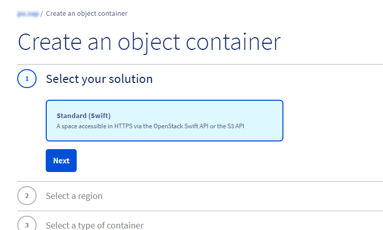{.thumbnail}

<ol start="3">
  <li>Select the region. ex: 'Gravelines (GRA)':</li>
</ol>

{.thumbnail}

<ol start="4">
  <li>Select the <code class="action">Private</code> container type:</li>
</ol>

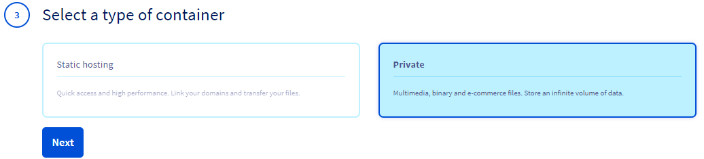{.thumbnail}

<ol start="5">
  <li>Give a name to your container:</li>
</ol>

{.thumbnail}

You container will now be present on the list, as shown below:

{.thumbnail}

<ol start="6">
  <li>Go to <code class="action">s3 users</code> tab to create a user:</li>
</ol>

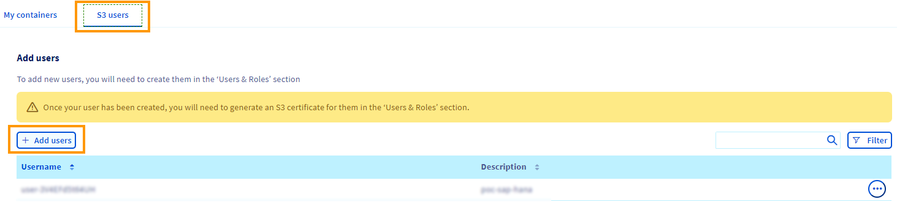{.thumbnail}

***N.B : Store the password associated to this user in a password manager as it will be provided just once.***

<ol start="7">
  <li>Give the <code class="action">Object Storage Operator</code> role for this user on <code class="action">Users & Roles</action> tab :</li>
</ol>

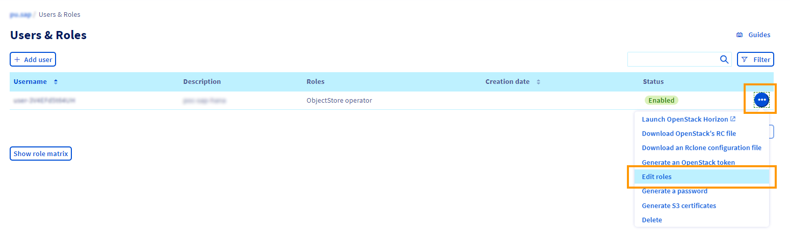{.thumbnail}

<ol start="8">
  <li>Select the user and download the OpenStack configuration file:</li>
</ol>

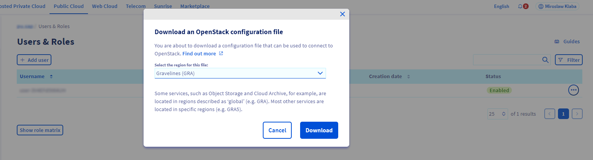{.thumbnail}

<ol start="9">
  <li>Install the OpenStack & Nova client:</li>
</ol>

```bash
sudo apt-get install python3-openstackclient python3-novaclient -y
```

<ol start="10">
  <li>Once the installation is finished, source the .sh script file:</li>
</ol>

```bash
source xxxxxxxxxxxxxxxxxx-openrc.sh
```

> [!primary]
> Save the password in your favorite password manager.

<ol start="11">
  <li>Create the credentials:</li>
</ol>

```bash
openstack ec2 credentials create
```

<ol start="12">
  <li>Now we can add the object storage container as a backup repository on our Veeam infrastructure with the access & secret key provided above</li>
</ol>

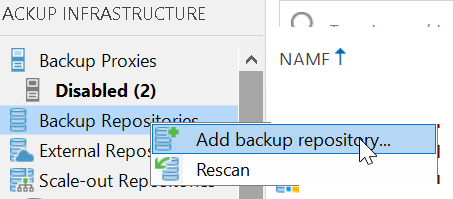{.thumbnail}

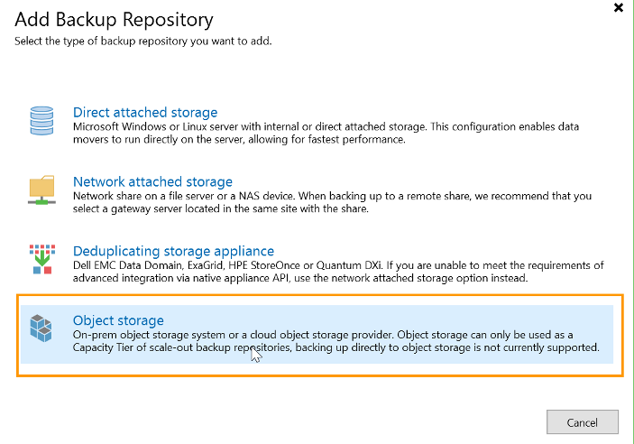{.thumbnail}

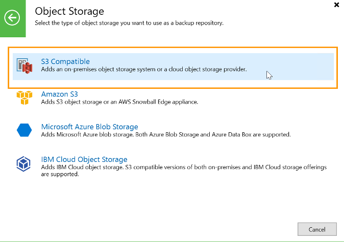{.thumbnail}

{.thumbnail}

{.thumbnail}

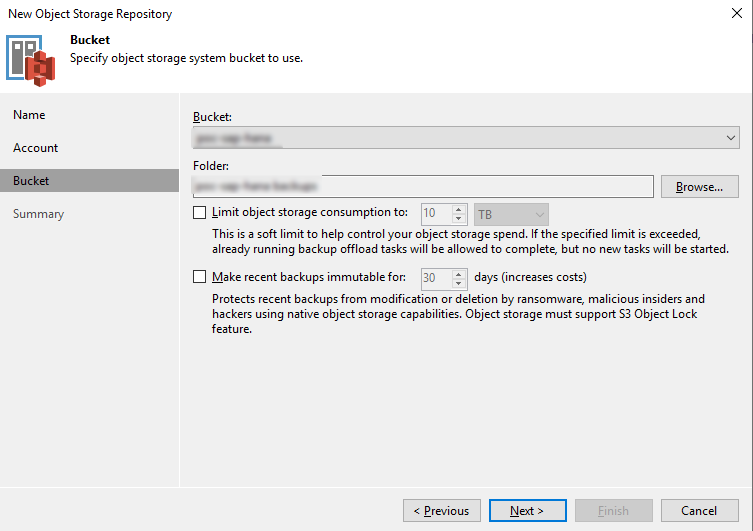{.thumbnail}

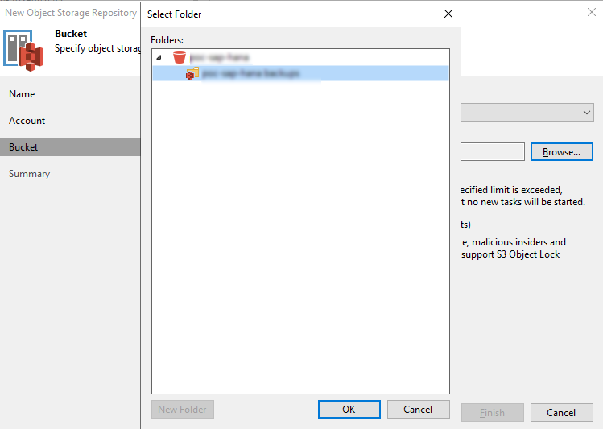{.thumbnail}

<ol start="13">
  <li>Now we can specify this repository as an extension of one of our SOBR:</li>
</ol>

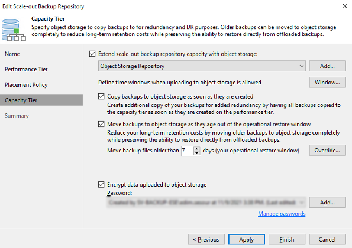{.thumbnail}

### Setting up the backup <a name="backup-setup"></a>

#### File System Backup

File System Backups write all data to files (for example an NFS share that is available for all nodes).

Make sure to monitor the fill level of your file system during the backup operations.

The File System Backups can be configured through these options:

 - Manually in HANA Studio
 - SQL Script (manual/external scheduler)
 - SAP DBA Cockpit (external scheduler)

If you want to protect the SAP HANA server itself, you can use the image-level and file-level backup functionality of Veeam Backup & Replication or Veeam Agent for Linux.

Note that image-level and file-level backups of SAP HANA servers do not guarantee transaction-consistency of database backups.

#### Scheduling backups

The HANA database Backups can be scheduled through these options:

- In HANA Studio
- SQL Script (manual/external scheduler)
- SAP DBA Cockpit (external scheduler)

##### **Scheduling a filesystem backup script**

To backup your HANA instance to file system, please refer to [SAP NOTE 1950261](https://launchpad.support.sap.com/#/notes/1950261){.external}

##### **Backint API Backup**

Backint for SAP HANA is an API that enables 3rd party tool vendors to directly connect their backup agents to the SAP HANA database.

To enable backuping through the backint API, a Veeam plugin installation and setup is required on the server hosting the HANA database.

Here is how the backup operates:

<ol start="1">
    <li>HANA starts the backup.</li>
    <li>Veeam Plugin for SAP HANA assigns multiple streams to backup target.</li>
    <li>Data is stored in the Veeam backup repository</li>
</ol>

*** For more information, please check the [Veeam Plugin for SAP-HANA documentation](https://helpcenter.veeam.com/docs/backup/plugins/sap_hana_plugin.html?ver=100){.external} ***

To Install the plugin:

1. Copy the VeeamPluginforSAPHANA from the Veeam Backup and Replication Installation ISO to the HANA-DB server
2. Run the rpm package install

```bash
rpm -i VeeamPluginforSAPHANA-10.x.x.xxxx-x.x86_64.rpm
```

You can then configure the plugin:

1. Log in with operating system user (<sid>adm)
2. Run the backint plugin configuration wizard:

```bash
SapBackintConfigTool --wizard
Enter backup server name or IP address: 172.x.x.x
Enter backup server port number [10006]:
#NB: The used account must have access to Veeam backup repositories that you plan to use.
Enter username: xx-backup-ovh\svc_veeam_hana
Enter password for xx-backup-ovh\svc_veeam_hana:
Available backup repositories:
1. Backup Repository
#Select the backup repository where the HANA-db backups will be stored
Enter repository number: 1
Configuration result:
    SID xxx has been configured
```

#### Scheduling backint backups

The Veeam plugin automatically creates a backup job and transfers data according to the backup schedule you have set.

If you run a manual backup through the backint, it will therefore automatically be pushed to the Veeam BR solution.

> [!primary]
> All SAP HANA jobs can be monitored within the Veeam Backup & Replication console.

### Housekeeping <a name="housekeeping"></a>

It is recommended to regularly delete full backups and backup generations that are no longer needed to recover your SAP HANA database.

Failing to do so might result in a full backup volume and block new backup generation.

For more information, please refer to the official SAP guides:

[Housekeeping: Deleting and Archiving Backups](https://help.sap.com/viewer/afa922439b204e9caf22c78b6b69e4f2/2.13.0.0/en-US/cac903c28b0e4301b39814ef41dbf568.html){.external}

[2399996 - How-To: Configuring automatic SAP HANA Cleanup with SAP HANACleaner](https://launchpad.support.sap.com/#/notes/2399996){.external}

## Go further

If you need training or technical assistance to implement our solutions, contact your sales representative or click on [this link](https://www.ovhcloud.com/pl/professional-services/) to get a quote and ask our Professional Services experts for assisting you on your specific use case of your project.
