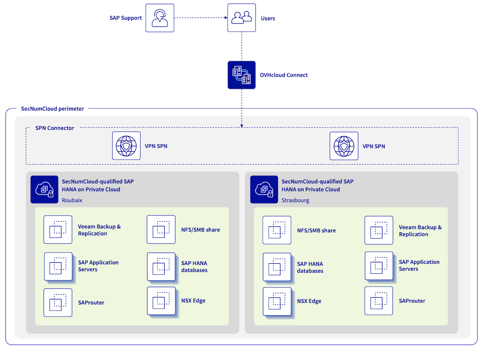

 
## Objective

The following concept enables you to build an architecture with SAP HANA databases up to 1.5 TB, and take advantage of all VMware features on OVHcloud (including OVF/OVA templates, NSX, DRS, Fault Tolerance, or else vSphere High Availability) for your SAP infrastructure in a single OVHcloud location or across multiple OVHcloud locations in a SecNumCloud context.

{.thumbnail}
  
| Objective | Description |
| --------- | ----------- |
| Objective #1 | Building an SAP infrastructure based on existing SecNumCloud-qualified SAP HANA on Private Cloud infrastructure. |
| Objective #2 | Compliance requirements with SecNumCloud regulation. |
| Objective #3 | An Infrastructure Recovery Point Objective (RPO) of 60 minutes. |
| Objective #4 (optional) | An SAP infrastructure available in a second region which can be activated in the event of a major issue impacting the primary region. This second region offers an Infrastructure Recovery Point Objective (RPO) near to zero for your SAP HANA databases. |

> [!primary]
>
> All information presented in this documentation is intended for informational purposes only. Please note that certain elements may differ based on your specific SAP environment. Before implementing any of the solutions or approaches described herein, it is recommended to consult with your SAP and/or infrastructure experts to ensure that they are suitable for your particular needs.
>

> [!primary]
>
> Keep equipments up-to-date with the latest patches and updates.
>
> Also ANSSI1 demands to host production environments on a separate and dedicated infrastructure, and to keep them isolated from non-production environments such as development and test environments.
>

1 **A**gence **N**ationale de la **S**écurité des **S**ystèmes d'**I**nformation
  
## Concept elements

### 1 - Network connectivity

To ensure optimal communication quality between your local site and your SAP infrastructure hosted on OVHcloud, we recommend using OVHcloud Connect. This solution offers a secure and high-performance connection between your offices and OVHcloud. For more information, please refer to the [OVHcloud Connect](https://www.ovhcloud.com/en-ie/network/ovhcloud-connect/) product page.

In addition, a VPN Secure Private Network (VPN-SPN) can be deployed to ensure secure external communication using the IPsec protocol with highest performance between your local site and your SecNumCloud-qualified SAP HANA on Private Cloud infrastructure. For more details about this architecture, refer to our [documentation](/pages/hosted_private_cloud/hosted_private_cloud_powered_by_vmware/snc-connectivity-concepts-overview) on this topic.

Under no circumstances should your SAP environment be accessible from the internet without passing through several filtered gateways and a demilitarised zone (DMZ). This DMZ must not be bypassed.

For SAProuter, used primarily to connect your SAP environment to SAP support, its installation should be done on a dedicated virtual machine that is not used for any other purpose, in a DMZ. The SAPROUTTAB should be filled with a high level of vigilance.
However, ANSSI strongly recommends not opening the SecNumCloud environment to external support that is not SecNumCloud-qualified. In this scenario, the external support takes control of an administrator's computer or server through a shared screen, with visual control from the administrator.

Similarly, the SAP Web Dispatcher, used primarily to publish HTTP(s) endpoints for your SAP environment, should be installed on a dedicated virtual machine that is not used for any other purpose, in a DMZ. Only the HTTPS protocol should be enabled. Access Control Lists (ACL), Authentication Handler, and HTTP Rewrite Handler should be configured with a high level of vigilance. We recommend implementing a Web Application Firewall (WAF) to protect the SAP Web Dispatcher from common web-based attacks, such as SQL injection and cross-site scripting (XSS).

Document all connections and only open the necessary connections. Additionally, connection logs should be externalised in the event of suspicious behaviour of the SAProuter or the SAP Web Dispatcher, allowing for its readability without loss, even in the event of service deletion.

Please note that all communications with a SaaS SAP service, such as the SAP Business Technology Platform (SAP BTP) or SAP Analytics Cloud (SAC), are considered outside the scope of SecNumCloud.

ANSSI requires that the same hardware host must be used for services within the same trusted zone. This means that you cannot use the same host to run a service in the DMZ and your trusted service, as your SAP HANA databases.

It is important to regularly review and test your security measures to ensure they are effective and up-to-date. Perform regularly:

- vulnerability assessments;
- Intrusion tests;
- audits on your network configuration and system.

All this to ensure compliance with the requirements and recommendations of the ANSSI.

### 2 - SAP HANA database

To define a compliant configuration between SAP and virtual machines, read the following:

- [SAP Note 2161991](https://me.sap.com/notes/2161991){.external} (Especially chapter 2 and 3) ;
- [SAP Note 2015392](https://me.sap.com/notes/2015392){.external} ;
- [SAP Note 2937606](https://me.sap.com/notes/2937606){.external} ;
- [SAP Note 3102813](https://me.sap.com/notes/3102813){.external}.

For virtualised SAP environments, it is essential to ensure that the NUMA (Non-Uniform Memory Access) sharing is configured appropriately. Failure to do so can result in poor performance and system instability. For more information on NUMA sharing and how to configure it properly, please refer to [SAP Help Portal](https://wiki.scn.sap.com/wiki/display/VIRTUALIZATION/SAP+HANA+on+VMware+vSphere){.external} and [SAP Note 2470289](https://me.sap.com/notes/2470289){.external}.

The Fault Tolerance feature provided by VMware is not suitable to protect the SAP HANA virtual machine due to the resource limitation of Fault Tolerance. However, we advise to enable the feature vSphere HA which monitors the health of each ESXi host in the cluster, and automatically restarts the virtual machines hosted on the impacted ESXi host.

For optimal disaster recovery and business continuity, we recommend implementing an SAP HANA cluster in a single OVHcloud region. This allows for reduced recovery time objective (RTO) and recovery point objective (RPO) times. Refer to our [dedicated documentation](/pages/hosted_private_cloud/sap_on_ovhcloud/cookbook_configure_sap_hana_cluster) to guide you through the configuration process with a SUSE cluster. When implementing an SAP HANA cluster, it is important to create an anti-affinity rule to avoid running both SAP HANA databases on the same ESXi host.

Data and log volumes in the SAP HANA database must be encrypted using the SAP HANA encryption provided by SAP. Starting with SAP HANA Platform 2.0 SPS 07, data and log encryption and backup encryption parameters are enabled by default during new installations. However, it is important to note that these parameters are not modified during upgrades from previous versions. We strongly recommend enabling virtual machine encryption on the hypervisor level for added security. Our [Virtual Machine Encryption on vSphere](/pages/hosted_private_cloud/hosted_private_cloud_powered_by_vmware/vm_encrypt) documentation provides a step-by-step guide on how to enable this feature. You can also utilise the vSphere Native Key Provider (vNKP) for encryption key management if you do not already have a Key Management Service (KMS). Our [documentation](/pages/hosted_private_cloud/hosted_private_cloud_powered_by_vmware/vm_encrypt-vnkp) provides instructions on how to use vNKP for this purpose.

Authentication to the SAP HANA database by administrators can be performed using various methods, including password, SAML, X.509 certificate, and Kerberos. We recommend using a strong authentication mechanism to prevent unauthorised access to the database. It is also essential to review and update roles and privileges regularly to ensure appropriate access control. Enabling audit logs is also critical in detecting and responding to suspicious behaviour. Outsource the audit logs, as detailed in [SAP Note 2624117](https://me.sap.com/notes/0002624117){.external}.

To further enhance security, access to the SAP HANA database for administrative purposes must be restricted and overseen via controlled and monitored entry points. Implement a robust access control policy. Review and update it regularly to ensure optimal security.

For more information on SAP HANA security, please refer to the [SAP documentation](https://www.sap.com/documents/2016/06/3ea239ad-757c-0010-82c7-eda71af511fa.html){.external}.

### 3 - SAP Application Servers

The Fault Tolerance feature provided by VMware ensures the high availability of your SAP Application Servers, automatically switching them over to a different ESXi host in case of a failure. It is recommended to enable Fault Tolerance on your virtual machines that host SAP Central Services (SCS), provided that you do not have another SAP cluster solution in place for this service. Fault Tolerance can also be enabled on SAP Application Servers that host critical services. To learn how to enable this feature, please refer to [our documentation](/pages/hosted_private_cloud/hosted_private_cloud_powered_by_vmware/vmware_fault_tolerance).

However, to enable Fault Tolerance, the virtual machine cannot have more than 8 vCPUs and 128 GB of memory. For SAP Application Servers that do not host critical services, the vSphere High Availability (HA) feature is recommended.

Additionally, the vSphere Distributed Resource Scheduler (DRS) can also be activated with VM/Host rules to avoid running all SAP Application Servers on the same ESXi host. This feature helps balance the load across the ESXi hosts in the cluster. More details can be found in our documentation [VMware DRS](/pages/hosted_private_cloud/hosted_private_cloud_powered_by_vmware/vmware_drs_distributed_ressource_scheduler_new).

All external and internal exchanges with your SAP environment must be encrypted using the SAP Secure Network Communications (SNC) protocol for RFC type 3 communication and HTTPS for RFC type H/G. Refer to the SAP documentation [Securing Remote Function Call (RFC)](https://support.sap.com/content/dam/support/en_us/library/ssp/security-whitepapers/securing_remote-function-calls.pdf){.external} for best practices and instructions. Also, your SAP Application Server virtual machines themselves must be encrypted on the hypervisor level. To learn how to enable Virtual Machine Encryption on vSphere, please refer to our dedicated documentation: [Enable Virtual Machine Encryption on vSphere](/pages/hosted_private_cloud/hosted_private_cloud_powered_by_vmware/vm_encrypt).

Authentication can be performed using various methods, including password, Single Sign-On (SSO) with Kerberos, LDAP, or SAML. For optimal security, use a strong authentication mechanism to prevent unauthorised access to the SAP system. Regularly review and update roles and privileges to ensure appropriate access control. Additionally, enable and externalise audit logs to detect and respond to compromising behaviour. Refer to the [SAP Help Portal](https://help.sap.com/docs/ABAP_PLATFORM_NEW/025d1fb2f02c42c097f04f45df09106a/f64babd8c8a0489caf61c48d8bdc9478.html){.external} for more information on configuring and managing audit logs in your SAP environment.

### 4 - Backup infrastructure

At this time, our S3 Object Storage solution is not SecNumCloud-qualified. Therefore, you cannot use this solution to store backups for your SAP infrastructure in a SecNumCloud-compliant manner.

To ensure the security and compliance of your SAP infrastructure, deploy a second SecNumCloud-qualified SAP HANA on Private Cloud infrastructure in a separate OVHcloud region. This second region will be dedicated solely to hosting NFS servers for storing backups from your SAP infrastructure. These backups can be managed by a Veeam Backup and Replication server.

With Veeam Backup and Replication, you can easily create and manage backups and snapshots of your virtual machines. This ensures a quick recovery time objective (RTO) in the event of any issue with your SecNumCloud-qualified SAP HANA on Private Cloud infrastructure.

Furthermore, Veeam Backup and Replication provides a Veeam Plug-in for SAP HANA, allowing you to leverage all Backint features proposed by SAP for SAP HANA.

For detailed instructions on how to set up this backup infrastructure, please refer to our documentation: [Backup SAP HANA with Veeam Backup and Replication](/pages/hosted_private_cloud/sap_on_ovhcloud/cookbook_veeam_backup_sap_hana).

Implement regular backups, and test the restore process to ensure that data can be recovered in the event of a disaster.

Note: You can use the second region to also store backups from other critical systems.

Finally, when implementing your backup infrastructure, be sure to follow best practices for configuring and managing backups, such as encrypting backup data (both at rest and in transit), testing your restore process, and regularly reviewing and updating your backup strategy to ensure it remains effective and up-to-date with the latest threats and vulnerabilities.

### 5 - SAP Support connection

In line with our previous chapter on network connectivity, the SAProuter must be deployed in a demilitarised zone (DMZ) and the SAPROUTTAB must be configured with stringent vigilance. SAP's connections are encrypted by design, utilising the SAP Secure Network Communications (SNC) protocol.

Proper documentation and limiting connections to only those deemed absolutely necessary are essential security measures. Connection logs are crucial for monitoring and detecting any suspicious activities; they should be externalised to enable readability and archival purposes, even if deletion of the SAProuter service is necessary. For more information on best practices, see [SAP Note 1895350](https://me.sap.com/notes/1895350/E){.external}.

Placing the SAProuter behind security devices, such as firewalls and intrusion detection systems (IDS) is advisable. These devices can filter, analyse, and control connections toward the SAProuter, thereby enhancing the security.

As a reminder, ANSSI strongly recommends not opening the SecNumCloud environment to external support that is not SecNumCloud-qualified.

### 6 - Dual regions (optional)

To ensure high availability and mitigate the risk of single-point failure, deploy a secondary OVHcloud region with an identical service. In the event of a primary region outage, the secondary region can seamlessly take over and maintain service continuity.

#### 6.1 - Network connectivity

For consistent security and connectivity across your infrastructure, we recommend employing OVHcloud Connect in the secondary OVHcloud region, analogous to the primary one. Furthermore, establish a VPN Secure Private Network (VPN-SPN) between your local site and your SecNumCloud-qualified SAP HANA on Private Cloud infrastructure. This VPN-SPN connection should be attached to the same vRack and extended to both of your SecNumCloud-qualified SAP HANA on Private Cloud using the InterDC functionality. This will create a secure and wire-area network for seamless communication across all your infrastructure components.

#### 6.2 - SAP HANA database

The SAP HANA System Replication, known as SAP HSR, plays a vital role in replicating data and configurations from your primary OVHcloud region to your secondary OVHcloud region. This replication process enables you to secure your data in a separate SAP HANA database, resulting in the lowest Recovery Point Objective (RPO) possible. SAP HSR ensures high availability and disaster recovery capabilities by offering synchronous and asynchronous replication modes. For detailed information on the various replication modes supported by SAP HANA, consult the SAP documentation on [SAP Help Portal](https://help.sap.com/docs/SAP_HANA_PLATFORM/6b94445c94ae495c83a19646e7c3fd56/86267e1ed56940bb8e4a45557cee0e43.html?locale=en-US){.external}.

For SAP HANA systems operating in an OVHcloud environment with two regions, we highly recommend enabling data and log compression and using the ASYNC replication mode. This combination enhances replication efficiency and reduces the required network bandwidth. More information on these settings can be found on [SAP Help Portal](https://help.sap.com/docs/SAP_HANA_PLATFORM/6b94445c94ae495c83a19646e7c3fd56/92447e0a105c4facad3553b28aaec318.html){.external}.

Beginning with SAP HANA 2.0 Platform SPS 07, Secure Sockets Layer (SSL) is enabled by default using TLS/SSL for communications between primary and secondary sites. If you are operating a lower SAP HANA version, ensure that this security feature is enabled as described in the [SAP documentation](https://help.sap.com/docs/SAP_HANA_PLATFORM/6b94445c94ae495c83a19646e7c3fd56/ec50b815f5b740d7a9777d80f7104a2c.html?locale=en-US){.external}.

In the event of a takeover to your secondary OVHcloud region, it is vital to switch the SAP Application Servers accordingly. By making this switch, you guarantee consistent performance between the SAP Application Servers and the SAP HANA database during disaster recovery procedures.

#### 6.3 - SAP Application Servers

Currently, no SecNumCloud-qualified solutions in the OVHcloud portfolio support real-time replication of virtual machines. The Continuous Data Protection (CDP) solution included in Veeam Backup & Replication does not yet have compatibility with the SecNumCloud-qualified SAP HANA on Private Cloud infrastructure.

Should a Recovery Point Objective (RPO) with an infrastructure delay of several hours be deemed acceptable, you can consider using Veeam Backup & Replication to copy your virtual machines snapshots between your SecNumCloud-qualified VMware infrastructures. This approach provides a reduced minimum Recovery Time Objective (RTO) that significantly shortens the recovery process for the secondary region.

However, it is strongly advised against scheduling snapshots of virtual machines during periods of high activity, as doing so may result in negative performance impacts. For an optimal balance between backup and performance, carefully plan and configure your snapshot schedule outside peak hours.

You can pair these snapshots with a more regular backup of critical directories of your SAP application servers, such as /sapmnt and /usr/sap/trans. These shorter backups will not impact your business and will significantly reduce your potential data loss.

Consult the [User Guide for VMware vSphere by Veeam](https://helpcenter.veeam.com/docs/backup/vsphere/replication.html?ver=120){.external} for detailed information on leveraging Veeam Backup & Replication for maintaining copies between your VMware infrastructures and best practices for balancing data protection and performance.

#### 6.4 - Backup infrastructure

The primary concept remains similar to a single-region setup that includes a SecNumCloud-qualified SAP HANA on Private Cloud service, featuring one major distinction: the ability to restore and resume SAP services on the second region without incurring infrastructure delivery downtime.

In this second region with a SecNumCloud-qualified SAP HANA on Private Cloud service, you can restore backups and snapshots of your SAP application servers, execute a takeover operation on your secondary SAP HANA databases, and eventually restart your SAP systems within a controllable time frame.

The distinction between single-region and two-region setups lies in the recovery capabilities and accelerated timeframes. With the two-region setup, you not only reduce the recovery time but also minimise the service disruption risk due to infrastructure delivery constraints. This design provides quicker recovery, continuous operation, and enhanced business resilience.

#### 6.5 - SAP Support connection

To ensure connection continuity with SAP Support during a disaster recovery scenario, it's recommended to configure a secondary SAProuter located in the secondary OVHcloud region. This setup enables SAP Support personnel to establish a secure connection with your SAP systems within the secondary region during a disaster, without disruptions or extended downtimes.

In the event of a disaster recovery activation, the public IP address in the SAP Support LaunchPad should only be updated to re-establish the connection.

As a reminder, ANSSI strongly recommends not opening the SecNumCloud environment to external support that is not SecNumCloud-qualified.

The secondary SAProuter must still be configured and managed with the same care and vigilance as if it was the primary SAProuter. Consequently, all best practices and guidelines mentioned in the [Network connectivity](#network-connectivity) and [SAP Support connection](#sap-support-connection) chapters must be carefully observed. Proper security measures, logging, and monitoring should be implemented to ensure the security of your SAP infrastructure and maintain a high level of connection reliability with SAP Support.

## Go further

If you need training or technical assistance to implement our solutions, contact your sales representative or click on [this link](/links/professional-services) to get a quote and ask our Professional Services experts for assisting you on your specific use case of your project.
  
Join our [community of users](/links/community).
