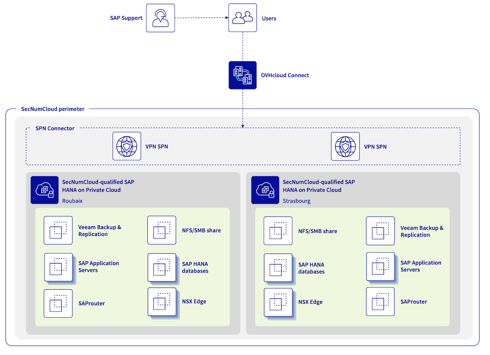

## Objectif

Ce concept vous permet de construire une architecture à haut niveau d'exigence de sécurité, avec des bases de données SAP HANA jusqu'à 1,5 To et d'utiliser toutes les fonctionnalités VMware on OVHcloud (comprenant les templates OVF/OVA, NSX, DRS, Fault Tolerance, ou encore vSphere High Availability) pour votre infrastructure SAP qualifiée SecNumCloud sur une unique région OVHcloud ou multiple.

{.thumbnail}

| Objectif | Description |
| -------- | ----------- |
| Objectif #1 | Construire une infrastructure SAP basée sur une infrastructure SAP HANA on Private Cloud qualifiée SecNumCloud existante. |
| Objectif #2 | Besoin d'une infrastructure à haut niveau d'exigence de sécurité. |
| Objectif #3 | Une perte de données maximale admissible de 60 minutes. |
| Objectif #4 (optionnel) | Une infrastructure SAP disponible sur une seconde localisation OVHcloud qui peut être activée dans le cas d'un incident majeur affectant la localisation OVHcloud principale. Cette seconde localisation OVHcloud propose une perte de données maximale admissible proche de zéro pour vos bases de données SAP HANA. |

> [!primary]
>
> L'ensemble des informations présentées dans cette documentation sont fournies à titre informatif. Veuillez noter que certains éléments peuvent différer en fonction de votre environnement SAP et sont à adapter en fonction des exigences que sont les vôtres. Avant de mettre en œuvre l'une des solutions ou approches décrites ci-après, consultez vos experts en solution SAP et/ou en infrastructure pour vous assurer qu'elles sont adaptées à vos besoins.
>

> [!primary]
>
> De plus, maintenez régulièrement vos équipements à jour. Ceci avec les derniers correctifs et mises à jour disponibles.
>
> [L'ANSSI1 préconise](https://cyber.gouv.fr/publications/recommandations-relatives-ladministration-securisee-des-si) d'héberger les environnements de production sur une infrastructure distincte et dédiée. Elle demande également de les isoler des environnements hors production, tels que les environnements de développement et de test.
>

1 **A**gence **N**ationale de la **S**écurité des **S**ystèmes d'**I**nformation  

## Éléments du concept

### 1 - Connectivité réseau

Afin d'assurer une qualité de communication optimale entre votre site local et votre infrastructure SAP hébergée chez OVHcloud, nous vous recommandons d'utiliser OVHcloud Connect. Cette solution offre une connexion sécurisée et performante entre votre site local et OVHcloud. Pour plus d'informations, veuillez consulter la page produit [OVHcloud Connect](https://www.ovhcloud.com/fr/network/ovhcloud-connect/).

De plus, un VPN Secure Private Network (VPN-SPN) peut être déployé pour assurer une communication externe sécurisée. Ceci en utilisant le protocole IPsec avec les meilleures performances entre votre site local et votre infrastructure VMware on OVHcloud qualifiée SecNumCloud. Pour plus de détails sur cette architecture, consultez notre [documentation](/pages/hosted_private_cloud/hosted_private_cloud_powered_by_vmware/snc-connectivity-concepts-overview) dédiée.

Votre environnement SAP ne devrait en aucun cas être accessible depuis Internet sans passer par plusieurs passerelles filtrées et une zone démilitarisée (DMZ).

Pour le SAProuter, utilisé principalement pour connecter votre environnement SAP au support SAP, il est préférable de réaliser son installation sur une machine virtuelle dédiée qui n'est utilisée à aucune autre fin, au sein d'une DMZ. La SAPROUTTAB est à configurer avec une grande vigilance.
L'ANSSI recommande cependant de ne pas ouvrir l'environnement SecNumCloud à un support externe non qualifié Prestataires d’Administration et de Maintenance Sécurisées (PAMS). Dans ce scénario, il est préférable de mettre en oeuvre des sessions de travail dites « quatre yeux » pour avoir un contrôle visuel des actions réalisées par un administrateur interne.

Il est conseillé d'installer le SAP Web Dispatcher, utilisé principalement pour publier des services HTTP(s) pour votre environnement SAP, sur une machine virtuelle dédiée qui n'est utilisée à aucune autre fin, au sein d'une DMZ. Pour des raisons de sécurité, nous recommandons de n'activer que le protocole HTTPS. Les listes de contrôle d'accès (ACL), le gestionnaire d'authentification et le gestionnaire de réécriture HTTP sont à configurer avec une grande vigilance. De même, considérez l'implémentation d'un pare-feu d'application web (WAF) pour protéger votre SAP Web Dispatcher des attaques web courantes, telles que l'injection SQL et le cross-site scripting (XSS).

Concernant les connexions, c'est une bonne pratique de les documenter exhaustivement, de n'ouvrir que les connexions nécessaires et d'externaliser les logs associés afin de garantir l'accès à ces logs.

À noter que toutes les communications avec un service SAP en mode SaaS, comme SAP Business Technology Platform (SAP BTP) ou SAP Analytics Cloud (SAC), sont considérées comme étant en dehors du périmètre qualifié SecNumCloud.

[L'ANSSI préconise](https://cyber.gouv.fr/publications/recommandations-relatives-ladministration-securisee-des-si) que le même hôte ESXi soit utilisé pour les services au sein d'une même zone de confiance. Il n'est pas préconisé d'exécuter un service se trouvant dans votre DMZ et un service se trouvant dans votre zone de confiance, comme vos bases de données SAP HANA sur un même hôte ESXi.

Il est important d'effectuer une revue et de tester régulièrement vos mesures de sécurité pour vous assurer qu'elles sont efficaces et à jour. Effectuez régulièrement :

- des évaluations de vulnérabilités ;
- des tests d'intrusion ;
- des audits sur la configuration de votre réseau et sur votre système.

### 2 - Base de données SAP HANA

Afin de définir une configuration conforme entre SAP et machines virtuelles, prenez connaissance des éléments suivants :

- [SAP Note 2161991](https://me.sap.com/notes/2161991) (En particulier les chapitres 2 et 3)
- [SAP Note 2015392](https://me.sap.com/notes/2015392)
- [SAP Note 2937606](https://me.sap.com/notes/2937606)
- [SAP Note 3102813](https://me.sap.com/notes/3102813)

Pour les environnements SAP virtualisés, il est essentiel de s'assurer que le partage NUMA (Non-Uniform Memory Access) est correctement configuré. À défaut, les performances risquent d'être impactées et le système instable. Pour plus d'informations sur le partage NUMA et sa configuration, consultez [SAP Help Portal](https://wiki.scn.sap.com/wiki/display/VIRTUALIZATION/SAP+HANA+on+VMware+vSphere) ainsi que la [SAP Note 2470289](https://me.sap.com/notes/2470289).

La fonctionnalité Fault Tolerance fournie par VMware n'est pas adaptée à la protection des machines virtuelles SAP HANA en raison de la limitation des ressources de Fault Tolerance. Cependant, nous vous conseillons d'activer la fonctionnalité vSphere HA qui surveille l'intégrité de chaque hôte ESXi du cluster et redémarre automatiquement les machines virtuelles hébergées sur l'hôte ESXi impacté.

Pour une continuité d'activité optimale, nous vous recommandons de mettre en œuvre un cluster SAP HANA. Cela permet de réduire le temps de rétablissement (RTO) et de perte de données (RPO). Consultez notre [documentation dédiée](/pages/hosted_private_cloud/sap_on_ovhcloud/cookbook_configure_sap_hana_cluster) pour vous guider tout au long du processus de configuration d'un cluster SUSE. Lors de la mise en place d'un cluster SAP HANA, il est important de créer une règle d'anti-affinité afin d'éviter d'exécuter les deux bases de données SAP HANA sur le même hôte ESXi.

À partir de la version SAP HANA Platform 2.0 SPS 07, les paramètres de chiffrement des données et des journaux ainsi que les sauvegardes sont activés par défaut lors des nouvelles installations. Cependant, il est important de noter que ces paramètres ne sont pas modifiés lors des mises à niveau des versions précédentes. En complément, nous vous recommandons vivement d'activer le chiffrement de la machine virtuelle au niveau de l'hyperviseur pour plus de sécurité. Notre documentation [Virtual Machine Encryption on vSphere](/pages/hosted_private_cloud/hosted_private_cloud_powered_by_vmware/vm_encrypt) fournit un guide étape par étape sur la façon d'activer cette fonctionnalité. Vous pouvez également utiliser le vNKP (vSphere Native Key Provider) pour la gestion des clés de chiffrement si vous ne disposez pas encore de service de gestion de clés (KMS). Notre [documentation](/pages/hosted_private_cloud/hosted_private_cloud_powered_by_vmware/vm_encrypt-vnkp) fournit des instructions sur l'utilisation de vNKP.

L'authentification à la base de données SAP HANA par les administrateurs peut être effectuée à l'aide de diverses méthodes, comprenant mot de passe, SAML, certificat X.509 et Kerberos. Nous vous recommandons d'utiliser un mécanisme d'authentification fort pour empêcher tout accès non autorisé à la base de données. Il est également essentiel de réviser et de mettre à jour régulièrement les rôles et les privilèges pour assurer un contrôle d'accès approprié. L'activation des journaux d'audit est également essentielle pour détecter et répondre aux comportements suspects. Privilégiez l'externalisation des logs d'audit, comme indiqué dans la [SAP Note 2624117](https://me.sap.com/notes/0002624117).

Il est recommandé de restreindre et de surveiller l'accès à la base de données SAP HANA pour l'administration via des points d'entrée contrôlés et surveillés pour améliorer la sécurité.

Pour plus d'informations sur la sécurité SAP HANA, consultez la [documentation SAP](https://www.sap.com/documents/2016/06/3ea239ad-757c-0010-82c7-eda71af511fa.html).

### 3 - Serveurs d'application SAP

La fonctionnalité Fault Tolerance fournie par VMware garantit la haute disponibilité de vos serveurs d'application SAP, en les basculant automatiquement vers un hôte ESXi différent en cas de panne. Il est peut être intéressant d'activer Fault Tolerance sur les machines virtuelles qui hébergent SAP Central Services (SCS), à condition de ne pas avoir mis en place une autre solution de cluster SAP pour ce service. Fault Tolerance peut également être activé sur les serveurs d'application SAP qui hébergent des services critiques. Pour obtenir des instructions sur l'activation de cette fonctionnalité, consultez [notre documentation](/pages/hosted_private_cloud/hosted_private_cloud_powered_by_vmware/vmware_fault_tolerance).

Pour activer Fault Tolerance, la machine virtuelle ne peut pas avoir plus de 8 vCPU et 128 Go de mémoire. Pour les serveurs d'application SAP qui n'hébergent pas de services critiques, nous recommandons la fonctionnalité vSphere High Availability (HA).

La fonctionnalité vSphere Distributed Resource Scheduler (DRS) peut également être activée avec des règles VM/Host pour éviter d'exécuter tous les serveurs d'application SAP sur le même hôte ESXi. Cette fonctionnalité permet d'équilibrer la charge sur les hôtes ESXi du cluster. Retrouvez plus de détails sur cette fonctionnalité dans notre documentation [VMware DRS](/pages/hosted_private_cloud/hosted_private_cloud_powered_by_vmware/vmware_drs_distributed_ressource_scheduler_new).

Les échanges externes et internes avec votre environnement SAP peuvent être chiffrés à l'aide du protocole SAP Secure Network Communications (SNC) pour les communications RFC de type 3 et du protocole HTTPS pour les communications RFC de type H/G. Consultez la documentation SAP [Securing Remote Function Call (RFC)](https://support.sap.com/content/dam/support/en_us/library/ssp/security-whitepapers/securing_remote-function-calls.pdf) pour connaître les meilleures pratiques et obtenir des instructions. En complément, nous vous recommandons vivement d'activer le chiffrement de vos machines virtuelles SAP Application Server au niveau de l'hyperviseur. Pour savoir comment activer le chiffrement de machines virtuelles sur vSphere, référez-vous à notre [documentation dédiée](/pages/hosted_private_cloud/hosted_private_cloud_powered_by_vmware/vm_encrypt).

L'authentification au système SAP peut être effectuée à l'aide de diverses méthodes, mot de passe, l'authentification unique (SSO) avec Kerberos, LDAP ou SAML. Pour une sécurité optimale, utilisez un mécanisme d'authentification fort pour empêcher tout accès non autorisé au système SAP. Nous vous conseillons de réviser et de mettre à jour régulièrement les rôles et les privilèges pour assurer un contrôle d'accès approprié. L'activation des journaux d'audit et leur externalisation peut être envisagé pour détecter et répondre aux comportements suspects. Vous pouvez vous reporter au [SAP Help Portal](https://help.sap.com/docs/ABAP_PLATFORM_NEW/025d1fb2f02c42c097f04f45df09106a/f64babd8c8a0489caf61c48d8bdc9478.html) pour obtenir plus d'informations sur la configuration et la gestion des journaux d'audit dans votre environnement SAP.

### 4 - Infrastructure de sauvegarde

Pour assurer la sécurité et la conformité de votre infrastructure SAP, vous pouvez déployer une deuxième infrastructure SAP HANA on Private Cloud qualifiée SecNumCloud dans une région OVHcloud distincte. Cette seconde région sera dédiée à l’hébergement de serveurs NFS pour le stockage des sauvegardes de votre infrastructure SAP. Ces sauvegardes peuvent être gérées par un serveur Veeam Backup and Replication.

Avec Veeam Backup and Replication, vous avez la possibilité de créer et gérer facilement des sauvegardes et des snapshots de vos machines virtuelles. Cela vous assure un temps de rétablissement faible (RTO) en cas de problème avec votre infrastructure SAP HANA on Private Cloud qualifiée SecNumCloud.

Veeam Backup and Replication fournit un Plug-in Veeam pour SAP HANA, vous permettant d'exploiter toutes les fonctionnalités de Backint proposées par SAP pour SAP HANA.

Pour des instructions détaillées sur la configuration de cette infrastructure de sauvegarde, consultez notre documentation : [Backup SAP HANA with Veeam Backup and Replication](/pages/hosted_private_cloud/sap_on_ovhcloud/Cookbook_veeam_backup_sap_hana).

Nous vous recommandons de mettre en œuvre des sauvegardes régulières et de tester le processus de restauration pour garantir la récupération des données en cas de sinistre.

Vous pouvez utiliser la deuxième région pour stocker des sauvegardes d'autres systèmes critiques.

Enfin, lors de la mise en œuvre de votre infrastructure de sauvegarde, veillez à suivre les meilleures pratiques en matière de configuration et de gestion des sauvegardes, telles que le chiffrement des données de sauvegarde (au repos et en transit), le test de votre processus de restauration, ainsi que l'examen et la mise à jour réguliers de votre stratégie de sauvegarde pour vous assurer qu'elle reste efficace et à jour face aux dernières menaces et vulnérabilités.

### 5 - Connexion du support SAP

Conformément à notre précédent chapitre sur la [connectivité réseau](#network-connectivity), il est préférable de déployer le SAProuter dans une zone démilitarisée (DMZ) et de configurer avec une grande rigueur la SAPROUTTAB. Le protocole SAP Secure Network Communications (SNC) peut être utilisé pour chiffrer les connexions SAP.

C'est une bonne pratique de documenter et de limiter les connexions à celles jugées exclusivement nécessaires. Les logs de connexion sont essentiels pour surveiller et détecter toute activité suspecte ; leur externalisation permet une lisibilité et un archivage, même si la suppression du service SAProuter est nécessaire. Pour plus d’informations sur les meilleures pratiques, voir la [SAP Note 1895350](https://me.sap.com/notes/1895350/E).

Il est conseillé de placer le SAProuter derrière des dispositifs de sécurité tels que des pare-feu et des systèmes de détection des intrusions (IDS). Ces périphériques peuvent filtrer, analyser et contrôler les connexions vers le SAProuter améliorant la sécurité.

Pour rappel, l’ANSSI vous recommande vivement de ne pas ouvrir l’environnement SecNumCloud à un support externe non qualifié PAMS.

### 6 - Double localisation OVHcloud (optionnel)

Pour assurer une haute disponibilité et atténuer le risque de perte totale du service, vous pouvez envisager de déployer une seconde région OVHcloud avec un service identique. En cas de panne de la région principale, la région secondaire peut prendre le relais et maintenir la continuité du service.

#### 6.1 - Connectivité réseau

Pour une sécurité et une connectivité constantes de votre infrastructure, nous vous recommandons d’utiliser OVHcloud Connect dans la région secondaire d’OVHcloud, similaire à la région principale, ainsi qu'un VPN Secure Private Network (VPN-SPN) entre votre site local et votre infrastructure SAP HANA on Private Cloud qualifiée SecNumCloud. Cette connexion VPN-SPN doit être attachée au même vRack et étendue à vos deux infrastructure SAP HANA on Private Cloud qualifiée SecNumCloud à l'aide de la fonctionnalité InterDC. Ainsi un réseau étendu et sécurisé est créé permettant une communication transparente entre tous les composants de votre infrastructure.

#### 6.2 - Base de données SAP HANA

La réplication SAP HANA, connue sous le nom de SAP HSR, joue un rôle essentiel dans la réplication des données et des configurations de votre région OVHcloud principale vers votre région OVHcloud secondaire. Ce processus de réplication vous permet de sécuriser vos données dans une base de données SAP HANA distincte, avec pour résultat une perte de données maximale admissible (RPO) le plus bas possible. SAP HSR assure des capacités de haute disponibilité et de reprise après sinistre en proposant des modes de réplication synchrone et asynchrone. Pour des informations détaillées sur les différents modes de réplication pris en charge par SAP HANA, consultez la documentation SAP sur [SAP Help Portal](https://help.sap.com/docs/SAP_HANA_PLATFORM/6b94445c94ae495c83a19646e7c3fd56/86267e1ed56940bb8e4a4557cee0e43.html?en=US).

Pour les systèmes SAP HANA fonctionnant dans un environnement OVHcloud avec deux régions, nous vous recommandons vivement d’activer la compression des données et des journaux et d’utiliser le mode de réplication ASYNC. Cette combinaison améliore l’efficacité de la réplication et réduit la bande passante réseau requise. Pour plus d'informations sur ces paramètres, consultez [SAP Help Portal](https://help.sap.com/docs/SAP_HANA_PLATFORM/6b94445c94ae495c83a19646e7c3fd56/92447e0a105c4facad3553b28aaec318.html).

À partir de la version SAP HANA Platform 2.0 SPS 07, le SSL (Secure Sockets Layer) est activé par défaut à l'aide de TLS/SSL pour les communications entre les sites principaux et secondaires. Si vous utilisez une version inférieure de SAP HANA, assurez-vous que cette fonction de sécurité est activée comme décrit dans la [documentation SAP](https://help.sap.com/docs/SAP_HANA_PLATFORM/6b94445c94ae495c83a19646e7c3fd56/ec50b815f5b740d7a9777d80f7104a2c?html=US).

En cas de reprise de votre région secondaire OVHcloud, il est primordial de basculer les serveurs d'application SAP. Cette bascule permet de garantir des performances constantes entre les serveurs d’application SAP et la base de données SAP HANA lors des procédures de reprise d’activité.

#### 6.3 - Serveurs d'application SAP

Si une perte de données admissible maximale (RPO) de quelques heures est jugée acceptable, vous pouvez envisager d'utiliser Veeam Backup & Replication pour maintenir une copie des snapshots de vos machines virtuelles entre vos infrastructures qualifiées SecNumCloud. Cette approche offre une reprise d'activité (RTO) minimale et raccourcit considérablement le processus de récupération pour la région secondaire.

Cependant, il est fortement déconseillé de planifier des snapshots de machines virtuelles pendant les périodes de forte activité, cela pourrait avoir un impact négatif sur les performances. Pour un équilibre optimal entre la sauvegarde et les performances, planifiez et configurez soigneusement votre planification de snapshots.

Vous pouvez coupler ces snapshots par une sauvegarde plus régulière des volumes critiques de vos serveurs d'application SAP comme, par exemple, les volumes qui hébergent /sapmnt, /usr/sap/trans. Ces sauvegardes à une fréquence plus courte n'impacteront pas votre activité et réduiront considérablement votre perte de données.

Consultez le [User Guide for VMware vSphere](https://helpcenter.veeam.com/docs/backup/vsphere/replication.html?ver=120) pour obtenir des informations détaillées sur l’utilisation de Veeam Backup & Replication pour maintenir des copies entre vos infrastructures VMware et les meilleures pratiques pour équilibrer la protection des données et les performances.

#### 6.4 - Infrastructure de sauvegarde

Le concept reste similaire à une configuration à région unique qui comprend une infrastructure SAP HANA on Private Cloud qualifiée SecNumCloud, mais présentant une distinction majeure : la possibilité de restaurer et de reprendre les services SAP sur la deuxième région sans subir de temps d'arrêt dû à la livraison de l'infrastructure.

Cette deuxième région, avec une infrastructure SAP HANA on Private Cloud qualifiée SecNumCloud, vous permet restaurer les sauvegardes et les snapshots de vos serveurs d'application SAP, d'exécuter une opération de reprise sur vos bases de données SAP HANA secondaires et finalement de redémarrer vos systèmes SAP dans un délai maîtrisé.

La différence entre les configurations à une seule région et à deux régions réside dans les capacités de récupération et les délais accélérés. Avec la configuration à deux régions, vous réduisez non seulement le temps de récupération, mais également le risque d'interruption de service dû aux contraintes de livraison de l'infrastructure. Cette conception permet une reprise plus rapide, un fonctionnement continu et une meilleure résilience.

#### 6.5 - Connexion du support SAP

Si vous souhaitez assurer la continuité de la connexion avec le support SAP lors d'un scénario de reprise d’activité, vous pouvez configurer un SAProuter secondaire situé dans votre région secondaire OVHcloud. Cette configuration permet au personnel du support SAP d’établir une connexion sécurisée avec vos systèmes SAP dans la région secondaire en cas de sinistre, sans interruption ni temps d’arrêt prolongés.

En cas d’activation de la reprise après sinistre, seule l’adresse IP publique dans le SAP Support LaunchPad doit être mise à jour pour rétablir la connexion.

La configuration du SAProuter secondaire nécessite le même soin et la même vigilance que le SAProuter principal. Par conséquent, toutes les bonnes pratiques et recommandations mentionnées dans les chapitres [Connectivité réseau](#network-connectivity) et [Connexion du support SAP](#sap-support-connection) s'appliquent.

## Aller plus loin

Si vous avez besoin d'une formation ou d'une assistance technique pour la mise en oeuvre de nos solutions, contactez votre commercial ou cliquez sur [ce lien](/links/professional-services) pour obtenir un devis et demander une analyse personnalisée de votre projet à nos experts de l’équipe Professional Services.

Échangez avec notre communauté d'utilisateurs sur [https://community.ovh.com](/links/community).
