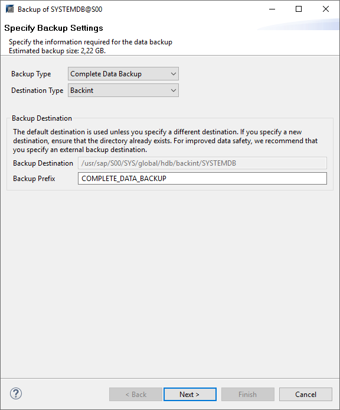
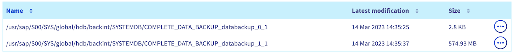
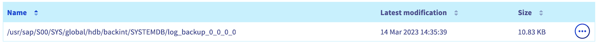
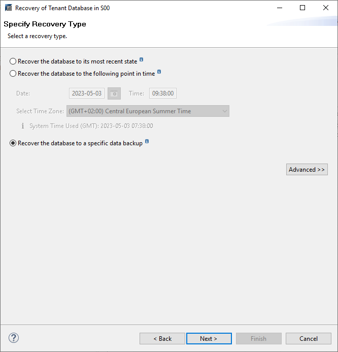
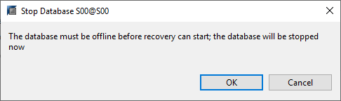
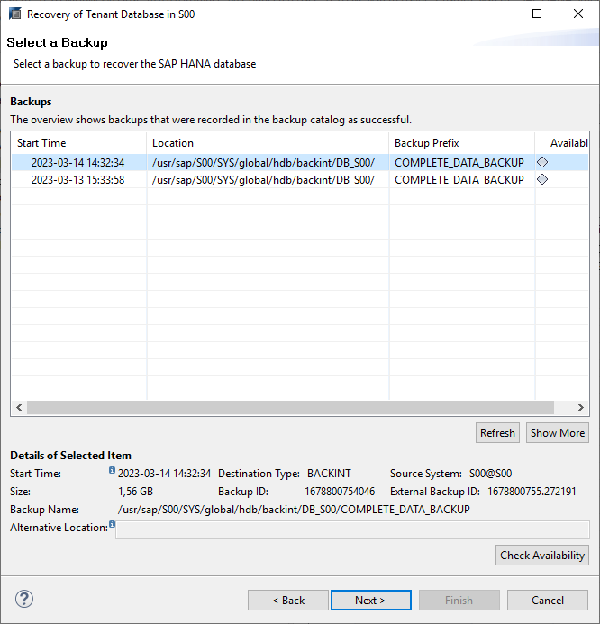
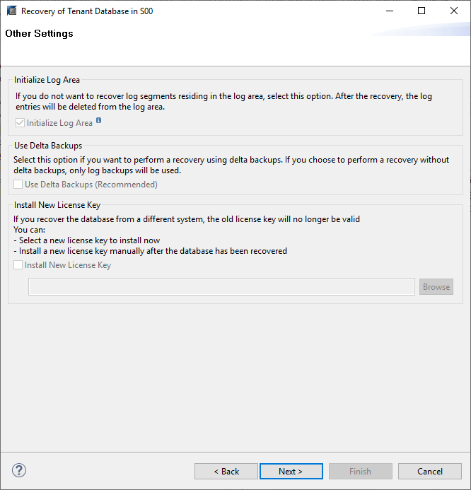
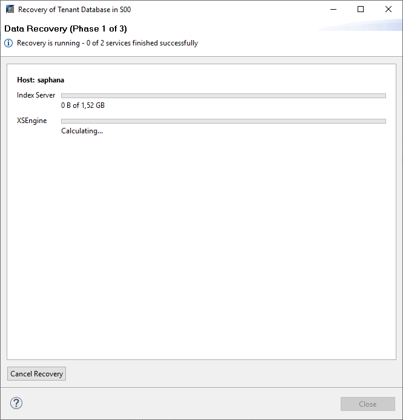

 
 
## Objective

This guide provides the details of using OVHcloud Backint Agent for SAP HANA with several S3 Object Storage buckets.

OVHcloud Backint Agent for SAP HANA allows you to back up your SAP HANA database on an OVHcloud S3 Object Storage bucket.

The advantage of using several S3 Object Storage buckets is to separate the data backup named "DATA" from the log backup named "LOG", for example to store it on an S3 Object Storage bucket with different needs or another location.

{.thumbnail}

## Requirements

- [A Public Cloud project](/pages/public_cloud/compute/create_a_public_cloud_project)deployed.
- [An S3 user](/pages/storage_and_backup/object_storage/s3_identity_and_access_management#creating-a-user) created.
- [At least two S3 Object Storage buckets](/pages/storage_and_backup/object_storage/s3_create_bucket) created.
- [The read and write rights configured](/pages/storage_and_backup/object_storage/s3_identity_and_access_management#manage-access-to-a-bucket-via-a-profile) on the S3 Object Storage buckets for the S3 user.
- An SAP HANA database installed.
- [OVHcloud Backint Agent for SAP HANA installed](/pages/hosted_private_cloud/sap_on_ovhcloud/cookbook_install_ovhcloud_backint_agent#ovhcloud-backint-agent-for-sap-hana).

> [!warning]
> The access key and the secret key should not be communicated. They grant the rights to write, read and delete the data which will be stored in the S3 Object Storage bucket.
>

## Instructions

### S3 Object Storage

> [!primary]
> To get more information about the configuration and the usage of the AWS S3 CLI commands, please refer to the documentation [Getting started with Object Storage](/pages/storage_and_backup/object_storage/s3_getting_started_with_object_storage).
>

The bucket versioning must be enabled to ensure the correct operation of OVHcloud Backint Agent.

To check if the versioning is enabled on your S3 Object Storage bucket, execute the following command:

```bash
aws --profile <profile_name> \
s3api get-bucket-versioning \
--bucket <bucket_name>
```

Output expected:

```bash
{
    "Status": "Enabled"
}
```

If the versioning status of your S3 Object Storage bucket is different from `Enabled`, execute the following command:

```bash
aws --profile <profile_name> \
s3api put-bucket-versioning \
--bucket <bucket_name> \
--versioning-configuration Status=Enabled
```

> [!warning]
> This step has to be done on all S3 Object Storage buckets which will be used to back up your SAP HANA database with OVHcloud Backint Agent.
>

### Configuration

Edit the content of the `hdbbackint.cfg` file and replace all values between round brackets by your S3 Object Storage bucket information.

```{.console}
[trace]
default = INFO
destination = outputfile
 
[ovhcloud]
endpoint_url = https://s3.(region).io.cloud.ovh.net # example : https://s3.rbx.io.cloud.ovh.net
bucket = (bucket_name) # example : sap-hana-backup
region = (region) # example : rbx
access_key = (s3_user_access_key) # example : 12345678901234567890123456789012
secret_key = (s3_user_secret_key) # example : 12345678901234567890123456789012
max_concurrency = 10
multipart_chunksize = 51916800
multipart_threshold = 51916800
```

Create a copy of the `hdbbackint.cfg` file with another name, for example `hdbbackint-log.cfg` and replace its values by the details of your second S3 Object Storage bucket.

> [!warning]
> The following commands modify the backup configuration of your SAP HANA database. Execute these commands with precaution.
>
> We recommend to trigger a full backup of your SAP HANA database after this operation to validate the configuration.
>

Execute the following SQL commands to update the backup configuration of your SAP HANA database.

*Replace in the following SQL commands the* `<SID>` *characters by the SID of your SAP HANA database.*

```SQL
ALTER SYSTEM ALTER CONFIGURATION('global.ini','SYSTEM') SET('backup','catalog_backup_parameter_file')='/usr/sap/<SID>/SYS/global/hdb/opt/hdbbackint.cfg' WITH RECONFIGURE;
ALTER SYSTEM ALTER CONFIGURATION('global.ini','SYSTEM') SET('backup','catalog_backup_using_backint')='true' WITH RECONFIGURE;
ALTER SYSTEM ALTER CONFIGURATION('global.ini','SYSTEM') SET('backup','data_backup_parameter_file')='/usr/sap/<SID>/SYS/global/hdb/opt/hdbbackint.cfg' WITH RECONFIGURE;
ALTER SYSTEM ALTER CONFIGURATION('global.ini','SYSTEM') SET('backup','log_backup_parameter_file')='/usr/sap/<SID>/SYS/global/hdb/opt/hdbbackint-log.cfg' WITH RECONFIGURE;
ALTER SYSTEM ALTER CONFIGURATION('global.ini','SYSTEM') SET('backup','log_backup_using_backint')='true' WITH RECONFIGURE;
```

> [!primary]
> To discover all backup parameters for SAP HANA, we recommend the [SAP documentation](https://help.sap.com/docs/SAP_HANA_PLATFORM/009e68bc5f3c440cb31823a3ec4bb95b/e28fbdf1024c40e1a97fca48380aad98.html?locale=en-US). In the column "Section", set "Backup".
>

### Backup

To validate the configuration, you can trigger manual backups with the following commands via SSH access:

*Replace in the following commands the* `<SID>` *characters by the SID of your SAP HANA database.*

```bash
# SYSTEMDB Backup
/usr/sap/<SID>/HDB00/exe/hdbsql -u SYSTEM -d SYSTEMDB "BACKUP DATA USING BACKINT ('MANUAL_COMPLETE_BACKUP');"

# TENANTDB Backup
/usr/sap/<SID>/HDB00/exe/hdbsql -u SYSTEM -d SYSTEMDB "BACKUP DATA FOR <SID> USING BACKINT ('MANUAL_COMPLETE_BACKUP');"
```

You also have the possibility to trigger these backups via the SAP HANA Studio software. Select `Backint`{.action} in the `Destination Type`{.action} category.

{.thumbnail}

After the execution of these backups, several "DATA_BACKUP" files are now present in your first S3 Object Storage bucket, corresponding to data backups of your SAP HANA database via OVHcloud Backint Agent.

{.thumbnail}

In your second S3 Object Storage bucket, "LOG_BACKUP" files corresponding to log backups are present.

{.thumbnail}

> [!success]
> If you see these files in your S3 Object Storage bucket, congratulations, you have successfully configured your SAP HANA backups with OVHcloud Backint Agent on two S3 Object Storage buckets.
>

If these backups have not been done as expected, check the content of the following files to search for errors:

- backint.log
- backup.log

Both files are present in the repository `/usr/sap/<SID>/HDB<NI>/<hostname>/trace` for the SYSTEMDB backup and in the repository `/usr/sap/<SID>/HDB<NI>/<hostname>/trace/DB_<SID>` for the TENANTDB backup.

The `backint.log` file gives you information about the OVHcloud Backint Agent execution. For example, a permission issue with the S3 Object Storage bucket:

```log
botocore.exceptions.ClientError: An error occurred (AccessDenied) when calling the PutObject operation: Access Denied.
```

The `backup.log` file gives you information about the backup execution through SAP HANA, its progress and its encountered errors.

```log
INFO    BACKUP   state of service: nameserver, <hostname>:30001, volume: 0, BackupExecuteTopologyAndSSFSBackupInProgress
INFO    BACKUP   state of service: nameserver, <hostname>:30001, volume: 0, BackupError
INFO    BACKUP   state of service: nameserver, <hostname>:30001, volume: 1, BackupAbortSavepointInProgress
INFO    BACKUP   state of service: nameserver, <hostname>:30001, volume: 1, BackupAbortSavepointFinished
ERROR   BACKUP   SAVE DATA finished with error: [447] backup could not be completed
```

You have the possibility to create more S3 Object Storage buckets and apply on it different parameters as the retention policy or the managing object immutability.

In order to target the right S3 Object Storage bucket, OVHcloud Backint Agent needs the corresponding `hdbbackint.cfg` file during the backup execution.

### Scheduling

A scheduling example via crontab with several S3 Object Storage buckets:

*Replace in the following commands the* `<SID>` *characters by the SID of your SAP HANA database.*

```bash
# TENANTDB Full Backup - MON THU SUN
0 0 * * 1,4,7 /usr/sap/<SID>/HDB00/exe/hdbsql -U BACKUP "BACKUP DATA FOR <SID> USING BACKINT ('SCHEDULED_$(date +\%H\%M\%S\%s)_COMPLETE_BACKUP');"
 
# TENANTDB Differential Backup - TUE WED FRI SAT
0 0 * * 2,3,5,6 /usr/sap/<SID>/HDB00/exe/hdbsql -U BACKUP "BACKUP DATA DIFFERENTIAL FOR <SID> USING BACKINT ('SCHEDULED_$(date +\%H\%M\%S\%s)_DIFFERENTIAL_BACKUP');"
 
# SYSTEMDB Full Backup - SUN
0 0 * * 7 /usr/sap/<SID>/HDB00/exe/hdbsql -U BACKUP "BACKUP DATA USING BACKINT ('SCHEDULED_$(date +\%H\%M\%S\%s)_COMPLETE_BACKUP);"

# TENANTDB Full Backup - MONTHLY (LONG RETENTION)
0 0 1 * * /usr/sap/<SID>/HDB00/monthly_backup.sh
```

> [!primary]
> The `-U` option allows you to call a stored key in the *hdbuserstore*. To know more about the addition of keys in the *hdbuserstore*, we invite you to take note of the SAP documentation available at [this address](https://help.sap.com/docs/SAP_HANA_PLATFORM/b3ee5778bc2e4a089d3299b82ec762a7/ddbdd66b632d4fe7b3c2e0e6e341e222.html?version=2.0.02&locale=en-US).
>
> In this example, the "BACKUP" key has been created with a login and password for a SAP HANA user which has the role BACKUP. The privileges to grant to this user are explained in [the SAP HANA documentation](https://help.sap.com/docs/SAP_HANA_PLATFORM/6b94445c94ae495c83a19646e7c3fd56/c4b71703bb571014810ebb38dc59cf51.html).
>

Content example of the `monthly_backup.sh` file:

```bash
#!/bin/bash

# Change the hdbbackint.cfg file to use the hdbbackint-monthly.cfg
ln -sf /usr/sap/<SID>/SYS/global/hdb/opt/hdbbackint-monthly.cfg /usr/sap/<SID>/SYS/global/hdb/opt/hdbbackint.cfg

# Trigger the TENANTDB Full Backup - MONTHLY (LONG RETENTION) to the S3 Object Storage bucket with a long retention policy
/usr/sap/<SID>/HDB00/exe/hdbsql -U BACKUP "BACKUP DATA FOR <SID> USING BACKINT ('SCHEDULED_$(date +\%H\%M\%S\%s)_COMPLETE_BACKUP');"

# Roll back the hdbbackint.cfg file to use the hdbbackint-daily.cfg file
ln -sf /usr/sap/<SID>/SYS/global/hdb/opt/hdbbackint-daily.cfg /usr/sap/<SID>/SYS/global/hdb/opt/hdbbackint.cfg
```

### Recovery

To recover a SAP HANA database from a backup done with OVHcloud Backint Agent, follow these steps in SAP HANA Studio:

> [!tabs]
> **Step 1**
>> Determine on which S3 Object Storage bucket your backup is located and aim your `hdbbackint.cfg` file at the right configuration.
>>
>> In this example, we want to use a specific monthly backup.
>>
>> ```bash
>> ln -sf /usr/sap/<SID>/SYS/global/hdb/opt/hdbbackint-monthly.cfg /usr/sap/<SID>/SYS/global/hdb/opt/hdbbackint.cfg
>> ```
>>
> **Step 2**
>> Select your TENANTDB that you want to recover.
>>
>> Then click on `Next`{.action}.
>>
>> {.thumbnail}
>>
> **Step 3**
>> Select the option that you want to use to recover your TENANTDB:
>>
>> - Recover the database to its most recent state.
>> - Recover the database to the following point in time.
>> - Recover the database to a specific data backup.
>>
>> In this example, we want to recover with a specific backup.
>>
>> Then click on `Next`{.action}.
>>
>> {.thumbnail}
>>
> **Step 4**
>> Ensure that the options `Recover using the backup catalog`{.action} and `Search for the backup catalog in Backint only`{.action} are selected.
>>
>> Then click on `Next`{.action}.
>>
>> {.thumbnail}
>>
> **Step 5**
>> The TENANTDB has to be stopped to do the recovery.
>>
>> Ensure to stop your SAP system linked to this SAP HANA database before starting the recovery.
>>
>> {.thumbnail}
>>
> **Step 6**
>> After few seconds, SAP HANA Studio displays the full backup list recorded in the backup catalog of your SAP HANA database.
>>
>> We recommend to click on `Check Availability`{.action} to check the availability of the backup in the S3 Object Storage bucket.
>>
>> Then click on `Next`{.action}.
>>
>> {.thumbnail}
>> 
> **Step 7**
>> In the case of recovery from a specific backup, no option is available.
>> 
>> {.thumbnail}
>>
> **Step 8**
>> The recovery of your SAP HANA database starts.
>>
>> {.thumbnail}
>>
> **Step 9**
>> Once the recovery has been done successfully, your SAP HANA database is started and available.
>>
>> Aim your `hdbbackint.cfg` file at your configuration used for your daily backups.
>>
>> ```bash
>> ln -sf /usr/sap/<SID>/SYS/global/hdb/opt/hdbbackint-daily.cfg /usr/sap/<SID>/SYS/global/hdb/opt/hdbbackint.cfg
>> ```
>>

## Go further

To improve the security of your backups, we advise you to set the [object immutability](/pages/storage_and_backup/object_storage/s3_managing_object_lock).

Join our community of users on <https://community.ovh.com/en/>.