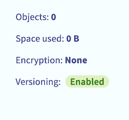
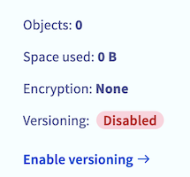

## Objectif

Ce guide vous détaille les étapes pour utiliser OVHcloud Backint Agent pour SAP HANA avec plusieurs buckets Object Storage S3.

OVHcloud Backint Agent pour SAP HANA vous permet de sauvegarder et de restaurer votre base de données SAP HANA sur un ou plusieurs buckets Object Storage S3 OVHcloud.

Utiliser plusieurs buckets Object Storage S3 peut être notamment utile pour :

- séparer les sauvegardes de données dites `databackup` des sauvegardes de fichiers de logs dites `log_backup` ;
- stocker sur des buckets Object Storage S3 ayant des besoins de rétention différents ;
- utiliser des régions différentes.

{.thumbnail}

OVHcloud Backint Agent pour SAP HANA a été certifié par SAP, vous pouvez retrouver les informations de la certification à ces adresses :

- [SAP Certified Solutions Directory](https://www.sap.com/dmc/exp/2013_09_adpd/enEN/#/solutions?search=backint&id=s:c5927e8a-cf79-40c1-84ad-cdd354554389)
- [SAP Note 2031547](https://me.sap.com/notes/0002031547)
- [SAP Note 3344150](https://me.sap.com/notes/3344150)

## Prérequis

- Être connecté à l’[espace client OVHcloud](/links/manager).
- [Un projet Public Cloud](/pages/public_cloud/compute/create_a_public_cloud_project) dans votre compte OVHcloud avec :
    - [Deux buckets Object Storage S3](/pages/storage_and_backup/object_storage/s3_create_bucket) et [un utilisateur S3](/pages/storage_and_backup/object_storage/s3_identity_and_access_management#creation-dun-utilsateur) avec le droit de lecture et d'écriture.
- Une base de données SAP HANA installée.
- [OVHcloud Backint Agent pour SAP HANA installé](/pages/hosted_private_cloud/sap_on_ovhcloud/cookbook_install_ovhcloud_backint_agent).

## En pratique

### Object Storage S3

Le versioning du bucket Object Storage S3 doit être activé afin d'assurer le bon fonctionnement d'OVHcloud Backint Agent. Le versioning permet de garder plusieurs versions d'un même objet dans votre bucket Object Storage S3.

Dans le cas des sauvegardes SAP HANA, le versioning vous permet de réaliser plusieurs sauvegardes avec le même nom (comme par exemple « COMPLETE_DATA_BACKUP ») et de garder la possibilité de restaurer une version spécifique de la sauvegarde « COMPLETE_DATA_BACKUP ». Si le versioning n'est pas activé, seule la dernière version de la sauvegarde « COMPLETE_DATA_BACKUP » peut être restaurée.

Vous pouvez vérifier le statut du versioning de votre bucket Object Storage S3 en suivant ces étapes :

1. Accédez à l'[espace client OVHcloud](/links/manager).
2. Cliquez sur l'univers `Public Cloud`{.action} et sélectionnez votre projet Public Cloud. Puis cliquez sur `Object Storage`{.action}.
3. Cliquez sur les buckets Object Storage S3 qui accueilleront les sauvegardes de votre base de données SAP HANA.
4. Vérifiez la valeur du paramètre `Versioning`{.action}, ce dernier doit avoir pour valeur `Activé`{.action}. Si la valeur de ce paramètre est `Désactivé`{.action}, cliquez sur `Activer le versioning`{.action}.

| Versioning activé | Versioning désactivé |
| --- | --- |
| {.thumbnail} | {.thumbnail} |

### Configuration

Éditez le contenu du fichier `hdbbackint.cfg` et remplacez les valeurs entre chevrons par les informations liées à votre premier bucket Object Storage S3. Ci-dessous, un exemple de son contenu.

```ini
[trace]
default = INFO
destination = outputfile
 
[ovhcloud]
endpoint_url = https://s3.rbx.io.cloud.ovh.net
bucket = mon-bucket-sap-hana-data
region = rbx
access_key = 12345678901234567890123456789012
secret_key = 12345678901234567890123456789012
max_concurrency = 10
multipart_chunksize = 1GB
multipart_threshold = 1GB
```

Les paramètres `multipart_chunksize` et `multipart_threshold` acceptent les valeurs en bytes (exemple : 52428800 équivaut à 50MB), en KB, en GB et en TB. Si l'unité de mesure n'est pas indiquée, l'unité par défaut est le byte.

- Le paramètre `multipart_threshold` permet le déclenchement de l'envoi de l'objet en plusieurs parties (multipart).
- Le paramètre `multipart_chunksize` spécifie la taille des parties de l'objet à envoyer.

Les valeurs fournies par défaut des paramètres `multipart_chunksize` et `multipart_threshold` dans le fichier `hdbbackint.cfg` offrent une performance optimale dans de nombreux cas, mais elles peuvent être augmentées ou diminuées en fonction de votre environnement.

Copiez le fichier `hdbbackint.cfg` sous un autre nom, par exemple `hdbbackint-log.cfg`, et remplacez les paramètres par les informations de votre second bucket Object Storage S3.

```ini
[trace]
default = INFO
destination = outputfile
 
[ovhcloud]
endpoint_url = https://s3.rbx.io.cloud.ovh.net
bucket = mon-bucket-sap-hana-log
region = rbx
access_key = 12345678901234567890123456789012
secret_key = 12345678901234567890123456789012
max_concurrency = 10
multipart_chunksize = 1GB
multipart_threshold = 1GB
```

>[!warning]
>
> Les commandes qui vont suivre vont modifier la configuration de sauvegarde de votre base de données SAP HANA, veillez à exécuter ces commandes avec précaution.
>
> Il est également conseillé de réaliser une sauvegarde complète de votre base de données SAP HANA après la modification de la configuration, dans le but de valider cette dernière.
>

Veuillez exécuter ces commandes SQL suivante afin de mettre à jour la configuration de sauvegarde de votre base de données SAP HANA.

*Remplacez, dans les commandes SQL ci-dessous, les caractères* `<SID>` *par le SID de votre base de données SAP HANA.*

```SQL
ALTER SYSTEM ALTER CONFIGURATION('global.ini','SYSTEM') SET('backup','catalog_backup_parameter_file')='/usr/sap/<SID>/SYS/global/hdb/opt/hdbbackint.cfg' WITH RECONFIGURE;
ALTER SYSTEM ALTER CONFIGURATION('global.ini','SYSTEM') SET('backup','catalog_backup_using_backint')='true' WITH RECONFIGURE;
ALTER SYSTEM ALTER CONFIGURATION('global.ini','SYSTEM') SET('backup','data_backup_parameter_file')='/usr/sap/<SID>/SYS/global/hdb/opt/hdbbackint.cfg' WITH RECONFIGURE;
ALTER SYSTEM ALTER CONFIGURATION('global.ini','SYSTEM') SET('backup','log_backup_parameter_file')='/usr/sap/<SID>/SYS/global/hdb/opt/hdbbackint-log.cfg' WITH RECONFIGURE;
ALTER SYSTEM ALTER CONFIGURATION('global.ini','SYSTEM') SET('backup','log_backup_using_backint')='true' WITH RECONFIGURE;
```

>[!primary]
>
> Pour connaître l'exhaustivité des paramètres liés à la sauvegarde SAP HANA, nous vous recommandons la [documentation SAP](https://help.sap.com/docs/SAP_HANA_PLATFORM/009e68bc5f3c440cb31823a3ec4bb95b/e28fbdf1024c40e1a97fca48380aad98.html?locale=en-US). Dans la colonne « Section », indiquez « Backup ».
>

### Sauvegarde

Afin de valider les fichiers de configuration précédemment créés, vous pouvez réaliser des sauvegardes manuelles depuis un accès SSH, via les commandes suivantes :

*Remplacez, dans les commandes ci-dessous, les caractères* `<SID>` *par le SID de votre base de données SAP HANA et les caractères* `<NI>` *par le numéro d'instance de votre base de données SAP HANA.*

```bash
# Sauvegarde du SYSTEMDB
/usr/sap/<SID>/HDB<NI>/exe/hdbsql -u SYSTEM -d SYSTEMDB "BACKUP DATA USING BACKINT ('MANUAL_COMPLETE_BACKUP');"

# Sauvegarde du TENANTDB
/usr/sap/<SID>/HDB<NI>/exe/hdbsql -u SYSTEM -d SYSTEMDB "BACKUP DATA FOR <SID> USING BACKINT ('MANUAL_COMPLETE_BACKUP');"
```

Vous pouvez également réaliser ces sauvegardes via SAP HANA Cockpit, en sélectionnant `Backint`{.action} dans la catégorie `Destination Type`{.action}.

{.thumbnail}

Suite à la réalisation de ces sauvegardes, plusieurs fichiers nommés `_databackup_` sont présents sur votre premier bucket Object Storage S3, ils correspondent aux sauvegardes de votre base de données SAP HANA via OVHcloud Backint Agent. Deux fichiers nommés `log_backup_0_0_0_0` ayant pour préfixe `DB_<SID>` et `SYSTEMDB` se trouvent également dans votre premier bucket Object Storage S3. Ces fichiers correspondent aux sauvegardes du catalogue de sauvegardes SAP HANA, vous permettant de lister les sauvegardes connues par SAP HANA.

{.thumbnail}

Dans votre second bucket Object Storage S3, sont présents les fichiers nommés `log_backup` qui correspondent aux sauvegardes des fichiers de logs.

{.thumbnail}

Si les sauvegardes ne sont pas effectuées comme attendu, vous avez la possibilité de démarrer votre diagnostic en étudiant le contenu de deux fichiers :

- backint.log
- backup.log

Ces deux fichiers se trouvent dans le répertoire `/usr/sap/<SID>/HDB<NI>/<hostname>/trace` pour la sauvegarde du SYSTEMDB et dans le répertoire `/usr/sap/<SID>/HDB<NI>/<hostname>/trace/DB_<SID>` pour la sauvegarde du TENANTDB.

Le fichier `backint.log` vous apportera des informations relatives à l'exécution d'OVHcloud Backint Agent, comme un problème de permissions sur le bucket Object Storage S3 par exemple :

```log
2024-02-08 14:10:41.266 backint started:
  command: /usr/sap/HDB/SYS/global/hdb/opt/hdbbackint -f backup -p /usr/sap/HDB/SYS/global/hdb/opt/hdbbackint.cfg -i /var/tmp/hdbbackint_HDB.kwu3jY -o /var/tmp/hdbbackint_HDB.N1KX90 -u HDB -s 1707397841205 -c 2 -l COMPLETE
  pid: 3702
  input:
  #SOFTWAREID "backint 1.04" "HANA HDB server 2.00.071.00.1687900751"
  #PIPE "/usr/sap/HDB/SYS/global/hdb/backint/SYSTEMDB/FULL_BACKUP_databackup_0_1"
2024-02-08 14:10:41.967 backint terminated:
  pid: 3702
  exit code: 1
  output:
  exception:
  exception  1: no.110507  (Backup/Destination/Backint/impl/BackupDestBackint_Executor.cpp:250)
      Backint exited with exit code 1 instead of 0. console output: Bucket information error in hdbbackint.cfg - 403 Forbidden
```

Le fichier `backup.log` vous apportera des informations relatives à l'exécution même de la sauvegarde à travers SAP HANA, sa progression et ses erreurs rencontrées.

```log
INFO    BACKUP   state of service: nameserver, <hostname>:30001, volume: 0, BackupExecuteTopologyAndSSFSBackupInProgress
INFO    BACKUP   state of service: nameserver, <hostname>:30001, volume: 0, BackupError
INFO    BACKUP   state of service: nameserver, <hostname>:30001, volume: 1, BackupAbortSavepointInProgress
INFO    BACKUP   state of service: nameserver, <hostname>:30001, volume: 1, BackupAbortSavepointFinished
ERROR   BACKUP   SAVE DATA finished with error: [447] backup could not be completed
```

Vous pouvez créer et utiliser plusieurs buckets Object Storage S3 pour y appliquer des paramètres supplémentaires comme une politique de rétention ou encore la gestion de l'immutabilité.

### Planification

Pour la planification de vos sauvegardes SAP HANA, veuillez vous référer à notre guide [Installer et utiliser OVHcloud Backint Agent pour SAP HANA](/pages/hosted_private_cloud/sap_on_ovhcloud/cookbook_install_ovhcloud_backint_agent#planification).

### Restauration

Pour la restauration de votre base de données SAP HANA, veuillez vous référer à notre guide [Installer et utiliser OVHcloud Backint Agent pour SAP HANA](/pages/hosted_private_cloud/sap_on_ovhcloud/cookbook_install_ovhcloud_backint_agent#restauration).

Les étapes sont identiques, même si vous utilisez des buckets Object Storage S3 différents pour vos sauvegardes `DATA` et `LOG`.

## Aller plus loin

Afin d'améliorer la sécurité de vos sauvegardes, nous vous conseillons de mettre en place la [gestion de l'immutabilité](/pages/storage_and_backup/object_storage/s3_managing_object_lock).

Si vous avez besoin d'une formation ou d'une assistance technique pour la mise en oeuvre de nos solutions, contactez votre commercial ou cliquez sur [ce lien](https://www.ovhcloud.com/fr-ca/professional-services/) pour obtenir un devis et demander une analyse personnalisée de votre projet à nos experts de l’équipe Professional Services.

Échangez avec notre communauté d'utilisateurs sur <https://community.ovh.com>.
