## Objective

This guide provides detailed steps for the installation and usage of OVHcloud Backint Agent for SAP HANA.

OVHcloud Backint Agent for SAP HANA allows you to back up and recover your SAP HANA database on one or many OVHcloud S3 Object Storage buckets.

{.thumbnail}

OVHcloud Backint Agent for SAP HANA has been certified by SAP, you can find certification information here:

- [SAP Certified Solutions Directory](https://www.sap.com/dmc/exp/2013_09_adpd/enEN/#/solutions?search=backint&id=s:c5927e8a-cf79-40c1-84ad-cdd354554389)
- [SAP Note 2031547](https://me.sap.com/notes/0002031547)
- [SAP Note 3344150](https://me.sap.com/notes/3344150)

## Requirements

- Access to the [OVHcloud Control Panel](/links/manager).
- [A Public Cloud project](/pages/public_cloud/compute/create_a_public_cloud_project) in your OVHcloud account with:
    - An [S3 Object Storage bucket](/pages/storage_and_backup/object_storage/s3_create_bucket).
    - An [S3 user](/pages/storage_and_backup/object_storage/s3_identity_and_access_management#creating-a-user) with the read and write rights.
- A SAP HANA database installed.

## Instructions

> [!primary]
>
> [** Quick access to OVHcloud Backint Agent download URL**](#ovhcloud-backint-agent-for-sap-hana)
>

### S3 Object Storage

The S3 Object Storage bucket versioning must be enabled to ensure the correct operation of OVHcloud Backint Agent. The versioning allows you to keep several versions of a same object in your S3 Object Storage bucket.

With SAP HANA backups, the versioning allows you to trigger several backups with the same name (for example "COMPLETE_DATA_BACKUP") and keeping the capacity to recover a specific version of the backup named "COMPLETE_DATA_BACKUP". If the versioning is not enabled, only the latest version of the backup named "COMPLETE_DATA_BACKUP" can be recovered.

You can check the versioning status of your Object Storage S3 bucket by following these steps:

1. Log in to the [OVHcloud Control Panel](/links/manager).
2. Click `Public Cloud`{.action} and select your Public Cloud project. Then click `Object Storage`{.action}.
3. Click on the Object Storage bucket that will host backups of your SAP HANA database.
4. Check the value of the `Versioning`{.action} parameter, it must have the value `Enabled`{.action}. If the value of this parameter is `Disabled`{.action}, click on `Enable versioning`{.action}.

| Versioning enabled | Versioning disabled |
| --- | --- |
| 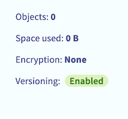{.thumbnail} | 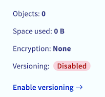{.thumbnail} |

### OVHcloud Backint Agent for SAP HANA

From your SAP HANA server, go to the repository `/usr/sap/<SID>/SYS/global/hdb/opt/` and [download the OVHcloud Backint Agent for SAP HANA archive](https://ovhcloud-backint-agent.s3.rbx.io.cloud.ovh.net/ovhcloud-backint-agent.zip) which contains:

- The usage license of OVHcloud Backint Agent for SAP HANA
- The NOTICE file including copyrights
- The VERSION file
- A configuration file template
- The OVHcloud Backint Agent for SAP HANA binary

To download the archive, you can use the following command:

```bash
wget https://ovhcloud-backint-agent.s3.rbx.io.cloud.ovh.net/ovhcloud-backint-agent.zip -P /usr/sap/<SID>/SYS/global/hdb/opt/
```

The archive `ovhcloud-backint-agent.zip` must be decompressed, you can execute the following command:

```bash
unzip /usr/sap/<SID>/SYS/global/hdb/opt/ovhcloud-backint-agent.zip -d /usr/sap/<SID>/SYS/global/hdb/opt/
```

Now, five files are present in the repository `/usr/sap/<SID>/SYS/global/hdb/opt/`:

- LICENSE
- NOTICE
- VERSION
- hdbbackint.cfg
- hdbbackint

> [!primary]
>
> Take note of the LICENSE file. By using or downloading OVHcloud Backint Agent for SAP HANA, you consent to the license terms.
>

The `hdbbackint.cfg` file must have the read and write rights, the `hdbbackint` file must have the read and execution rights. These rights must be applied to the SAP HANA (sid)adm user.

```bash
chown <sid>adm:sapsys /usr/sap/<SID>/SYS/global/hdb/opt/hdbbackint.cfg
chown <sid>adm:sapsys /usr/sap/<SID>/SYS/global/hdb/opt/hdbbackint
chmod 600 /usr/sap/<SID>/SYS/global/hdb/opt/hdbbackint.cfg
chmod 500 /usr/sap/<SID>/SYS/global/hdb/opt/hdbbackint
```

Check that you are able to execute OVHcloud Backint Agent with the SAP HANA user.

```bash
su - <sid>adm -c "/usr/sap/<SID>/SYS/global/hdb/opt/hdbbackint -v"
```

Expected output:

```console
"Backint 1.04" "OVHcloud Backint Agent version 1.0 for SAP HANA"
```

### Configuration

Edit the content of the `hdbbackint.cfg` file and replace all values between chevrons by your S3 Object Storage bucket information. Below is an example of its content after edition.

```ini
[trace]
default = INFO
destination = outputfile

[ovhcloud]
endpoint_url = https://s3.rbx.io.cloud.ovh.net
bucket = my-sap-hana-bucket
region = rbx
access_key = 12345678901234567890123456789012
secret_key = 12345678901234567890123456789012
max_concurrency = 10
multipart_chunksize = 1GB
multipart_threshold = 1GB
```

The `multipart_chunksize` and `multipart_threshold` parameters can be set with values in byte (example: 52428800 equal 50MB), in KB, in GB, or in TB. If the value is set without unit, the default unit is byte.

- The `multipart_threshold` parameter triggers the upload of an object in multipart.
- The `multipart_chunksize` parameter sets the size of each part to be uploaded.

The default values for `multipart_chunksize` and `multipart_threshold` parameters in the `hdbbackint.cfg` file offer an optimal performance in many cases, but you can increase or decrease it, depending on your environment.

> [!warning]
>
> The following commands modify the backup configuration of your SAP HANA database, please execute these commands with caution.
>
> We recommend triggering a full backup of your SAP HANA database after this operation to validate the configuration.
>

Execute the following SQL commands to update the backup configuration of your SAP HANA database.

*Replace in the following SQL commands the* `<SID>` *characters by the SID of your SAP HANA database.*

```SQL
ALTER SYSTEM ALTER CONFIGURATION('global.ini','SYSTEM') SET('backup','catalog_backup_parameter_file')='/usr/sap/<SID>/SYS/global/hdb/opt/hdbbackint.cfg' WITH RECONFIGURE;
ALTER SYSTEM ALTER CONFIGURATION('global.ini','SYSTEM') SET('backup','catalog_backup_using_backint')='true' WITH RECONFIGURE;
ALTER SYSTEM ALTER CONFIGURATION('global.ini','SYSTEM') SET('backup','data_backup_parameter_file')='/usr/sap/<SID>/SYS/global/hdb/opt/hdbbackint.cfg' WITH RECONFIGURE;
ALTER SYSTEM ALTER CONFIGURATION('global.ini','SYSTEM') SET('backup','log_backup_parameter_file')='/usr/sap/<SID>/SYS/global/hdb/opt/hdbbackint.cfg' WITH RECONFIGURE;
ALTER SYSTEM ALTER CONFIGURATION('global.ini','SYSTEM') SET('backup','log_backup_using_backint')='true' WITH RECONFIGURE;
```

If the size of your SAP HANA database is greater than 128GB, it is possible to optimise the performance of the back up and recover with enabling the multi-streaming. To do this, please execute the following SQL commands:

```SQL
ALTER SYSTEM ALTER CONFIGURATION('global.ini','SYSTEM') SET('backup','parallel_data_backup_backint_channels')='4' WITH RECONFIGURE COMMENT 'SAP NOTE 2458043';
ALTER SYSTEM ALTER CONFIGURATION('global.ini','SYSTEM') SET('backup','data_backup_buffer_size')='2048' WITH RECONFIGURE COMMENT 'SAP NOTE 2458043';
```

The value of the `data_backup_buffer_size` parameter depends from that `parallel_data_backup_backint_channels` parameter.
Its value is the result of the "512 x `parallel_data_backup_backint_channels`" operation.

> [!primary]
>
> To discover all backup parameters for SAP HANA, we recommend the [SAP documentation](https://help.sap.com/docs/SAP_HANA_PLATFORM/009e68bc5f3c440cb31823a3ec4bb95b/e28fbdf1024c40e1a97fca48380aad98.html?locale=en-US). In the column "Section", set "Backup".
>

### Backup

To validate the configuration, you can trigger manual backups with the following commands via SSH access:

*Replace in the following commands the* `<SID>` *characters by the SID of your SAP HANA database and* `<NI>` *characters by the instance number of your SAP HANA database.*

```bash
# SYSTEMDB Backup
/usr/sap/<SID>/HDB<NI>/exe/hdbsql -u SYSTEM -d SYSTEMDB "BACKUP DATA USING BACKINT ('MANUAL_COMPLETE_BACKUP');"

# TENANTDB Backup
/usr/sap/<SID>/HDB<NI>/exe/hdbsql -u SYSTEM -d SYSTEMDB "BACKUP DATA FOR <SID> USING BACKINT ('MANUAL_COMPLETE_BACKUP');"
```

You also have the possibility to trigger these backups via SAP HANA Cockpit. Select `Backint`{.action} in the `Destination Type`{.action} category.

{.thumbnail}

After the execution of these backups, several files named `_databackup_` are now present in your S3 Object Storage bucket, these files correspond to backups of your SAP HANA database via OVHcloud Backint Agent.

Two files named `log_backup_0_0_0_0` and which have `DB_<SID>` and `SYSTEMDB` prefixes are also present in your S3 Object Storage bucket. These files correspond to backups of the SAP HANA backup catalog, allowing you to list backups known by SAP HANA.

Files named `log_backup` correspond to backups of SAP HANA logs backups.

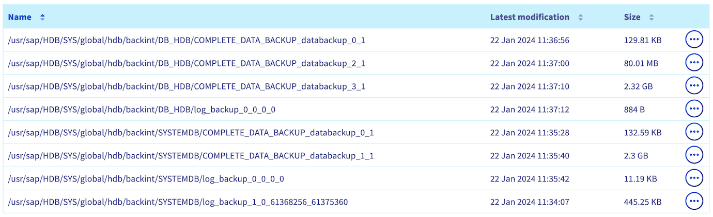{.thumbnail}

If these backups have not been done as expected, check the content of the following files to search for errors:

- backint.log
- backup.log

Both files are present in the repository `/usr/sap/<SID>/HDB<NI>/<hostname>/trace` for the SYSTEMDB backup and the repository `/usr/sap/<SID>/HDB<NI>/<hostname>/trace/DB_<SID>` for the TENANTDB backup.

The `backint.log` file gives you information about the OVHcloud Backint Agent execution. For example, a permission issue with the S3 Object Storage bucket:

```log
2024-02-08 14:10:41.266 backint started:
  command: /usr/sap/HDB/SYS/global/hdb/opt/hdbbackint -f backup -p /usr/sap/HDB/SYS/global/hdb/opt/hdbbackint.cfg -i /var/tmp/hdbbackint_HDB.kwu3jY -o /var/tmp/hdbbackint_HDB.N1KX90 -u HDB -s 1707397841205 -c 2 -l COMPLETE
  pid: 3702
  input:
  #SOFTWAREID "backint 1.04" "HANA HDB server 2.00.071.00.1687900751"
  #PIPE "/usr/sap/HDB/SYS/global/hdb/backint/SYSTEMDB/FULL_BACKUP_databackup_0_1"
2024-02-08 14:10:41.967 backint terminated:
  pid: 3702
  exit code: 1
  output:
  exception:
  exception  1: no.110507  (Backup/Destination/Backint/impl/BackupDestBackint_Executor.cpp:250)
      Backint exited with exit code 1 instead of 0. console output: Bucket information error in hdbbackint.cfg - 403 Forbidden
```

The `backup.log` file gives you information about the backup execution through SAP HANA, its progress and its encountered errors.

```log
INFO    BACKUP   state of service: nameserver, <hostname>:30001, volume: 0, BackupExecuteTopologyAndSSFSBackupInProgress
INFO    BACKUP   state of service: nameserver, <hostname>:30001, volume: 0, BackupError
INFO    BACKUP   state of service: nameserver, <hostname>:30001, volume: 1, BackupAbortSavepointInProgress
INFO    BACKUP   state of service: nameserver, <hostname>:30001, volume: 1, BackupAbortSavepointFinished
ERROR   BACKUP   SAVE DATA finished with error: [447] backup could not be completed
```

### Scheduling

The scheduling of your SAP HANA database backups has to be modified.

We advise you to refer to the SAP Note [2782059](https://launchpad.support.sap.com/#/notes/2782059) which sets out four options to schedule the backup of SAP HANA databases.

An example of a daily scheduling of a TENANTDB SAP HANA backup via the SAP HANA Cockpit:

1\. Select the TENANTDB on which you want to schedule backups. Click on `+`{.action} to add the scheduling.

{.thumbnail}

2\. Select the `Schedule a Series of Backups`{.action} option.

{.thumbnail}

3\. Give a name to your scheduling.

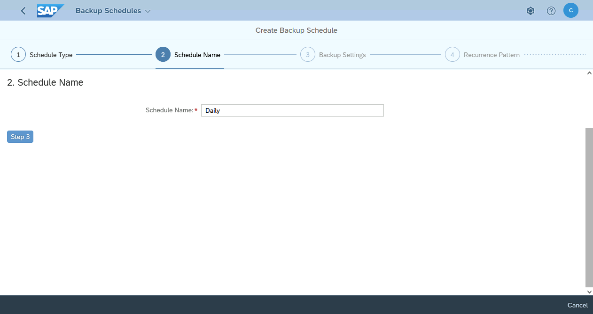{.thumbnail}

4\. Select `Complete`{.action} option then `Backint`{.action}. You have the possibility to configure a backup prefix. By default, backups are prefixed with the date and time.

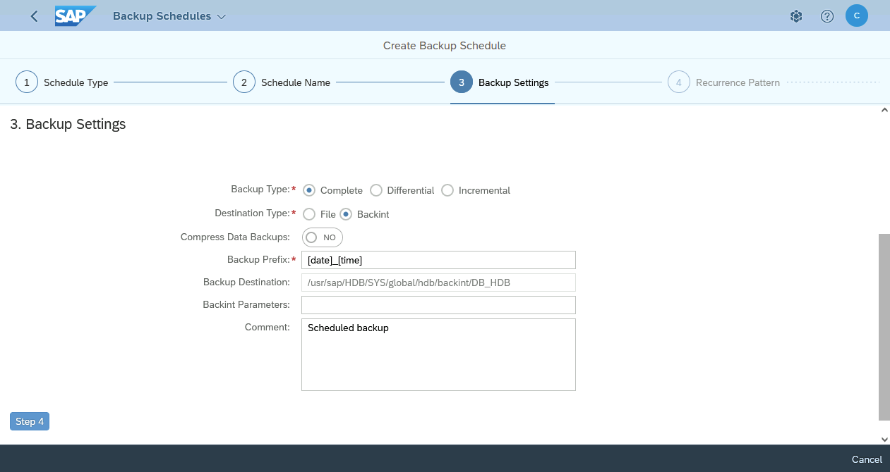{.thumbnail}

5\. Select `Weekly`{.action} option.

{.thumbnail}

6\. Select your time zone, the time and the day when the backup has to be triggered. In this daily backups example, we check all days of the week.

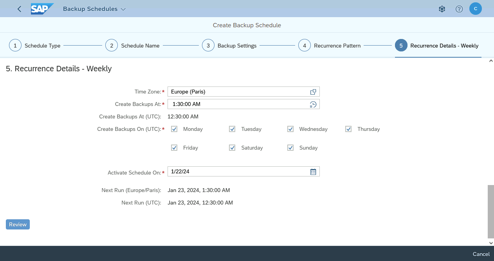{.thumbnail}

7\. Please check parameters of your scheduling before applying.

{.thumbnail}

8\. The daily scheduling is now configured for your TENANTDB.

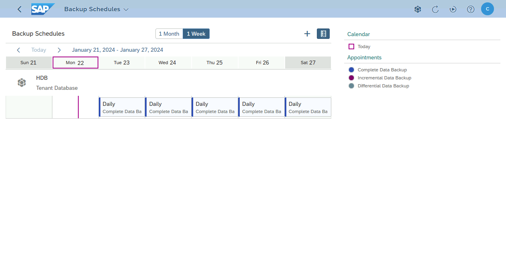{.thumbnail}

Find below the same daily backups scheduling of the TENANTDB SAP HANA via crontab:

*Replace in the following commands the* `<SID>` *characters by the SID of your SAP HANA database and* `<NI>` *characters by the instance number of your SAP HANA database.*

```bash
# TENANTDB Full Backup - Everyday
30 1 * * * /usr/sap/<SID>/HDB<NI>/exe/hdbsql -U BACKUP "BACKUP DATA FOR <SID> USING BACKINT ('$(date +\%d\%m\%Y_\%H\%M\%S\%s)_COMPLETE_BACKUP');"
```

> [!primary]
>
> The `-U` option allows you to call a stored key in the hdbuserstore. To know more about the addition of a key in the hdbuserstore, we suggest you to read the SAP documentation available at [this address](https://help.sap.com/docs/SAP_HANA_PLATFORM/b3ee5778bc2e4a089d3299b82ec762a7/ddbdd66b632d4fe7b3c2e0e6e341e222.html?version=2.0.02&locale=en-US).
>
> In this example, the `BACKUP` key has been created with a login and password for a SAP HANA user which has the role BACKUP. The privileges to grant to this user are explained in [the SAP HANA documentation](https://help.sap.com/docs/SAP_HANA_PLATFORM/6b94445c94ae495c83a19646e7c3fd56/c4b71703bb571014810ebb38dc59cf51.html).
>

### Recovery

To recover a SAP HANA database from a backup done with OVHcloud Backint Agent, follow these steps in SAP HANA Cockpit:

1\. In the `Database Management`{.action} tab, select your TENANTDB. Click on `Tenant Actions`{.action} then select `Recover Tenant`{.action}.

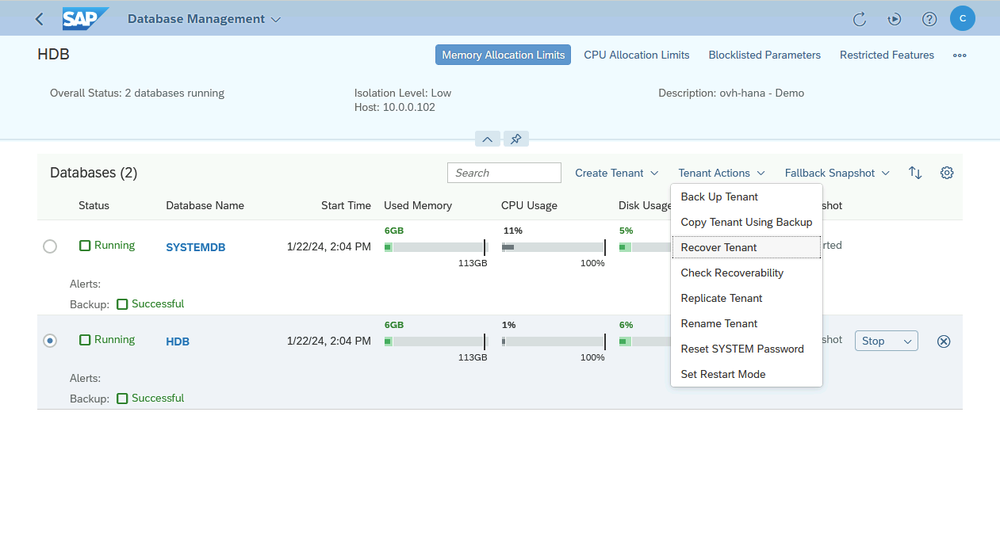{.thumbnail}

2\. The TENANTDB has to be stopped to do the recovery.

Make sure to stop your SAP system linked to this SAP HANA database before starting the recovery.

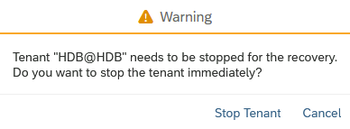{.thumbnail}

3\. Select the wanted option :

- `Data and logs backups`{.action} allows you to recover to a specific point in time.
- `Full data backup only`{.action} allows you to recover to a state of a full backup.

In our example, we select the `Data and logs backups`{.action} option.

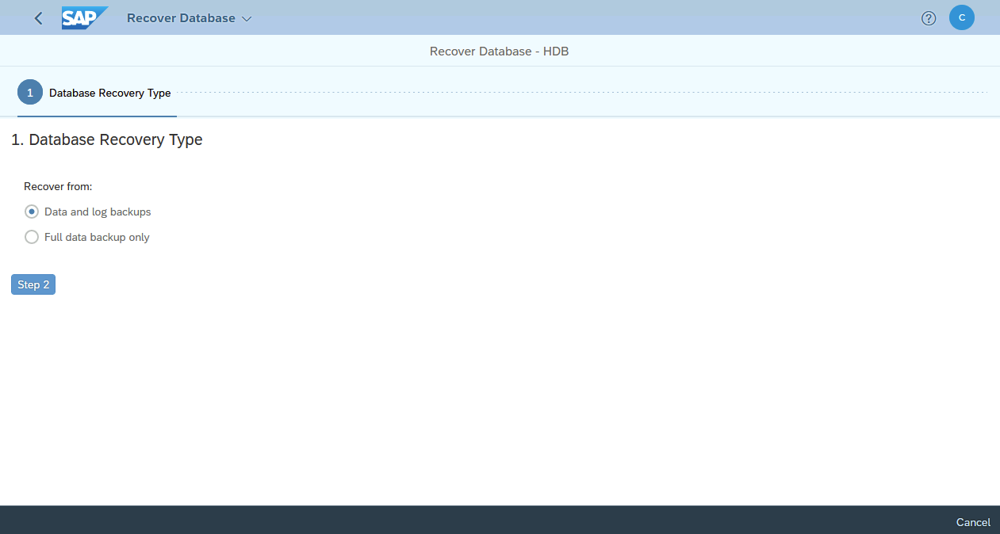{.thumbnail}

4\. If you previously selected the `Data and logs backups`{.action} option, you have two options:

- `Recover to the most recent state`{.action} allows you to recover to the most recent state.
- `Recover to a specific point in time`{.action} allows you to recover to a specific point in time.

In our example, we select the `Recover to the most recent state`{.action} option.

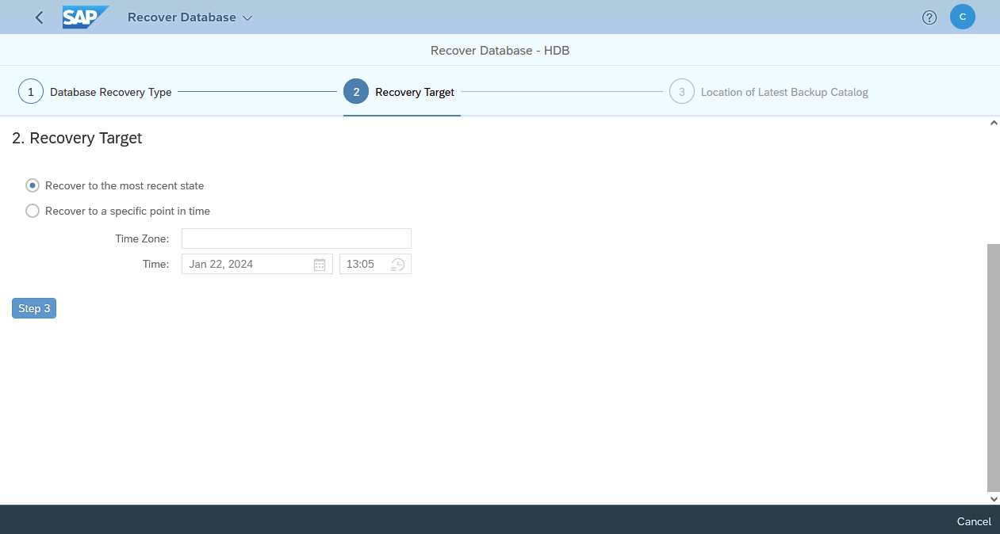{.thumbnail}

5\. If you did not modify the backups catalog location, the `Backup location only`{.action} option is right.

Otherwise, please give the path.

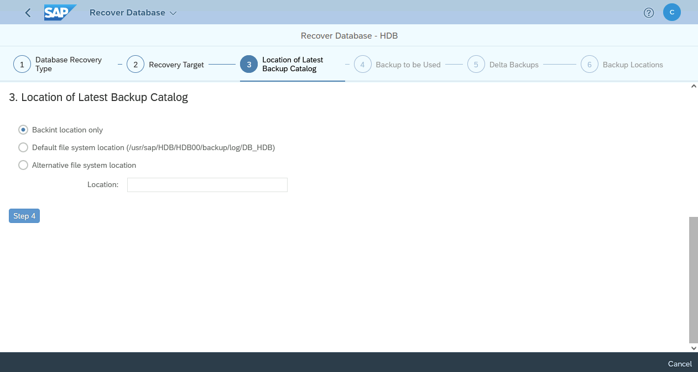{.thumbnail}

6\. After few seconds, all full data backups recorded in the backups catalog of your SAP HANA database are listed.

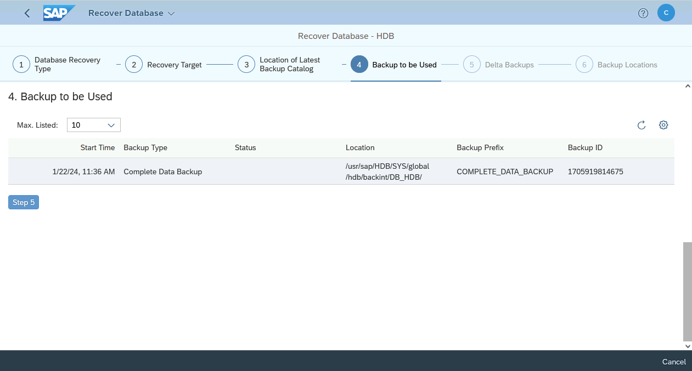{.thumbnail}

7\. You can leave the `Yes (recommended)`{.action} option selected.

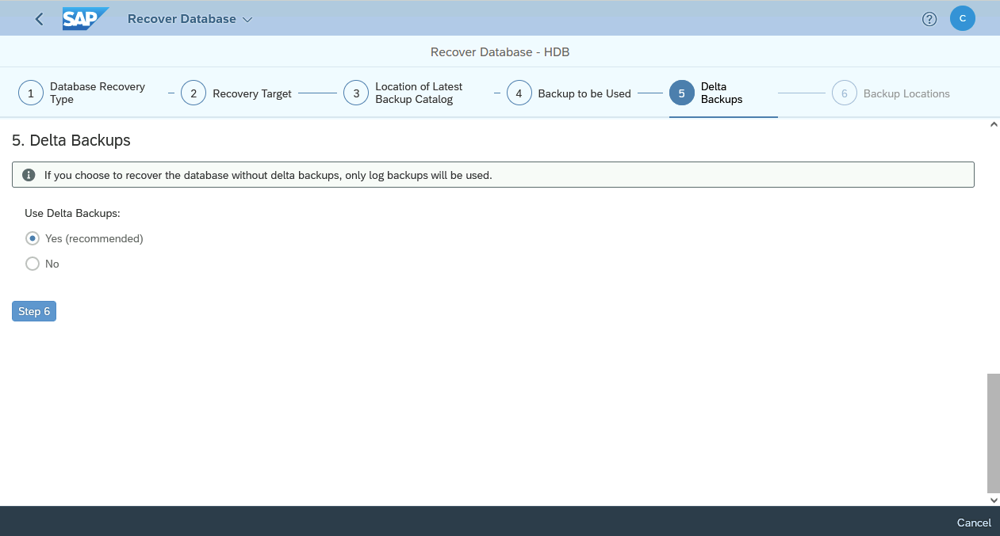{.thumbnail}

8\. If you did not modify the backups and logs backup location, please leave the fields empty.

Otherwise, please set paths.

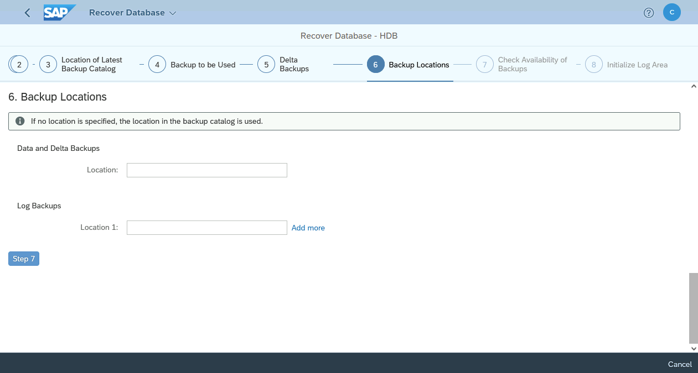{.thumbnail}

9\. We recommend selecting `Yes`{.action} for the `Backint`{.action} category. This option allows you to check the availability of backups before triggering the recovery.

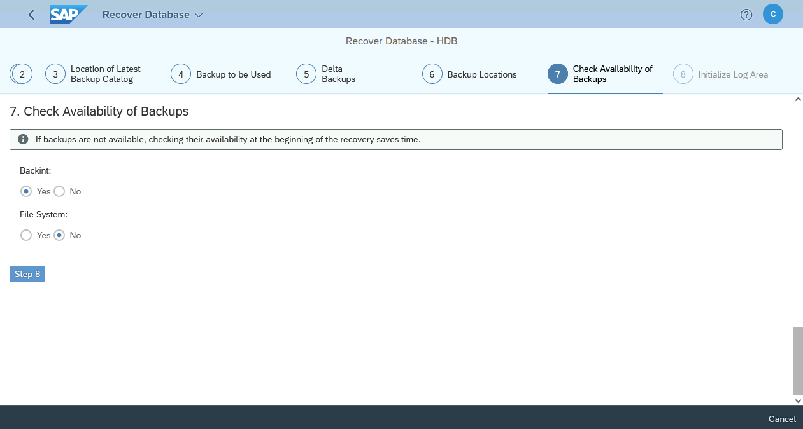{.thumbnail}

10\. In our example, we select `No`{.action} for the `Initialize the log area`{.action} step.

{.thumbnail}

11\. Please check parameters of your recovery before applying.

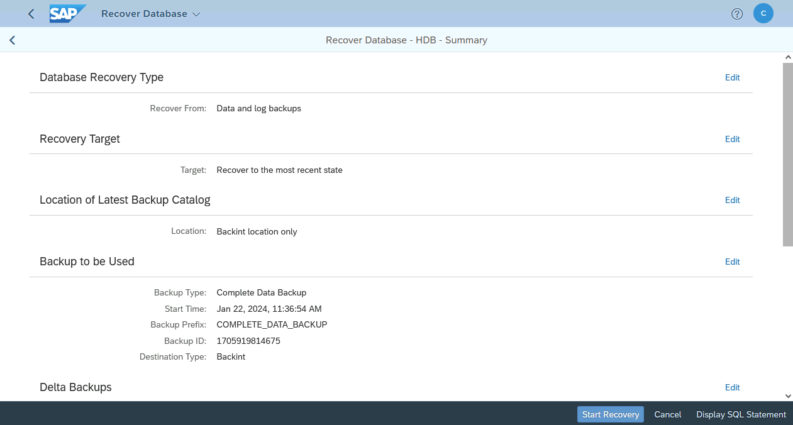{.thumbnail}

12\. The recovery of your TENANTDB services starts.

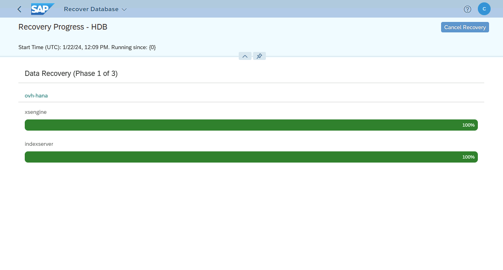{.thumbnail}

13\. Once the recovery has been done successfully, your SAP HANA database is started and available.

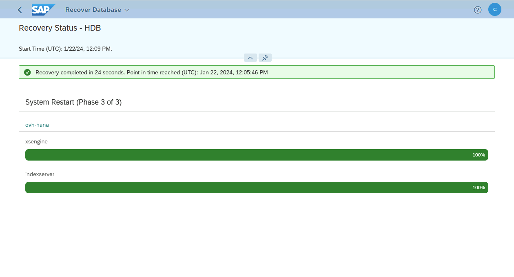{.thumbnail}

## Go further

- To improve the security of your backups, we advise you to set the [object immutability](/pages/storage_and_backup/object_storage/s3_managing_object_lock).
- You also have the possibility to [trigger SAP HANA backup to several S3 Object Storage buckets](/pages/hosted_private_cloud/sap_on_ovhcloud/cookbook_configure_ovhcloud_backint_agent_several_buckets).

If you need training or technical assistance to implement our solutions, contact your sales representative or click on [this link](/links/professional-services) to get a quote and ask our Professional Services experts for assisting you on your specific use case of your project.

Join our [community of users](/links/community).
