## Objective

This guide provides instructions for deploying a SLES for SAP virtual machine with SAP HANA, the OVHcloud Backint Agent for SAP HANA, and SAP logs on OVHcloud Logs Data Platform, pre-installed on a VMware on OVHcloud solution using OVF template provided by OVHcloud.

## Requirements

- Access to the [OVHcloud Control Panel](/links/manager)
- A [SAP HANA on Private Cloud solution](https://www.ovhcloud.com/it/hosted-private-cloud/sap-hana/) deployed
- A [Public Cloud project](/pages/public_cloud/compute/create_a_public_cloud_project) in your OVHcloud account with:
    - [An S3 Object Storage bucket](/pages/storage_and_backup/object_storage/s3_create_bucket) and [an S3 user](/pages/storage_and_backup/object_storage/s3_identity_and_access_management#creation-dun-utilsateur) with read right
    - [A second S3 Object Storage bucket](/pages/storage_and_backup/object_storage/s3_create_bucket) and [an S3 user](/pages/storage_and_backup/object_storage/s3_identity_and_access_management#creation-dun-utilsateur) with read/write rights

## Instructions

> [!primary]
>
> [**Quick access to the OVF template URL**](#ovf_link)
>

### Deployment

OVHcloud provides an OVF template that includes the SUSE Linux Enterprise Server for SAP Applications operating system, which is pre-configured to receive an SAP HANA installation.

In order to meet the vCPU/RAM ratio requirements for OLAP and OLTP workloads in a production environment, OVHcloud recommends three models of virtual machines.

| Host               | vCPU   | Socket  | Memory    |
|--------------------|--------|---------|-----------|
| SAP HANA vSAN 1536 | 24     | 0.5     | 384 GB    |
| SAP HANA vSAN 1536 | 48     | 1       | 768 GB    |
| SAP HANA vSAN 1536 | 96     | 2       | 1436 GB<sup>1</sup>  |

<sup>[1] We suggest reserving 100 GB of memory for the ESXi host.</sup>

This OVF template offers the possibility to automatically install SAP HANA, the OVHcloud Backint Agent for SAP HANA, and SAP logs on OVHcloud Logs Data Platform, reducing the time required to deliver an SAP HANA database.

First, you must upload SAP HANA sources to your first S3 Object Storage bucket, as described in the 'Requirements' section. The sources must be uploaded in the same format as the original download, for example, « 51056821.ZIP ».

> [!warning]
>
> SAP HANA Components (such as AFL, EML, LCAPPS, EPMMDS, etc.) are not managed by this automation. They should be installed and managed in the post-installation step.
>

We recommend following our [S3 Object Storage guide](/pages/storage_and_backup/object_storage/s3_getting_started_with_object_storage) if it's your first time with S3 Object Storage.

Once the SAP HANA sources have been uploaded to your S3 Object Storage bucket, you can now connect to the vSphere interface of your VMware on OVHcloud solution.

> [!warning]
>
> A current issue with the Content Library and the dynamic disk feature (as documented [KB85842](https://kb.vmware.com/s/article/85842)) requires us to use the direct link of the OVF template instead.
>

1\. To begin the deployment process, go to the vSphere interface and select your datacenter. Then, click on `Action`{.action} menu and select `Deploy OVF template`{.action}.

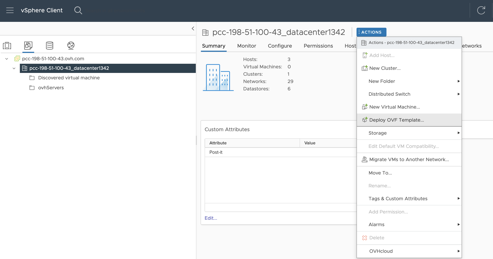{.thumbnail}

2\. Enter the following URL in the 'URL' field to access the OVF template for SAP HANA, then click `Next`{.action}.
<a name="ovf_link"></a>

The below URL is an example, you must replace the value `pcc-xxx-xxx-xxx-xxx.ovh.xxx` with the URL of your VMware on OVHcloud service.

```console
https://plugin.pcc-xxx-xxx-xxx-xxx.ovh.xxx:3330/sles4sap-sap-hana-SLE15-SP5-Full-x86_64/sles4sap-sap-hana-SLE15-SP5-Full-x86_64.ovf
```

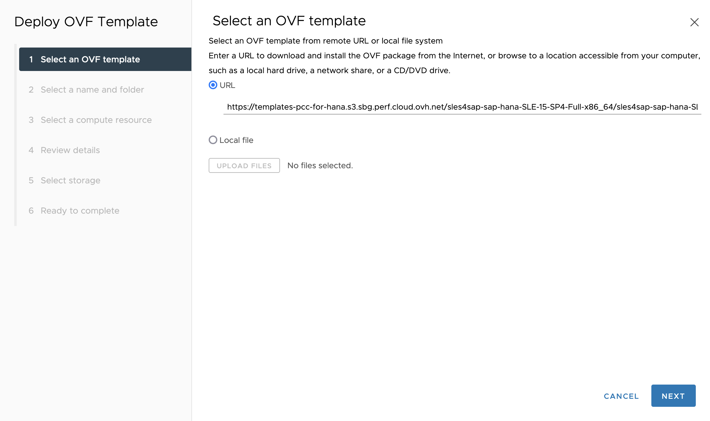{.thumbnail}

3\. Give a name to your virtual machine and select your datacenter. Then, click `Next`{.action} to continue.

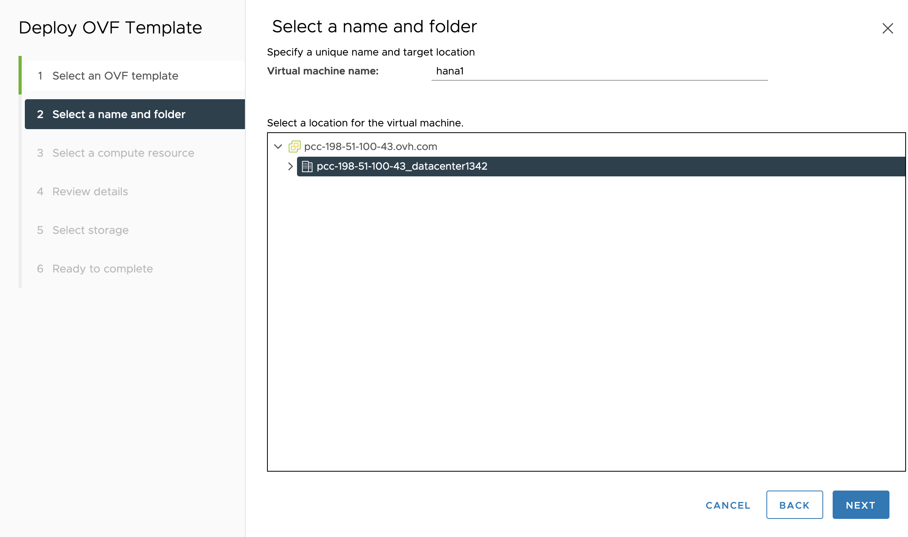{.thumbnail}

4\. Select 'Cluster1'. Then, click `Next`{.action} to continue.

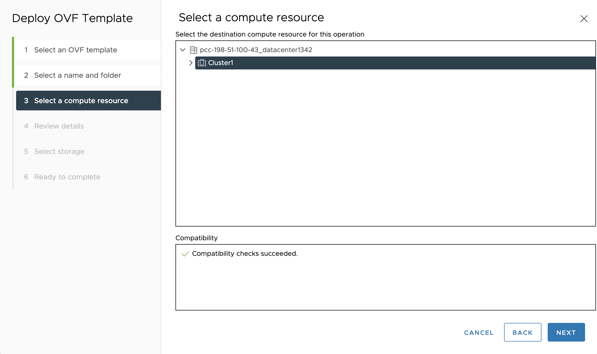{.thumbnail}

5\. The product name must be 'SLES for SAP SLE-15-SP5-Full-x86_64 for SAP HANA (BYOL)'. Then, click `Next`{.action} to continue.

Note that the advanced configurations in the OVF template may trigger a warning block to appear.

{.thumbnail}

6\. Select 'vsanDatastore' as the datastore for your SAP HANA virtual machine to comply with SAP and VMware recommendations. Then, click `Next`{.action} to continue.

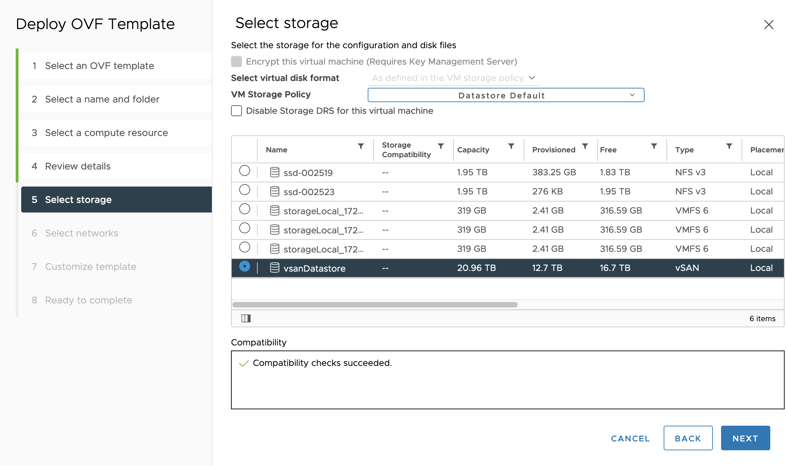{.thumbnail}

7\. From the list of available networks, select the one where you want to deploy your SAP HANA database. Then, click '`Next`{.action} to continue.

Note that you will have the opportunity to add another network card to your virtual machine after the deployment is complete, if necessary.

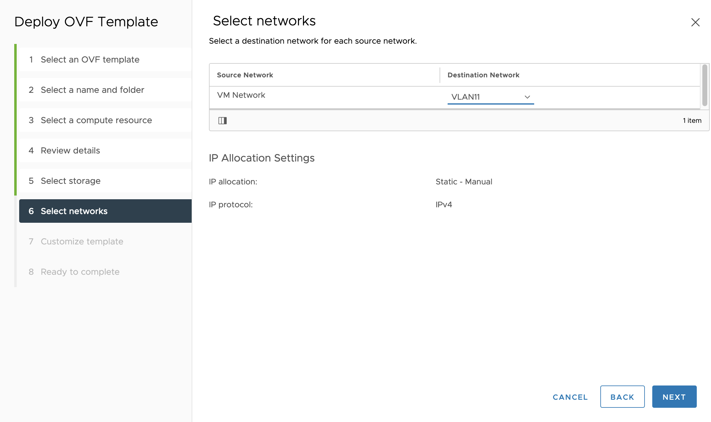{.thumbnail}

8\. The 'SLES for SAP SLE-15-SP5-Full-x86_64 for SAP HANA (BYOL)' model offers a wide range of customization options for your virtual machine. You can adjust settings such as the size of virtual disks, enable the SAP HANA installation, the OVHcloud Backint Agent installation or else SAP logs on OVHcloud Logs Data Platform.

In this guide, we focus on these four categories:

- SAP HANA disks ;
- SAP HANA installation ;
- OVHcloud Backint Agent installation ;
- SAP logs on OVHcloud Logs Data Platform.

In the `SAP HANA disks`{.action} category, you can set the size of the virtual disks that will be created. Our OVF template is pre-filled with default values for a virtual machine with 8 vCPUs and 128 GB of memory. These values are based on SAP's storage recommendations for this model.

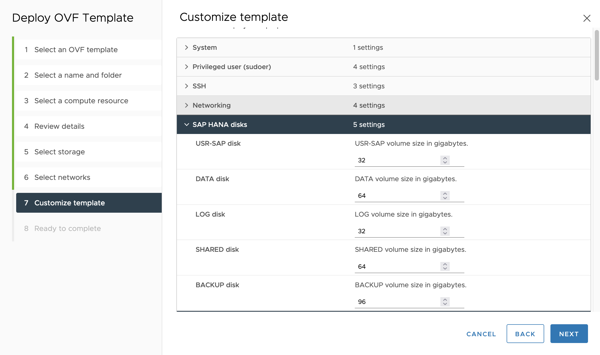{.thumbnail}

Find below the table of SAP recommendations for sizing SAP HANA disks:

| Disk       | Size                                                  |
|------------|-------------------------------------------------------|
| usrsap     | MIN(32 GB)                                            |
| hanadata   | 1 x RAM                                               |
| hanalog    | [RAM ≤ 512 GB] = 1/2 x RAM<br>[RAM > 512 GB] = 512 GB |
| hanashared | MIN(1 x RAM; 1 TB)                                    |
| hanabackup | hanadata + hanalog                                    |

If you want to use our automated installation process for SAP HANA, check the box to enable installation and fill in the required information in the `SAP HANA installation`{.action} category.

> [!primary]
>
> Take note of the [SAP Note 1979280](https://me.sap.com/notes/1979280/E) which lists all SAP HANA SIDs that are not supported by SAP.
>

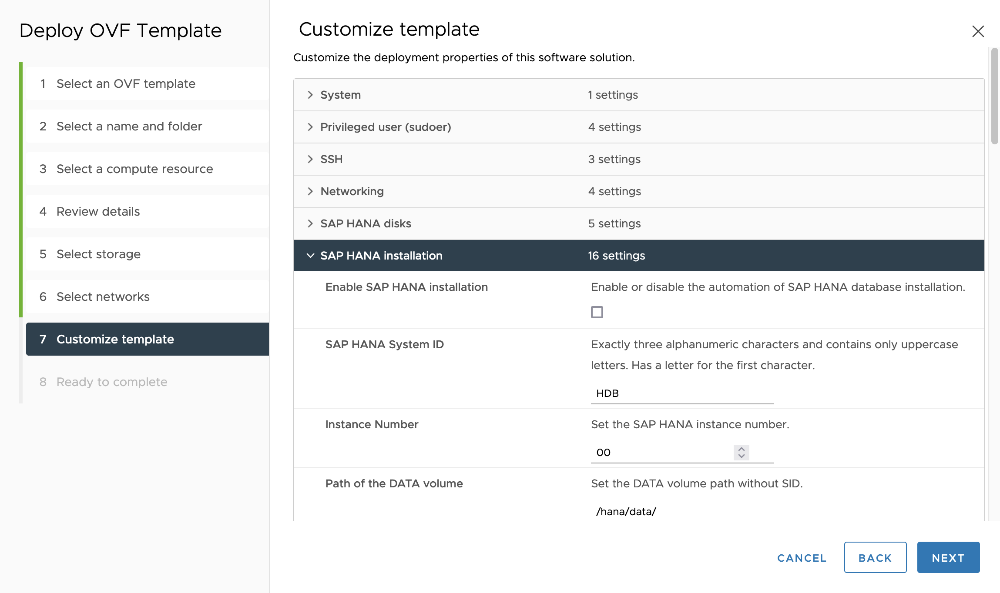{.thumbnail}

10\. To use our automated installation process for the OVHcloud Backint Agent for SAP HANA, check the box to enable installation and fill in the required information in the `OVHcloud Backint Agent installation`{.action} category.

> [!warning]
>
> Note that this option is only available if you have enabled the SAP HANA installation as described in the previous category.
>

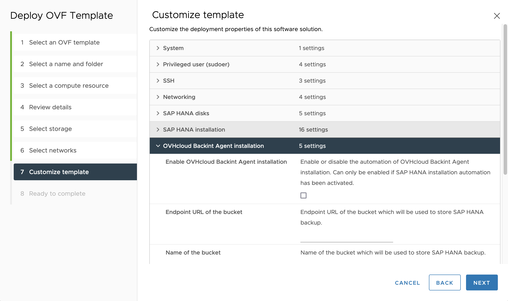{.thumbnail}

11\. To use our automated installation process for forwarding SAP logs to the OVHcloud Logs Data Platform, check the box to enable installation and fill in the required information in the `SAP logs on OVHcloud Logs Data Platform`{.action} category.

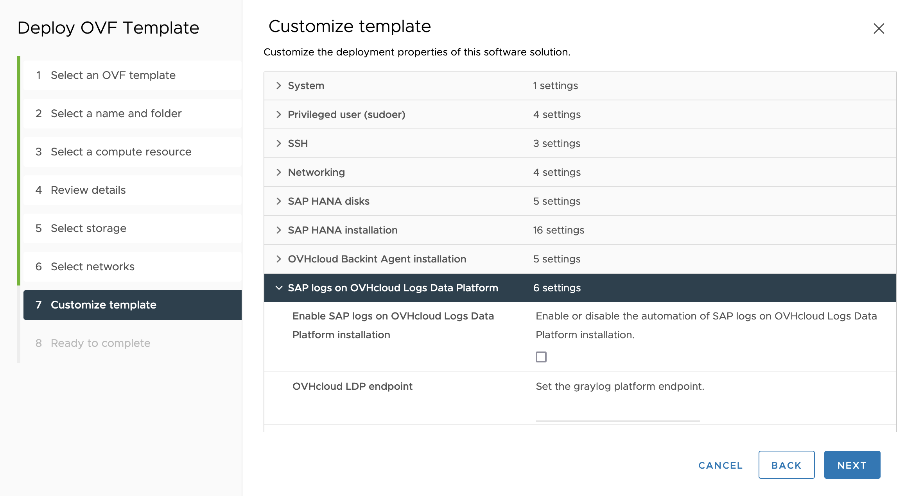{.thumbnail}

Once you have completed these steps, the deployment of your virtual machine from the OVF template created by OVHcloud will begin.

Before starting your virtual machine, we recommend reviewing the [Advanced settings](#advanced-settings) section and performing any necessary actions.

<a name="advanced-settings"></a>

### Advanced settings

Although the OVF template created by OVHcloud supports a wide range of parameters out of the box, there may be additional configurations required for specific use cases. Once your virtual machine is deployed, you can adjust these parameters to suit your needs.

1\. To make these additional adjustments, first select your virtual machine. Then, click on the `Action`{.action}, menu and select `Edit Settings`{.action}.

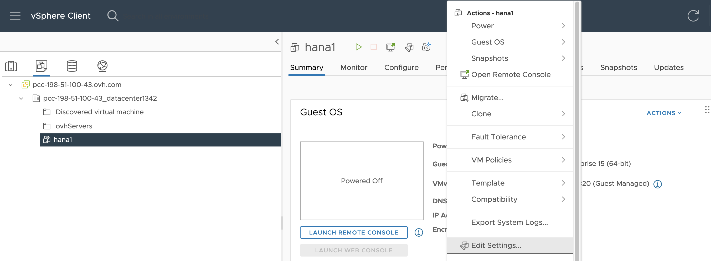{.thumbnail}

2\. From the `Edit Configuration`{.action} interface, click on the `Options VM`{.action} tab to access additional configuration options for your virtual machine. Then, expand the `Advanced`{.action} menu and select `Edit Configuration`{.action} to adjust the advanced settings as needed.

{.thumbnail}

3\. These following parameters are included in the OVF template:

| Parameter                     | Value  |
|-------------------------------|--------|
| tools.guestlib.enableHostInfo | TRUE   |
| numa.memory.gransize          | 32768  |

For more details about these parameters, we invite you to take note of the [SAP Note 1606643](https://me.sap.com/notes/1606643/E) as well as the [VMware documentation](https://core.vmware.com/resource/sap-hana-vmware-vsphere-best-practices-and-reference-architecture-guide).

4\. If your SAP HANA virtual machine uses a half-socket or only one socket, it's recommended applying this parameter:

| Parameter          | Value  |
|--------------------|--------|
| numa.vcpu.preferHT | TRUE   |

5\. We recommend applying a VM Storage Policy with thick provisioning. To create a new VM Storage Policy, click on the `vSphere Client`{.action} and select the `VM Storage Policies`{.action} icon. This will open the VM Storage Policy wizard, where you can configure the storage settings for your SAP HANA virtual machine.

Find below the parameters for the rule that we advise creating for SAP HANA:

| Parameter                         | Value                          |
|-----------------------------------|--------------------------------|
| Storage Type                      | VSAN                           |
| Site disaster tolerance           | None - standard cluster        |
| Failures to tolerate              | 1 failure - RAID-1 (Mirroring) |
| Number of disk stripes per object | 6*                             |
| IOPS limit for object             | 0                              |
| Object space reservation          | Thick provisioning             |
| Flash read cache reservation      | 0%                             |
| Disable object checksum           | No                             |
| Force provisioning                | No                             |
| Encryption services               | No preference                  |
| Space efficiency                  | Deduplication and compression  |
| Storage tier                      | All flash                      |

<sup>* For a SAP HANA on Private Cloud solution.</sup>  
<sup>The value for this rule will depend on the number of capacity disks (vSAN Capacity) on your hosts.</sup>

This VM Storage Policy must be applied to the disks that host the /hana/data (on Hard Disk 4) and /hana/log (on Hard Disk 5) volumes of your virtual machine.

6\. You can now start your virtual machine.

If you have enabled the installation of SAP HANA when deploying your virtual machine, the installation process will begin automatically during the first boot. This process can take a bit more than 15 minutes to complete, so we recommend not performing any actions on your virtual machine during this time.

To monitor the progress of the installation, you can establish an SSH connection to your virtual machine and check the status messages. These messages will appear periodically throughout the installation process, and will provide updates on the current status.

### Post-configuration

We strongly recommend performing the following actions before putting your SAP HANA database in production.

1\. Register your SUSE Linux Enterprise Server for SAP Applications operating system and get the latest updates with the command:

```bash
zypper update -y
```

2\. Install your SAP HANA licence.

3\. Create the scheduling backups for your SAP HANA database. We present an example of the scheduling backups with OVHcloud Backint Agent for SAP HANA in [our guide](/pages/hosted_private_cloud/sap_on_ovhcloud/cookbook_install_ovhcloud_backint_agent).

4\. We recommend setting the same time servers (NTP) at the OS level as the ones used by your ESXi hosts of your VMware on OVHcloud solution.

This information is available in your vSphere interface by selecting an ESXi host, going to the `Configure`{.action} tab, and then selecting `Time Configuration`{.action} in the menu.

On SLES, edit the /etc/chrony.conf file and add the IP address of NTP servers:

```console
# Allow NTP client access from local network.
# Use public servers from the pool.ntp.org project.
# Please consider joining the pool (https://www.pool.ntp.org/join.html).
server {ip-ntp-server1}
server {ip-ntp-server2}
server {ip-ntp-server3}
server {ip-ntp-server4}
```

Start and enable this service for next startup:

```bash
systemctl start chronyd.service
systemctl enable chronyd.service
```

## Go further

- [Install and use OVHcloud Backint Agent for SAP HANA](/pages/hosted_private_cloud/sap_on_ovhcloud/cookbook_install_ovhcloud_backint_agent)
- [Use OVHcloud Backint Agent with several S3 Object Storage buckets](/pages/hosted_private_cloud/sap_on_ovhcloud/cookbook_configure_ovhcloud_backint_agent_several_buckets)
- [SAP HANA on VMware vSphere Best Practices and Reference Architecture Guide](https://core.vmware.com/resource/sap-hana-vmware-vsphere-best-practices-and-reference-architecture-guide)
- [SAP Note 1606643 - Linux: VMware vSphere host monitoring interface](https://me.sap.com/notes/1606643/E)
- [SAP Note 2470289 - FAQ: SAP HANA Non-Uniform Memory Access (NUMA)](https://me.sap.com/notes/2470289)
- [SAP Note 2779240 - Workload-based sizing for virtualized environments](https://me.sap.com/notes/2779240)
- [SAP HANA on VMware vSphere](https://wiki.scn.sap.com/wiki/display/VIRTUALIZATION/SAP+HANA+on+VMware+vSphere)

If you need training or technical assistance to implement our solutions, contact your sales representative or click on [this link](https://www.ovhcloud.com/it/professional-services/) to get a quote and ask our Professional Services experts for assisting you on your specific use case of your project.

Join our community of users on <https://community.ovh.com/en/>.
