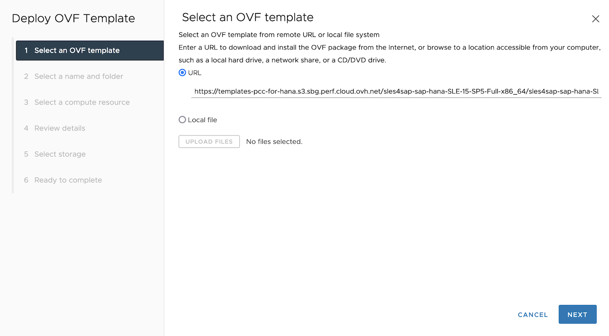

## Objective

This guide provides instructions for deploying a SLES for SAP virtual machine with SAP HANA and OVHcloud Backint Agent for SAP HANA pre-installed on VMware on OVHcloud solution using OVF template created by OVHcloud.

## Requirements

- Access to the [OVHcloud Control Panel](https://www.ovh.com/auth/?action=gotomanager&from=https://www.ovh.pt/&ovhSubsidiary=pt)
- A [SAP HANA on Private Cloud solution](https://www.ovhcloud.com/pt/hosted-private-cloud/sap-hana/) deployed
- A [Public Cloud project](/pages/public_cloud/compute/create_a_public_cloud_project) in your OVHcloud account with:
    - [An S3 Object Storage bucket](/pages/storage_and_backup/object_storage/s3_create_bucket) and [an S3 user](/pages/storage_and_backup/object_storage/s3_identity_and_access_management#creation-dun-utilsateur) with *read* right
    - [A second S3 Object Storage bucket](/pages/storage_and_backup/object_storage/s3_create_bucket) and [an S3 user](/pages/storage_and_backup/object_storage/s3_identity_and_access_management#creation-dun-utilsateur) with *read/write* rights

## Instructions

> [!primary]
>
> [**Quick access to the OVF template URL**](#ovf_link)
>

### Deployment

OVHcloud provides an OVF template including SUSE Linux Enterprise Server for SAP Applications operating system pre-configured to receive an SAP HANA installation.

In order to respect the vCPU/RAM ratio for OLAP and OLTP workloads, three models of virtual machines are recommended in a production environment.

| Host               | vCPU   | Socket  | Memory    |
|--------------------|--------|---------|-----------|
| SAP HANA vSAN 1536 | 24     | 0.5     | 384 GB    |
| SAP HANA vSAN 1536 | 48     | 1       | 768 GB    |
| SAP HANA vSAN 1536 | 96     | 2       | 1436 GB<sup>1</sup>  |

<sup>[1] We suggest reserving 100 GB of memory for the ESXi host.</sup>

This OVF template offers you the possibility to install SAP HANA as well as OVHcloud Backint Agent for SAP HANA in an automated way, reducing the time to deliver an SAP HANA database.

First, you must upload SAP HANA sources to your first S3 Object Storage bucket, as asked in the requirements chapter. The sources must be uploaded in the same format as the one used for download, for example « 51056821.ZIP ».

> [!warning]
>
> SAP HANA Components (AFL, EML, LCAPPS, EPMMDS, etc.) are not managed by this automation. They should be managed in the post-installation step.
>

We recommend following our [S3 Object Storage guide](/pages/storage_and_backup/object_storage/s3_getting_started_with_object_storage) if it's your first time with S3 Object Storage.

Once the SAP HANA sources have been uploaded in your S3 Object Storage bucket, you can now connect to the vSphere interface of your VMware on OVHcloud solution.

> [!warning]
>
> A current issue with the Content Library and the dynamic disk feature ([KB85842](https://kb.vmware.com/s/article/85842)) forces us to use the direct link of the OVF template.
>

1\. In the vSphere interface, select your datacenter, click on `Action`{.action}, then `Deploy OVF template`{.action}.

{.thumbnail}

2\. Set the following URL to reach the OVF template for SAP HANA, then click on `Next`{.action}.
<a name="ovf_link"></a>

```console
https://templates-pcc-for-hana.s3.sbg.perf.cloud.ovh.net/sles4sap-sap-hana-SLE-15-SP4-Full-x86_64/sles4sap-sap-hana-SLE-15-SP4-Full-x86_64.ovf
```

{.thumbnail}

3\. Give a name to your virtual machine and select your datacenter, then click on `Next`{.action}.

{.thumbnail}

4\. Select "Cluster1", then click on `Next`{.action}.

{.thumbnail}

5\. The product name must be "SLES for SAP SLE-15-SP4-Full-x86_64 for SAP HANA (BYOL)". Click on `Next`{.action}.

Due to advanced configurations in the OVF template, a warning block is displayed.

{.thumbnail}

6\. Select "vsanDatastore" to store your SAP HANA virtual machine, to be compliant with SAP and VMware recommendations.

{.thumbnail}

7\. Select the network where you want to deploy your SAP HANA database, then click on `Next`{.action}.

At the end of the deployment, you will have the possibility to edit your virtual machine to add another network card, if needed.

{.thumbnail}

8\. The « SLES for SAP SLE-15-SP4-Full-x86_64 for SAP HANA (BYOL) » model offers many parameters to customize the virtual machine.

In this guide, we focus on these three categories:

- SAP HANA disks ;
- SAP HANA installation ;
- OVHcloud Backint Agent installation.

In the `SAP HANA disks`{.action} category, you must set the disks size which will be created.

Our OVF template has a default configuration to deploy a virtual machine with 8vCPUS and 128GB of memory. The pre-filled values follow the SAP storage recommendations for this model.

{.thumbnail}

Find below the table of SAP recommendations to size SAP HANA disks:

| Disk       | Size                                                  |
|------------|-------------------------------------------------------|
| usrsap     | MIN(32 GB)                                            |
| hanadata   | 1 x RAM                                               |
| hanalog    | [RAM ≤ 512 GB] = 1/2 x RAM<br>[RAM > 512 GB] = 512 GB |
| hanashared | MIN(1 x RAM; 1 TB)                                    |
| hanabackup | hanadata + hanalog                                    |

9\. If you want to use the automation of the SAP HANA installation, tick the installation enable box and fill in the information in the `SAP HANA installation`{.action} category.

> [!primary]
>
> Take note of the [SAP Note 1979280](https://me.sap.com/notes/1979280/E) which describes all SAP HANA SID which cannot be used.
>

{.thumbnail}

10\. If you want to use the automation of the OVHcloud Backint Agent for SAP HANA installation to backup your SAP HANA database on an S3 Object Storage, tick the installation enable box and fill in the information in the `OVHcloud Backint Agent installation`{.action}` category.

> [!warning]
>
> This option is only available if you have enabled the SAP HANA installation in the previous category.
>

{.thumbnail}

Once these steps have been done, the deployment of your virtual machine from the OVF template created by OVHcloud starts.

We advise you to read and perform the actions of the [Advanced settings](#advanced-settings) chapter before starting your virtual machine.

<a name="advanced-settings"></a>

### Advanced settings

The OVF template created by OVHcloud takes in charge many parameters. However, some additional parameters can be set in specific cases once the virtual machine has been deployed.

1\. To add these parameters, select your virtual machine, click on `Action`{.action}, then `Edit Settings`{.action}.

{.thumbnail}

2\. Click on the `Options VM`{.action} tab, then expand the `Advanced`{.action} menu and click on `Edit Configuration`{.action}.

{.thumbnail}

3\. These following parameters are included in the OVF template:

| Parameter                     | Value  |
|-------------------------------|--------|
| tools.guestlib.enableHostInfo | TRUE   |
| numa.memory.gransize          | 32768  |

To get more details about these parameters, we invite you to take note of the [SAP Note 1606643](https://me.sap.com/notes/1606643/E) as well as the [VMware documentation](https://core.vmware.com/resource/sap-hana-vmware-vsphere-best-practices-and-reference-architecture-guide).

4\. If your SAP HANA virtual machine uses a half-socket or only one socket, it's recommended applying this parameter:

| Parameter          | Value  |
|--------------------|--------|
| numa.vcpu.preferHT | TRUE   |

5\. We recommend applying a VM Storage Policy with a thick provisioning. To create a VM Storage Policy, click the `vSphere Client`{.action}, then click the `VM Storage Policies`{.action} icon.

Find below the parameters for the rule that we advise creating for SAP HANA.

| Parameter                         | Value                          |
|-----------------------------------|--------------------------------|
| Storage Type                      | VSAN                           |
| Site disaster tolerance           | None - standard cluster        |
| Failures to tolerate              | 1 failure - RAID-1 (Mirroring) |
| Number of disk stripes per object | 1                              |
| IOPS limit for object             | 0                              |
| Object space reservation          | Thick provisioning             |
| Flash read cache reservation      | 0%                             |
| Disable object checksum           | No                             |
| Force provisioning                | No                             |
| Encryption services               | No preference                  |
| Space efficiency                  | Deduplication and compression  |
| Storage tier                      | All flash                      |

This VM Storage Policy must be applied on disks which host /hana/shared (Hard disk 3), /hana/data (Hard disk 4)
and /hana/log (Hard disk 5) volumes of your virtual machine.

6\. You can now start your virtual machine.

If you have enabled the installation of SAP HANA, the installation will start during the first boot of your virtual machine. The installation takes a bit more than 15 minutes, please don't perform any action on your virtual machine during the installation process.

A status will inform you about progress during your SSH connection to your virtual machine as well as prompt messages once connected.

### Post-configuration

We suggest you perform the following actions before putting your SAP HANA database in production.

1\. Register your SUSE Linux Enterprise Server for SAP Applications operating system and get the latest updates with the command:

```bash
zypper update -y
```

2\. Install your SAP HANA licence.

3\. Create the scheduling backups for your SAP HANA database. We present an example of the scheduling backups with OVHcloud Backint Agent for SAP HANA in [our guide](/pages/hosted_private_cloud/sap_on_ovhcloud/cookbook_install_ovhcloud_backint_agent).

4\. We suggest setting the same time servers (NTP) as the ones used by your ESXi hosts of your VMware on OVHcloud solution at the OS level.

This information is available in your vSphere interface, selecting an ESXi host, in the `Configure`{.action} tab and `Time Configuration`{.action} menu.

On SLES, edit the /etc/chrony.conf file and add the IP address of NTP servers:

```console
# Allow NTP client access from local network.
# Use public servers from the pool.ntp.org project.
# Please consider joining the pool (https://www.pool.ntp.org/join.html).
server {ip-ntp-server1}
server {ip-ntp-server2}
server {ip-ntp-server3}
server {ip-ntp-server4}
```

Just start and enable this service for next startup:

```bash
systemctl start chronyd.service
systemctl enable chronyd.service
```

## Go further

- [Install and use OVHcloud Backint Agent for SAP HANA](/pages/hosted_private_cloud/sap_on_ovhcloud/cookbook_install_ovhcloud_backint_agent)
- [Use OVHcloud Backint Agent with several S3 Object Storage buckets](/pages/hosted_private_cloud/sap_on_ovhcloud/cookbook_configure_ovhcloud_backint_agent_several_buckets)
- [SAP HANA on VMware vSphere Best Practices and Reference Architecture Guide](https://core.vmware.com/resource/sap-hana-vmware-vsphere-best-practices-and-reference-architecture-guide)
- [SAP Note 1606643 - Linux: VMware vSphere host monitoring interface](https://me.sap.com/notes/1606643/E)
- [SAP Note 2470289 - FAQ: SAP HANA Non-Uniform Memory Access (NUMA)](https://me.sap.com/notes/2470289)
- [SAP Note 2779240 - Workload-based sizing for virtualized environments](https://me.sap.com/notes/2779240)
- [SAP HANA on VMware vSphere](https://wiki.scn.sap.com/wiki/display/VIRTUALIZATION/SAP+HANA+on+VMware+vSphere)

If you need training or technical assistance to implement our solutions, contact your sales representative or click on [this link](https://www.ovhcloud.com/pt/professional-services/) to get a quote and ask our Professional Services experts for assisting you on your specific use case of your project.

Join our community of users on <https://community.ovh.com/en/>.
