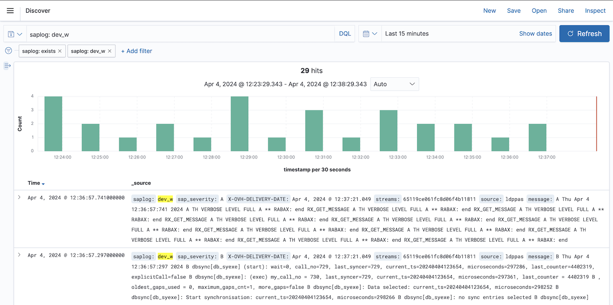
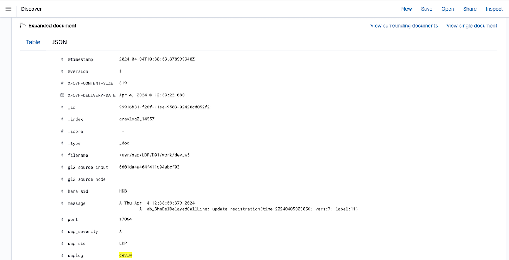
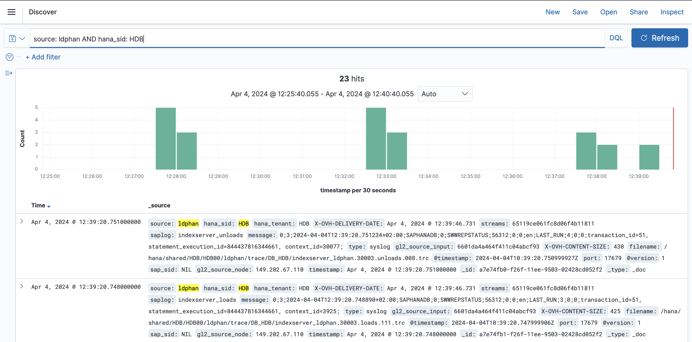
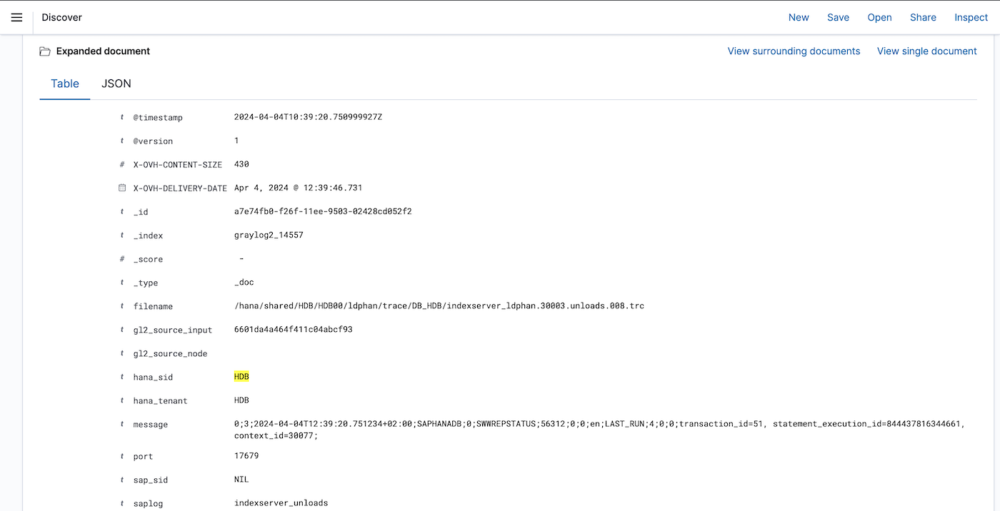
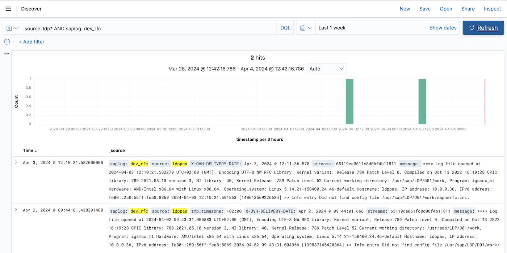
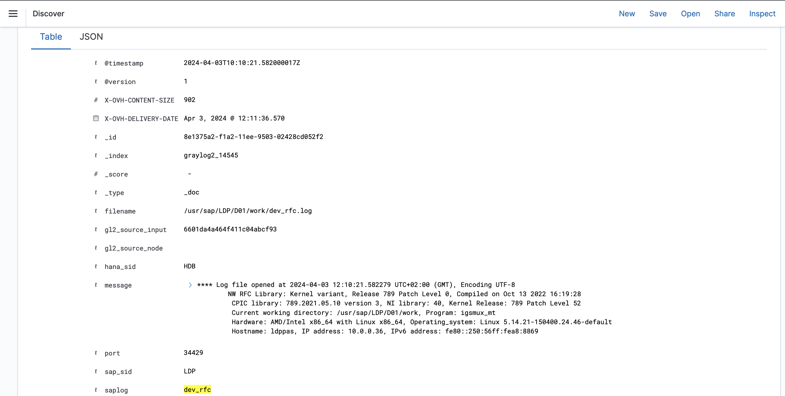
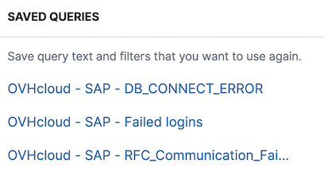
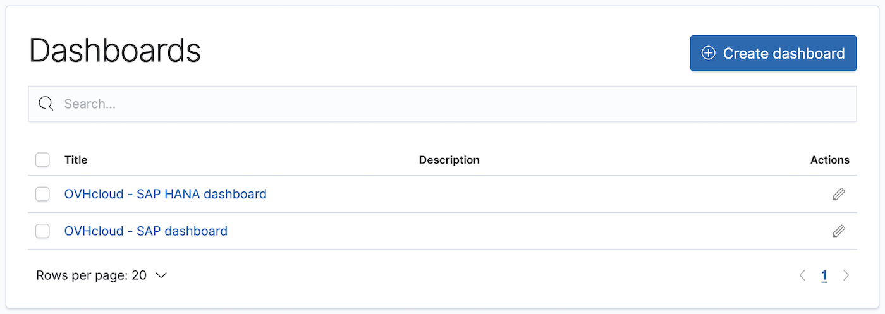
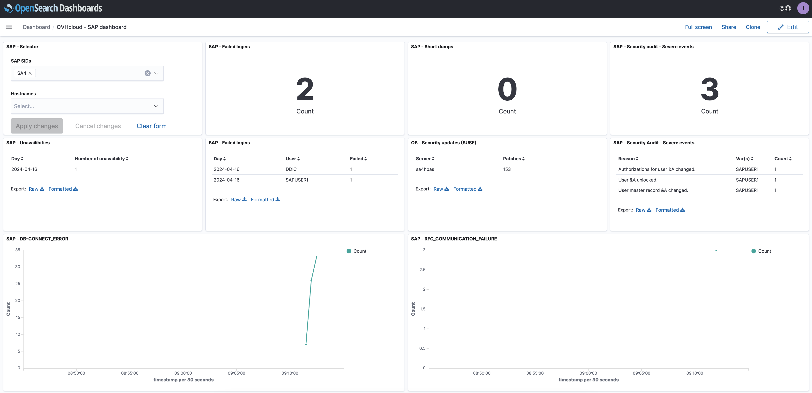

## Objectif

Ce guide a pour but de vous accompagner dans la récupération et l'exploitation de vos logs SAP avec SAP logs on OVHcloud Logs Data Platform.

Si vous n'avez pas encore configuré la fonctionnalité SAP logs on OVHcloud Logs Data Platform, veuillez suivre notre guide [SAP logs on OVHcloud Logs Data Platform - Configuration](/pages/hosted_private_cloud/sap_on_ovhcloud/cookbook_sap_logs_on_ovhcloud_logs_data_platform_solution_setup).

## Prérequis

- [SAP logs on OVHcloud Logs Data Platform configuré](/pages/hosted_private_cloud/sap_on_ovhcloud/cookbook_sap_logs_on_ovhcloud_logs_data_platform_solution_setup)

## En pratique

### Visualiser vos logs

Avec la configuration de SAP logs on OVHcloud Logs Data Platform, vos logs sont accessibles dans votre data stream.

Dans le but de les visualiser, deux options s'offrent à vous, Graylog et OpenSearch Dashboards. OpenSearch Dashboards offre la possibilité de créer des dashboards ainsi que des recherches vous aidant à répondre à vos différents cas d'usages.

OVHcloud propose une liste de fichiers SAP qui sont transférés sur votre data stream. Vous pouvez accéder à cette liste de fichiers sur notre [repository GitHub](https://github.com/ovh/sap-logs-on-ovhcloud-logs-data-platform).

### Filtrer vos logs

Plusieurs champs ont été créés afin de rendre la navigation à travers vos logs plus facile.

Ci-dessous, un résumé des champs créés :

| Nom du champ  | Description |
| ------------- | ----------- |
| filename      | Chemin absolu du fichier de log. |
| hana_sid      | SID HANA de votre base de données SAP HANA ou SID HANA utilisé par votre système SAP. |
| hana_tenant   | SID HANA du tenant dans un environnement multi-tenancy. |
| message       | Log original. |
| sap_sip       | SID SAP de votre système SAP ou SID SAP utilisé par votre base de données SAP HANA. |
| saplog        | Catégorise le message. Exemple: syslog, security_audit, dev_w, nameserver, etc. |
| source        | Nom du serveur ayant envoyé le log. |
| timestamp     | Horodatage du log (format UTC). |

Quelques exemples de filtrage :

Logs d'un fichier de trace de type work process (dev_w*)

Logs du serveur ldphan avec hana_sid HDB

Logs de tous les serveurs dont le nom démarre par ldp et provenant des fichiers de trace RFC (dev_rfc*)

À partir de ces champs, vous avez la possibilité de créer des recherches afin de vous faciliter l'analyse de vos logs.

### Utiliser les recherches sauvegardées

Dans OpenSearch Dashboards, vous avez la possibilité de sauvegarder des recherches afin de les réutiliser ultérieurement. Pour créer une recherche sauvegardée, naviguez dans la barre de recherche disponible dans la page Discover, effectuez la recherche désirée et cliquez sur `Save current query`{.action}.

> [!primary]
>
> OVHcloud fournit des requêtes de recherche SAP prédéfinies sur notre [repository GitHub](https://github.com/ovh/sap-logs-on-ovhcloud-logs-data-platform/tree/main/opensearch).
>

{.thumbnail}

### Utiliser les dashboards importés

Suite à l'importation de vos dashboards ou des dashboards d'OVHcloud, l'onglet Dashboards regroupe l'ensemble des dashboards disponibles au sein de votre solution OpenSearch Dashboards.

{.thumbnail}

Les dashboards SAP OVHcloud vous offrent la possibilité de filtrer sur un SID SAP et/ou sur un serveur en particulier.

{.thumbnail}

### Ajouter un nouveau fichier de logs

SAP logs on OVHcloud Logs Data Platform vous permet d'ajouter votre propre configuration. Pour ajouter un nouveau fichier de log, vous devez ajouter un nouveau bloc dans votre fichier de configuration rsyslog (`/etc/rsyslog.d/ovhcloud-sap-rsyslog.conf`) et appliquer la règle appropriée afin de transférer vos logs dans votre data stream.

Après chaque changement dans le fichier de configuration, il est nécessaire de redémarrer le service rsyslog.

### Récupérer les logs archivés

Si vous avez choisi d'archiver vos logs lors de la configuration de votre data stream, vous pouvez les récupérer en suivant les instructions de notre [documentation](/pages/manage_and_operate/observability/logs_data_platform/archive_cold_storage#retrieving-the-archives).

Une fois que vous avez obtenu vos logs archivés, vous pouvez les utiliser à l'aide de votre éditeur de texte, ils seront présentés dans un format GELF / JSON, avec tous les champs comme indiqués sur la plateforme Graylog.

Les données étant au format JSON, vous pouvez également envoyer vos logs sur une plateforme d'analyse Big Data.

L’API OVHcloud disponible sur [api.ovh.com](https://ca.api.ovh.com/console-preview/) peut vous aider à récupérer vos données. Dans la documentation, vous retrouverez de nombreux appels d'API qui peuvent vous aider à récupérer et utiliser vos logs.

## Aller plus loin

- [Archiving your logs - Cold-storage](/pages/manage_and_operate/observability/logs_data_platform/archive_cold_storage)
- [Logs Data Platform - Archive mirror](https://github.com/ovh/ldp-archive-mirror)
- [SAP logs on OVHcloud Logs Data Platform - Index des logs SAP](/pages/hosted_private_cloud/sap_on_ovhcloud/cookbook_sap_logs_on_ovhcloud_logs_data_platform_index_of_sap_logs)

Si vous avez besoin d'une formation ou d'une assistance technique pour la mise en oeuvre de nos solutions, contactez votre commercial ou cliquez sur [ce lien](https://www.ovhcloud.com/fr-ca/professional-services/) pour obtenir un devis et demander une analyse personnalisée de votre projet à nos experts de l’équipe Professional Services.

Échangez avec notre communauté d'utilisateurs sur <https://community.ovh.com>.
