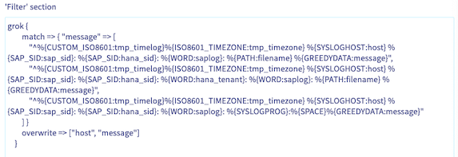

## Objective

<<<<<<< HEAD
> [!primary]
> This page is a temporary placeholder for the future SAP logs on OVHcloud Logs Data Platform feature.
>
=======
This guide provides instructions for configuring your SAP logs on OVHcloud Logs Data Platform.

{.thumbnail}

## Requirements

- Access to the [OVHcloud Control Panel](https://www.ovh.com/auth/?action=gotomanager&from=https://www.ovh.co.uk/&ovhSubsidiary=GB)
- An SAP system already installed

## Instructions

### Logs Data Platform

OVHcloud Logs Data Platform is a service that can ingests the logs generated by your infrastructure and applications, then classify and display them in real-time dashboards. For further information you can refer to the [documentation](/pages/manage_and_operate/observability/logs_data_platform).

OVHcloud provides resources (SAP logs formatting, dashboards and searches) to leverage OVHcloud Logs Data Platform service for your SAP applications.

A Logs Data Platform account is the highest-level tenancy level specific to Logs Data Platform. An account is needed to use the different logs services available.

Follow the chapter [Welcome to Logs Data Platform](/pages/manage_and_operate/observability/logs_data_platform/getting_started_quick_start#welcome-to-logs-data-platform) to create and configure you Logs Data Platform.

### Data Stream

In your Logs Data Platform, it is necessary to establish a Data Stream. The purpose of the Data Stream is to serve as a centralized hub for collecting and managing your log data.

In an SAP context, we recommend to create two different Data Streams with different retentions ; one will be used to store technical logs, the second one for audit and security logs.

To establish your Data Stream, you can refer to the chapter titled [Let's send some logs](/pages/manage_and_operate/observability/logs_data_platform/getting_started_quick_start#lets-send-some-logs). This chapter will provide you with step-by-step instructions for configuring your Data Stream and sending your log data.

Note that you can also configure retention of your logs for a certain period of time. You can find more information in our documentation named [Activating cold storage on a stream](/pages/manage_and_operate/observability/logs_data_platform/archive_cold_storage).

The table summarizes the key parameters for the two distinct Data Stream configurations:

| Name | Description | Enable WebSocket broadcasting | Enable indexation | Enable long-term storage | Compression algorithm | Archive conservation period | Storage solutions | Content of archives delivered |
| --- | --- | --- | --- | --- | --- | --- | --- | --- |
| sap-logstash | Data Stream for SAP system logs and OS logs | True | True | False | | | | |	
| audit-sap-logstash | Data Stream for audit and security logs | True | True | True |.gz (zlib) | 5 years[^1] | OVHcloud Archive | An archive containing all of the logs in Gelf format |

[^1]: The term may refer to the time frame mandated for conservation by your local regulation.

### Data-gathering tools

Due to the vast quantity and diverse nature of SAP logs, it is essential to deploy a data-gathering tool that will process, format, and structure each type of logs provided by SAP appropriately.

Follow the chapter [Host a logstash collector on Logs Data Platform](/pages/manage_and_operate/observability/logs_data_platform/ingestion_logstash_dedicated_input#host-a-logstash-collector-on-logs-data-platform) to create a new service.

Here is a summary table, listing the suggested inputs:

| Name | Description | Software | TCP port to be opened | Trusted networks[^1] | Associate with data stream |
| ---- | ----------- | -------- | --------------------- | -------------------- | -------------------------- |
| tools-sap-logstash | Data-gathering tool for SAP system logs and OS logs | LOGSTASH 8.x | 6541 | | sap-logstash |
| tools-audit-sap-logstash | Data-gathering tool for audit and security logs | LOGSTASH 8.x | 6541 | | audit-sap-logstash |

The SAP logs on OVHcloud Logs Data Platform feature provides a logstash configuration that will filter and configure all your logs received from a SAP system.

Select SAP on OVHcloud:

{.thumbnail}

The Input, Filter and Customized Grok templates will be automatically filled:

{.thumbnail}

This configuration includes the essential filters required to interact with an SAP system. You can as well develop your own filter if you have introduced new messages.

You can now finish the configuration.

On your new Data-gathering tool that you just created, click on the three dots , then "Useful information".

You will see different information related to your data-gathering tool. Those information will be needed later to configure your rsyslog service to send messages on the data-gathering tool.

[^1]: For enhanced security, we recommend configuring trusted networks as part of your setup.

### Operating system configuration

In this section, we will configure the SAP operating systems in order to forward the logs to the previously created Data-gathering tool.

> [!primary]
> This section needs to be repeated on each server from which you need to send logs on the Logs Data Platform.
>
> If you are using [SAP HANA pre-installation template](/pages/hosted_private_cloud/sap_on_ovhcloud/cookbook_sap_hana_template_vmware), please note that configuration can be triggered at the end of the form.

#### Packages

 Minimum configurations are required for SAP logs on OVHcloud Logs Data Platform. Make sure that the rsyslog (>=8.23.0) and rsyslog-module-gtls (>=8.2108) packages are presents on your environment.

- SLES
```bash
zypper install rsyslog rsyslog-module-gtls
```
- RHEL
```bash
yum install rsyslog rsyslog-module-gtls
```

#### Installation

OVHcloud provides many rsyslog configuration files available on GitHub (LINK) needed to handle correctly most of the logs available on SAP systems.

To ease the deployment of these rsyslog configurations, two solutions are available as well on the GitHub. The first one, is a bash script that will launch the configuration automatically depending on the parameters provided. The second one is an Ansible playbook to launch the configuration in multiple environments.

When launching the deployment, many options are available to configure rsyslog on your operating system:

| Name | Option | Long | Option | Ansible | Description |
| ---- | ------ | ---- | ------ | ------- | ----------- |
| Help | -h | --help | | Print a Help |
| Software Stack | -k | --software-stack | software_stack | Software Stack of the Instance, S4 / NW / HANA. Defining only the Software Stack during the installation will allow the process to discover your environment and defined the SAP SID and HANA SID automatically. |
| SAD SID | -s | --sap-sid | sap_sid | SAP SID. Three alphanumeric characters. |
| HANA SID | | --hana-sid | hana_sid | HANA SID. Three alphanumeric characters. |
| LDP target platform | -t | --ldp-target-platform | ldp_target_platform | Logs Data Platform target platform URI, ex: gra159-xxx.gra159.logs.ovh.com. |
| LDP CA file path | -p | --ldp-ca-file-path | ldp_ca_file_path	| Logs Data Platform certificate absolute path. |
| Audit LDP target platform | | --audit-ldp-target-platform | audit_ldp_target_platform | Audit Logs Data Platform target platform URI, ex: gra159-xxx.gra159.logs.ovh.com. This parameter is not mandatory but allows you to configure a different Logs Data Platform for your SAP HANA, SAP ABAP and SAP JAVA audit files. |
| Audit LDP CA file path | | --audit-ldp-ca-file-path | audit_ldp_ca_file_path | Audit Logs Data Platform certificate absolute path. This parameter is not mandatory but allows you to configure a different Logs Data Platform for your SAP HANA, SAP ABAP and SAP JAVA audit files. |
| Forward AS ABAP Audit log | | --collect-sal | collect_sal | Boolean, enables the processing and forwarding of audit logs from an Application Server ABAP. In order to use this option, the audit log must be activated on the SAP system. |

#### Terminal

A default deployment only requires the LDP endpoint and the location of the certificate:

```bash
./start.sh \
    --ldp-target-platform gra159-xxx.gra159.logs.ovh.com \
    --ldp-ca-file-path /etc/rsyslog.d/logstash.crt
```

You can specify the software stack of your system with the value S4, NW or HANA to let the script discover your environment:

```bash
./start.sh --software-stack S4 \
    --ldp-target-platform gra159-xxx.gra159.logs.ovh.com \
    --ldp-ca-file-path /etc/rsyslog.d/logstash.crt
```

Deployment with setting the SAP SID or the SAP HANA SID:

```bash
./start.sh --software-stack NW \
--sap-sid S0P \
--ldp-target-platform gra159-xxx.gra159.logs.ovh.com \
--ldp-ca-file-path /etc/rsyslog.d/logstash.crt
```

Deployment with Audit logs on a specific Data Stream:

```bash
./start.sh --software-stack NW \
--sap-sid S0P \
--ldp-target-platform gra159-xxx.gra159.logs.ovh.com \
--ldp-ca-file-path /etc/rsyslog.d/logstash.crt
--audit-ldp-target-platform gra159-xxx.gra159.logs.ovh.com \
--audit-ldp-ca-file-path /etc/rsyslog.d/audit-logstash.crt 
```

The feature SAP logs on OVHcloud Logs Data Platform provides the possibility to retrieve the ABAP security audit logs directly with the parameter --collect-sal. More information about the action of this parameter in the following chapter named SAP AS ABAP Security Audit Log:

```bash
./start.sh --software-stack NW \
--sap-sid S0P \
--ldp-target-platform gra159-xxx.gra159.logs.ovh.com \
--ldp-ca-file-path /etc/rsyslog.d/logstash.crt
--collect-sal
```

#### Ansible (>=2.15)

As explained in the introduction you can do the same thing with Ansible (parameters are named the same with underscores replacing hyphens):

```ansible
- name: Playbook - rsyslog configure
  hosts: all
  tasks:
    - name: Configure rsyslog
      ansible.builtin.include_role:
        name: rsyslog

    - name: Configure rsyslog config files
      ansible.builtin.include_role:
        name: rsyslog_config
      vars:
        software_stack: S4
        ldp_target_platform: gra159-xxx.gra159.logs.ovh.com
        ldp_ca_file_path: /etc/rsyslog.d/logstash.crt
```

Regardless of the method used, if you missed an option or need to reconfigure your rsyslog during the process, you can relaunch the script. A new configuration will be deployed, and the old configuration will be saved with the .old extension.

#### SAP AS ABAP Security Audit Log

SAP records security-related system information of your AS ABAP (The Security Audit Log). You must first activate the AS ABAP Security Audit to perform the operations related to the collection of these audits files.

By activating the audit logs, SAP will record your activities that you specify on an audit log file located in /usr/sap/\<SID\>/D\<SAP_instance_number\>/log/audit_\<date\> for SAP NetWeaver 7.50.

However, for SAP S/4HANA, the classic approach must be configured, only one file per day must be generated, the option "protection format active" must be disabled and the parameter FN_AUDIT (set in the DEFAULT.PFL profile) must be set with the value ++++++++.AUD

In order to load this new configuration, a restart of your SAP system must be done.

In order for these file to be correctly parsed and sent to Log Data Platform, OVHcloud developed a Linux service available on GitHub (link to github). It will forward audit messages on /var/log/messages file and identify them with the tag security_audit.

During the installation, two files will be created: /etc/systemd/system/ovhcloud-sap-audit.service and /usr/sbin/ovhcloud-sap-auditd, in order to create a service named ovhcloud-sap-audit.

You will be able to start or stop this new service using the commands:

```bash
systemctl stop ovhcloud-sap-audit.service
systemctl start ovhcloud-sap-audit.service
```

### Setup OpenSearch Dashboard

OVHcloud provides a solution enabling you to enhance your dashboards using OpenSearch Dashboard. With this solution, you can save searches and create dashboards tailored to your various use cases.

Create a new OpenSearch Dashboard by following the guide [Using OpenSearch Dashboards with Logs Data Platform](/pages/manage_and_operate/observability/logs_data_platform/visualization_opensearch_dashboards).

#### Import OVHcloud Objects for SAP

OVHcloud offers a collection of saved queries and dashboards that can be directly accessed on our GitHub repository (LINK). These objects can be downloaded and imported on your OpenSearch Dashboard to build base reports.

> [!primary]
>
> Note that the file downloaded will have the keyword \<alias-data-stream\> to be replaced with the alias of your Logs Data Platform to work properly.

To begin using your OpenSearch Dashboard, first enter its instance by pressing the menu button and selecting "Access your OpenSearch Dashboards instance".

Once you have entered your OpenSearch Dashboard instance, use the left panel to navigate to "Stack Management" and then "Saved Objects" to import the saved searches from OVHcloud.

By following these steps, you should now have many objects available on the "Saved Objects" page.

On your OpenSearch Dashboard, in the main menu, you should now have new dashboards created by OVHcloud with various visualization items. You can also access the saved queries by clicking on the save icon and selecting your search.

{.thumbnail}

Your logs should be new send to the Logs Data Platform and displayed on your Data Stream via OpenSearch Dashboards.

{.thumbnail}

### Setup alerts on SAP logs

You can also receive email notifications when specific patterns or threshold values are detected in your SAP logs. You will have to set up alerts from your Data Stream to perform this action.

You can create alerts with the guide [Configuring an Field Aggregation alert condition](/pages/manage_and_operate/observability/logs_data_platform/alerting_stream#configuring-an-field-aggregation-alert-condition).

Upon choosing the appropriate alert type for your requirements, we provide some example of alerts:

| Alert condition | Name | Field | Value | Threshold type | Threshold | Aggregation type | Grace period | Build-up of messages | Request filter |
| --- | --- | --- | --- | --- | --- | --- | --- | --- | --- |
| Content field | SAP - Security audit - Severe events | Severity | Severe | | | 1 | 5 | saplog: security_audit_abap and not Class: Logon and not Details: "Non-encrypted &A communication (&B)" |
| Number of messages | SAP - DB_CONNECT_ERROR | | | More than | 5 | 1 | 2 | saplog: dev_w and sap_sid: "<SAP_SID>" and message: "ERROR-DB-CONNECT_ERROR" |
| Number of messages | SAP - Short dumps | More than | 50 | 1 | 10 | saplog:syslog and message: ("Short dump" and "created") |
| Content field | SAP - Failed logins | Details | Logon failed (reason=&B, type=&A, method=&C) | | | | 5 | 3 | saplog:syslog and program: security_audit and sap_sid: "<SAP_SID>" |
| Content field | SAP - Unavailibities | message | Unavailable | | | | 1 | 1 | saplog: available |
| Content field | SAP HANA - Memory outages | message | OUT OF MEMORY | | | | 1 | 1 | saplog: *alert* and hana_sid: "<HANA_SID>" |
| Number of messages | SAP HANA - Backup issues | | | More than | 1 | | 2 | 5 | saplog: backup_tenant or saplog: backup or saplog: backint_tenant or saplog: backint and message: *ERROR* and hana_sid: "<HANA_SID>" |
| Number of messages | SAP HANA - Services alerts | | | More than | 10 | | 2 | 10 | saplog: *alert* and hana_sid: "<HANA_SID>" |
| Number of messages | SAP HANA - Modified parameters | | | More than | 5 | | 5 | 20 | saplog: nameserver  and message: "alter system alter configuration" |
| Number of messages | SAP HANA - Failed logins | | | More than | 3 | | 1 | 5 | saplog: syslog and program: (HDB_SYSTEMDB or HDB_TENANTDB) and message: "authentication failed" |

After you have created your alerts, you will receive an email in the following format:

{.thumbnail}

### Troubleshooting

If messages are not forwarded to your OVHcloud Logs Data Platform, check that the rsyslog service has no errors with the command:

```bash
systemctl status rsyslog.service
```

Commun errors are displayed there and very straightforward. If you find an error, you can search the possible resolution with the code error on the rsyslog website.

For example, errors related to your endpoint can be displayed via the rsyslog status, showing an invalid endpoint:

```bash
cannot resolve hostname 'gra159-xxx.gra159.logs.ovh.com': Invalid argument [v8.2306.0 try https://www.rsyslog.com/e/2027  ]
```

Verify that the indicated endpoint and certificate are correct. You can find these details on your Data-gathering tool under the "Useful Information" section of its menu.

Sometimes your rsyslog service can be surcharged if you are forwarding a lot of messages. Most of the times its preferable to just wait some minutes for the rsyslog service to forward the messages, as the state of each file are saved on a specific directory (/var/spool/rsyslog). If its still blocked you can restart the rsyslog service and the syslog socket.

```bash
systemctl restart rsyslog.service syslog.socket
```

### Uninstallation

If you no longer want to use the SAP logs on OVHcloud Logs Data Platform feature, you can simply remove the rsyslog configuration file (ovhcloud-sap-rsyslog.conf) related to the solution. It is located in /etc/rsyslog.d and restart your rsyslog service:

```bash
systemctl restart rsyslog.service syslog.socket
```

If you have chosen to install our audit service and now wish to uninstall it, please use the following command:

```bash
systemctl stop ovhcloud-sap-audit.service
systemctl disable ovhcloud-sap-audit.service
rm /usr/sbin/ovhcloud-sap-auditd
rm /etc/systemd/system/ovhcloud-sap-audit.service
rm -r /etc/systemd/system/ovhcloud-sap-audit.service.d
```


## Go further
- [Introduction to Logs Data Platform](/pages/manage_and_operate/observability/logs_data_platform/getting_started_introduction_to_LDP)
- [Quick start for Logs Data Platform](/pages/manage_and_operate/observability/logs_data_platform/getting_started_quick_start)


>>>>>>> 52a51e141e (feat: added docs for the new feature SAP logs on OVHcloud Logs Data Platform)
Join our community of users on <https://community.ovh.com/en/>.