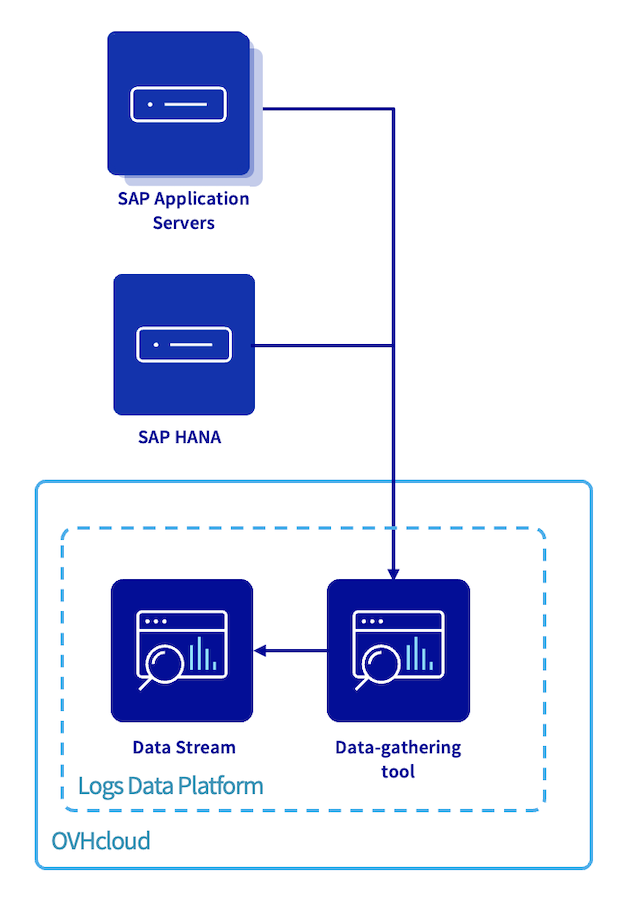
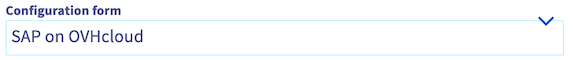
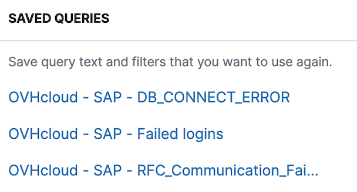
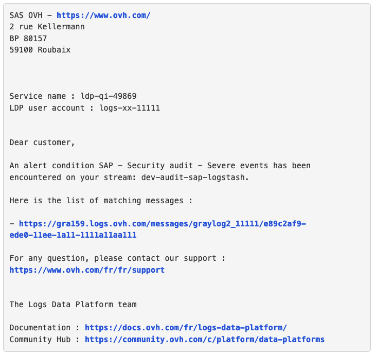

## Objectif

Ce guide vous fournit les instructions pour configurer SAP logs on OVHcloud Logs Data Platform.

{.thumbnail}

## Prérequis

- Un accès à l'[espace client OVHcloud](/links/manager).
- Un système SAP installé.

## En pratique

### Logs Data Platform

OVHcloud Logs Data Platform est un service qui traite les logs générés par vos infrastructures et applications, dans le but de les classifier et de les afficher en temps réel dans des dashboards. Pour plus d'informations, vous pouvez vous référer à notre [documentation](/products/observability-logs-data-platform).

OVHcloud fournit les ressources (formatage des logs SAP, dashboards et recherches) afin d'apporter une solution complète au service OVHcloud Logs Data Platform pour vos applications SAP.

Un compte Logs Data Platform est le plus haut niveau de conteneurisation pour Logs Data Platform. À l'intérieur de ce compte, vous pourrez déployer vos outils de collecte, vos OpenSearch Dashboards et autres.

Suivez les instructions du chapitre « Welcome to Logs Data Platform » dans notre [documentation](/pages/manage_and_operate/observability/logs_data_platform/getting_started_quick_start#welcome-to-logs-data-platform) pour créer et configurer votre compte Logs Data Platform.

### Data stream

Un data stream est un hub pour collecter et gérer vos logs dans votre compte Logs Data Platform.

Dans un environnement SAP, nous recommandons de créer deux data streams avec des politiques de rétention différentes ; un data stream qui sera utilisé pour héberger vos logs techniques et un second data stream pour héberger vos logs d'audit et de sécurité.

Pour établir la configuration de votre data stream, vous pouvez vous référer au chapitre « Let's send some logs » de notre [documentation](/pages/manage_and_operate/observability/logs_data_platform/getting_started_quick_start#lets-send-some-logs).

Vous pouvez également configurer une rétention de vos logs pour une période donnée. Vous trouverez plus d'informations dans notre documentation [Activating cold storage on a stream](/pages/manage_and_operate/observability/logs_data_platform/archive_cold_storage).

Le tableau résume les paramètres clefs pour les configurations des deux data streams que nous recommandons :

| Nom | Description | Activer la diffusion WebSocket | Activer l'indexation | Activer le stockage longue durée | Algorithme de compression | Durée de rétention des archives | Solution de stockage | Contenu des archives livrées |
| --- | --- | --- | --- | --- | --- | --- | --- | --- |
| sap-logstash | Data stream pour les logs SAP et OS | Oui | Oui | Non | | | | |
| audit-sap-logstash | Data stream pour logs d'audit et de sécurité | Oui | Oui | Oui |.gz (zlib) | 5 ans<sup>1</sup> | OVHcloud Archive | Une archive contenant l'ensemble des logs au format Gelf |

<sup>1</sup> La durée peut être ajustée en fonction de la réglementation locale de conservation des logs.

### Outils de collecte

En raison de la quantité et de la diversité des types de logs SAP, le déploiement d’un outil de collecte de données pour traiter, formater et structurer chaque type de logs fournis par SAP de manière appropriée est essentiel.

Veuillez suivre le chapitre « Host a logstash collector on Logs Data Platform » de notre [documentation](/pages/manage_and_operate/observability/logs_data_platform/ingestion_logstash_dedicated_input#host-a-logstash-collector-on-logs-data-platform) pour être guidé sur le déploiement d'un outil de collecte.

| Nom | Description | Logiciel | Port TCP à ouvrir | Réseaux de confiance<sup>2</sup> | Lier à un flux de données |
| ---- | ----------- | -------- | --------------------- | -------------------- | -------------------------- |
| tools-sap-logstash | Outil de collecte pour vos logs SAP et OS | LOGSTASH 8.x | 6514 | X.X.X.X/X | sap-logstash |
| tools-audit-sap-logstash | Outil de collecte pour vos logs d'audit et de sécurité | LOGSTASH 8.x | 6514 | X.X.X.X/X | audit-sap-logstash |

<sup>2</sup> Dans le but d'améliorer la sécurité, nous recommandons de configurer un ou plusieurs réseaux de confiance.

> [!primary]
>
> Chaque instance possède des capacités limitées pour gérer les logs en provenance de vos serveurs et de vos applications. Dans un contexte SAP, nous vous recommandons d'activer la mise à l'échelle automatique et de paramétrer le nombre minimum d'instances à 2.
>

La fonctionnalité SAP logs on OVHcloud Logs Data Platform fournit une configuration Logstash permettant de filtrer et de traiter vos logs provenant d'un serveur SAP Central Services, d'un serveur d'application SAP, d'une base de données SAP HANA, d'un SAProuter ou d'un SAP WebDispatcher.

1\. Sélectionnez `SAP on OVHcloud`{.action} dans la liste déroulante.

{.thumbnail}

2\. Les sections `Input`{.action}, `Filter`{.action} et `Modèles Grok personnalisés`{.action} sont automatiquement remplies. Vous pouvez également développer vos propres filtres si vous introduisez de nouveaux logs.

3\. Cliquez sur `Terminer la configuration`{.action}.

4\. Sur votre data stream, cliquez sur l'icône représentant les trois points, puis sur `Informations utiles`{.action}.  
Ces informations seront nécessaire pour la configuration de votre service rsyslog afin de transférer vos logs vers l'outil de collecte Logstash.

### Configuration du système d'exploitation

> [!primary]
>
> Cette section doit être répétée sur chaque serveur sur lequel vous souhaitez transférer les logs vers Logs Data Platform.
>
> Si vous utilisez notre [template SAP HANA](/pages/hosted_private_cloud/sap_on_ovhcloud/cookbook_sap_hana_template_vmware), veuillez noter que cette configuration peut être réalisée durant le déploiement du template.
>

#### Paquets

Veuillez vous assurer que les paquets rsyslog (>=8.23.0) et rsyslog-module-gtls (>=8.2108) sont présents sur vos serveurs.

```bash
$ rpm -qa rsyslog
rsyslog-8.2306.0-150400.5.27.1.x86_64

$ rpm -qa rsyslog-module-gtls
rsyslog-module-gtls-8.2306.0-150400.5.27.1.x86_64
```

Si la version est inférieure à celle requise, veuillez mettre à jour votre système d'exploitation. Si le message de sortie est vide, cela signifie que le paquet n'est pas présent sur votre système d'exploitation et que vous devez l'installer.

- SLES

```bash
zypper install rsyslog rsyslog-module-gtls
```

- RHEL

```bash
yum install rsyslog rsyslog-module-gtls
```

#### Installation

OVHcloud fournit de nombreux fichiers de configuration rsyslog disponibles sur notre [repository GitHub](https://github.com/ovh/sap-logs-on-ovhcloud-logs-data-platform). Ces fichiers sont nécessaires afin de gérer correctement les logs d'un système SAP.

Afin de faciliter le déploiement de ces configurations rsyslog, deux solutions sont disponibles sur notre GitHub. La première est un script bash lançant la configuration en fonction des paramètres fournis. La seconde est un playbook Ansible pour lancer la configuration sur plusieurs serveurs en même temps.

De nombreuses options sont disponibles pour configurer rsyslog avec nos automatisations :

| Nom                       | Option bash | Option bash (longue)        | Option Ansible            | Description                                                                                                                                                                                                                                                                                                   | Description |
|---------------------------|-------------|-----------------------------|---------------------------|---------------------------------------------------------------------------------------------------------------------------------------------------------------------------------------------------------------------------------------------------------------------------------------------------------------|-------------|
| Help                      | -h          | --help                      |                           | Affiche l'aide.                                                                                                                                                                                                                                                                                               |             |
| Software Stack            | -k          | --software-stack            | software_stack            | Software Stack de l'instance S4 / NW / HANA.<br>Permet de déclencher la découverte automatique du ou des SIDs.                                                                                                                                                                                                |             |
| SAD SID                   | -s          | --sap-sid                   | sap_sid                   | SAP SID.<br>Trois caractères alphanumériques.                                                                                                                                                                                                                                                                 |             |
| HANA SID                  |             | --hana-sid                  | hana_sid                  | HANA SID.<br>Trois caractères alphanumériques.                                                                                                                                                                                                                                                                |             |
| LDP target platform       | -t          | --ldp-target-platform       | ldp_target_platform       | URI de l'outil de collecte Logs Data Platform cible.<br>Exemple: gra159-xxx.gra159.logs.ovh.com                                                                                                                                                                                                               |             |
| LDP CA file path          | -p          | --ldp-ca-file-path          | ldp_ca_file_path          | Chemin absolu du certificat de l'outil de collecte Logs Data Platform cible.<br>Exemple: /etc/rsyslog.d/logstash.crt                                                                                                                                                                                          |             |
| Audit LDP target platform |             | --audit-ldp-target-platform | audit_ldp_target_platform | URI de l'outil de collecte Logs Data Platform cible pour les logs d'audit et de sécurité.<br>Ce paramètre n'est pas obligatoire mais permet de configurer un outil de collecte Logs Data Platform pour vos logs d'audit et de sécurité de vos SAP HANA, SAP ABAP et SAP JAVA système.                         |             |
| Audit LDP CA file path    |             | --audit-ldp-ca-file-path    | audit_ldp_ca_file_path    | Chemin absolu du certificat de l'outil de collecte Logs Data Platform cible pour les logs d'audit et de sécurité.<br>Ce paramètre n'est pas obligatoire mais permet de configurer un outil de collecte Logs Data Platform pour vos logs d'audit et de sécurité de vos SAP HANA, SAP ABAP et SAP JAVA système. |             |
| Forward AS ABAP Audit log |             | --collect-sal               | collect_sal               | Booléen.<br>Permet d'activer le service OVHcloud afin de traiter les logs d'audit SAP ABAP.                                                                                                                                                                                                                   |             |

#### Terminal

- Un déploiement minimal ne nécessite que l'hôte d'OVHcloud Logs Data Platform et la localisation du certificat :

```bash
./start.sh \
--ldp-target-platform gra159-xxx.gra159.logs.ovh.com \
--ldp-ca-file-path /etc/rsyslog.d/logstash.crt
```

- Un déploiement en paramétrant le software stack afin de laisser le script découvrir l'environnement SAP :

```bash
./start.sh --software-stack S4 \
--ldp-target-platform gra159-xxx.gra159.logs.ovh.com \
--ldp-ca-file-path /etc/rsyslog.d/logstash.crt
```

- Un déploiement en paramétrant le SID SAP :

```bash
./start.sh --software-stack NW \
--sap-sid S0P \
--ldp-target-platform gra159-xxx.gra159.logs.ovh.com \
--ldp-ca-file-path /etc/rsyslog.d/logstash.crt
```

- Un déploiement en paramétrant les logs d'audit SAP HANA sur un data stream spécifique :

```bash
./start.sh --software-stack HANA \
--sap-sid S0P \
--hana-sid HDB \
--ldp-target-platform gra159-xxx.gra159.logs.ovh.com \
--ldp-ca-file-path /etc/rsyslog.d/logstash.crt \
--audit-ldp-target-platform gra159-xxx.gra159.logs.ovh.com \
--audit-ldp-ca-file-path /etc/rsyslog.d/audit-logstash.crt
```

- Un déploiement en paramétrant la collecte des logs d'audit SAP ABAP :

*La fonctionnalité SAP logs on OVHcloud Logs Data Platform fournit la possibilité de traiter les logs d'audit ABAP avec le paramètre `--collect-sal`. Plus d'information dans le chapitre [SAP AS ABAP Security Audit Log](#sap-as-abap-security-audit-log).*

```bash
./start.sh --software-stack NW \
--sap-sid S0P \
--ldp-target-platform gra159-xxx.gra159.logs.ovh.com \
--ldp-ca-file-path /etc/rsyslog.d/logstash.crt \
--collect-sal
```

#### Ansible (>=2.15)

OVHcloud fournit un playbook Ansible pour déployer la configuration rsyslog.

```ansible
- name: Playbook - rsyslog configure
  hosts: all
  tasks:
    - name: Configure rsyslog
      ansible.builtin.include_role:
        name: rsyslog

    - name: Configure rsyslog config files
      ansible.builtin.include_role:
        name: rsyslog_config
      vars:
        software_stack: S4
        ldp_target_platform: gra159-xxx.gra159.logs.ovh.com
        ldp_ca_file_path: /etc/rsyslog.d/logstash.crt
```

> [!primary]
>
> Si vous avez oublié une option ou souhaitez reconfigurer votre rsyslog, vous pouvez relancer le script bash ou le playbook Ansible. Une nouvelle configuration sera déployée et l'ancienne configuration sera sauvegardée avec l'extension `.old`.
>

#### SAP AS ABAP Security Audit Log

SAP fournit la possibilité d'enregistrer tous les évènements liés à la sécurité d'un système SAP avec la fonctionnalité Security Audit Log.

En l'activant, toutes les activités que vous aurez spécifiées seront enregistrées dans un log d'audit localisé dans `/usr/sap/<SID>/D<NI>/log/audit_YYYYMMDD` pour la version NetWeaver 7.50. Veuillez noter que le service OVHcloud n'accepte que les fichiers journalisés ayant pour nom audit_YYYYDDMM.

Pour les versions SAP S/4HANA, l'approche classique doit être configurée. Un seul fichier par jour doit être généré, l'option `protection format active`{.action} doit être désactivée et le paramètre FN_AUDIT (configuré dans le profil DEFAULT.PFL) doit avoir pour valeur ++++++++.AUD, où ++++++++ est égal à YYYYDDMM. Dans le but de charger cette nouvelle configuration, un redémarrage de votre système SAP doit être réalisé.

Ces fichiers d'audit n'ayant pas une syntaxe rsyslog standard, OVHcloud a développé un service Linux dans le but d'identifier et d'envoyer ces logs à rsyslog par le biais du fichier `/var/log/messages`. Ces logs provenant du processus Security Audit Log sont identifiés avec le tag `security_audit_abap`{.action}.

Durant l'installation, deux fichiers sont créés `/etc/systemd/system/ovhcloud-sap-audit.service` et `/usr/sbin/ovhcloud-sap-auditd`. Ces fichiers sont utilisés pour créer le service nommé `ovhcloud-sap-audit`{.action}.

Vous pouvez démarrer ou stopper ce nouveau service en utilisant les commandes suivantes :

```bash
systemctl stop ovhcloud-sap-audit.service
systemctl start ovhcloud-sap-audit.service
```

### Configurer OpenSearch Dashboards

OVHcloud fournit une solution permettant d'améliorer vos dashboards en utilisant OpenSearch Dashboards. Avec cette solution, vous pouvez sauvegarder et créer des dashboards répondant à vos différents cas d'usage.

Pour créer un OpenSearch Dashboards, veuillez prendre connaissance de notre documentation [Using OpenSearch Dashboards with Logs Data Platform](/pages/manage_and_operate/observability/logs_data_platform/visualization_opensearch_dashboards).

#### Importer les objets OVHcloud pour SAP

OVHcloud fournit une collection de recherches et de dashboards, disponibles sur notre [repository GitHub](https://github.com/ovh/sap-logs-on-ovhcloud-logs-data-platform/tree/main/opensearch). Ces objets peuvent être téléchargés et importés dans votre OpenSearch Dashboards.

> [!primary]
>
> Dans le fichier téléchargé, les mots clefs <replace-with-your-alias-id\> et <replace-with-your-audit-alias-id\> doivent être remplacés par l'ID de l'alias de votre data stream.
>
> Dans le cas où vous n'auriez qu'un seul data stream pour vos logs techniques et de sécurité, remplacez les deux mots clefs par la même valeur.
>
> Vous pouvez trouver cet ID dans votre instance OpenSearch Dashboards, `Stack Management`{.action}, `Index patterns`{.action}, puis sélectionnez votre alias. L'ID est affichée dans l'URL et est composé de caractères alphanumériques.
>

Dans votre instance OpenSearch Dashboards, utilisez le panneau de gauche pour naviguer dans l'onglet `Stack Management`{.action}, puis `Saved Objects`{.action} et cliquez sur `Import`{.action} pour sélectionner le fichier précédemment téléchargé.

En suivant ces étapes, vous avez à présent les objets disponibles dans le menu `Saved Objects`{.action}.

Toujours au sein de votre instance OpenSearch Dashboards, dans le menu principal, vous avez à présent deux nouveaux dashboards créés par OVHcloud. Vous avez également la possibilité d'accéder aux recherches sauvegardées en cliquant sur l'icône de sauvegarde.

{.thumbnail}

Vos logs sont à présent transférés vers Logs Data Platform et sont visualisables via OpenSearch Dashboards.

{.thumbnail}

### Configurer des alertes SAP

Vous pouvez recevoir des notifications par e-mail quand des mots clefs sont détectés ou un seuil dépassé dans vos logs SAP.

Vous pouvez retrouver les informations pour créer une alerte dans notre documentation [Configuring a Field Aggregation alert condition](/pages/manage_and_operate/observability/logs_data_platform/alerting_stream#configuring-an-field-aggregation-alert-condition).

Ci-dessous, nous vous proposons des exemples d'alertes :

| Condition d'alerte | Nom | Champ | Valeur | Type de seuil | Seuil | Type d'agrégation | Période de grâce | Accumulation de messages | Filtre de requête |
| --- | --- | --- | --- | --- | --- | --- | --- | --- | --- |
| Le contenu d'un champ | SAP - Security audit - Severe events | Severity | Severe | | | 1 | 5 | saplog: security_audit_abap and not Class: Logon and not Details: "Non-encrypted &A communication (&B)" | |
| Un nombre de messages | SAP - DB_CONNECT_ERROR | | | Plus | 5 | 1 | 2 | saplog: dev_w and sap_sid: "<SAP_SID>" and message: "ERROR-DB-CONNECT_ERROR" | |
| Un nombre de messages | SAP - Short dumps | | | | Plus | 50 | 1 | 10 | saplog:syslog and message: ("Short dump" and "created") |
| Le contenu d'un champ | SAP - Failed logins | Details | Logon failed (reason=&B, type=&A, method=&C) | | | | 5 | 3 | saplog:security_audit_abap and sap_sid: "<SAP_SID>" |
| Le contenu d'un champ | SAP - Unavailibities | message | Unavailable | | | | 1 | 1 | saplog: available |
| Le contenu d'un champ | SAP HANA - Memory outages | message | OUT OF MEMORY | | | | 1 | 1 | saplog: \*alert* and hana_sid: "<HANA_SID>" |
| Un nombre de messages | SAP HANA - Backup issues | | | Plus | 1 | | 2 | 5 | saplog: backup_tenant or saplog: backup or saplog: backint_tenant or saplog: backint and message: \*ERROR* and hana_sid: "<HANA_SID>" |
| Un nombre de messages | SAP HANA - Services alerts | | | Plus | 10 | | 2 | 10 | saplog: \*alert* and hana_sid: "<HANA_SID>" |
| Un nombre de messages | SAP HANA - Modified parameters | | | Plus | 5 | | 5 | 20 | saplog: nameserver  and message: "alter system alter configuration" |
| Un nombre de messages | SAP HANA - Failed logins | | | Plus | 3 | | 1 | 5 | saplog: syslog and program: (HDB_SYSTEMDB or HDB_TENANTDB) and message: "authentication failed" |

Quand une alerte est déclenchée, vous recevez ce type d'e-mail.

{.thumbnail}

### Diagnostic

Si les messages ne sont pas transférés à votre OVHcloud Logs Data Platform, veuillez vérifier que votre service rsyslog n'a pas d'erreur avec la commande :

```bash
systemctl status rsyslog.service
```

Par exemple, une erreur en lien avec votre hôte OVHcloud Logs Data Platform:

```console
cannot resolve hostname 'gra159-xxx.gra159.logs.ovh.com': Invalid argument [v8.2306.0 try https://www.rsyslog.com/e/2027]
```

Vérifiez que les informations de votre hôte et de votre certificat sont correctes. Vous trouverez ces informations dans votre outil de collecte dans la section `Informations utiles`{.action} de ce menu.

Parfois, le service rsyslog peut être surchargé dans le cas où un très grand nombre de messages doit être envoyé. Dans la plupart des cas, il est préférable d'attendre quelques minutes que le service rsyslog traite les messages par le biais de son spool (`/var/spool/rsyslog`). Si après plusieurs minutes, vous vous apercevez que les messages sont toujours bloqués, vous pouvez alors envisager de redémarrer les services rsyslog et syslog.socket.

```bash
systemctl restart rsyslog.service syslog.socket
```

### Désinstallation

Si vous ne souhaitez plus utiliser la fonctionnalité SAP logs on OVHcloud Logs Data Platform, vous pouvez supprimer le fichier de configuration rsyslog `/etc/rsyslog.d/ovhcloud-sap-rsyslog.conf` et redémarrer les services syslog et syslog.socket.

```bash
systemctl restart rsyslog.service syslog.socket
```

Si vous aviez choisi d'installer notre service pour gérer les logs d'audit SAP, il vous suffit d'exécuter les commandes suivantes :

```bash
systemctl stop ovhcloud-sap-audit.service
systemctl disable ovhcloud-sap-audit.service
rm /usr/sbin/ovhcloud-sap-auditd
rm /etc/systemd/system/ovhcloud-sap-audit.service
rm -r /etc/systemd/system/ovhcloud-sap-audit.service.d
```

## Aller plus loin

- [Introduction to Logs Data Platform](/pages/manage_and_operate/observability/logs_data_platform/getting_started_introduction_to_LDP)
- [Quick start for Logs Data Platform](/pages/manage_and_operate/observability/logs_data_platform/getting_started_quick_start)
- [SAP logs on OVHcloud Logs Data Platform - Analysez et exploitez vos logs](/pages/hosted_private_cloud/sap_on_ovhcloud/cookbook_sap_logs_on_ovhcloud_logs_data_platform_analyze_and_work_with_your_logs)

Si vous avez besoin d'une formation ou d'une assistance technique pour la mise en oeuvre de nos solutions, contactez votre commercial ou cliquez sur [ce lien](https://www.ovhcloud.com/fr-ca/professional-services/) pour obtenir un devis et demander une analyse personnalisée de votre projet à nos experts de l’équipe Professional Services.

Échangez avec notre communauté d'utilisateurs sur <https://community.ovh.com>.
