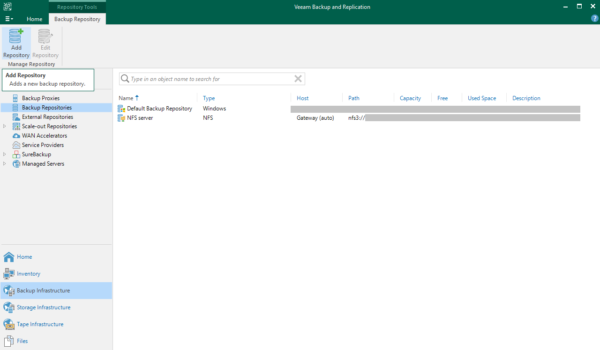
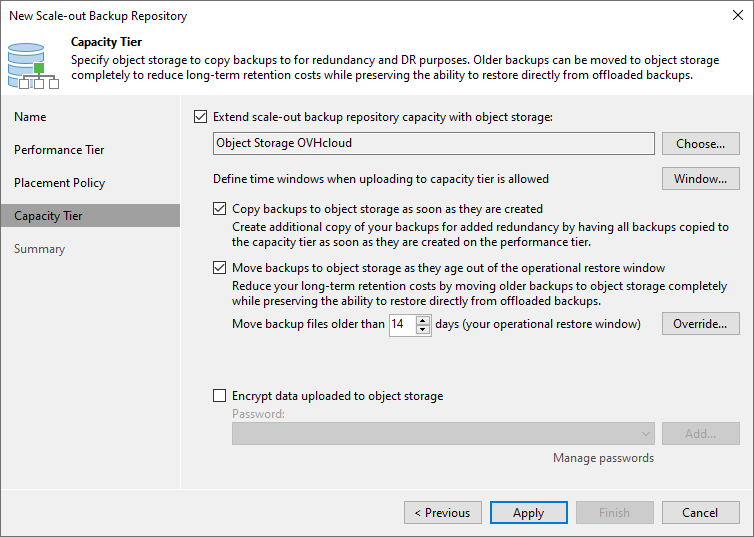
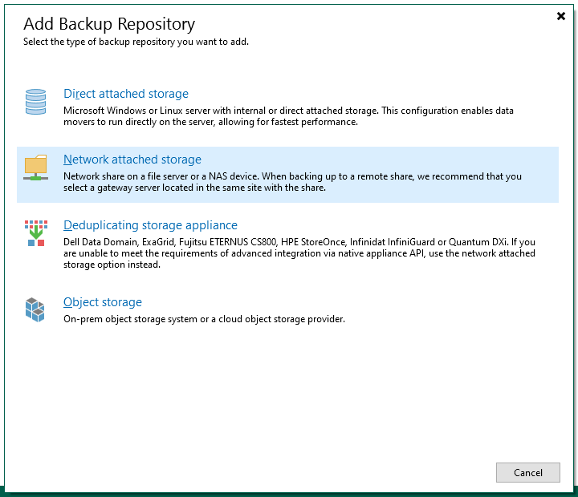
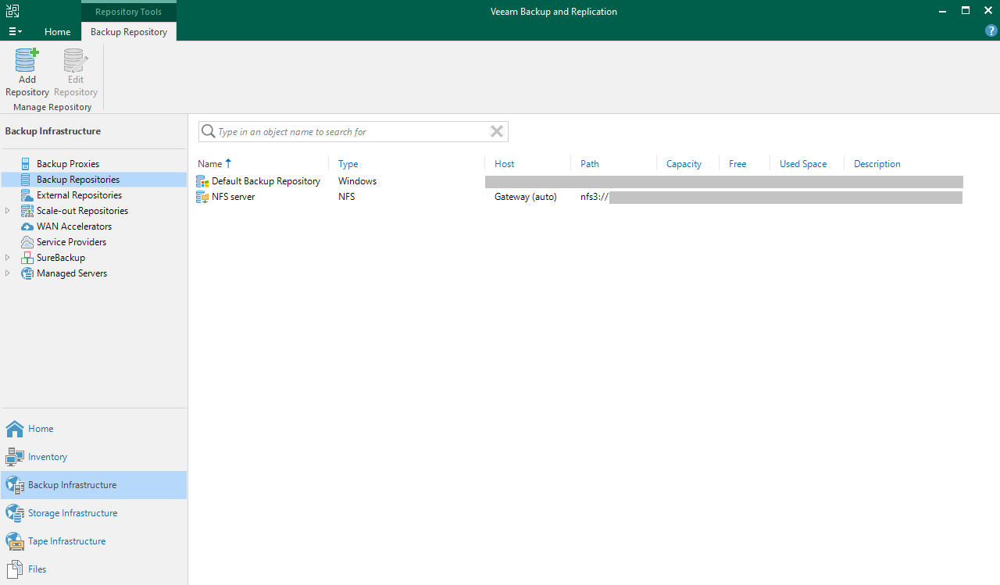
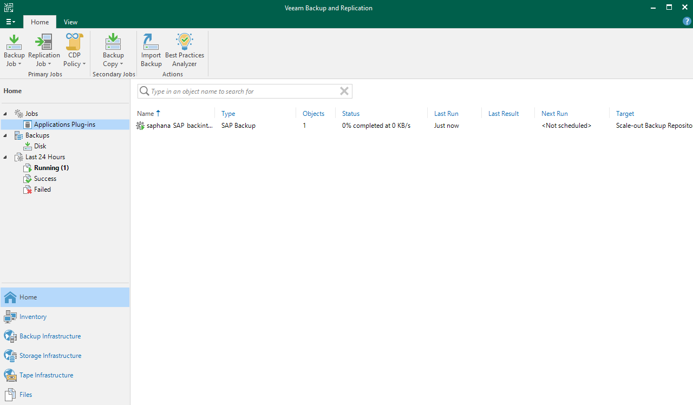
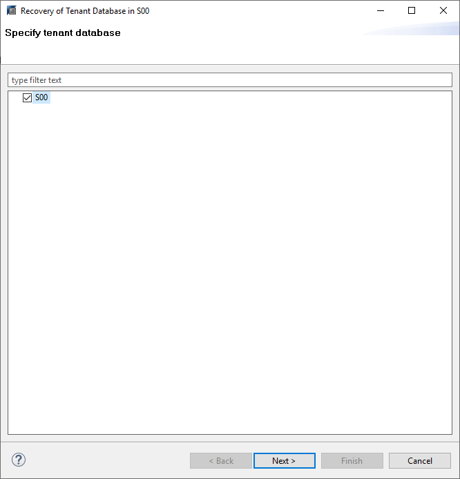
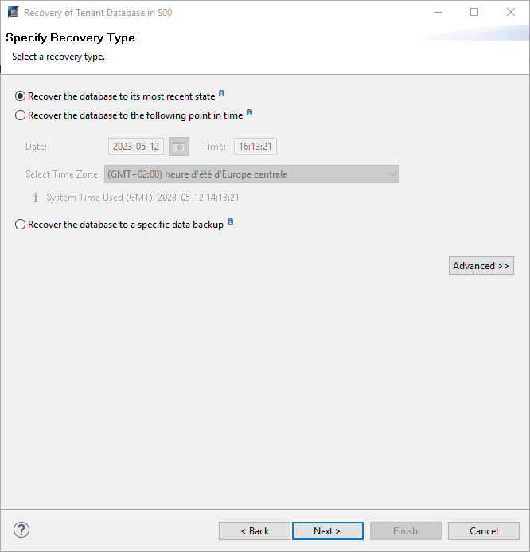
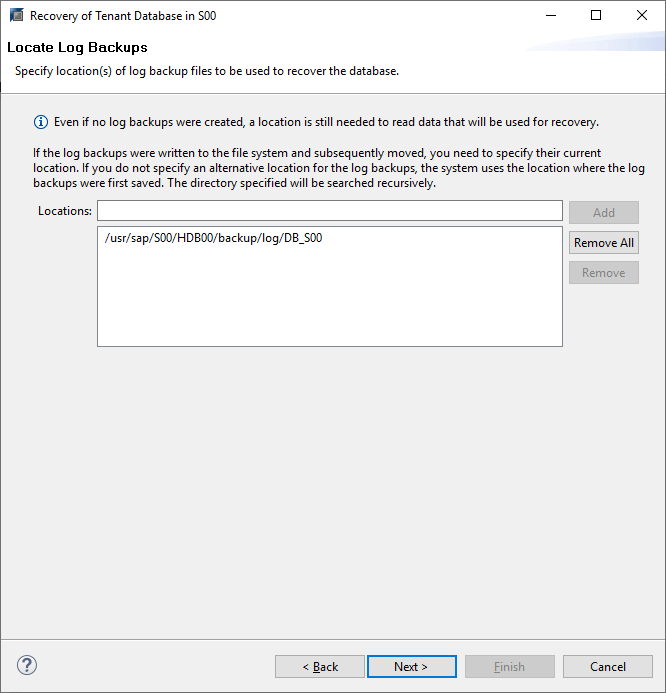

## Objectif

Ce guide fournit des instructions générales pour sauvegarder une base de données SAP HANA avec Veeam Backup and Replication et Veeam Plug-in for SAP HANA.

[Veeam Enterprise Plus avec OVHcloud](https://www.ovhcloud.com/fr-ca/storage-solutions/veeam-enterprise/) vous permet d’utiliser Veeam Backup and Replication au sein de votre infrastructure OVHcloud en bénéficiant d'un niveau de licence Veeam Enterprise Plus.

## Prérequis

- Une base de données SAP HANA installée.
- Un serveur Windows qui hébergera la solution [Veeam Backup and Replication](https://www.ovhcloud.com/fr-ca/storage-solutions/veeam-enterprise/).
- Un espace de stockage partagé pour un besoin non SecNumCloud ou une machine virtuelle sur [VMware on OVHcloud qualifié SecNumCloud](https://www.ovhcloud.com/fr-ca/enterprise/products/secnumcloud/) faisant office de serveur NFS ou SMB pour un besoin SecNumCloud.

## En pratique

### Installation de Veeam Backup and Replication

Si vous souhaitez être guidé sur l'installation de Veeam Backup and Replication sur votre serveur Windows, nous vous recommandons [notre guide](/pages/storage_and_backup/backup_and_disaster_recovery_solutions/veeam/veeam_veeam_backup_replication).

### Configuration du Backup Repository

Après l'installation de Veeam Backup and Replication sur votre serveur Windows, vous devez réaliser la configuration du Backup Repository.

Un Backup Repository est un espace de stockage où Veeam Backup and Replication héberge les sauvegardes.

#### Configuration d'un Backup Repository pour un besoin non SecNumCloud

Pour cette configuration, vous pouvez utiliser un espace de stockage partagé, ainsi qu'un Object Storage S3 pour sécuriser les sauvegardes sur une autre localisation.

**Création du Backup Repository**

> [!tabs]
> **Étape 1**
>>
>> Dans la console Veeam Backup and Replication, sélectionnez `Backup Infrastructure`{.action}, puis `Backup Repositories`{.action}.
>>
>> Cliquez sur `Add Repository`{.action} pour démarrer l'assistant de configuration.
>>
>> {.thumbnail}
>>
> **Étape 2**
>>
>> Sélectionnez `Network attached storage`{.action}.
>>
>> {.thumbnail}
>>
> **Étape 3**
>>
>> Sélectionnez le protocole sur lequel votre serveur de partage de fichiers écoute.
>>
>> Vous serez guidé dans les étapes pour entrer les informations telles que l'adresse IP ou le nom complet (FQDN) de votre serveur, ou encore le chemin où vous souhaitez stocker vos sauvegardes SAP HANA.
>>
>> {.thumbnail}
>>
> **Étape 4**
>>
>> Votre Backup Repository de type NFS ou SMB est maintenant visible dans la console Veeam Backup and Replication et utilisable par les configurations de sauvegarde.
>>
>> Vous pouvez aller plus loin dans la configuration de ce Backup Repository en configurant des permissions d'accès à un utilisateur ou à un groupe d'utilisateurs spécifiques et en chiffrant les sauvegardes qui seront hébergées dans ce Backup Repository. Retrouvez plus d'informations à ce sujet dans le [guide Veeam](https://helpcenter.veeam.com/archive/backup/110/vsphere/access_permissions.html).
>> 
>> {.thumbnail}
>>

**Création du Backup Repository Object Storage**

Ce Backup Repository servira à sécuriser vos sauvegardes sur un autre espace de stockage et sur une autre localisation OVHcloud.

Pour découvrir les étapes de création d'un bucket Object Storage S3, nous vous recommandons [notre guide](/pages/storage_and_backup/object_storage/s3_create_bucket).

> [!tabs]
> **Étape 1**
>>
>> Dans la console Veeam Backup and Replication, sélectionnez `Backup Infrastructure`{.action}, puis `Backup Repositories`{.action}.
>>
>> Cliquez à présent sur `Add Repository`{.action} pour démarrer l'assistant de configuration.
>>
>> {.thumbnail}
>>
> **Étape 2**
>>
>> Sélectionnez `Object storage`{.action}.
>>
>> {.thumbnail}
>>
> **Étape 3**
>>
>> Sélectionnez `S3 Compatible`{.action}.
>>
>> {.thumbnail}
>>
> **Étape 4**
>>
>> Indiquez un nom à votre Object Storage Repository
>>
>> {.thumbnail}
>>
> **Étape 5**
>> 
>> Entrez le `Service point`{.action} qui correspond à l'endpoint du bucket Object Storage S3 ainsi que la région.
>>
>> Ajoutez les identifiants de l'utilisateur S3 qui possède le rôle Administrator sur ce bucket Object Storage S3. Il s'agit de la clé d'accès et de la clé secrète de l'utilisateur S3 associée au bucket Object Storage S3. Retrouvez plus d'informations sur l'utilisateur S3 dans [notre guide](/pages/storage_and_backup/object_storage/s3_identity_and_access_management).
>>
>> {.thumbnail}
>>
> **Étape 6**
>> 
>> Indiquez le nom du bucket Object Storage S3 dans lequel vous souhaitez stocker vos sauvegardes SAP HANA.
>>
>> Vous devez également indiquer ou créer un répertoire dans ce bucket Object Storage S3.
>>
>> {.thumbnail}
>>
> **Étape 7**
>>
>> Votre Backup Repository de type S3-compatible est maintenant visible dans la console Veeam Backup and Replication et utilisable par les configurations de sauvegarde.
>>
>> {.thumbnail}
>>

**Création du Scale-out Backup Repository**

> [!tabs]
> **Étape 1**
>>
>> Dans la console Veeam Backup and Replication, sélectionnez `Backup Infrastructure`{.action}, puis `Scale-out Repositories`{.action}.
>>
>> Cliquez à présent sur `Add Scale-out Repository`{.action} pour démarrer l'assistant de configuration.
>>
>> {.thumbnail}
>>
> **Étape 2**
>>
>> Donnez un nom à votre Scale-out Backup Repository.
>>
>> {.thumbnail}
>>
> **Étape 3**
>>
>> Cliquez sur `Add`{.action} et sélectionnez votre Backup Repository précédemment créé.
>>
>> {.thumbnail}
>>
> **Étape 4**
>>
>> Sélectionnez la politique de localisation souhaitée. Nous conseillons la politique `Data locality`{.action}.
>>
>> {.thumbnail}
>>
> **Étape 5**
>>
>> Cochez `Extend scale-out backup repository capacity with object storage`{.action}, puis sélectionnez le Backup Repository Object Storage précédemment créé.
>>
>> - La première option permet de copier les sauvegardes sur l'Object Storage S3 dès que les sauvegardes ont été créées sur le stockage partagé.
>> - La seconde option permet de déplacer les sauvegardes sur l'Object Storage S3 après une période définie, libérant ainsi l'espace sur le stockage partagé.
>>
>> Nous conseillons d'activer ces deux options, garantissant une mise en sécurité de vos sauvegardes et une gestion automatisée du nettoyage sur le stockage partagé.
>>
>> {.thumbnail}
>>
> **Étape 6**
>>
>> Par défaut, aucun accès n'est autorisé à ce Scale-out Repository.
>>
>> Sélectionnez votre Scale-out Repository et cliquez sur `Set Access Permissions`{.action}.
>>
>> {.thumbnail}
>>
> **Étape 7**
>>
>> Vous avez la possibilité d'autoriser tous les comptes utilisateurs à utiliser ce Scale-out Repository ou de limiter à une liste définie.
>>
>> Nous vous recommandons de n'autoriser que les comptes nécessaires.
>>
>> {.thumbnail}
>>
> **Étape 8**
>>
>> Sur votre bucket Object Storage S3, vous avez à présent une arborescence que Veeam Backup and Replication a créée.
>>
>> {.thumbnail}
>>

Une fois ces étapes réalisées, vous pouvez continuer ce guide avec le chapitre [Installation de Veeam Plug-in for SAP HANA](#installation-de-veeam-plug-in-for-sap-hana_1).

#### Configuration d'un Backup Repository pour un besoin SecNumCloud

La solution Object Storage S3 n'est pour le moment pas qualifiée SecNumCloud. Elle ne peut donc être utilisée pour héberger vos sauvegardes dans un contexte SecNumCloud.

Pour répondre à ce besoin, nous proposons de créer une machine virtuelle sur [VMware on OVHcloud qualifié SecNumCloud](https://www.ovhcloud.com/fr-ca/enterprise/products/secnumcloud/) faisant office de serveur NFS ou SMB.

> [!warning]
> Dans le cas d'une utilisation d'une machine virtuelle pour héberger un serveur NFS ou SMB, veillez à protéger cette machine virtuelle et son contenu en dupliquant ses données sur une autre localisation.
>
> Pour répondre à ce besoin, la création d'un second Backup Repository sur une autre localisation peut être envisagée.
>

> [!tabs]
> **Étape 1**
>>
>> Dans la console Veeam Backup and Replication, sélectionnez `Backup Infrastructure`{.action}, puis `Backup Repositories`{.action}.
>>
>> Cliquez à présent sur `Add Repository`{.action} pour démarrer l'assistant de configuration.
>>
>> {.thumbnail}
>>
> **Étape 2**
>>
>> Sélectionnez `Network attached storage`{.action}.
>>
>> {.thumbnail}
>>
> **Étape 3**
>>
>> Sélectionnez le protocole sur lequel votre serveur de partage de fichiers écoute.
>>
>> Vous serez guidé dans les étapes pour entrer les informations telles que l'adresse IP ou le nom complet (FQDN) de votre serveur, ou encore le chemin où vous souhaitez stocker vos sauvegardes SAP HANA.
>>
>> {.thumbnail}
>>
> **Étape 4**
>>
>> Votre Backup Repository de type NFS ou SMB est maintenant visible dans la console Veeam Backup and Replication et utilisable par les configurations de sauvegarde.
>>
>> Vous pouvez aller plus loin dans la configuration de ce Backup Repository en configurant des permissions d'accès à un utilisateur ou à un groupe d'utilisateurs spécifiques et en chiffrant les sauvegardes qui seront hébergées dans ce Backup Repository. Retrouvez plus d'informations à ce sujet dans le [guide Veeam](https://helpcenter.veeam.com/archive/backup/110/vsphere/access_permissions.html).
>> 
>> {.thumbnail}
>>

Pour plus d'informations sur les configurations des Backup Repositories, nous vous invitons à consulter la [documentation de Veeam Backup Repository](https://helpcenter.veeam.com/archive/backup/110/vsphere/backup_repository.html).

### Installation de Veeam Plug-in for SAP HANA

1. Copiez Veeam Plugin for SAP-HANA de l'ISO Veeam Backup and Replication Installation vers votre serveur qui héberge votre base de données SAP HANA.

2. Exécutez l'installation avec la commande :

```bash
rpm -i VeeamPluginforSAPHANA-xx.x.x.xxxx-x.x86_64.rpm
```

<ol start=3><li>Avec l'utilisateur SAP HANA (sid)adm, exécutez l'assistant de configuration :</li></ol>

```bash
./SapBackintConfigTool --wizard
```

```textile
Enter backup server name or IP address: <Adresse IP de votre serveur Windows>
Enter backup server port number [10006]:
Enter username: <identifiant> (1)
Enter password for <identifiant>: <mot de passe> (1)
Available backup repositories:
1. Backup Repository
Enter repository number: <Entrez le numéro du Backup Repository précédemment créé>
Configuration result:
    SID <SID> has been configured
```

> [!primary]
> (1) Nous conseillons de créer un compte dédié Veeam Backup and Replication ne possédant que les rôles Veeam Backup Operator et Veeam Restore Operator. Ne pouvant ajouter deux rôles pour le même utilisateur sur la même ligne dans la console Veeam Backup and Replication, vous devrez ajouter une seconde ligne pour le second rôle. Retrouvez plus d'informations à [cette adresse](https://helpcenter.veeam.com/archive/backup/110/vsphere/users_roles.html).
>

<ol start=4><li>Vous pouvez à présent lancer une sauvegarde de votre base de données SAP HANA afin de vous assurer que votre configuration fonctionne comme vous le désirez.<br><br>

Une tâche de sauvegarde SAP HANA est maintenant visible dans la console Veeam Backup and Replication.</li></ol>

{.thumbnail}

Si vous avez configuré un Scale-out Repository avec un Object Storage S3, vous devriez observer vos sauvegardes sur votre bucket Object Storage S3.

{.thumbnail}

Si vous souhaitez découvrir toutes les possibilités avec Veeam Plug-in for SAP HANA, nous vous conseillons de prendre connaissance de la documentation disponible sur [Veeam](https://helpcenter.veeam.com/archive/backup/110/plugins/sap_hana_plugin.html).

### Planification des sauvegardes

> [!warning]
> La console Veeam Backup and Replication ne propose pas de planification avec l'utilisation de Veeam Plug-in for SAP HANA.
>

Nous vous conseillons de vous référer à la [SAP Note 2782059](https://launchpad.support.sap.com/#/notes/2782059) qui présente quatre options pour planifier les sauvegardes sur une base de données SAP HANA.

Voici un exemple de planification de sauvegardes SAP HANA via crontab.

*Remplacez, dans les commandes ci-dessous, les caractères* `<SID>` *par le SID de votre base de données SAP HANA.*

```bash
# Sauvegarde complète du TENANTDB - LUN JEU DIM
0 0 * * 1,4,7 /usr/sap/<SID>/HDB00/exe/hdbsql -U BACKUP "BACKUP DATA FOR <SID> USING BACKINT ('SCHEDULED_$(date +'%H%M%S%s')_COMPLETE_BACKUP')";
 
# Sauvegarde différentielle du TENANTDB - MAR MER VEN SAM
0 0 * * 2,3,5,6 /usr/sap/<SID>/HDB00/exe/hdbsql -U BACKUP "BACKUP DATA DIFFERENTIAL FOR <SID> USING BACKINT ('SCHEDULE_$(date +'%H%M%S%s')_DIFFERENTIAL_BACKUP')";
 
# Sauvegarde complète du SYSTEMDB - DIM
0 0 * * 7 /usr/sap/<SID>/HDB00/exe/hdbsql -U BACKUP "BACKUP DATA USING BACKINT ('SCHEDULE_$(date +'%H%M%S%s')_COMPLETE_BACKUP)";
```

> [!primary]
> L'option `-U` permet d'appeler une clé stockée dans le hdbuserstore. Pour en savoir plus sur l'ajout d'une clé dans le hdbuserstore, nous vous invitons à prendre connaissance de la documentation SAP disponible à [cette adresse](https://help.sap.com/docs/SAP_HANA_PLATFORM/b3ee5778bc2e4a089d3299b82ec762a7/ddbdd66b632d4fe7b3c2e0e6e341e222.html?version=2.0.02&locale=en-US).
>
> Dans cet exemple, la clé « BACKUP » a été créée contenant le couple identifiant / mot de passe d'un utilisateur sur la base de données SAP HANA ayant le rôle de sauvegarde. La liste des rôles devant être associés à cet utilisateur est disponible à [cette adresse](https://help.sap.com/docs/SAP_HANA_PLATFORM/6b94445c94ae495c83a19646e7c3fd56/c4b71703bb571014810ebb38dc59cf51.html).
>

### Restauration

Pour restaurer de votre base de données SAP HANA depuis une sauvegarde réalisée avec Veeam Backup and Replication, vous pouvez réaliser les étapes suivantes depuis SAP HANA Studio :

> [!tabs]
> **Étape 1**
>>
>> Sélectionnez le TENANTDB que vous souhaitez restaurer.
>>
>> Puis cliquez sur `Next`{.action}.
>>
>> {.thumbnail}
>>
> **Étape 2**
>>
>> Sélectionnez l'option que vous souhaitez utiliser pour restaurer votre TENANTDB :
>>
>> - Restaure à l'état le plus récent possible
>> - Restaure à une date et une heure précise
>> - Restaure via une sauvegarde précise
>> 
>> Puis cliquez sur `Next`{.action}.
>>
>> {.thumbnail}
>>
> **Étape 3**
>>
>> Veillez à sélectionner les options `Recover using the backup catalog`{.action} et `Search for the backup catalog in Backint only`{.action}.
>>
>> Puis cliquez sur `Next`{.action}.
>>
>> {.thumbnail}
>>
> **Étape 4**
>>
>> Le TENANTDB doit être éteint pour réaliser sa restauration.
>>
>> Veillez à arrêter votre système SAP lié à cette base de données SAP HANA avant de démarrer la restauration.
>>
>> {.thumbnail}
>>
> **Étape 5**
>>
>> Après quelques secondes, SAP HANA Studio affiche les sauvegardes complètes inscrites dans le catalogue de sauvegardes de votre base de données SAP HANA.
>>
>> Il est recommandé de cliquer sur `Check Availability`{.action} afin de s'assurer que la sauvegarde est toujours disponible dans son espace de stockage.
>>
>> Puis cliquez sur `Next`{.action}.
>>
>> {.thumbnail}
>>
> **Étape 6**
>>
>> Si vous n'avez pas modifié la localisation de vos sauvegardes des fichiers de log, vous pouvez cliquer sur `Next`{.action}.
>>
>> Dans le cas contraire, veuillez indiquer le chemin. Puis cliquez sur `Next`{.action}.
>> 
>> {.thumbnail}
>>
> **Étape 7**
>>
>> Veillez à sélectionner l'option `Third-Party Backup Tool (Backint)`{.action} et à désélectionner l'option `File System`{.action}.
>>
>> Puis cliquez sur `Next`{.action}.
>>
>> {.thumbnail}
>>
> **Étape 8**
>>
>> La restauration de votre base de données SAP HANA démarre.
>>
>> {.thumbnail}
>>

Une fois la restauration réalisée avec succès, votre base de données SAP HANA est démarrée et disponible.

## Aller plus loin

Si vous avez besoin d'une formation ou d'une assistance technique pour la mise en oeuvre de nos solutions, contactez votre commercial ou cliquez sur [ce lien](https://www.ovhcloud.com/fr-ca/professional-services/) pour obtenir un devis et demander une analyse personnalisée de votre projet à nos experts de l’équipe Professional Services.

Échangez avec notre communauté d'utilisateurs sur <https://community.ovh.com>.
