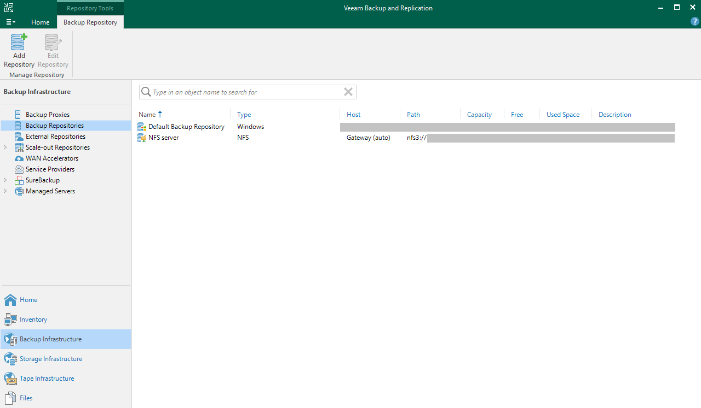

## Objective

This guide provides instructions for backing up SAP HANA databases using Veeam Backup and Replication 12.2 and the Veeam Plug-in for SAP HANA.

[Veeam Enterprise Plus with OVHcloud](https://www.ovhcloud.com/it/storage-solutions/veeam-enterprise/) allows you to use Veeam Backup and Replication 12 within your OVHcloud infrastructure and benefiting from a Veeam Enterprise Plus licence.

## Requirements

- A SAP HANA database has been installed.
- A Windows server that will host the solution [Veeam Backup and Replication](https://www.veeam.com/products/veeam-data-platform/backup-recovery.html).
- A storage space that will host the backups.
- The [firewall openings](https://helpcenter.veeam.com/docs/backup/plugins/ports_vpsh.html?ver=120) have been made, allowing communication between your servers.

## Instructions

### 1 - Installation of Veeam Backup and Replication

If you want to be guided through the installation of Veeam Backup and Replication on your Windows server, [our guide](/pages/storage_and_backup/backup_and_disaster_recovery_solutions/veeam/veeam_veeam_backup_replication) outlines all the necessary steps.

### 2 - Configuration of the Backup Repository

After installing Veeam Backup and Replication on your Windows server, you need to configure the Backup Repository.

A Backup Repository is a storage space where Veeam Backup and Replication hosts the backups.

At this stage, two scenarios can occur:

- [Your infrastructure is not a SecNumCloud-qualified infrastructure](#nonsecnumcloud).
- [Your infrastructure is a SecNumCloud-qualified infrastructure](#secnumcloud).

#### 2.1 - Configuration of the Backup Repository for non-SecNumCloud needs 

In this configuration, you can use a storage space, as well as an Object Storage S3 to secure the backups in another OVHcloud region.

##### 2.1.1 - Creation of the Backup Repository

> [!tabs]
> **Step 1**
>>
>> Open the Veeam Backup and Replication console, select `Backup Infrastructure`{.action}, then `Backup Repositories`{.action}.
>>
>> Click on `Add Repository`{.action} to start the configuration assistant.
>>
>> {.thumbnail}
>>
> **Step 2**
>>
>> Select `Direct attached storage`{.action} or `Network attached storage`{.action}, depending on your situation.
>>
>> - `Direct attached storage`{.action} allows you to add a physical or virtual server as storage without NFS or SMB protocols.
>> - `Network attached storage`{.action} allows you to add a file share via NFS or SMB (CIFS) protocols.
>>
>> {.thumbnail}
>>
> **Step 3**
>>
>> You will be guided through the steps of configuring the connection to the storage space, such as the IP address or the full name (FQDN) of your server, or the path where you want to store your SAP HANA backups.
>>
>> Find detailed steps in the Veeam Backup and Replication 12 User Guide for different configurations:
>>
>> - [Direct attached storage with Windows](https://helpcenter.veeam.com/docs/backup/vsphere/repo_add.html?ver=120)
>> - [Direct attached storage with Linux](https://helpcenter.veeam.com/docs/backup/vsphere/linux_repository_add.html?ver=120)
>> - [Direct attached storage with Linux Hardened](https://helpcenter.veeam.com/docs/backup/vsphere/hardened_repository.html?ver=120)
>> - [Network attached storage with SMB (CIFS) Share](https://helpcenter.veeam.com/docs/backup/vsphere/smb_share.html?ver=120)
>> - [Network attached storage with NFS Share](https://helpcenter.veeam.com/docs/backup/vsphere/nfs_share.html?ver=120)
>>
> **Step 4**
>>
>> Your Backup Repository is now visible in the Veeam Backup and Replication console and ready to use with backup configurations.
>>
>> You can go further in configuring this Backup Repository by setting access permissions for a specific user or a group of users, and by encrypting the backups that will be hosted in this Backup Repository. Find more information on this in the [Veeam Backup and Replication 12 User Guide](https://helpcenter.veeam.com/docs/backup/vsphere/access_permissions.html?ver=120).
>>
>> If you do not wish to proceed with the creation of a Backup Repository Object Storage, make sure to configure the permissions for that Backup Repository. You can then continue with the chapter [Installation of Veeam Plug-in for SAP HANA](#veeampluginhana).
>>
>> {.thumbnail}
>>

##### 2.1.2 - Creation of Backup Repository Object Storage (optional)

This Backup Repository will be used to secure your backups on a secondary storage space, which can be hosted on a second OVHcloud region.

To discover the steps to create an Object Storage S3 bucket, please refer to the detailed steps in [our guide](/pages/storage_and_backup/object_storage/s3_create_bucket).

> [!tabs]
> **Step 1**
>>
>> Open the Veeam Backup and Replication console, select `Backup Infrastructure`{.action}, then `Backup Repositories`{.action}.
>>
>> Click `Add Repository`{.action} to start the configuration assistant.
>>
>> {.thumbnail}
>>
> **Step 2**
>>
>> Select `Object storage`{.action}.
>>
>> {.thumbnail}
>>
> **Step 3**
>>
>> Select `S3 Compatible`{.action}.
>>
>> {.thumbnail}
>>
> **Step 4**
>>
>> Give a name to your Object Storage Repository.
>>
>> {.thumbnail}
>>
> **Step 5**
>>
>> Enter the `Service point`{.action} which corresponds to the Object Storage S3 endpoint, as well as the region (in lowercase) of your Object Storage S3.
>>
>> Add the credentials of the S3 user who has the `Administrator`{.action} role on this Object Storage S3. This includes the access key and the secret key of the S3 user associated with the Object Storage S3. Find more information about the S3 user in [this guide](/pages/storage_and_backup/object_storage/s3_identity_and_access_management).
>>
>> {.thumbnail}
>>
> **Step 6**
>>
>> Indicate the name of the Object Storage S3 bucket where you want to store your SAP HANA backups.
>>
>> You must also indicate or create a directory in this Object Storage S3 bucket.
>>
>> {.thumbnail}
>>
> **Step 7**
>>
>> Your S3-compatible Backup Repository is now visible in the Veeam Backup and Replication console and can be used by backup configurations.
>>
>> {.thumbnail}
>>

##### 2.1.3 - Creation of Scale-out Backup Repository (optional)

Creating a Scale-out Backup Repository will secure your backups deposited in your first Backup Repository by copying them to your second Backup Repository without any action required from you.

> [!tabs]
> **Step 1**
>>
>> Open the Veeam Backup and Replication console, select `Backup Infrastructure`{.action}, then `Scale-out Repositories`{.action}.
>>
>> Click `Add Scale-out Repository`{.action} to start the configuration assistant.
>>
>> {.thumbnail}
>>
> **Step 2**
>>
>> Give a name to your Scale-out Backup Repository.
>>
>> {.thumbnail}
>>
> **Step 3**
>>
>> Click `Add`{.action} and select your previously created Backup Repository.
>>
>> {.thumbnail}
>>
> **Step 4**
>>
>> Select the desired location policy. We recommend the `Data locality`{.action} policy.
>>
>> {.thumbnail}
>>
> **Step 5**
>>
>> Check `Extend scale-out backup repository capacity with object storage`{.action}, then select the previously created Backup Repository Object Storage.
>>
>> Check the `Copy backups to object storage as soon as they are created`{.action} option to replicate the backups from the first Backup Repository to the second Backup Repository immediately after their creation. This configuration provides quick protection for your backups.
>>
>> {.thumbnail}
>>
> **Step 6**
>>
>> By default, no access is allowed to this Scale-out Repository.
>>
>> Select your Scale-out Repository and click `Set Access Permissions`{.action}.
>>
>> {.thumbnail}
>>
> **Step 7**
>>
>> You have the option to allow all user accounts to use this Scale-out Repository or limit it to a defined list. We recommend allowing only the necessary accounts.
>>
>> {.thumbnail}
>>
> **Step 8**
>>
>> On your Object Storage S3 bucket, a hierarchical structure has been generated and configured by Veeam Backup and Replication.
>>
>> {.thumbnail}
>>

Once these steps are completed, you can continue this guide with the chapter [Installation of Veeam Plug-in for SAP HANA](#veeampluginhana).

#### 2.2 - Configuring a Backup Repository for SecNumCloud needs 

In this configuration, the storage space must also be hosted on a SecNumCloud-qualified infrastructure.

##### 2.2.1 - Creation of a Backup Repository

> [!tabs]
> **Step 1**
>>
>> Open the Veeam Backup and Replication console, select `Backup Infrastructure`{.action}, then `Backup Repositories`{.action}.
>>
>> Click on `Add Repository`{.action} to start the configuration assistant.
>>
>> {.thumbnail}
>>
> **Step 2**
>>
>> Select `Direct attached storage`{.action} or `Network attached storage`{.action}, depending on your situation.
>>
>> - `Direct attached storage`{.action} allows you to add a physical or virtual server as storage without NFS or SMB protocols.
>> - `Network attached storage`{.action} allows you to add a file share via NFS or SMB (CIFS) protocols.
>>
>> {.thumbnail}
>>
> **Step 3**
>>
>> You will be guided through the steps of configuring the connection to the storage space, such as the IP address or the full name (FQDN) of your server, or the path where you want to store your SAP HANA backups.
>>
>> Find detailed steps in the Veeam Backup and Replication 12 User Guide for different configurations:
>>
>> - [Direct attached storage with Windows](https://helpcenter.veeam.com/docs/backup/vsphere/repo_add.html?ver=120)
>> - [Direct attached storage with Linux](https://helpcenter.veeam.com/docs/backup/vsphere/linux_repository_add.html?ver=120)
>> - [Direct attached storage with Linux Hardened](https://helpcenter.veeam.com/docs/backup/vsphere/hardened_repository.html?ver=120)
>> - [Network attached storage with SMB (CIFS) Share](https://helpcenter.veeam.com/docs/backup/vsphere/smb_share.html?ver=120)
>> - [Network attached storage with NFS Share](https://helpcenter.veeam.com/docs/backup/vsphere/nfs_share.html?ver=120)
>>
> **Step 4**
>>
>> Your Backup Repository is now visible in the Veeam Backup and Replication console and ready to use with backup configurations.
>>
>> You can go further in configuring this Backup Repository by setting access permissions for a specific user or a group of users, and by encrypting the backups that will be hosted in this Backup Repository. Find more information on this in the [Veeam Backup and Replication 12 User Guide](https://helpcenter.veeam.com/docs/backup/vsphere/access_permissions.html?ver=120).
>>
>> {.thumbnail}
>>

For more information on configuring Backup Repositories, please refer to the [Veeam Backup and Replication documentation](https://helpcenter.veeam.com/docs/backup/vsphere/backup_repository.html?ver=120).

The Object Storage S3 solution is not currently qualified as SecNumCloud-compliant and cannot be used to host backups in a SecNumCloud context.

If you wish to secure your backups on a second Backup Repository, please repeat this step. Continue with the guide at the step [Installation of Veeam Plug-in for SAP HANA](#veeampluginhana), and then follow the chapter [Creation of the Backup Copy job](#backupcopyjob).

##### 2.2.2 - Creation of the Backup Copy job (optional) 

A Backup Copy job allows you to duplicate backups from one Backup Repository to another, ensuring the security of these backups on a separate storage location. This operation is useful for protecting critical data from loss or corruption by keeping a copy on a remote backup site. With this feature, you can configure advanced backup strategies to ensure the resilience and availability of your data in the event of a disaster.

> [!primary]
>
> Ports tcp/2500-3300 must be open between Backup Repositories.
>

> [!tabs]
> **Step 1**
>>
>> Open the Veeam Backup and Replication console, select the `Home`{.action} menu, `Backup Copy`{.action}, then `Application-level backup...`{.action}.
>>
>> 
>>
> **Step 2**
>>
>> Give a name to your Backup Copy job.
>>
>> 
>>
> **Step 3**
>>
>> Add either the Backup jobs that manage your SAP HANA database backups or the Backup Repository where they are stored.
>>
>> In this guide, we have chosen to use the Backup job.
>>
>> 
>>
> **Step 4**
>>
>> Select your second Backup Repository that will host the backup copies.
>>
>> Review the available settings in the `Advanced`{.action} menu.
>>
>> 
>>
> **Step 5**
>>
>> Configure the replication slots if desired. By default, a copy is triggered as soon as a backup is made.
>>
>> 
>>
> **Step 6**
>>
>> Your Backup Copy job is now operational.
>>
>> 
>>

### 3 - Installation of Veeam Plug-in for SAP HANA 

The installation of Veeam Plug-in for SAP HANA can be accomplished using one of the following two methods:

- The "Standalone Mode" method involves a manual installation using the binary extracted from the Veeam Backup and Replication ISO on the server hosting the SAP HANA database. This method offers limited functionality through the Veeam Backup and Replication console.
- The "Managed Mode" method is an automated installation performed via the Veeam Backup and Replication console, allowing for the use of several features such as scheduling a backup job.

For the purposes of this documentation, we will use the "Managed Mode" method in order to use all the features provided by Veeam.

#### 3.1 - Creation of a Protection Group

The creation of a protection group is a prerequisite for the installation of Veeam Plug-in for SAP HANA in Managed Mode.

> [!tabs]
> **Step 1**
>>
>> Open the Veeam Backup and Replication console, select `Inventory`{.action}, then `Physical Infrastructure`{.action}.
>>
>> Click on `Create Protection Group`{.action}.
>>
>> {.thumbnail}
>>
> **Step 2**
>>
>> Click on `Individual computers`{.action}.
>>
>> {.thumbnail}
>>
> **Step 3**
>>
>> Name your protection group. Then click on `Next`{.action}.
>>
>> {.thumbnail}
>>
> **Step 4**
>>
>> Add the desired SAP HANA databases to this protection group. For example, you can group your production databases.
>>
>> *For security reasons, it is recommended to create a dedicated Linux account for the Veeam connection to your server instead of using the root account.*
>>
>> {.thumbnail}
>>
> **Step 5**
>>
>> Configure the protection group scan frequency.
>>
>> Check `Install application plug-ins`{.action}. Click on `Configure`{.action}, then check `SAP HANA`{.action}.
>>
>> Click on `Next`{.action} to proceed.
>>
>> {.thumbnail}
>>
> **Step 6**
>>
>> The protection group creation begins, a first scan is launched on the SAP HANA database(s) you previously added, and the Veeam Plug-in for SAP HANA installation along with its dependencies starts.
>>
>> {.thumbnail}
>>

#### 3.2 - Creating the backup job

Following the installation of Veeam Plug-in for SAP HANA in Managed mode, we are now able to create a backup job and manage its scheduling via the Veeam Backup and Replication console.

> [!tabs]
> **Step 1**
>>
>> Open the Veeam Backup and Replication console, select the `Home`{.action} menu, `Backup job`{.action}, `Application`{.action}, then `SAP HANA`{.action}.
>>
>> {.thumbnail}
>>
> **Step 2**
>>
>> Give a name to your SAP HANA backup job. Then click on `Next`{.action}.
>>
>> {.thumbnail}
>>
> **Step 3**
>>
>> Select your SAP HANA databases, as well as the associated TENANTs (SYSTEMDB and/or TENANTDB) that you want to manage with this backup job. Then click on `Next`{.action}.
>>
>> {.thumbnail}
>>
> **Step 4**
>>
>> Select the Backup repository where you want to store your SAP HANA backups. You also have the option to manage the retention of backups in this Backup repository. However, retention does not delete backups in the SAP HANA backup catalog.
>>
>> Click on `Advanced...`{.action} in order to schedule full backups, select the type of incremental or differential backups. In the `SAP HANA`{.action} tab, you have the possibility to configure the number of channels to optimize the speed of SAP HANA backups. 
>>
>> Click on `Next`{.action} to continue.
>>
>> {.thumbnail}
>>
> **Step 5**
>>
>> Configure the OS and SAP HANA database credentials. Then click on `Next`{.action}.
>>
>> *For security reasons, it is recommended to create a Linux user dedicated to connecting Veeam to your server instead of using the root account. The same applies to the account allowing connection to the SAP HANA database, this account only needs backup privileges.*
>>
>> {.thumbnail}
>>
> **Step 6**
>>
>> You have the option to manage log backups either by the SAP HANA mechanism or by Veeam. By choosing log backup management via Veeam, you get detailed information about log backups in the Veeam Backup and Replication console.
>>
>> In this guide, we have chosen to use management via Veeam to present the feature to you.
>>
>> Click on `Next`{.action} to continue.
>>
>> {.thumbnail}
>>
> **Step 7**
>>
>> Configure the scheduling of the backup job execution. Then click on `Apply`{.action}.
>>
>> {.thumbnail}
>>
> **Step 8**
>>
>> Make sure to check `Enable the backup policy when I click Finish`{.action} to activate the backup job. Click on `Finish`{.action} to complete the configuration of the backup job.
>>
>> {.thumbnail}
>>
> **Step 9**
>>
>> We recommend applying the following settings to your SAP HANA database:
>>
>> - Apply the [catalog_backup_using_backint](https://help.sap.com/docs/SAP_HANA_PLATFORM/009e68bc5f3c440cb31823a3ec4bb95b/514ab38a2e574c85a70ebba80ff16d99.html?locale=en-US&version=2.0.05#loio514ab38a2e574c85a70ebba80ff16d99__configSPS05_id_723) parameter to `true` to back up the backup catalog outside of your SAP HANA database.
>> - Apply the [data_backup_buffer_size](https://help.sap.com/docs/SAP_HANA_PLATFORM/009e68bc5f3c440cb31823a3ec4bb95b/514ab38a2e574c85a70ebba80ff16d99.html?locale=en-US&version=2.0.05#loio514ab38a2e574c85a70ebba80ff16d99__configSPS05_id_726) parameter according to the following method: 512 MB * the number of channels (MAX: 4096 MB)
>>

You can now run a backup of your SAP HANA database to ensure that your configuration works as desired.

To do this, simply go to the `Home`{.action} menu, select `Jobs`{.action} then `Applications`{.action}, then select your backup job and click on `Full`{.action}. This will launch a full backup of the SAP HANA databases configured in this backup job.

You can follow the progress of the backup job.

{.thumbnail}

When performing log backups, you have the option to access detailed information.

{.thumbnail}

If you have configured a Scale-out Repository with an S3 Object Storage bucket, you can observe your backups on your S3 Object Storage bucket.

{.thumbnail}

If you are in a SecNumCloud context and want to secure your backups on a second backup repository, configure a [Backup Copy job](#backupcopyjob).

If you want to learn about all the possibilities with Veeam Plug-in for SAP HANA, we recommend consulting the [Veeam documentation](https://helpcenter.veeam.com/docs/backup/plugins/sap_hana_plugin.html?ver=120).

### 4 - Restoration

To restore your SAP HANA database from a backup taken with Veeam Backup and Replication, you can perform the following steps from the Veeam Backup and Replication console and Veeam Explorer for SAP HANA.

> [!primary]
>
> The following ports must be open between your Veeam Backup and Replication server and your SAP HANA database:
>
> - SAP Host Agent HTTP – tcp/1128
> - SOAP HTTP - tcp/5<NN\>13
>
> If you want to perform communication via the HTTPS protocol, the ports are:
>
> - SAP Host Agent HTTPS - tcp/1129
> - SOAP HTTPS - tcp/5<NN\>14
>

> [!tabs]
> **Step 1**
>>
>> Open the Veeam Backup and Replication console, select `Home`{.action}, `Backups`{.action}, `Disk`{.action}, then click on `Restore from SAP HANA backups...`{.action} by right-clicking the backup of your SAP HANA database.
>>
>> 
>>
> **Step 2**
>>
>> The Veeam Explorer for SAP HANA application opens and allows you to restore either the SYSTEMDB or the TENANTDB of your SAP HANA database. All restoration modes are available:
>>
>> - [Restoration with the most recent backups](https://helpcenter.veeam.com/docs/backup/explorers/vehana_restore_single_latest.html?ver=120).
>> - [Restoration to a specific date and time (Point-in-Time Recovery)](https://helpcenter.veeam.com/docs/backup/explorers/vehana_restore_single_pit.html?ver=120).
>> - [Restoration to another SAP HANA database](https://helpcenter.veeam.com/docs/backup/explorers/vehana_restore_single_tas.html?ver=120).
>>
>> You will be guided through the restoration steps based on the mode you select.
>>
>> 
>>
> **Step 3**
>>
>> The restoration of your SAP HANA database is executed. You have the possibility to follow the progress of the restoration via Veeam Explorer for SAP HANA.
>>
>> Once the restoration is completed successfully, your database is started.
>>
>> 
>>

## Go further

If you need training or technical assistance to implement our solutions, contact your sales representative or click on [this link](/links/professional-services) to get a quote and ask our Professional Services experts for assisting you on your specific use case of your project.

Join our [community of users](/links/community).
