## Objective

This guides provides instructions for deploying an SAProuter on VMware on OVHcloud with NSX.

## Requirements

- Access to the [OVHcloud Control Panel](/links/manager).
- A [VMware on OVHcloud solution](https://www.ovhcloud.com/en-sg/enterprise/products/hosted-private-cloud/) deployed.
- Access to NSX with management rights.

## Instructions

### Network Firewall configuration

OVHcloud provides a firewall and anti-DDoS solution, the Network Firewall. This option protects you against potential attacks from the public network. We advise you to enable it for your public IP address which you will use in this configuration.

If you didn't create a Network Firewall and a firewall rule for the public IP address used by your NSX gateway, follow these steps to do it. If you are familiar with the Network Firewall, you can skip the first three steps.

> [!tabs]
> **Step 1**
>>
>> Connect to your [OVHcloud Control Panel](/links/manager), open the `Bare Metal Cloud`{.action} tab, expand the `Network`{.action} menu then click on `IP`{.action}.
>>
>> If you have many public IP addresses or services, you can filter them with the `All service types`{.action} value and select `Hosting Private Cloud (VMware)`{.action}, or with the `All services`{.action} value and select your VMware on OVHcloud solution.
>>
>> In our [First steps with NSX](/pages/hosted_private_cloud/hosted_private_cloud_powered_by_vmware/nsx-01-first-steps) guide, the [Displaying the HA VIP virtual IP address](/pages/hosted_private_cloud/hosted_private_cloud_powered_by_vmware/nsx-01-first-steps/#displaying-the-ha-vip-virtual-ip-address) chapter shows you the way to get the public IP address held by your NSX gateway.
>>
>> Expand the IPv4 address block, select the IPv4 address used by your NSX gateway and click on `Create Firewall`{.action}.
>>
>> 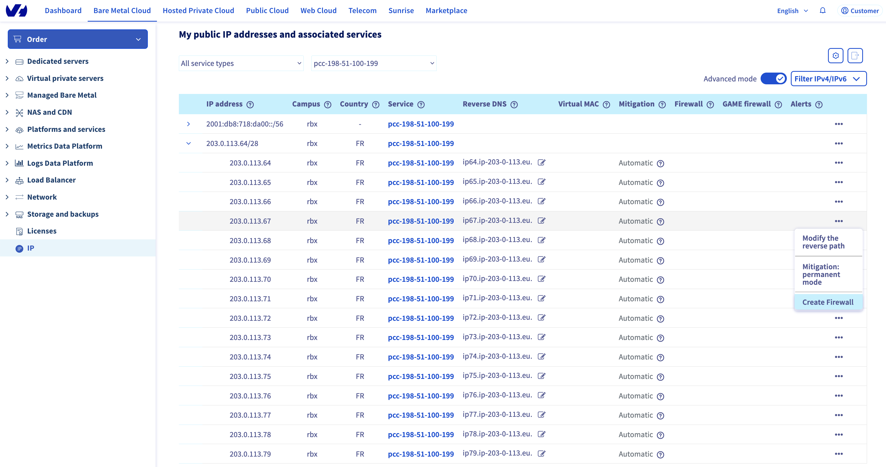{.thumbnail}
>>
> **Step 2**
>> 
>> Click on `Configure the firewall`{.action} to open the edition window of your Network Firewall.
>>
>> 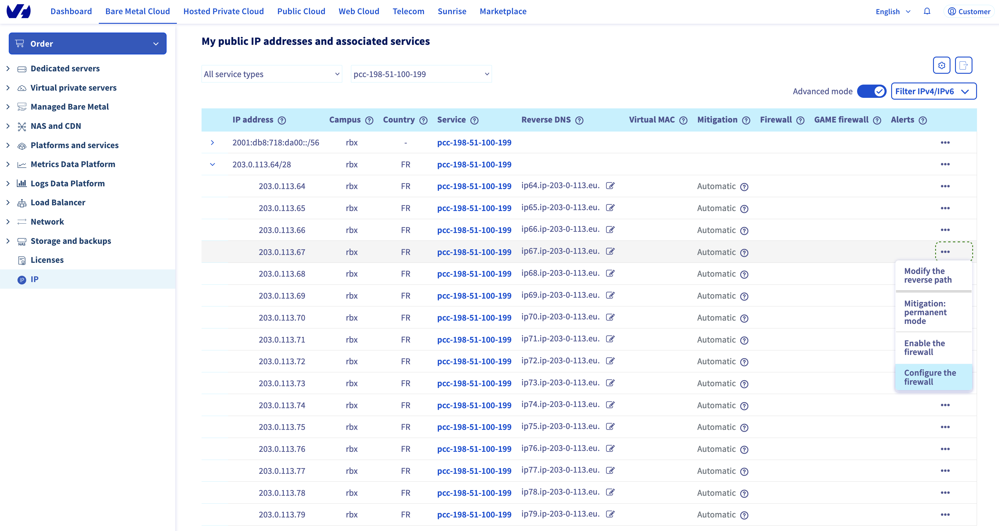{.thumbnail}
>>
> **Step 3**
>>
>> We advise you to create 2 default rules in your Network Firewall.
>>
>> Click on `Add a rule`{.action} then set these parameters:
>>
>> 1. Parameters for the first rule:
>>      - Priority: 0
>>      - Action: Authorise
>>      - Protocol: TCP
>>      - Flags: ESTABLISHED
>>
>> We suggest that you authorise the TCP protocol from all IP addresses with the flag `ESTABLISHED`. This is to check that the packet is from a previous opened/initiated session. If you don't authorise it, the server won't receive TCP packets from SYN/ACK requests.
>>
>>
>> <ol start="2"> <li>Parameters for the second rule :</li>
>> <ul>
>> <li>Priority: 19</li>
>> <li>Action: Refuse</li>
>> <li>Protocol: IPv4</li>
>> </ul></ol>
>> We recommend refusing all IPv4 traffic which wasn't authorised by any prior rule.
>>
>> {.thumbnail}
>>
> **Step 4**
>>
>> Create the rule to allow the connection from the SAP support infrastructure.
>>
>> Click on `Add a rule`{.action} then set these parameters:
>>
>> - Priority: 1
>> - Action: Authorise
>> - Protocol: TCP
>> - IP source: 194.39.131.34/32
>> - Destination port: 3299
>> - Flags: None
>>
>>
>> 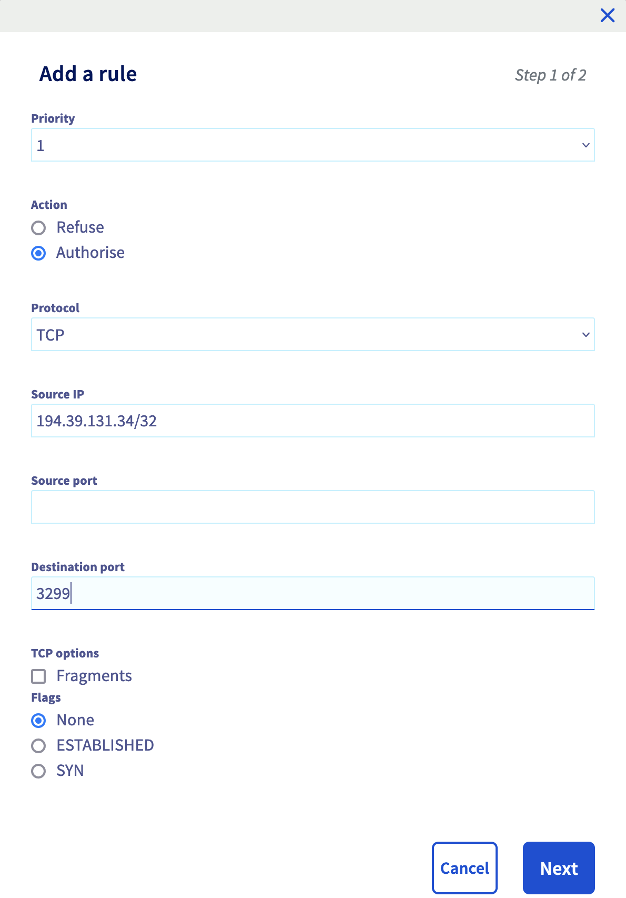{.thumbnail width="349" height="500"}
>>
>> Find more information about the SAP support public IP address on the [SAP support website](https://support.sap.com/en/tools/connectivity-tools/saprouter/install-saprouter.html?anchorId=section_498561288).
>>
> **Step 5**
>>
>> After a few seconds, the rule is enabled.
>>
>> 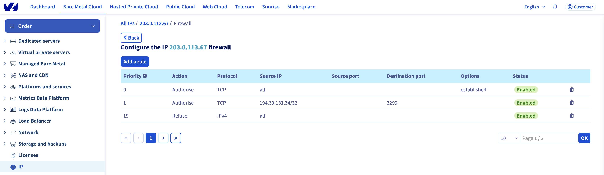{.thumbnail}
>>
> **Step 6**
>>
>> Click on the `Back`{.action} button, select the IP address where you have set up the rule and click on `Enable the firewall`{.action}.
>>
>> 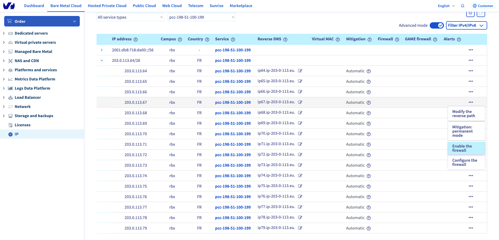{.thumbnail}
>>

### NSX gateway configuration

The NSX gateway is the gateway between Internet and your SAP infrastructure hosts on your VMware on OVHcloud solution. You must configure the NSX gateway to allow the connection from SAP support to your SAP infrastructure via SAProuter.

#### Firewall

We recommend doing a network filtering on your NSX gateway, in addition of the network filtering done by the previously configured Network Firewall.

This network filtering on your NSX gateway allows you to secure your SAProuter if the Network Firewall was to be disabled on your public IP address.

> [!tabs]
> **Step 1**
>>
>> Connect to your VMware on OVHcloud solution and click on the NSX tile.
>>
>> 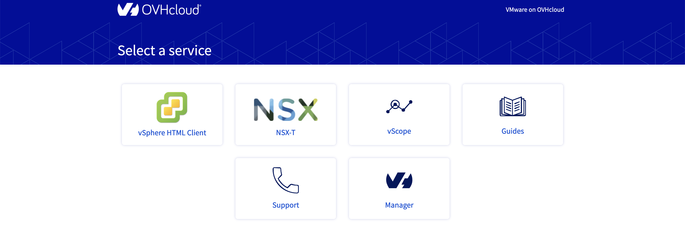{.thumbnail}
>>
> **Step 2**
>>
>> Click on the `Security`{.action} tab then, in the `Policy Management`{.action} category, click on `Gateway Firewall`{.action} and select your T0 gateway "ovh-T0-xxxx".
>>
>> 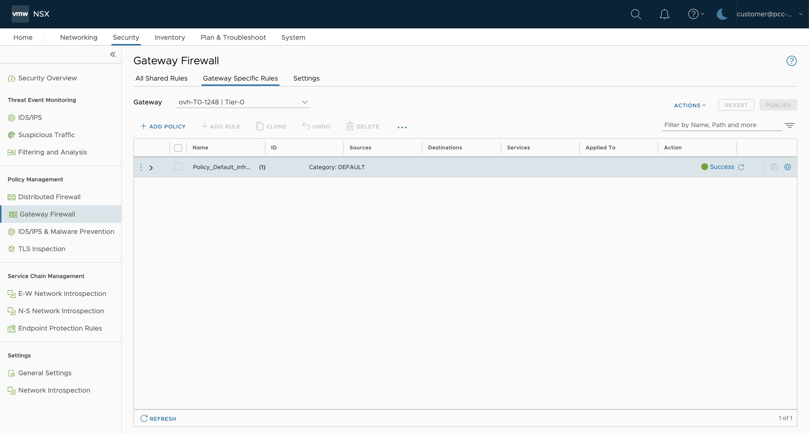{.thumbnail}
>>
> **Step 3**
>>
>> Click on `Add policy`{.action} and give it a name (example: SAP). Inside this policy, you can also set all SAP firewall rules.
>>
>> Select your new policy and click on `Add a rule`{.action}.
>>
>> 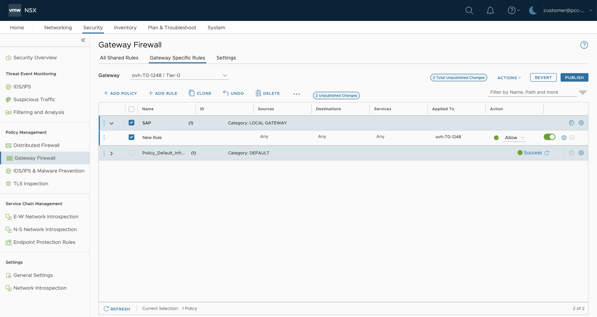{.thumbnail}
>>
> **Step 4**
>>
>> Set the following parameters:
>>
>> - Name: SAP support
>> - Sources: 194.39.131.34/32
>> - Destinations: *Private IP address of your SAProuter*
>> - Services: TCP - Destination: 3299
>> - Action: Allow
>>
>> 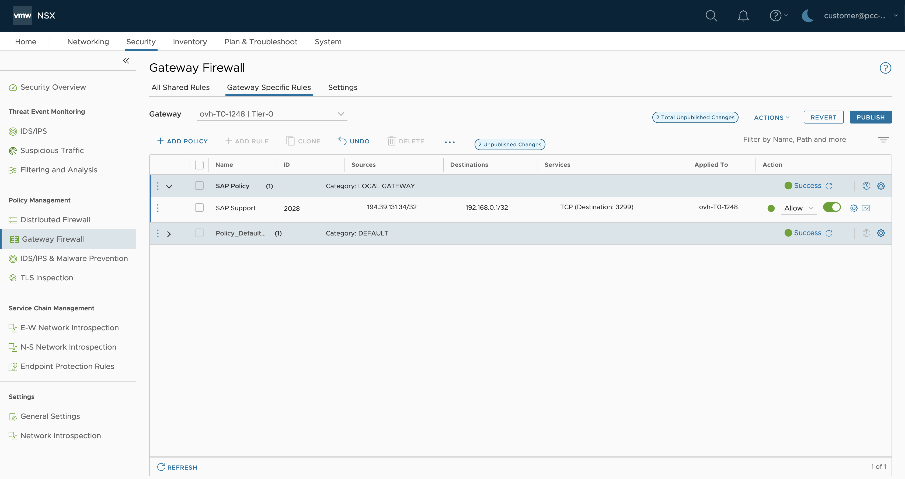{.thumbnail}
>>
> **Step 5**
>>
>> Once the rule has been created, click on `Publish`{.action} to update the configuration on the NSX gateway.
>>

#### NAT

The SAProuter doesn't have a public IP address. You must apply the configuration to route the traffic on the port tcp/3299 from the public IP address held by your NSX gateway to your SAProuter.

You must create a Destination Network Address Translation (DNAT) rule.

This part shows you the steps to create a DNAT rule on an NSX gateway.

> [!tabs]
> **Step 1**
>>
>> Click on the `Networking`{.action} tab then, in the `Network Services`{.action} category, click on `NAT`{.action}.
>>
>> 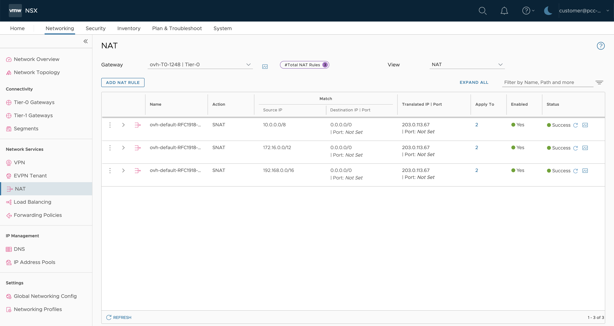{.thumbnail}
>>
> **Step 2**
>>
>> Select your T0 gateway "ovh-T0-xxxx" then click on `Add NAT rule`{.action}.
>>
>> Set the following parameters:
>> 
>> - Nom: SAP Support
>> - Action: DNAT
>> - Source IP : 194.39.131.34/32
>> - Destination IP | Port : *Public IP address of your NSX gateway* | 3299
>> - Translated IP | Port : *Private IP address of your SAProuter* | *Empty*
>>
>> 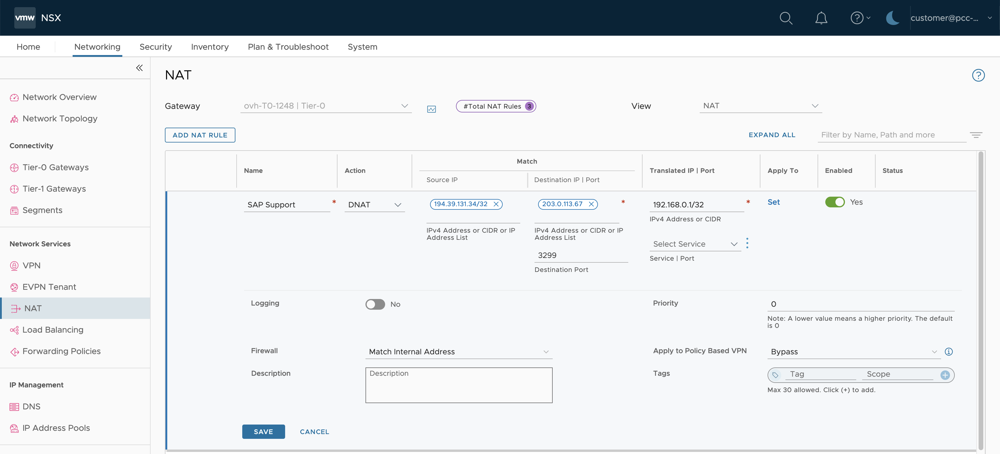{.thumbnail}
>>
> **Step 3**
>>
>> Once the DNAT rule has been created, click on `Publish`{.action} to update the configuration on the NSX gateway.
>>

Now the traffic originating from the public IP address 194.39.131.34/32 held by SAP to your public IP address of your NSX gateway on the tcp/3299 port will be routed to your SAProuter.

### SAProuter installation

To install the SAProuter service on your dedicated virtual machine, we recommend following [instructions provided by the SAP support](https://support.sap.com/en/tools/connectivity-tools/saprouter/install-saprouter.html). Some steps must be done on your SAP Support Launchpad to secure the connection between SAP support and the SAProuter.

We advise updating your SAProuter as often as you can and deploying it in a monitored and isolated network of your SAP infrastructure. The SAProuter should communicate with your SAP infrastructure on restricted ports.

Find more information about the firewall rule with an NSX gateway in [our guide](/pages/hosted_private_cloud/hosted_private_cloud_powered_by_vmware/nsx-06-manage-gateway-firewall).

## Go further

- [Configuring the Network Firewall](/pages/bare_metal_cloud/dedicated_servers/firewall_network)
- [Install SAProuter](https://support.sap.com/en/tools/connectivity-tools/saprouter/install-saprouter.html)
- [Gateway Firewall Management in NSX](/pages/hosted_private_cloud/hosted_private_cloud_powered_by_vmware/nsx-06-manage-gateway-firewall)

If you need training or technical assistance to implement our solutions, contact your sales representative or click on [this link](https://www.ovhcloud.com/en-sg/professional-services/) to get a quote and ask our Professional Services experts for assisting you on your specific use case of your project.

Join our community of users on <https://community.ovh.com/en/>.