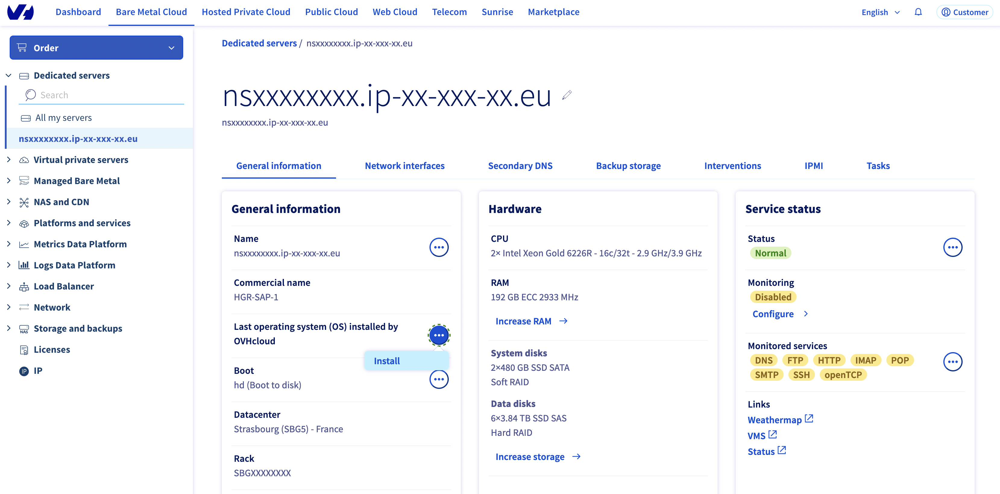
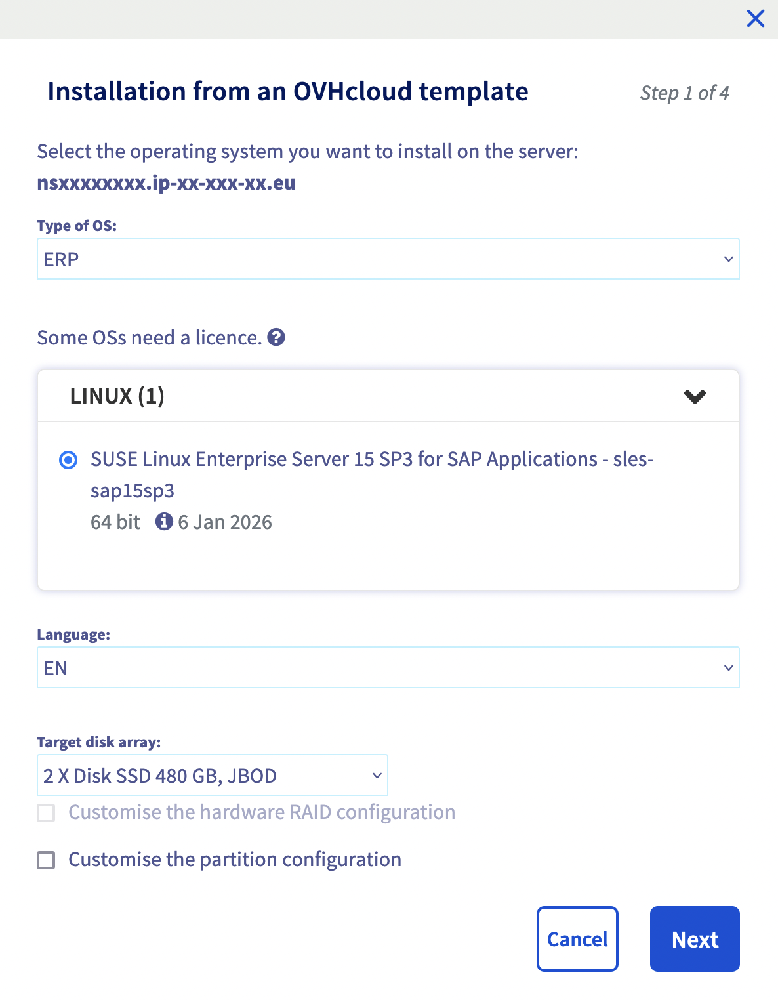

## Objective

This guide provides instructions for deploying the SLES 15 for SAP image on an OVHcloud dedicated server and preparing it for SAP HANA.

## Requirements

- Access to the [OVHcloud Control Panel](https://ca.ovh.com/auth/?action=gotomanager&from=https://www.ovh.com/asia/&ovhSubsidiary=asia)
- An [HGR-SAP dedicated server](https://www.ovhcloud.com/asia/lp/sap/)

## Instructions

### Deployment of the SLES 15 for SAP image

From the OVHcloud Control Panel, you can launch the deployment of the SLES 15 for SAP image provided by OVHcloud. Click the `Install`{.action} button to launch it.

{.thumbnail}

Select the `Install from an OVHcloud template`{.action} option.

{.thumbnail width=592 height=420}

The first step involves providing information about the operating system which you want to install.<br>
&ensp;&thinsp;a. In the drop-down menu `Type of OS`{.action}, select `ERP`{.action}.<br>
&ensp;&thinsp;b. In the drop-down menu `LINUX`{.action}, select `SUSE Linux Enterprise Server 15 SP3 for SAP Applications - sles-sap15sp3`{.action}.

We advise you to do this installation on the target disk array `2 X Disk SSD 480 GB, JBOD`{.action}.

If you want, you can customise the partition configuration.

> [!primary]
> By default, partitions `/boot` and `/` are in RAID 1.

{.thumbnail width=593 height=762}

If you do not custom the configuration of partitions, you will go to the last step.

You can set a hostname which will be displayed with the command `hostname`. You have also the possibility to [add your SSH key](/pages/bare_metal_cloud/dedicated_servers/getting-started-with-dedicated-server#adding-an-ssh-key-optional).

> [!primary]
> By default, a swap partition of 4 GB is created and follows the SAP recommendations which are explained in the [SAP Note 1999997 - FAQ: SAP HANA Memory](https://launchpad.support.sap.com/#/notes/1999997).

{.thumbnail}

Once these last parameters are configured, click `Confirm`{.action} to launch the installation.

> [!warning]
> The SLES 15 for SAP image provided by OVHcloud is an image without license included. Following the deployment, you should install your SLES 15 for SAP license with the following command:
>
> `SUSEConnect -r <license>`

Once the SLES 15 for SAP installation is done, you can [connect to your dedicated server](/pages/bare_metal_cloud/dedicated_servers/getting-started-with-dedicated-server#logging-on-to-your-server).

### Preparation of file systems

We will use the *Logical Volume* concept which is offering a lot of advantages within configuration of partitions.

1. Get the name of the disk where you will install your SAP HANA database. The name of the disk should be `sda`.

To check it, you can launch the command below and you will get this result:

```bash
$ lsblk

NAME          MAJ:MIN RM   SIZE RO TYPE  MOUNTPOINT
sda             8:0    0  10.5T  0 disk 
sdb             8:16   0 447.1G  0 disk
├─sdb1          8:17   0   511M  0 part
├─sdb2          8:18   0   256M  0 part
│ └─md2         9:2    0   255M  0 raid1 /boot
├─sdb3          8:19   0     2G  0 part  [SWAP]
├─sdb4          8:20   0 444.4G  0 part
│ └─md4         9:4    0 444.3G  0 raid1
│   └─vg-root 254:0    0 444.3G  0 lvm   /
└─sdb5          8:21   0     2M  0 part
sdc             8:32   0 447.1G  0 disk
├─sdc1          8:33   0   511M  0 part  /boot/efi
├─sdc2          8:34   0   256M  0 part
│ └─md2         9:2    0   255M  0 raid1 /boot
├─sdc3          8:35   0     2G  0 part  [SWAP]
└─sdc4          8:36   0 444.4G  0 part
  └─md4         9:4    0 444.3G  0 raid1
    └─vg-root 254:0    0 444.3G  0 lvm   /
```

<ol start="2">
  <li>Create a physical volume based on the data disks RAID with the following command:</li>
</ol>

```bash
pvcreate /dev/sda
```

<ol start="3">
  <li>Create a virtual group named <code>vg_hana</code> based on the physical volume previously created. </li>
</ol>

```bash
vgcreate vg_hana /dev/sda
```

<ol start="4">
  <li>Create logical volumes which will be the partitions for the operating system.</li>
</ol>

Each logical volume will be shown as a directory for the SAP HANA installation.

We advise you to follow this table to size your logical volumes.

| Logical volume  |                         Size                          |
|-----------------|-------------------------------------------------------|
| usrsap          |  MIN(32 GB)                                           |
| hanadata        |  1 x RAM                                              |
| hanalog         | [RAM ≤ 512 GB ] = 1/2 x RAM<br>[RAM > 512 GB ] = 512GB|
| hanashared      |  MIN(1 x RAM; 1 TB)                                   |
| hanabackup      |  hanadata + hanalog                                   |

In each line, replace the character `<X>` by the size of your logical volume wanted in gigabytes, for example 32.

```bash
lvcreate -L<X>G -n lv_usrsap vg_hana
lvcreate -L<X>G -n lv_hanadata vg_hana
lvcreate -L<X>G -n lv_hanalog vg_hana
lvcreate -L<X>G -n lv_hanashared vg_hana
lvcreate -L<X>G -n lv_hanabackup vg_hana
```

<ol start="5">
  <li>Once these logical volumes are created, it is necessary to format them in a format supported by SAP HANA.</li>
</ol>

In this guide, we use the XFS format. We recommend taking into consideration the [SAP Note 2972496 - SAP HANA Filesystem Types](https://launchpad.support.sap.com/#/notes/2972496) to discover all formats supported by SAP HANA.

```bash
mkfs.xfs /dev/vg_hana/lv_usrsap
mkfs.xfs /dev/vg_hana/lv_hanadata
mkfs.xfs /dev/vg_hana/lv_hanalog
mkfs.xfs /dev/vg_hana/lv_hanashared
mkfs.xfs /dev/vg_hana/lv_hanabackup
```

<ol start="6">
  <li>Create the directories on which are going to be based the logical volumes.</li>
</ol>

```bash
mkdir -p /hana/data /hana/log /hana/shared /usr/sap /hanabackup
```

<ol start="7">
  <li>To mount the file systems on the operation system, you have to get their UUID to fill the <code>/etc/fstab</code> file.</li>
</ol>

To get each UUID from logical volumes, you can use these commands:

```bash
blkid /dev/vg_hana/lv_usrsap | awk '{print $2}'
blkid /dev/vg_hana/lv_hanadata | awk '{print $2}'
blkid /dev/vg_hana/lv_hanalog | awk '{print $2}'
blkid /dev/vg_hana/lv_hanashared | awk '{print $2}'
blkid /dev/vg_hana/lv_hanabackup | awk '{print $2}'
```

<ol start="8">
  <li>Add this content in the <code>/etc/fstab</code> file, replacing content with previously retrieved values.</li>
</ol>

```bash
UUID=<UUID>       /usr/sap        xfs     noatime,nodiratime,logbsize=256k 0 0
UUID=<UUID>       /hana/data      xfs     noatime,nodiratime,logbsize=256k 0 0
UUID=<UUID>       /hana/log       xfs     noatime,nodiratime,logbsize=256k 0 0
UUID=<UUID>       /hana/shared    xfs     noatime,nodiratime,logbsize=256k 0 0
UUID=<UUID>       /hanabackup     xfs     noatime,nodiratime,logbsize=256k 0 0
```

<ol start="9">
  <li>You can now execute the command <code>mount -a</code>. This command will mount the logical volumes on your operation system. You have to see it in the output of the command <code>df -h</code> with the size previously configured.</li>
</ol>

### Application of parameters with SAPtune

The SAPtune package is available on the SUSE operating system, and allows applying system parameters depending on the SAP role hosted on the server. To discover more about this package, we invite you to read the [SUSE page](https://documentation.suse.com/sles-sap/15-SP2/html/SLES-SAP-guide/cha-tune.html).

> [!primary]
> As a reminder, you must have activated your SLES 15 for SAP license on your dedicated server before following the next steps of this guide.
>
> We advise you to do an update of your operating system with the command `zypper update -y`.

1. Install the saptune package.

```bash
zypper install -y saptune
```

<ol start="2">
  <li>Depending on your future SAP system, you have two possibilities.</li>
</ol>
&ensp;&thinsp;a. The first choice is `HANA` for running a SAP HANA database of a SAP NetWeaver system.<br>
&ensp;&thinsp;b. The second choice is `S4HANA-DBSERVER` for running the SAP HANA database of a SAP S/4HANA system.

To set these parameters after choosing your solution, run this following command:

```bash
saptune solution apply <HANA|S4HANA-DBSERVER>
```

<ol start="3">
  <li>We recommend enabling the SAPtune service during the startup. At each startup of your server, the SAPtune service will set up the recommended parameters for your operating system.</li>
</ol>

```bash
saptune service enablestart
```

<ol start="4">
  <li>You can check if parameters have been successfully applied with this following command:</li>
</ol>

```bash
saptune solution verify <HANA|S4HANA-DBSERVER>
```

> [!primary]
> If you want to learn more about the parameters for SLES 15 and SAP HANA, we recommend you to read these two SAP Notes:
>
> - [2578899 - SUSE Linux Enterprise Server 15: Installation Note](https://launchpad.support.sap.com/#/notes/2578899)
> - [1275776 - Linux: Preparing SLES for SAP environments](https://launchpad.support.sap.com/#/notes/1275776)

Your dedicated server is now ready to host a SAP HANA database.

You can proceed to its installation following the [official SAP guide](https://help.sap.com/docs/SAP_HANA_PLATFORM/2c1988d620e04368aa4103bf26f17727/88e3e9a612bc484cac335725ad0978d3.html).

## Go further

[How to Configure Your NIC for OVHcloud Link Aggregation in SLES 15](/pages/bare_metal_cloud/dedicated_servers/ola-enable-sles15)

If you need training or technical assistance to implement our solutions, contact your sales representative or click on [this link](https://www.ovhcloud.com/asia/professional-services/) to get a quote and ask our Professional Services experts for assisting you on your specific use case of your project.

Join our community of users on <https://community.ovh.com/en/>.
