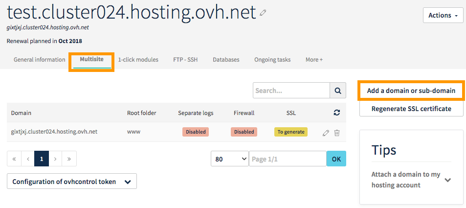
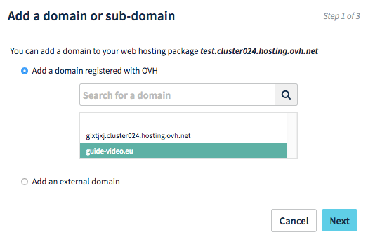
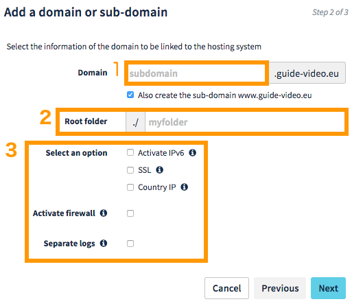
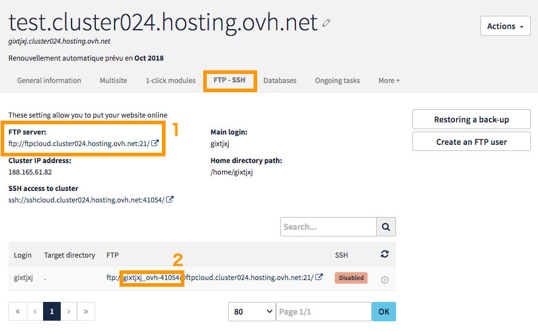
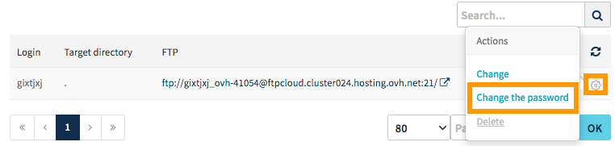
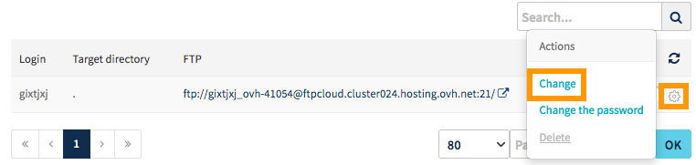
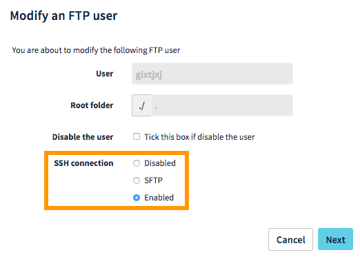
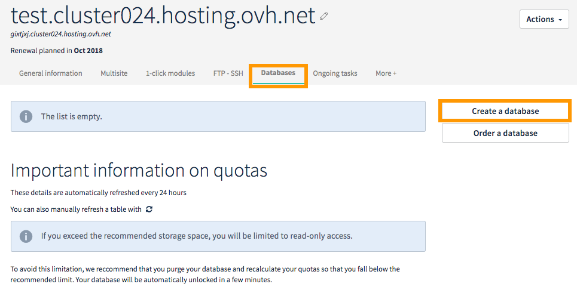

**Dernière mise à jour le 27/11/2017**

## Objectif

Cloud Web est une offre d'hébergement web basée sur les infrastructures Public Cloud d'OVH. Elle permet de bénéficier d'un serveur virtuel dédié tout en conservant la simplicité et la maintenance d'un hébergement web.

**Ce guide vous explique comment bien débuter avec l'offre Cloud Web.**

## Prérequis

- Disposer d'une offre [Cloud Web](https://labs.ovh.com/cloud-web).
- Disposer d'un [nom de domaine](https://www.ovh.com/fr/domaines/) (optionnel).
- Disposer d'un terminal (pour les commandes SSH) ou d'un logiciel FTP (comme FileZilla ou Cyberduck).
- Être connecté à [l'espace client OVH](https://www.ovh.com/auth/?action=gotomanager).

## En pratique

### Attacher un nom de domaine à l'hébergement Cloud Web


#### Avec un nom de domaine chez OVH lié au même compte client

Si vous possédez déjà un nom de domaine chez OVH, la manipulation est simple. Sur votre hébergement, rendez-vous sur dans l'onglet `Multisite`{.action} puis `Ajouter un domaine ou sous domaine`{.action} :
 
 



Le nom de domaine apparaît alors dans la liste. Sélectionnez-le et choisissez `Suivant`{.action} :




Vous pouvez maintenant décider d'ajouter un sous-domaine(1), de sélectionner le répertoire où seront présents les fichiers(2), d'ajouter des options(3)...





#### Avec un nom de domaine hors d'OVH ou lié à un compte client différent

Référez-vous à ce guide afin d'effectuer la configuration : <https://docs.ovh.com/fr/domains/creer-une-zone-dns-pour-un-domaine-externe>


### Se connecter à son hébergement Cloud Web

#### En FTP

Pour vous connecter à votre hébergement Cloud Web via ce protocole, utilisez le logiciel FTP de votre choix. Si vous n'en connaissez pas, nous vous recommandons par exemple le logiciel gratuit Filezilla. Vous trouverez dans le lien ci-dessous un guide détaillant le fonctionnement de cet outil :

<https://docs.ovh.com/fr/hosting/mutualise-guide-utilisation-filezilla>

Les informations pour vous connecter vous ont été envoyées par e-mail lors de la mise en place de l'offre. Vous pouvez aussi les retrouver dans votre espace client, à l'onglet `FTP / SSH`{.action}. Sur l'impression écran ci-dessous, vous obtiendrez les informations liées au serveur FTP(1) et votre login principal(2) :



Vous avez perdu votre mot de passe ou vous souhaitez le changer ? Il vous suffit de cliquer sur le petit engrenage dans le tableau en bas, tout à droite de la ligne qui apparaît. Là vous verrez l'option pour changer de mot de passe :
 



> [!primary]
>
> Voici les règles à respecter pour changer et valider votre mot de passe :
>
> - minimum 8 caractères ;
> - maximum 30 caractères ;
> - au moins une lettre majuscule ;
> - au moins une lettre minuscule ;
> - au moins un chiffre ;
> - uniquement des chiffres et des lettres.
> 

#### En SSH

Vous pouvez vous connecter à votre hébergement Cloud Web en SSH via votre terminal. Pour cela, vous devez d'abord activer le protocole en cliquant sur l'engrenage, puis sur `Modifier`{.action} :



Dans la fenêtre qui s'ouvre, activez le SSH :




Enfin dans votre terminal, connectez-vous avec la commande suivante :

```sh
ssh VotreLogin@LaRéférenceSSHDuServeur
```

Dans notre exemple, cela correspond à :

```sh
ssh gixtjxj@sshcloud.cluster024.hosting.ovh.net
```

### Créer une base de données

Votre hébergement vous permet de créer autant de bases de données que vous le souhaitez, la seule limite étant l'espace de stockage dont vous disposez. Pour les activer, rendez-vous dans la partie `Bases de données`{.action} de votre espace client, choisissez `Créer une base de données`{.action} et suivez les indications :



## Aller plus loin

Échangez avec notre communauté d'utilisateurs sur <https://community.ovh.com>