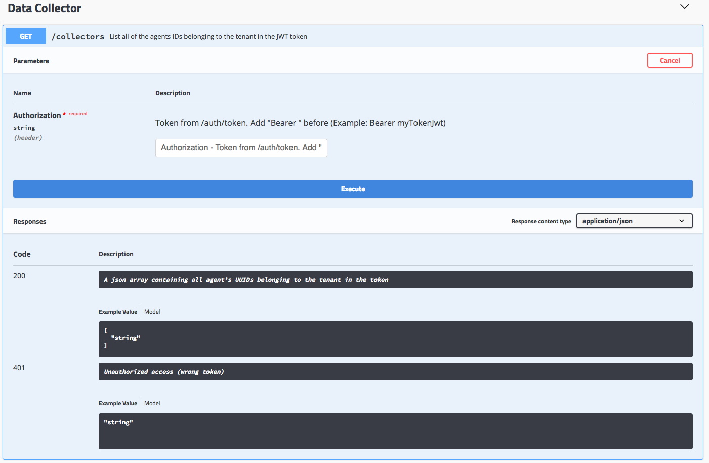
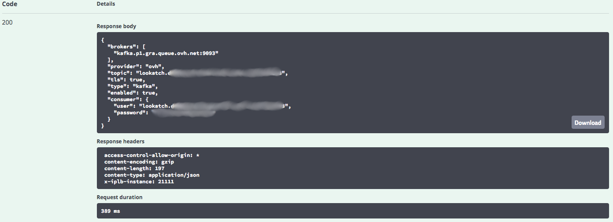

This tutorial shows you how to configure your agent.

Once you have ordered an agent, you should receive several information :

* The **agent ID** you just ordered
* If necessary, your **tenant ID and the password** associated with it

But the agent that has been created is an empty shell and still need configuration before you can
use it.

The aim of this guide is, therefore, to help you in configuring your new data collector.


## Using Data Convergence API to configure your Data Collector

First, let's generate a JWT token which will be signed and contains all the claims allowing you to
use certain routes and not others.
By default, any new tenant can use all routes for the Data Collector API, but this might be
restricted later if some endpoints are created for administration purposes, for instance.

> [!primary]
>
> Your JWT token is time limited to *24 hours*.
>


### 1 - Generate a JWT token

1. Navigate to [https://api.dataconvergence.ovh.com](https://api.dataconvergence.ovh.com)


2. In the Authorization field, enter `Basic` followed by "your username:your password" encoded in
Base64.

    * To encode in Base64, you can use the following command in Linux:

    ```
    $ echo -n 'your username:your password' | base64
    ```

    * For example using *user-tutorial:password-tutorial*

    ```
    $ echo -n 'user-tutorial:password-tutorial' | base64  
    dXNlci10dXRvcmlhbDpwYXNzd29yZC10dXRvcmlhbA==
    ```

    * Your Authorization field will thus contain `Basic dXNlci10dXRvcmlhbDpwYXNzd29yZC10dXRvcmlhbA`

* Click on *Execute*.
* In the Response Body, you should see your JWT token, generated for these credentials.
Keep it somewhere to avoid having to regenerate one.


### 2 - List your collectors

1. Click on the "GET /collectors" route from the "Data Collector" section.


2. In the Authorization field, enter **"Bearer "** followed by the JWT token generated in the
previous step.

3. Click on *Execute* and check the resulting IDs in the Response Body.


### 3 - Configure a data source for your Data Collector

For the next step, you need to configure a data source for your Data Collector.

1. First, start by listing all the currently supported sources. Expand the "**GET /collectors/{agentId}/sources/availableSources**"


2. Fill in the Authorization field with "Bearer " followed by the JWT token generated in the first
step.

3. Fill in the agentId field with the agent you want to configure, for example you can fill the
agent ID in the result from the previous step.

4. Click on *Execute* and check the response body to select the source you want to use.

5. Here, we are going to choose to configure a "mysqlQuery" source. This source requires the
following information, as specified in the previous response :


6. Open the "**POST /collectors/{agentId}/sources/{source}**" route and fill in the information
(Authorization as before, same for agentId and "MysqlQuery" in "source"). In the "body" field,
enter the JSON data from the "MysqlQuery" JSON from the previous call:

  ```
  {
      "name": "your-source",  
      "user": "your-source-user",  
      "password": "your-source-password",  
      "host": "your-host-ip",  
      "port": 3306  
  }
```

7. Then click on *Execute* and check the response body. It should look like this:


> [!primary]
>
> Note that the password is not in the response for obvious security reasons
>

To make sure everything is okay, open the "**GET /collectors/{agentId]/sources/{source}**" route
and fill the information (Authorization, agentId and "your-source" in "source").  
Click on *Execute* and it should give you the resulting data:


### 4 - Select sink

For the next step, you need to prepare the sink for your Data Collector. As of now, only a Kafka
sink, configured by OVH, is available.

1.  To be sure that no other sinks are available, we will start by calling the "**GET /collectors/{agentId}/sinks/availableSinks**" route, which should give you the following response:


2. Now, just call the "**POST /collectors/{agentId}/sinks/{sink}**" route with "ovhkafka" in the
"sink" field and the "body" field with:
  ```
  {
  "name": "your-sink"
  }
  ```

3. It should give you the following response:


4. As for the sources, let's check the configuration of the sink (which will allow you to get data
  on how to read events from the Kafka queue created for you).  
Call the "**GET /collectors/{agentId}/sinks/{sink}**" route with the right parameters, which should
give you the following response:


5. Now you have all the necessary information to connect to your Data Collector's Kafka topic.


### Deploy your agent

The last step is to deploy your agent !

Just launch the "**PUT /collectors/{agentId}/deploy**" and... wait for a **200** Response Body !

Your Data Collector is now configured and up and running.  
If your data source is accessible, you should now see your events into Kafka !
