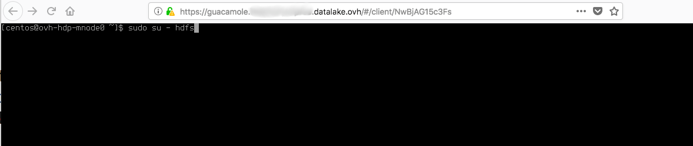

## What is Guacamole ?

[Apache Guacamole](https://guacamole.apache.org/) is a **clientless
remote desktop gateway**, supporting standard protocols like SSH, VNC
and RDP.

Clientless because you don't need plugins or client software to use it, just access in a web browser.

## Access to your Guacamole

When your cluster is deployed, you can access to Guacamole interface
with the URL `https://guacamole.{cluster_id}.datalake.ovh`.

## Guacamole overview

After log in succeed, you can see all available connections and recent
connections on the home screen.

Clicking on any connection will open that connection within the current
window, multiple connections can be used simultaneously.

## Copy / Paste text into Guacamole

If you need to use the copy/paste command into your opened connection on
Guacamole, you can use `Ctrl+Alt+Shift` keys to display the Guacamole
clipboard.

Enter the text you want to paste into your opened SSH connection, use
again `Ctrl+Alt+Shift` keys to close the Guacamole clipboard. Then use
`Ctrl+Shift+V` keys to paste the text from the Guacamole clipboard

