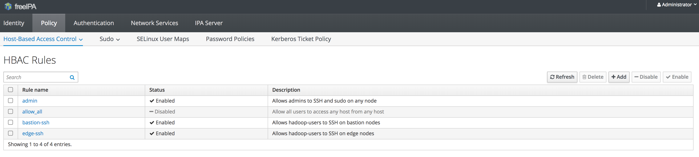

## What is FreeIPA

FreeIPA is an Identity Management System based on RedHat Identity Management.
It provides following services :

- 389 Directory Server : multi-master capable LDAP for user directory
- MIT Kerberos : IP level authentication layer to secure applications access
- NTP : time protocol for hosts synchronization
- DNS : domain name service that list all accessible domains
- Dogtag certificate system : certificates authority
- SSSD : System Security Services Daemon to enable multiple authentication provider

Learn more on [FreeIPA Wikipedia's page](https://en.wikipedia.org/wiki/FreeIPA)

### FreeIPA in Analytics Data Platform

In order to handle users authentication and provide a unique identity management point, we decided to setup an Identity manager. FreeIPA do provide all the features neded to handle it in one point.

It makes users/groups accesses and rights management easier all accross the cluster.

In your cloud project, the FreeIPA host is named `ovh-ipa.your-cluster-id.datalake.ovh`.
The IPA services are hosted on it. You can access it at `https://ipa.your-cluster-id.datalake.ovh`
Right after the cluster deployment, you cann connect using admin password.

> [!primary]
>
> Admin credentials can be retrieved at https://dataconvergence.ovh.com/credentials
>

## Create a User and a Group

Login with a user with administration rights on freeIPA web UI

`https://ipa.your-cluster-id.datalake.ovh`

Click on the "Add" button in *Identity -> Users*

Fill up the form and validate it by clicking on "Add".

> [!primary]
>
> The newly created user will have to edit his password at the first connection.
>

It is the same for groups creation. In *Identity -> Groups*, click the "Add" button and fill the creation form

In order to add users to a group, you have to select it first. Then on the group description screen, you can click the "Add" button in order to add users in the group you selected.

> [!warning]
>
> After user/group creation, it may take several minutes to be deployed all accross the cluster.
If needed, refresh the SSSD cache on the needed hosts.
>

## HBAC, sudo and password policy

### HBAC

HBAC stands for Host Based Access Control. It means that you can control
who is able to connect to services and hosts.
Access control is managed in the Policy pannel.

You may notice that the default policy *allow_all* has been disabled to prevent
security issues. It has been replaced by :

- *admin* : administrator access on all services and nodes
- *bastion-ssh* : ssh access to bastion host
- *edge-ssh* : ssh access to edge nodes. (see [edge nodes](../edge-nodes/guide.en-gb.md) )

When you create a rule, you have to specify :

- Who : the target user or group
- Accessing : which hosts the *Who* will access
- Via Service : the service that will be used to access to the hosts

### sudo

sudo rules list the users authorized to execute the Linux *sudo* command on a host.
By default, there is no sudo rules. That means that users are not authorized to launch
super user commands in the realm. Those rules are defined in *Policy -> Sudo -> Sudo Rules*,
after having defined commands in *Policy -> Sudo -> Sudo Commands*.

sudo rules are composed of :

- Who : the user/group that will be able to launch the command
- Access this host : the host on which command will be allowed
- Run Commands (Allow ou Deny) : the authorized command list
- As Whom : a list of users that could be used to run the command

> [!primary]
>
> You can group commands using labels.
>

### password policy

Password policies are used for password creation limitation. It means that
you can forbid or enforce length/Case/characters usage in password definition

> [!primary]
>
> Default policy called *global_policy* is permissive in terms of password definition. We recommand to define a stronger one.
>

When setting a password policy, you have to specify :

- Max lifetime (days) : maximum lifetime for a password in days
- Min lifetime (hours) : minimal lifetime of a password in hours. It is used to prevent users to reuse old password after consecutive changes.
- History Size (number of passwords) : number of old password to keep in memory in order to prevent password reuse.
- Character classes : character categories to include in any new password (number of different categories to include). Categories are :
    - Capital case letters
    - Small case letters
    - Numbers
    - Symbols ( ! . – { ?…)
- Min length : minimal password length.
- Max failures : maximal tries number before locking the user account
- Failure reset interval (seconds) : amont of time in seconds before resetting the failed login count.
- Lockout duration (seconds) : duration of account locking after too much fails.

> [!primary]
>
> For password reset see [reset password section](../manage-users/guide.en-gb.md)
>
