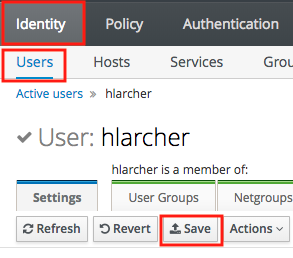

Using your Data Platform Identity Management tool (idM), you can manager groups and users. A first *admin* user is automatically created to administrate the platform.

## Managing users

> [!warning]
>
> Do not delete or edit the *ovhautomation* and *ovhsupport* users. Editing or deleting those user breaks the ability
to scale the cluster and avoids OVH support to troubleshoot your cluster. [Learn more](#ovh-users)
>

### Add new users

You can add new users using the idM web interface of your platform:

1. Navigate to `https://ipa.{cluster_id}.datalake.ovh`
2. Log in with the *admin* user. [Learn how to generate your first credentials](../retrieve-credentials/guide.en-gb.md)
3. Navigate to  *Identity* > *Users* and click on the *+ Add* button

4. Complete the new user form with *User login*, *First name*, *Last name* and *Password* and click on *Add and Edit*
5. In the user view, select *User Groups* tab
6. Click on *+ Add* button

7. Select the *hadoop-users* group and optionally the *hadoop-admins* group. [Learn more on groups](#default-user-groups)
8. Your new user should be able to login with SSH and will be asked to change its password on first login

> [!info]
>
> idM is in charge of synchronizing users and credentials to the cluster. This synchronization can take some time as
credentials are cached on the nodes for performances reasons.
>

### Reset a user Password
It happends that a user forgot his password. In such case, the user may want to reset his password.

1. Navigate to `https://ipa.{cluster_id}.datalake.ovh`
2. Login with your credentials
4. On the top right dropdown menu, select *change password*

5. Then fill in the password definition form

It can also happen that the administrator wants to reset a user password because of a security issue
(mainly in case of exposed password):

1. Navigate to `https://ipa.{cluster_id}.datalake.ovh`
2. Login with your administrator credentials
3. Navigate to  *Identity* > *Users* and click on the username
4. On the *action* menu dropdown, select *reset password*

5. Then fill in the temporary password definition

6. Give the temporary to the concerned user

> [!info]
>
> After a admin password reset, the user will have to change the temporary password at the first connection.
>

### Manage SSH keys
Each user is able to manage its own SSH public keys to connect on the platform:

1. Navigate to `https://ipa.{cluster_id}.datalake.ovh`
2. Login with your credentials
3. Navigate to  *Identity* > *Users* and click on your username
4. In the SSH public keys click on *Add*

5. Paste your public ssh key and click *Set*
6. Save your modifications using the dedicated button

## Manage groups
### Add new groups
Groups allow administrators to easily give access to resources to a given user. To create a group:

1. Navigate to `https://ipa.{cluster_id}.datalake.ovh`
2. Log in with the *admin* user. [Learn how to generate your first credentials](../retrieve-credentials/guide.en-gb.md)
3. Navigate to  *Identity* > *Groups* and click on the *+ Add* button

4. Complete the new group form with *Group name*, and an optional description
5. Click on *Add and Edit*
6. Your group is created, you can add users if desired

## Reference
### Default user groups
When your platform is created, the following user groups are created

Group name                   | Description                                            | Privileges
-----------------------------|--------------------------------------------------------|----------------
**hadoop-users**             | Users of the Data Platform                             | Access to the Hadoop cluster. Users can SSH on bastion and edge nodes
**hadoop-admins**            | Hadoop administrators                                  | Users are administrators on all Hadoop tools. Users can SSH on any node of the cluster. Users can sudo.
**admins**                   | idM administrators                                     | Users are administrators of the Identity Management tool. They can create/edit/delete users.
**hadoop-dataengineers**     | Data engineers                                         | Yours to define
**hadoop-datascientists**    | Data scientists                                        | Yours to define
**hadoop-bi**                | Data analysts                                          | Yours to define
**ambari-managed-principals**| Hadoop system users                                    | Do not use

### OVH users
Your Data Platform is created with two OVH users that should not be modified.

- **ovhautomation** is strictly used for automatic platform actions like upgrades or scaling. OVH support cannot use this user to connect to your cluster.
- **ovhsupport** is a user dedicated to OVH support, disabled by default. In case of troubleshooting, OVH support can ask you to enable the user to gain access to your platform.
You should always disable this user after troubleshooting.
