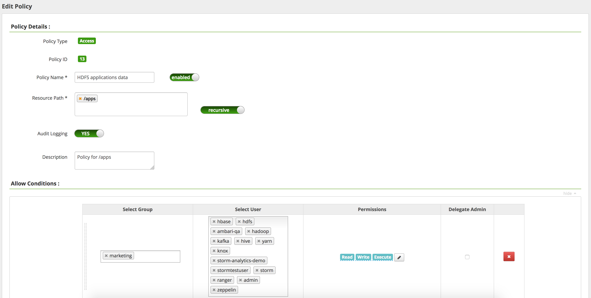
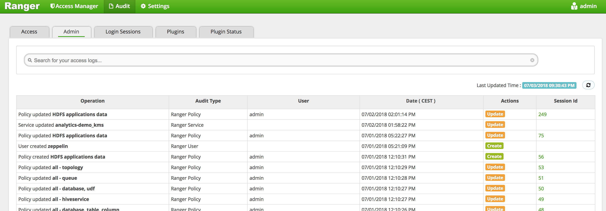

Apache Ranger is an open source project that helps in people and group access management to Hadoop resources.
It provides needed tools to setup data access control and policies.
You can read any needed information on the [Ranger project website](https://ranger.apache.org/)

Your Ranger instance is accessible through knox at following address

`https://knox.{cluster_id}.datalake.ovh/gateway/default/ranger`

## Policies

Connecting to Ranger, you will be presented with the Access Manger.
Each Hadoop service managed by Ranger will be shown.

Click on any service to access its policy list. For each policy you can define the scope, the user or groups impacted
and the effective access rights.

### HDFS
With HDFS policies you can restrict access to specific filesystem paths.

Create a new policy and input the desired HDFS path in the *Resource Path* field. Activate the *Recursive* switch
if you want to policy to also be applied for subfolders. Use the Audit logging switch to control whether you want
all accesses to that path to be logged by Ranger.

In *Allow conditions* select user(s) and group(s) that should be granted access. In the *Permissions* field,
select the effective permissions you want to grant. You can use the *Delegate Admin* if you want the users to be able to
modify the policy and create additional policies for subfolders.

> [!primary]
>
> When no policy match a given user/path, Ranger will fallback to default HDFS filesystem permissions.
>

### YARN
Use YARN policies to restrict users that can submit applications to YARN or restrict the queue they can use.
This can be useful on a mixed production cluster where a priority production queue could be only accessible to production
users.
Create a new policy and input the queue in the *Queue* field. In *Allow conditions*  select user(s) and group(s) that
should be granted access. In the *Permissions* field, select the effective permissions you want to grant.

### Kafka
With Kafka policies you can restrict the access to specific topics.
Create a new policy and input the desired Kafka topic using the *Topic* field.  
In *Allow conditions*  select user(s) and group(s) that should be granted access.
In the *Permissions* field, select the effective permissions you want to grant.

## Users and groups
Ranger users and groups are synchronized hourly from the Data Platform identity manager. To create or update users, use the
[idM interface].

## Audits

Use the *Audit* tab to access Ranger auditing tool.

- The access tab shows you the authorized/denied actions for each user and
policies. Using the search tab you can filter per service, date or username/group.
- The Admin tab allows you to monitor Ranger policies updates.
- The login sessions allows you to monitor users connecting to Ranger
- The *plugins* and *plugins status* can be used to monitor Ranger plugin synchronization status for each service

