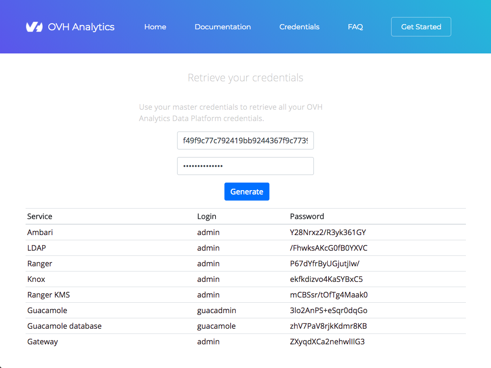

When your data platform is installed, it is initialized with a master password. This password must always be kept safe
as it allows to retrieve all the credentials of your platform services.  

To retrieve your credentials:

1. Connect to [https://dataconvergence.ovh.com/credentials](https://dataconvergence.ovh.com/credentials).
2. Enter your project id and your master password
3. Click on **Generate** button.

## Description of credentials

Credentials       | Description
------------------|----------------------------------------------------------
 Ambari           | Ambari administrator password: manage your cluster services
 LDAP             | LDAP directory administrator: add or remove users on your cluster
 LDAP gateway     | Use this password to access the LDAP management interface through your browser
 Ranger           | Ranger administrator: add or remove authorizations on Hadoop services
 Knox             | Access Hadoop services via Knox gateway as administrator
 Guacamole        | WebSSH administrator
 Ranger KMS       | Ranger KMS administrator
 Guacamole        | Guacamole MySQL DB administrator database
 Hive database    | Hive metastore MySQL DB administrator
 Oozie database   | Oozie MySQL DB administrator
 Ambari database  | Ambari MySQL DB administrator
 Ranger database  | Ranger MySQL DB administrator
 Ranger KMS       | Ranger KMS MySQL DB administrator database
