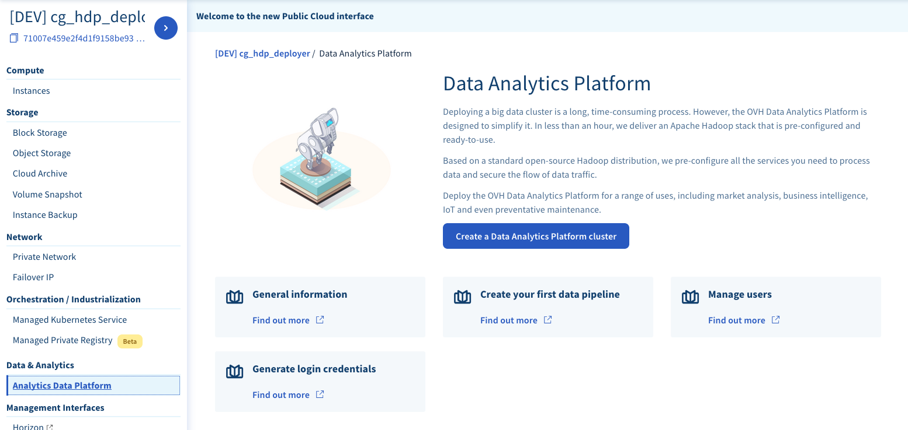
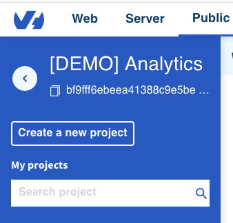
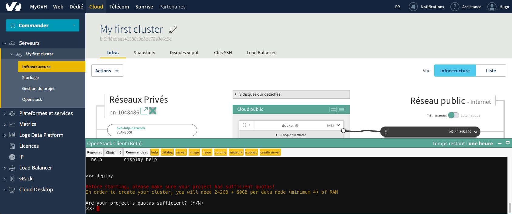

## Before you begin

The analytics data platform is meant to be deployed in an Openstack project.  
You can create a new project in your [OVH manager in Cloud section](https://www.ovh.com/manager/cloud/index.html#/)

The cloud project that you will use to deploy your Analytics Data Platform has to be connected to
[OVH vRack technology](https://www.ovh.com/fr/solutions/vrack/) to create and add it to your project,
please see [ section about vRack](../vrack/guide.en-gb.md).

## Create your first cluster

In this section you deploy a new Data Platform running on OVH Public
Cloud instances:

1.  Login to your [OVH Manager](https://www.ovh.com/manager/cloud/index.html)
2.  In the manager select *Order* > *Cloud Project*
3.  Choose a project name in which your cluster will run and create the project
4.  Select your project in the *sidebar* > *Infrastructure*
5.  Open the *OpenStack Client* window in the bottom right

6.  Launch the Analytics CLI by typing `bigdata-platform-cli`

7.  Launch a cluster deployment by typing ``deploy``

8.  Follow the on-screen instructions
9.  Save your master password to a secure place, you will need it to connect to your cluster
10. Congratulations, your cluster is now deploying! It should take less than 1 hour to complete.

## Connect to your cluster

Each OVH Analytics Data Platform instance is installed with Apache
Ambari, an easy-to-use web UI to monitor and configure your cluster.

To access Ambari GUI in your newly created cluster, go to the following
URL, using your cluster id:

`https://knox.{cluster_id}.datalake.ovh/gateway/default/ambari/`
