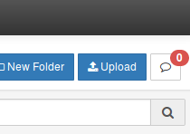
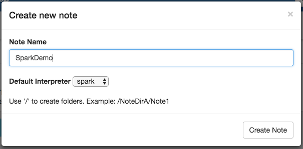

## Ingesting data

You now have an OVH Analytics cluster up and running and know how to
monitor it. Now, let's learn how to use it to store some data. An OVH
Analytics cluster comes with a few ways to ingest data :

- WebHDFS
- Ambari's Files View
- HBase
- Phoenix SQL (if you have enabled it through HBase configuration in Ambari)


In this part you will use Ambari Files view to ingest a CSV dataset.
The data we will ingest is going to be a very
popular sample from New York City cab service, specifically the trips
they made in January 2017. It's available here:

http://www.nyc.gov/html/tlc/html/about/trip_record_data.shtml

To access Ambari's Files View, click on Ambari's top bar's 9-squares
icon and choose Files View which will redirect you to this screen:


The view shows HDFS file tree, modification dates and permissions.
Each user is provided with a home directory where they can store data.
Browse to /user/admin (if admin is your current user, otherwise change the name according to
it) and create a new folder called NYCCabs:


Now, go into this new folder and click on the "Upload" button:



Drag the downloaded CSV file in the new popup and wait for the upload to
finish.


And here you are. You have now successfully ingested data into your data
lake. You will now be able to use the different analytic tools packaged
within OVH Analytics to work on your data sets.


### Make data available in Hive

[Apache Hive](<https://hive.apache.org/>) is a data warehouse software
project built on top of Apache Hadoop for providing data summarization,
query and analysis. Hive gives an SQL-like interface to query data
stored in various databases and file systems that integrate with Hadoop.
Hive provides the necessary SQL abstraction to integrate SQL-like
queries (HiveQL) into the underlying Java without the need to implement
queries in the low-level Java API.

### Creating a database

Hive behaves in a very similar way to a standard SQL system. Which means
that it supports databases (or schemas) to keep data separated. Before
we can use it, we will first have to create a new database. Let's go
into the Hive View 2.0 by clicking on the Ambari's 9-squares icon:


By entering this new view, you will first be placed on the query tab
which is the one we will use :


Execute the following query to create a new database that we will call
"taxis", as this is what our data set relates to:

```sql
  CREATE DATABASE IF NOT EXISTS taxis
```

You should now be able to select "taxis" in the database field (you may
have to refresh the screen for it to appear).

With our database now created, we can continue by...

### Creating a table to map my data

Before you can use your data sets imported previously into Hive, you
first have to explain to Hive how your data is structured. This is done
by creating an external table. External tables work like standard SQL
tables, with a limited number of supported data types (supported data
types can be found
[here](https://cwiki.apache.org/confluence/display/Hive/LanguageManual+Types>).

Let's continue with previous example of NYC taxi trips. The first
thing to do is to find out what our columns are and to which
Hive data type match them. In order to do that, just open
the CSV file in Ambari's Files View:


Once done, a popup will open displaying a limited number of lines from
the file, including it's header:


From this, you can see the headers and the values from the first ten
lines from which we can infer column names and data types and write the
HiveQL query that will create a table to map the CSV:

```sql
    CREATE EXTERNAL TABLE TaxiTrips
    (VendorID INT,
     tpep_pickup_datetime TIMESTAMP,
     tpep_dropoff_datetime TIMESTAMP,
     passenger_count TINYINT,
     trip_distance DOUBLE,
     RatecodeID TINYINT,
     store_and_fwd_flag CHAR(1),
     PULocationID INT,
     DOLocationID INT,
     payment_type TINYINT,
     fare_amount INT,
     extra DOUBLE,
     mta_tax DOUBLE,
     tip_amount DOUBLE,
     tolls_amount DOUBLE,
     improvement_surcharge DOUBLE,
     total_amount DOUBLE)
     ROW FORMAT DELIMITED FIELDS TERMINATED BY ','
     LOCATION "/user/admin/NYCCabs/"
     TBLPROPERTIES ("skip.header.line.count"="2");
```


The three last lines are pretty important. They specify the delimiting
character separating data fields, the path to access the folder
containing the files you want to map to the table and, finally, specify
that you want to skip the first two lines (which are the headers line and
a blank line).

{}
The query is mapped to a folder and not a specific file.
This is to allow users to add many files with a similar
structure in the same folder. Here, you only have the CSV for taxi trips
from January 2017, but you could add others months as well and the
created table will automatically take them into account.
{}

Let's now check with a simple SELECT that data is readable through
Hive by running the following query:

```sql
  SELECT * FROM TaxiTrips LIMIT 10;
```

Should result in:


And with a COUNT:

```sql
  SELECT COUNT(1) FROM TaxiTrips;
```

Should result in:


You can now use the Hive View to query your data and start with your
analysis with Spark.

### Creating a first Spark Job with Apache Zeppelin

[Apache Spark](https://spark.apache.org/) is a fast, in-memory data
processing engine that allows you to execute job on your data like
streaming, SQL or machine learning. Spark jobs are executed through
YARN, to manage correctly cluster resources.

[Apache Zeppelin](https://zeppelin.apache.org/) is a web notebook
that allows you to write jobs in many languages and for many
applications like data ingestion, data exploration and visualization.

To access Zeppelin's notebook, click on **Zeppelin Notebook** in the
service list on Ambari's left bar.


On the new screen, click on **Quick Links** at the top and choose
**Zeppelin UI**.


In this tutorial, we will create a notebook that will help us display
data from a sample personal bank account file. We will work on a CSV
file available at the following URL: [bank file](https://tinyurl.com/y786v2b2)
This file contains data about personal bank accounts. It's a file for
common usage defined for testing purposes only.

Once downloaded, let's put this file into HDFS under **/tmp/** directory
(follow the steps on how to ingest data if you don't know how to do it).
We can use Ambari's Files View to check the content of said file:


We will now create a new notebook by clicking on **Notebook** then
**Create new note**. Fill in the note name and the interpreter (livy2 in
our case).



As with most notebooks system (such as Jupyter), Zeppelin allows you to
separate your code in paragraphs and to run each of them separately as
needed.

Here we go. First, you have to set interpreter with '%' prefix. Then,
the next part of the code shows you how you can parallelize some
treatments on huge files and put the result in HDFS.

```scala
    %livy2.spark
    val bankText = sc.textFile("hdfs:/tmp/banking.csv")

    case class Bank(age: String, job: String, marital: String, education: String, balance: String)

    val bank = bankText.map(s => s.split(",")).filter(s => s(0) != "age").map(
        s => Bank(s(0),
                s(1).replaceAll("\"", ""),
                s(2).replaceAll("\"", ""),
                s(3).replaceAll("\"", ""),
                s(5).replaceAll("\"", "")
            )).toDF()

    bank.map(x => x.mkString("|")).rdd.saveAsTextFile("/tmp/file.csv")
```

We can now run this job by clicking on the **Play** button. We are able
to follow the state of this job by clicking on **Job** at the top.

When finished, you can find your file in hdfs view under "/tmp/".

Note that you have a menu above to run all paragraphs, show or hide the
code, show or hide the output, clear output, clone notes, export notes,
commit to repository, etc.

Finally, Zeppelin comes prepackaged with some tutorials (as you can see
below) that you can do if you want to know more without reading too much
documentation..


## Next steps

You have learned how to use Ambari and run your first jobs using your
OVH Analytics Data Platform cluster. You may find lot of documentation
resources and tutorials on [Hortonworks website](https://docs.hortonworks.com)
