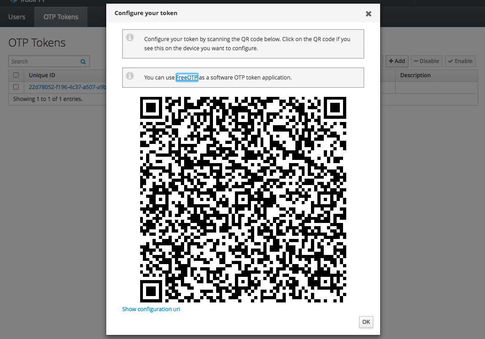

## What is two-factor authentication?

Two-factor authentication (2FA), is an extra layer of security used to log into your Data Platform.
When activating 2FA, your user will be asked their username/password and to provide a time-based token
generated by a smartphone application.

## Using 2FA
### Activating two-factor authentication
Two-factor authentication must be activated by the administrator:

1. Navigate to `https://ipa.{cluster_id}.datalake.ovh`
2. Log in with the *admin* user. [Learn how to generate your first credentials](../retrieve-credentials/guide.en-gb.md)
3. Navigate to  *Identity* > *Users* and select the user to edit
4. In *User authentication types*, tick *Two factor authentication*

5. Save your modifications

### Creating 2FA token
When two-factor authentication has been enabled, each user has to create its tokens to use with
a smartphone application:

1. Install a 2FA-compatible application on your smartphone (eg. [Google Authenticator](https://support.google.com/accounts/answer/1066447?co=GENIE.Platform%3DAndroid&hl=en))
2. Navigate to `https://ipa.{cluster_id}.datalake.ovh`
3. Log in with the user you want to activate 2FA for
4. Navigate to *OTP Tokens* tab
5. Click *+ Add button*
6. Select *Time-based* type and click *Add*
7. Scan the shown QRCode with your smartphone application


### Using 2FA
When two-factor authentication is activated for your user, just append the token generated by your application
to your password to login.

For example is your password is `superman` and the token `1234`, the password to use would be `superman1234`.

For SSH:

```bash
$ ssh me@[bastion IP]
First factor: [password]
Second factor: [token]

[me@ovh-bastion ~] $
```
