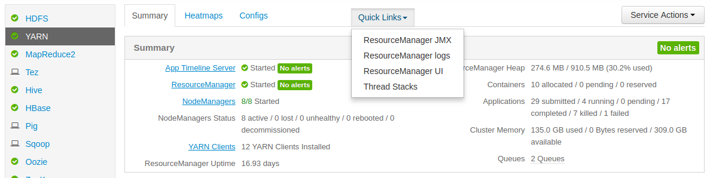

## Cluster overview using Ambari

You have now managed to deploy your Hadoop cluster connect to Ambari UI.
In this section you lean to use Ambari, create your first dataset and
run your first Apache Hive and Spark jobs.

> [!primary]
>
> If you check the users in Ambari, you may find a local admin user ’sync’. You should not delete this user as it has been created in order to accelerate the synchronization of the users between freeIPA and Ambari.
>

### Dashboard

The dashboard is the main page you will see when using Ambari. It
contains a list of predefined widgets with predefined alerts thresholds.
By monitoring it, you will be able to verify that your whole cluster and
each of your services are running smoothly.

Each widget can be customized to a certain extent (at minima, the
alerting thresholds) to better suit your needs.

On the dashboard's left side, you can sea all the services and clients
deployed on your cluster (the green tick indicates that it's a service,
like HDFS, while the computer icon represents a client, like Kerberos)

On the top bar, you can see more general monitoring data like the number
of currently running administration operations on your cluster and the
global number of alerts. You can also access the administration of
Ambari by clicking on your name (if you have the privileges for it,
obviously). Lastly, by clicking on the 9-squares icon, you can access
Ambari's views to monitor jobs or access to specific services :

### Services and Quicklinks

You can find the list of all service on left side panel of ambari UI.

When you select a service by clicking on it, the service panel is displayed.
In this panel you will find the service status and sometimes a list of metrics
to monitor it.

If the service has specific UI, a Quicklinks dropdown menu is displayed on top of
service panel. It helps you to go on the UI directly from ambari.

