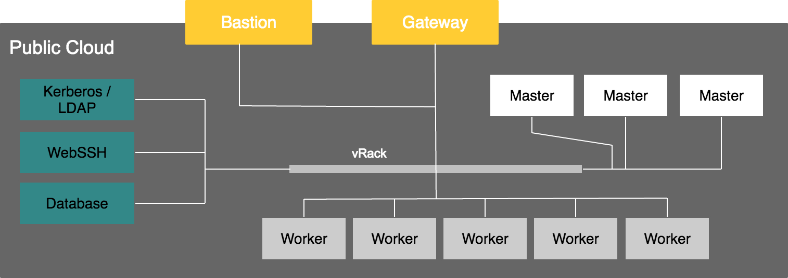

## What is vRack
Your Data Platform nodes are isolated inside a private network, an OVH vRack. It allows
them to communicate privately in a dedicated network isolated from the internet.
A firewalled [bastion host](../connect-using-ssh/guide.en-gb.md) allows you to
connect to your infrastructure and gives internet access to inside nodes.

[Learn more on OVH vRack](https://docs.ovh.com/fr/public-cloud/utiliser-le-vrack-et-les-reseaux-prives-avec-les-instances-public-cloud/)

