**Last updated on 08th October 2018**

## Objective

The Prescience platform is an automated learning tool. This guide will help you understand the basic concepts behind this tool. 

**This guide will show how to create an automated learning model in order to perform a classification.**

## Who is this guide for?

This guide is mainly aimed at people who are already familiar with the basic concepts behind machine learning. If you do not have any technical knowledge in this field, we recommend starting off by reading other guides that outline these concepts.

## Introduction

OVH Prescience is a tool you can use to train supervised machine learning algorithms, such as classifications and regressions. What makes Prescience stand out is the fact that you can automatically build a series of all the standard steps of data science:

1. First analysis of a dataset provided by the user (syntax analysis phase).
2. Transformation of this dataset, so that it can be interpreted by a mathematical algorithm (preprocessing).
3. Training different automated machine learning models.
4. Performance evaluation of these models.
5. Iteration of steps 3 and 4 in order to optimise evaluation results (optimisation phase).
6. Selection of the best trained machine learning model.
7. Deployment of a model in production in order to query it, and run web service predictions via an API. 

# Getting started

## Get a project token.

All of the actions performed on the Prescience tool are attached to a project. The various projects created on a single Prescience instance are completely isolated from one another. 

Each project has a unique token, which is used to log in to the portal.

As a result, you will need to get a token in order to log in to the tool.

## Log in to the tool

Via your web browser, go to the tool’s portal, which is available here:

[https://prescience.ai.ovh.net](https://prescience.ai.ovh.net)

You will then be automatically redirected to the login page, where you can enter your project’s unique token.

Click `Login`{.action} to access the application.

## Homepage

The application has two general tabs:

* Prescience
* Production

Once you have logged in, you will land on the ‘Prescience’ tab, in the ‘Dashboard’ section.

Once you start using the tool, this display will contain an execution list of all the tasks that have been launched, both manually and automatically. For now, it will be empty, which is normal, as this is a brand-new project.

## Resource list

All automated machine learning algorithms rely on an initial dataset. For Prescience, this dataset is called the ‘source’, and it corresponds to raw, unmodified data that the user uploads to the application. It is used as a base for processing.

To view all of the sources uploaded to the application, click on the `Sources`{.action} tab.

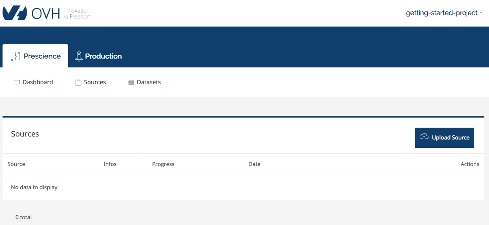

There won’t be any source datasets uploaded onto your project, but we will add one now.

## Upload a dataset

In this guide, we will use a dataset that is publicly available to download from the [Machine Learning Repository](https://archive.ics.uci.edu/ml/datasets/Adult) website, available [here](https://archive.ics.uci.edu/ml/machine-learning-databases/adult/adult.data). This tabular dataset is saved in .csv format. It gathers data concerning the wage brackets of around 30,000 American individuals, depending on criteria such as their age, social category, gender, etc. The aim is then to predict an unknown individual’s salary using these criteria.

To upload a new source, simply click on the `Upload Source`{.action} button, then fill in the fields requested.

* By clicking on the ‘Upload files’ button, you can select the files you want to upload.
* With the ‘Upload folder’ button, you can upload a full folder of source files.
* You can use the ‘Source’ field to give a unique name adn identifier to your source file.
* With the ‘Type’ field, you can select the format for the files you want to upload (.csv or parquet).
* If you choose .csv, another field will ask you to confirm whether or not the file contains any headers. In our case, the ‘adult.data’ file we have uploaded does not contain any headers.

Fill in the form as follows, then click `Upload`{.action} to start uploading the file.

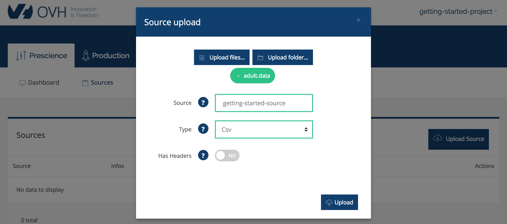

## Build a source associated with the dataset

When you first upload a source file, a *Parse* task is triggered automatically and will begin to run. The purpose of this task is to build our source object by performing a pre-analysis of the data received.

A progress bar will appear for the task. It will be blue while the task is running.

The source object building is complete when the progress bar reaches 100%. The ‘Parsed’ status shows that the source object build has been successful.

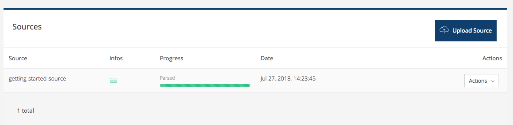

## Build a dataset associated with a source

In Prescience, a dataset is a source for which the data has been transformed, so that it can be interpreted by any automated machine learning algorithm.

The Prescience tasks responsible for building datasets are pre-processing tasks.

You can create multiple datasets from a single source. The singularity of datasets created will depend on the transformation methods you have chosen.

For the moment, we will just create a basic dataset. The transformation rules used during the preprocessing task will be automatically removed.

To launch a dataset build, simply expand the ‘Action’ dropdown menu linked to the source you have chosen, then select ‘Preprocess’.

A form will appear, prompting you to enter the following information:

* **Dataset.** A unique name you would like to give to your dataset.
* **Label.** The column for your dataset to select as a label for the learning. In our case, the label to predict concerns the wage bracket for the individual in the last column (14) of our data table.
* **Problem type.** The type of learning to carry out (i.e. classification or regression).

Fill in the form as follows, then continue by clicking `Start`{.action}.

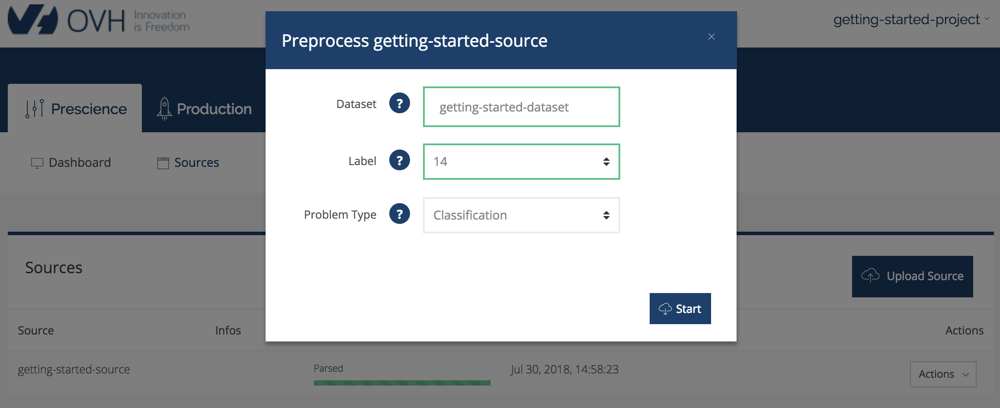

You can access the list of datasets created or in the process of being built at any time, via the ‘Dataset’ tab.

A progress bar will show the task’s progress, the same way as it would for source building.

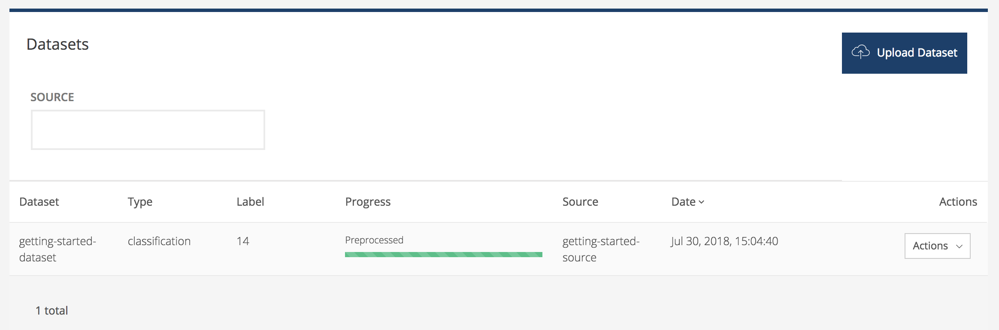

## Launch an optimisation

Once the dataset has been built, Prescience is ready to start the optimisation.

The optimisation phase involves finding the algorithm, as well as the hyperparameters associated with it, which you can use to generate the best prediction model on our dataset.

To do this, the system launches several different learning types, with various algorithms and hyperparameters on several sub-sets of our dataset (also called ‘k-folds’). The results of this training are then aggregated by the system in order to select the most relevant hyperparameters to test for future iterations.

This optimisation phase has an initial budget entered by the user. The phase will not stop until the budget has been used up.

**1 learning = 1 budget unit**

In order to launch an optimisation on our dataset, we first need to request for the details to be displayed. Click on the ‘Actions’ dropdown menu, then ‘See details’.

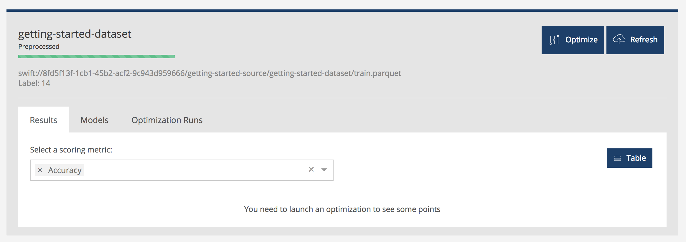

You can then launch an optimisation via the `Optimize`{.action} button. This action will prompt you to enter the following information:

* **Budget.** The budget to use for the task.
* **Scoring Metric.** The optimisation value that the algorithm will use in order to evaluate the performance of its results. The possible values are known indicators like accuracy, the F1 score or the ROC AUC.
* **K-Fold.** The number of sub-sets of the initial dataset to use.
* **Optimization Method.** The optimisation method to use.

Choose the budget you want, and leave all of the other parameters as default. Then start the optimisation.

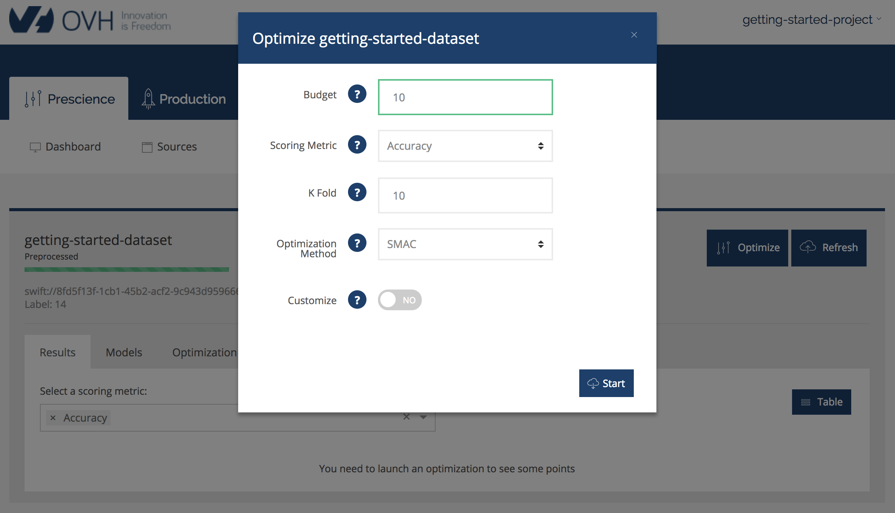

You can then track its progress in the 'Run Optimizations' tab.

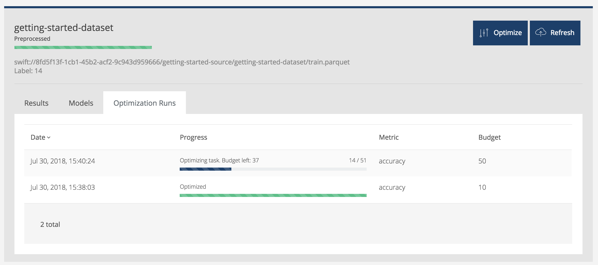

At the same time, you can view the results curve in real-time via the ‘Results’ tab. Each point in the curve corresponds to the result of a specific learning.

If you want, you can adjust the indicators to display on the curve via the ‘Select a scoring metric’ dropdown menu.

This display is also available in the form of a table, via the `Table`{.action} button.

## Train and deploy a model

The green box above the results curve will constantly display the best result received. 

By clicking on a point in the curve, a blue box will appear, which you can use to get more information on the results of the associated optimisation.

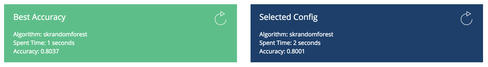

On each of the boxes, a ‘Train’ button will appear. You can use this button to launch a training on the associated configuration, then deploy the trained model so that it is in production. Unlike optimisation, this training will be carried out on the full dataset, and not on one of the sub-sets.

The only information you need to give Prescience during a ‘Train’ request is the identifier, which you can use to name the model generated.

Fill in the form with the following information, then click `Start`{.action}.

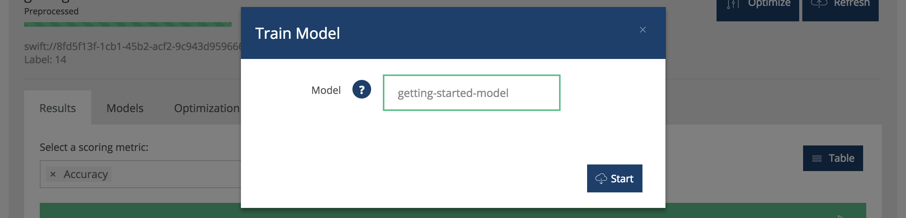

You will then be automatically redirected to the ‘Production > Models’ tab, where all of the models you have deployed will be listed.

Once the model deployment task is complete, you can query it to get predictions either directly via the ‘Query’ tab, or by using the Prescience web API. To see examples of web API requests, simply go to the ‘Production’ tab.

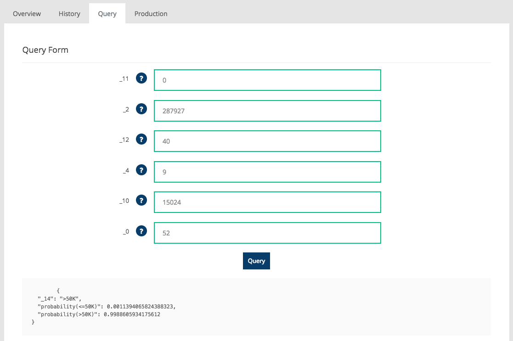

## Indicators associated with the model

If you look carefully at the ‘Dashboard’ tab that lists the tasks run by Prescience, you will see that each ‘Train’ task is automatically linked to a ‘Model-Metrics’ task.

This ‘Model-Metrics’ task corresponds to the computing stage of the indicators associated with the new model deployed in production.

Once they have been calculated, these indicators will be visible in your model’s preview, in the ‘Overview’ tab.

## Go further

Join our community of users on <https://community.ovh.com/en/>.