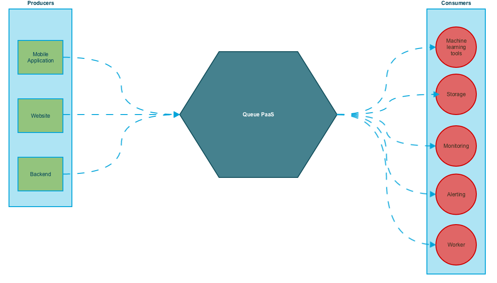
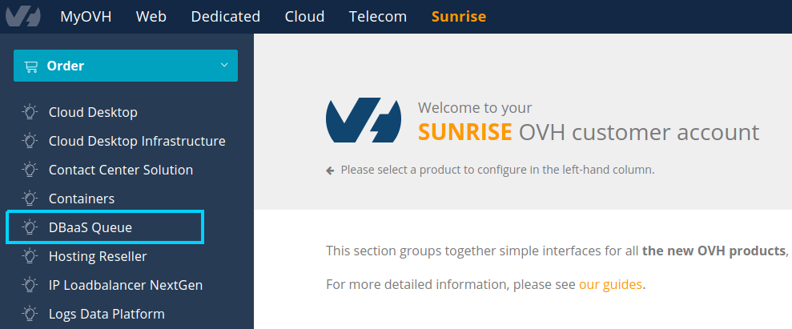
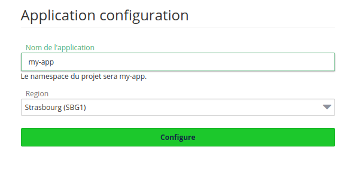
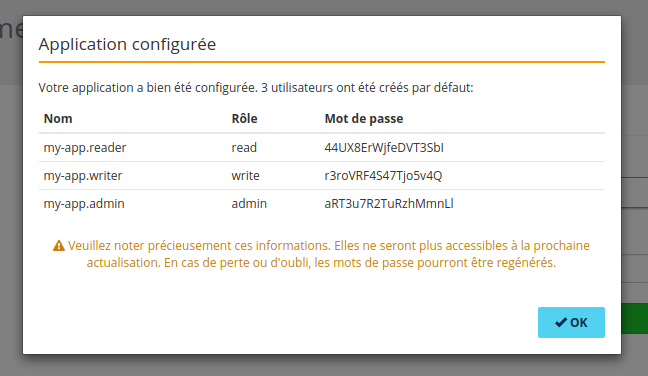
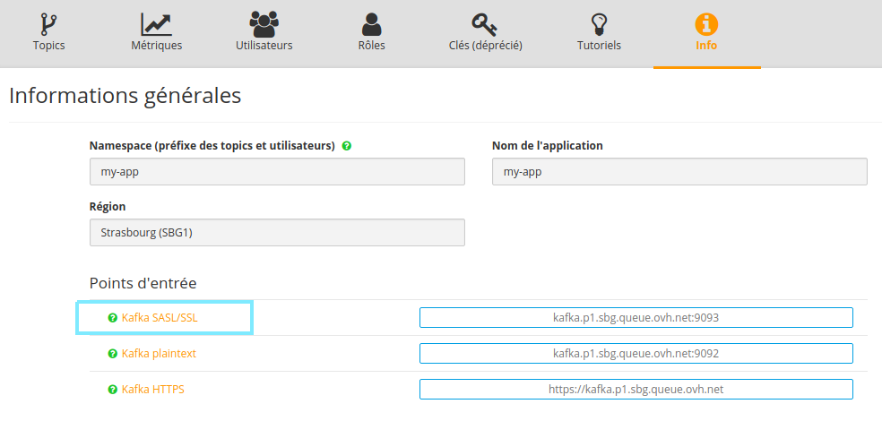

# OVH Queue and Kafka 101

Welcome to the getting started guide of the OVH Queue. This guide will help you to understand the core concepts behind the OVH Queue and how to produce your first message to the platform and consume it.

## What is the OVH Queue ?

It provides you a shared queuing system based on [Apache Kafka](http://kafka.apache.org/).

It powers fast, scalable and global low-latency messaging allowing you to connect anything to everything.

It is a solution to send and receive messages between independent applications, to decouple systems and components or to connect, build, and scale realtime applications.

## What is Kafka ?

Kafka is a high-throughput, distributed, publish-subscribe messaging system.
It allows you to connect producers and consumers through topics with fault tolerance as well as journalized events.
All messages are persisted on disk and replicated within the cluster to prevent data loss.

## What is a producer and a consumer ?



Kafka maintains feeds of messages in topics. Producers write data to topics and consumers read from topics. Since Kafka is a distributed system, topics are partitioned and replicated across multiple nodes.
Each message in a partition is assigned a unique offset. A consumer can save its offset position to remember the messages read.

# Getting started

## Joining the lab

Before starting to use the [Queue lab](https://www.runabove.com/dbaas-queue.xml) you need to make sure that you have an OVH.com account.

Go to [ovh.com](https://www.ovh.com/manager/web/login/) and select "Create Account".

## Create an application

The first step to use OVH Queue is to create an application.

1. Go to the [Queue lab page](https://www.runabove.com/dbaas-queue.xml) and click on the **Start Now** button. Note that you can also order a new application in the Sunrise Manager section of the OVH Manager.

2. Follow the order steps. You will receive an email as soon as your application is ready.

3. Go to the [OVH Manager Sunrise](https://www.ovh.com/manager/sunrise/index.html) and spot the DBaaS Queue section.

    

4. In the Sunrise manager, a new 'Not configured app' is available under the Queue DBaaS section.

    

5. Select the application. Choose its name, select a region and save it. Pay attention to the name you choose since it will be used as a namespace prefix for all your topics and users (eg. `my-app.my-topic`).

    

6. Once your application is configured, 3 users are automatically created along with their generated password. Each user is assigned a specific role: `read` for read access on all topics, `write` for write access on all topics, and `admin` for read access, write access and topic auto-creation.

    

7. You can retrieve the **Kafka SASL/SSL URL** on the **Info** tab of the Sunrise Manager.

    

## Produce and consume

**Important**: to be authenticated to the OVH Queue, you must:

- Set the proper username (eg. `my-app.admin`) and password in the `SASL` configuration of your Kafka client.
- Produce and consume on topics that your user can access, which are correctly prefixed by your namespace (eg. `my-app.my-topic`).
- Use any consumer group name that is prefixed by your username (eg `my-app.admin.my-consumer-group`).

## Produce

1. Download the [golang queue example](https://github.com/runabove/queue-examples/releases).

2. Start a consumer

    ```
    ./kafka-client-$(uname -s)-amd64 consume --brokers $HOST:9093 --username $SASL_USERNAME --password $SASL_PASSWORD --topic $TOPIC --consumer-group $CONSUMER_GROUP
    ```

    Example with the application created above:

    ```
    ./kafka-client-Linux-amd64 consume --brokers kafka.p1.sbg.queue.ovh.net:9093 --username my-app.admin --password aRT3u7R2TuRzhMmnLl --topic my-app.my-topic --consumer-group my-app.admin.my-consumer-group
    ```


3. Start a producer and write something to stdin to produce one message (the topic is automatically created).

    ```
    ./kafka-client-$(uname -s)-amd64 produce --brokers $HOST:9093 --username $SASL_USERNAME --password $SASL_PASSWORD --topic $TOPIC
    ```
    
    Then write to STDIN to send a message
    Example with the application created above:

    ```
    ./kafka-client-Linux-amd64 produce --brokers kafka.p1.sbg.queue.ovh.net:9093 --username my-app.admin --password aRT3u7R2TuRzhMmnLl --topic my-app.my-topic
    ```

# Supported Languages

The OVH Queue supports any [Kafka standard client](https://cwiki.apache.org/confluence/display/KAFKA/Clients).

In the [queue examples repository](https://github.com/runabove/queue-examples), you can find examples for:

  - [Golang](https://github.com/runabove/queue-examples/tree/master/go)
  - [NodeJS](https://github.com/runabove/queue-examples/tree/master/nodejs)
  - [Python](https://github.com/runabove/queue-examples/tree/master/python)
  - [Java](https://github.com/runabove/queue-examples/tree/master/java)

# Going further

- [Kafka documentation](http://kafka.apache.org/documentation.html#introduction)
- [User and roles](https://community.runabove.com/kb/en/queue/kafka-sasl-ssl.html)
- [Topic management](https://community.runabove.com/kb/en/queue/kafka-topics-management.html)
- [Kafka over HTTPS](https://community.runabove.com/kb/en/queue/dbaas-queue-https.html)
- [Metrics](https://community.runabove.com/kb/en/queue/kafka-metrics-grafana.html)
