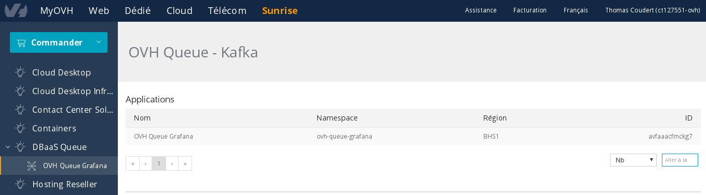
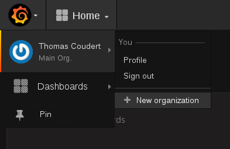
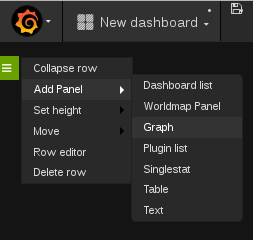
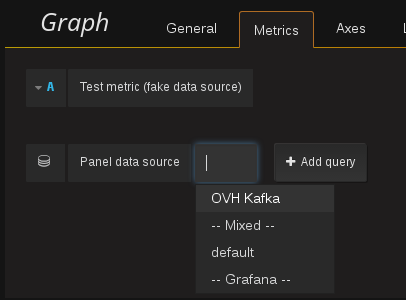
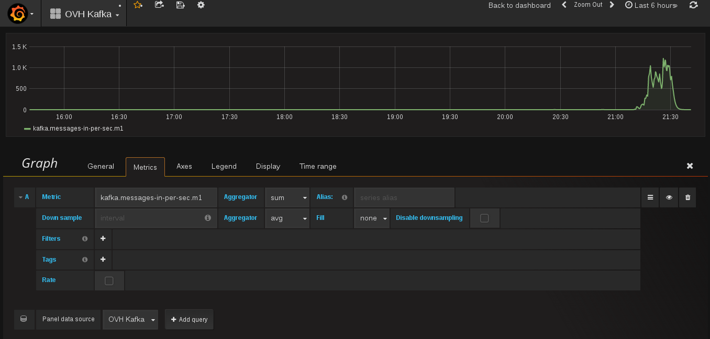
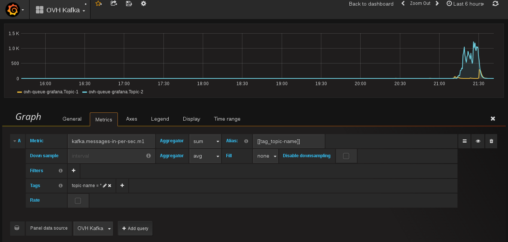

## Introduction

This tutorial assumes you already have an OVH account, have subscribed to [OVH Kafka](https://www.runabove.com/dbaas-queue.xml) and have created an OVH Kafka application.

If you don't, have a look at our [Getting Started](https://community.runabove.com/kb/en/queue/getting-started-with-queue-as-a-service.html) guide that will also introduce you to Kafka.

This guide will help you to understand step by step how to display your Kafka applications metrics using [Grafana](https://grafana.metrics.ovh.net) and the [Metrics Data Platform](https://www.ovh.com/fr/data-platforms/metrics/).

## Preparation
### Get your application credentials to use the Metrics API
You can find it in your [OVH manager](https://www.ovh.com/manager/sunrise/dbaasQueue/index.html#/dbaasQueue). When you click on the "Queue" menu, you can see your applications list:

Click on the application that you want to monitor, you will be by default in the "Topics" tab, click on the "Info" tab and you will see at the bottom of the page your Metrics credentials as below :

## Grafana configuration
Open [OVH Grafana](https://grafana.metrics.ovh.net) and log in with your OVH account.
To configure a new datasource, you first need to create your own organization.

### Create your own organization

Once you're logged in, go in the top left hand corner menu (with the Grafana logo), and click on your name, then a submenu is opened, click on "+ New Organization":

Fill the organization name that you want and create it.

### Configure a datasource

Now go back in the menu, you should see now an item called "Data Sources".

Click on it.
Then click on the "Add data source" button to configure one as below:

HTTP Settings:

  - Name: This is up to you
  - Type: OpenTSDB
  - Url: https://opentsdb.gra1.metrics.ovh.net
  - Access: Proxy
  - Http Auth: Basic Auth: true
  - With Credentials: false
  - User: The first part of the token (before the semi-colon) that you got previously.
  - Password: The second part of the token (after the semi-colon).

OpenTSDB Settings:

  - Version: ==2.2
  - Resolution: second

Then add it.

### Create a dashboard

Go back once again in the menu, go in "Dashboards" and click on "New".
You should have a blank page. On the left under the menu, you should see a green menu.

### Display Metrics on a Graph

Open it and click on "Add Panel" -> "Graph".

#### Graph general configuration

Let's fill the "Metrics" tab, which is the most important. Firstly in "Panel data source", select the datasource that you just created:

Then fill the fields:

  - Available metrics: 
  	- kafka.messages-in-per-sec.m1 
  	- kafka.bytes-in-per-sec.m1
   	- kafka.bytes-out-per-sec.m1 depending 
   	- consumer.lag
  - Aggregator: You can choose the aggregator that you want, knowing that by default it will be used to aggregate your differents topics.

 At this step you should see a graph aggregating all your topics:

Optional: If you prefer to see a different graph for each topic, you can set the alias and tag as below:

 - Alias: [[tag_topic-name]]
 - Tags (Add a new one): key=topic-name, value=*
The star allows to see metrics per topic. You can choose to display just one replacing the star by the name of the topic wished.

Now you should see each topic separated from the others:

You can now personalize your graph as you wish using the others configuration tabs.

#### Graph further configuration

 - "General" tab: Change the title of your graph
 - "Axes" tab: Modify the axes units, scale, range
 - "Legends" tab: Modify the legend format
 - "Display" tab: Change the graph appearance
 - "Time Range": Modify the X range, you can for exemple choose to only see the last hour, or the last 24 hours of data. Moreover you can shift the period displayed

Happy graphing!

## Go further

- [Queue](https://www.runabove.com/dbaas-queue.xml)
- [Grafana Documentation](http://docs.grafana.org/)
- [Keep in touch with us!](mailto:dbaas.queue-subscribe@ml.ovh.net)
