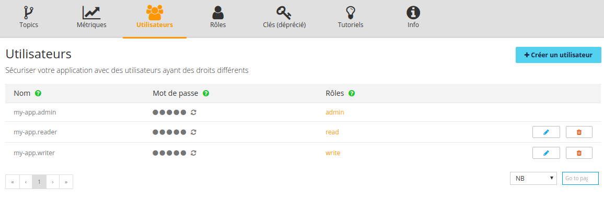
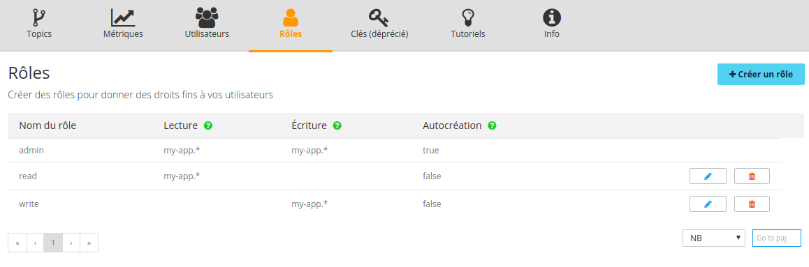

This tutorial assumes you already have an OVH account, have subscribed to [OVH Kafka](https://www.runabove.com/dbaas-queue.xml) and have created an OVH Kafka application.

If you do not have an OVH account, you may create one [here](https://www.ovh.com/fr/support/new_nic.xml).

This guide will help you to understand how to create users and roles to restrict topics access and how to configure SSL in your client.

OVH Kafka has been upgraded to use the latest Kafka version 0.10.0.1 that brings SASL (authentication) and SSL (encryption).

[SASL](https://fr.wikipedia.org/wiki/Simple_Authentication_and_Security_Layer) for Kafka means authentication of connections to brokers from clients and authorization of read/write operations by clients.

### Naming conventions

Like your topics all your users and consumer groups must be prefixed with your namespace.

- topics: `<namespace>.<topicname>` (ex: myapp42.mytopic)
- users: `<namespace>.<user>` (ex: myapp42.myuser)
- consumer groups: `<namespace>.<user>.<consumergroup>` (ex: myapp42.myuser.mygroup)

## Users and roles

For each OVH Kafka application, you can create as many users and roles as you want to give rights to READ and/or to WRITE on one or more topics.

  - A user has a name and one or more roles.
  - A role has a name and one or more topics ACL for read and write.
  - The star ('*') to match several topics is supported in topics ACL.
  - A role has one ACL to authorize the topics auto-creation.

### Default users and roles

For all newly created apps, some users and roles are automatically created:

  - User `<namespace>.reader` with read-only access on all topics
  - User `<namespace>.writer` with write-only access on all topics
  - User `<namespace>.admin` with read, write, and auto-create access on all topics

### Create a role

Here we first create a role named `myrole` to allow:

  - READ on all topics (`<namespace>.*`)
  - WRITE on the `<namespace>.events` and `<namespace>.logs` topics
  - the ability to create new topics automatically on production and consumption

```
POST /dbaas/queue/<appID>/role -d '{
  "name": "myrole",
  "readAcl": ["<namespace>.*"],
  "writeAcl": ["<namespace>.events","<namespace>.logs"],
  "autoCreateAcl": true
}'
```

Response:

```
{
  "name": "myrole",
  "readAcl": ["<namespace>.*"],
  "writeAcl": ["<namespace>.events","<namespace>.logs"],
  "autoCreateAcl": true
}
```

### Create a user

Then a user `<namespace>.bob` is created with the `myrole` role:

```
POST /dbaas/queue/<appID>/user -d '{
  "name": "<namespace>.bob",
  "roles": ["myrole"]
}'
```

Response:

```
{
  "id": "zziotuocuoc2a",
  "name": "<namespace>.bob",
  "password": "tgRkrRlolUK2Ov4RN5F",
  "roles": ["myrole"]
}
```

Each user has an auto generated password, that you can regenerate using the API.

### Consumer groups

There is no particular ACL on consumer groups, however you must use a consumer group name that is prefixed by your user name.

Example: if your user is `myApp.Toto`, you can use `myApp.Toto.GroupA` as consumer group name.

Exception: any user who is assigned the default "admin" role can access all your users consumer groups.

### Sunrise Manager

Users and roles are now available in the [Sunrise Manager](https://www.ovh.com/manager/sunrise/dbaasQueue/index.html#/dbaasQueue):




## SSL

You need to configure your Kafka client to use TLS. In most clients it is enough to enable a boolean.

## Code examples

Here are examples to configure your Kafka client to use SASL and SSL:

- [github.com/runabove/queue-examples](https://github.com/runabove/queue-examples)

## Go further with OVH Kafka

- [Create an OVH Kafka application](https://www.runabove.com/dbaas-queue.xml)
- [Keep in touch with us!](mailto:dbaas.queue-subscribe@ml.ovh.net)
