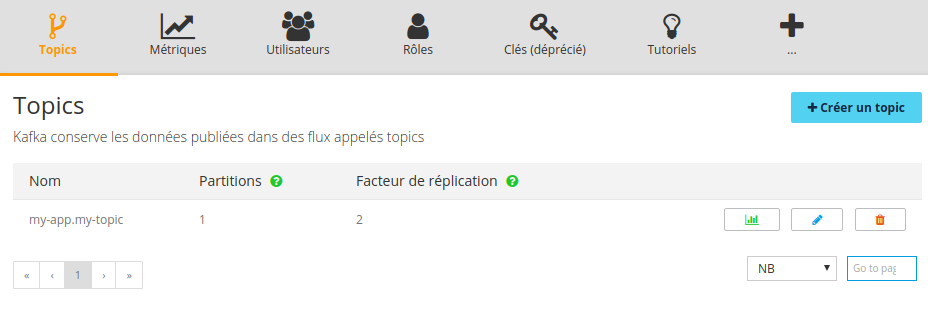

This tutorial assumes you already have an OVH account and have subscribed to the [Queue](https://www.runabove.com/dbaas-queue.xml).
This guide will help you to understand how to manage your Kafka topics using the [OVH API](https://api.ovh.com/).

### What is a Kafka topic?

A topic is what Kafka uses to maintain feeds of messages. Producers write data to topics and consumers read from topics. Since Kafka is a distributed system, topics are partitioned and replicated across multiple nodes.

### More Partitions Lead to Higher Throughput

A topic partition is the unit of parallelism in Kafka. Throughput of a topic essentially depends on the number of partition it has.

Messages are ordered within a partition but not across all partitions of a topic.

It is possible to attach a key to each message, in which case the producer guarantees that all messages with the same key will arrive to the same partition. When consuming from a topic, it is possible to configure a consumer group with multiple consumers. With more partitions it's possible to have more consumers in a consumer group.

### Data redundancy with replicas

Replicas are copies of the partitions. Their only purpose is data redundancy. There is a maximum replication factor depending on the region of your application. Increasing replication factor will decrease the throughput of the topic.

## Topic operations

All operations on topics are available through the [Sunrise Manager](https://www.ovh.com/manager/sunrise/dbaasQueue/index.html), or by using the [OVH API](https://api.ovh.com/).



### Create a topic

To create a topic you need to provide 3 arguments:

  - a topic ID : the name of the topic prefixed with your human application ID
  - the number of partitions
  - the replication factor

```shell
POST /dbaas/queue/<appID>/topic -d '{
  "ID": "qaas.events",
  "partitions": 3,
  "replicationFactor": 2
}'
```

Response:

```shell
{
  "ID": "qaas.events",
  "partitions": 3,
  "replicationFactor": 2
}
```

This operation may take a few seconds.


### Update a topic

Only the number of partitions can be increased.

```shell
PUT /dbaas/queue/<appID>/topic/qaas.events -d '{
  "partitions": 4,
}'
```

This operation may take a few seconds.

### Delete a topic

A topic can be deleted:

```
DELETE /dbaas/queue/<appID>/topic/qaas.events
```

This operation may take a few seconds.

### List your topics

All topics can be listed:

```
GET /dbaas/queue/<appID>/topic
```

Response:

```
[
  "qaas.events",
  "qaas.logs",
  "qaas.metrics",
  "qaas.realtime",
  "qaas.test"
]
```

### Get a topic

A topic with its detail can be retrieved:

```
GET /dbaas/queue/<appID>/topic/qaas.events
```

Response:

```
{
  id: "qaas.events",
  partitions: 4,
  replicationFactor: 2
}
```

## Go further with OVH Queue

- [Queue](https://www.runabove.com/dbaas-queue.xml)
- [Keep in touch with us!](mailto:dbaas.queue-subscribe@ml.ovh.net)