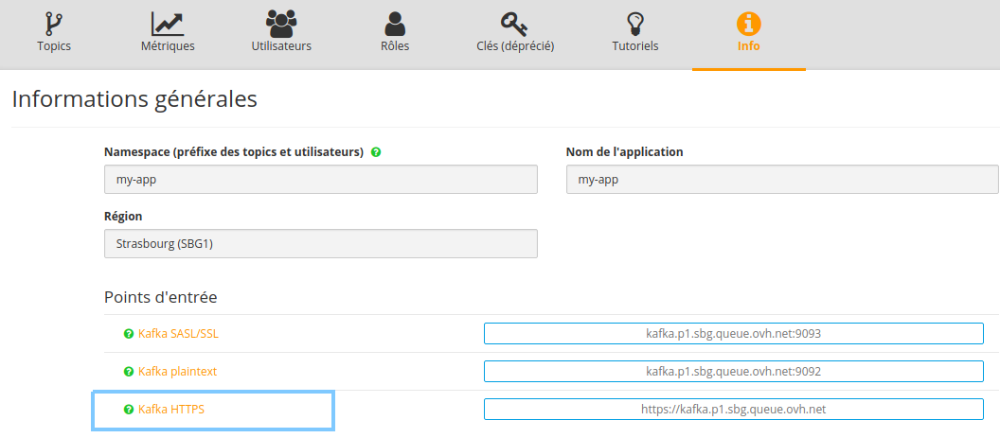

This tutorial assumes you already have an OVH account and have subscribed to the [Queue](https://www.runabove.com/dbaas-queue.xml).
If not, have a look at our [Getting Started](https://community.runabove.com/kb/en/queue/getting-started-with-queue-as-a-service.html) guide that will also introduce you to Kafka

## Why HTTP(S)?

Kafka protocol is built over TCP for multiple reasons, including performance and message ordering.
However we realized that for some use cases, Kafka clients usage can be quite complex since many parameters have to be taken into consideration:

- Number of partitions and partition leaders
- Offset commit
- Consumer groups

According to your programming language of choice, Kafka clients can be more or less efficient and easy to use.
Sometimes what you need is a simpler queue platform that you can use with any programming language. HTTP is the de-facto standard for that usage.

Queue platform implements a simple HTTP layer that allows you to:

- Produce one or many messages to your topic with a POST request
- Consume one or many messages from your topic with a GET request

Moreover, it comes with HTTPS support, for free.

## Usage

### Pre-requisite: Know your region

According to how you created your Queue DBaaS app, you chose one of the available region, which can be retrieved
on your [Sunrise Manager](https://www.ovh.com/manager/sunrise/dbaasQueue/index.html#/dbaasQueue). Here we are interested
in the HTTPS URL.



Example:

```
https://kafka.p1.sbg.queue.ovh.net
```

### Authentication

As with traditionnal Queue usage with Kafka Clients, you will have to use:

- an SASL username (eg. `SASL_USERNAME=my-app.admin`)
- an SASL password (eg. `SASL_PASSWORD=aRT3u7R2TuRzhMmnLl`)
- a topic that your user is authorized to access (eg. `TOPIC=my-app.my-topic`)

See our [Getting Started](https://community.runabove.com/kb/en/queue/getting-started-with-queue-as-a-service.html)
and [SASL](https://community.runabove.com/kb/en/queue/kafka-sasl-ssl.html) guides for more information.

User authentication is made with a standard HTTP basic auth in which you must provide your SASL username and password:

```
$SASL_USERNAME:$SASL_PASSWORD
```

### POST messages

You can post one or multiple messages, using _curl_ or HTTP clients in any language:

```
curl -u $SASL_USERNAME:$SASL_PASSWORD
  -XPOST https://kafka.p1.sbg.queue.ovh.net/topic/$TOPIC
  -d '[{"Value": "first message"},
       {"Value":"second message"}]'
```

Please note in the example above that your message payload must be a JSON array of objects containing your message as a string in the "Value" field.

If this data model does not suit you, you can also post a message in raw format (accepts JSON, string, arrays, bytes...):

```
curl -u $SASL_USERNAME:$SASL_PASSWORD
  -XPOST https://kafka.p1.sbg.queue.ovh.net/topic/$TOPIC?format=raw
  -d '{"my": {"complex": ["json", "here"]}}'
```

### GET messages

You can retrieve one or multiple messages, using _curl_ or HTTP clients in any language:

```
curl -u $SASL_USERNAME:$SASL_PASSWORD
  https://kafka.p1.sbg.queue.ovh.net/topic/$TOPIC[?limit=2]
```

The optional _limit_ parameter allows you to specify how many messages you want to retrieve.

### Offset management

Offsets are managed automatically at each GET request. It means that each message will be read only once. We plan to support manual offset and consumer group specification later on.

### Message type

As seen in the examples above, messages are sent through a JSON object, and must be strings. This does not prevent you from using other data types, by encoding your binary data as base64 for example. 

## Performance concerns

Despite the ease-of-use, using HTTPS instead of TCP implies a performance hit.
To put it simple: if you need a very high read/write throughput, use a normal TCP-based Kafka Client.

As an example, here are numbers on producing and consuming "hello world" messages:

- via a TCP Kafka Client: 200k+ messages per second
- via the HTTPS endpoint: 5-10k messages per second

Note that the number of messages you send or receive with a single HTTP request has an impact on performance: don't hesitate to batch messages together. 


## Contact and feedbacks

Please feel free to contact us for any question, feedback, or improvement that may come to your mind !

- [Queue](https://www.runabove.com/dbaas-queue.xml)
- [Mailing list](mailto:dbaas.queue-subscribe@ml.ovh.net)