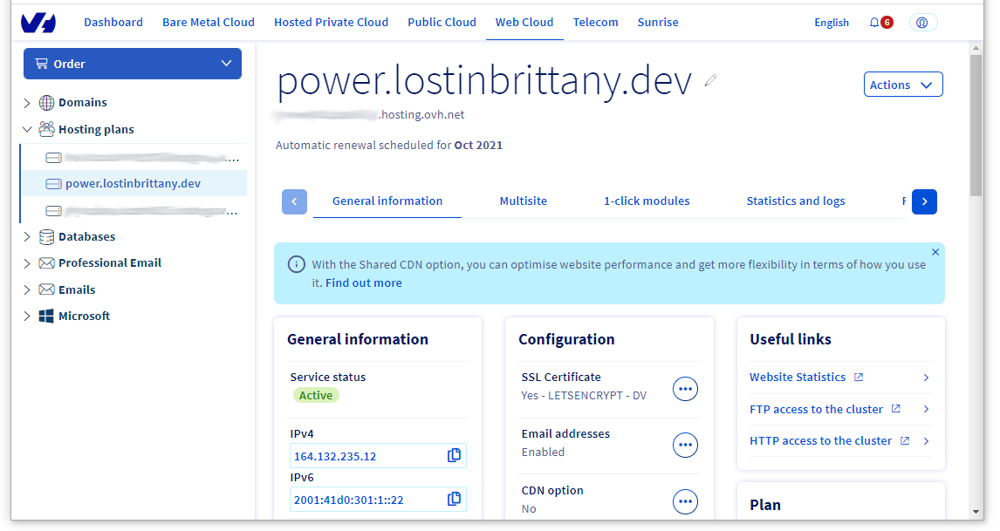
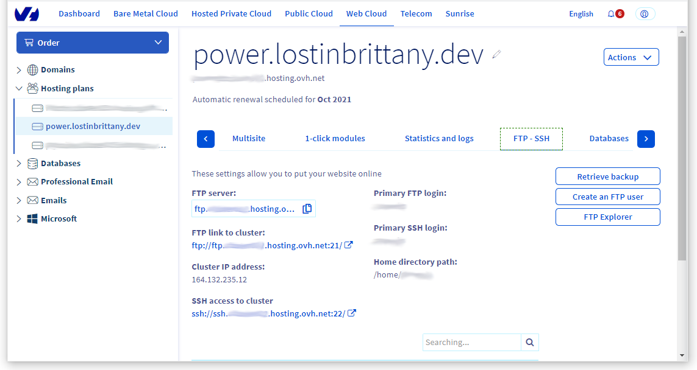
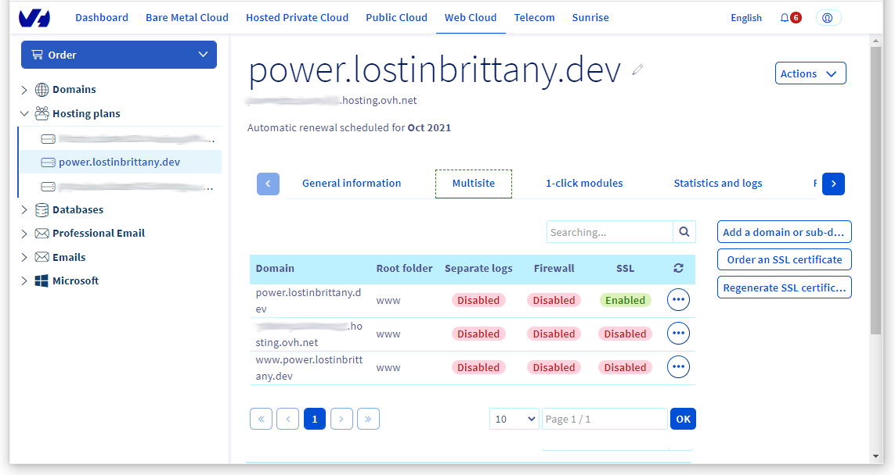
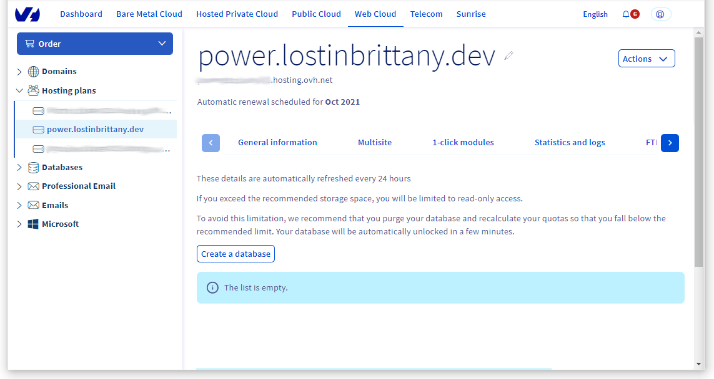
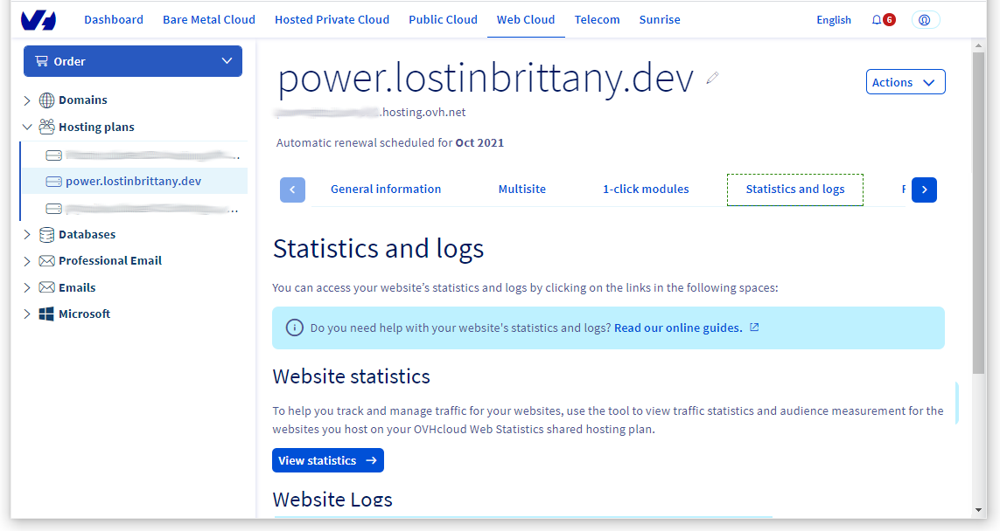
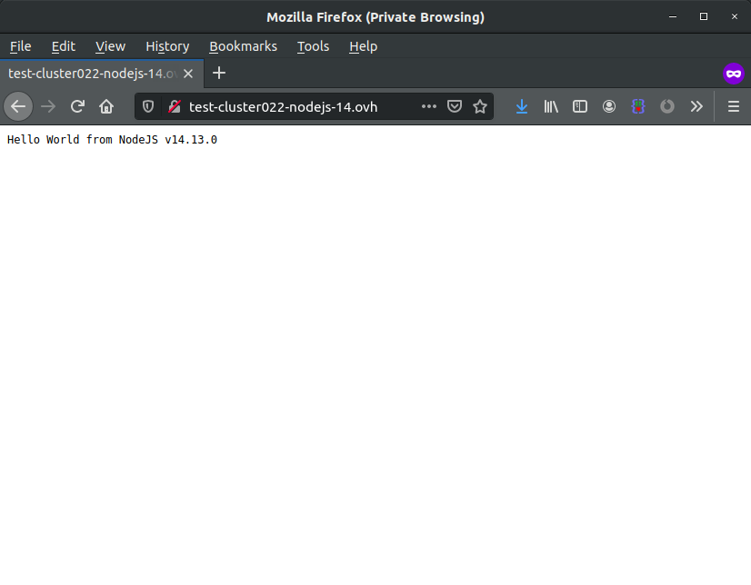
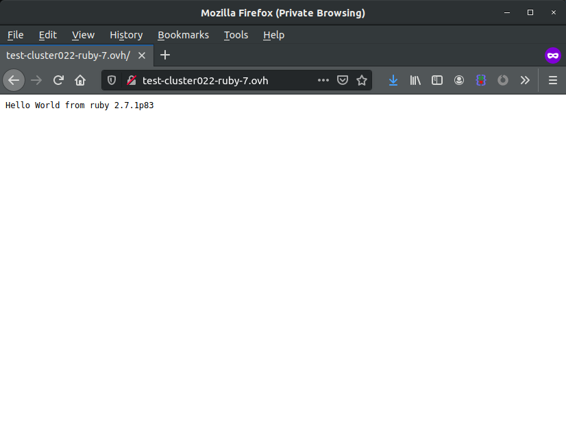

**Dernière mise à jour le 21/01/2021**

## Objectif

Vous avez souscrit à un hébergement web POWER pour bénéficier des langages **Node.js**, **Python** ou **Ruby** et souhaitez commencer à développer votre projet. 
Retrouvez ici les principales informations relatives à la gestion de votre hébergement POWER via l'espace client OVHcloud ou via les API. 

**Découvrez comment débuter sur un hébergement web POWER.**

## Prérequis 

- Disposer d'une des 3 offres d'hébergement web POWER : [Node.js](https://labs.ovh.com/managed-nodejs), [Python](https://labs.ovh.com/managed-python) ou [Ruby](https://labs.ovh.com/managed-ruby).
- Être connecté à votre [espace client OVHcloud](https://www.ovh.com/auth/?action=gotomanager&from=https://www.ovh.com/fr/&ovhSubsidiary=fr){.external} ou aux [API OVHcloud](https://api.ovh.com/).

## En pratique

### Depuis l'espace client

L'interface de gestion de votre offre d'hébergement web POWER se trouve dans la section `Web Cloud`{.action}, puis `Hébergements`{.action} dans la colonne de gauche. 

{.thumbnail}

#### Accès FTP - SSH <a name="ssh"></a>

Lors de l'activation de votre offre d'hébergement web POWER, un e-mail vous est transmis avec les informations de connexion FTP et SSH. Vous pouvez également gérer ces accès depuis l'onglet `FTP - SSH`{.action}.

{.thumbnail}

Vous trouverez des informations complémentaires dans notre guide « [Se connecter à l’espace de stockage de son hébergement web](../../hosting/connexion-espace-stockage-ftp-hebergement-web/) ».

#### Ajouter un nom de domaine

Par défaut, votre hébergement web POWER est attaché à une URL automatiquement attribuée. Vous pouvez néanmoins utiliser votre propre [nom de domaine](https://www.ovh.com/fr/domaines/), en l'ajoutant depuis l'onglet `Multisite`{.action}.

{.thumbnail}

Pour plus de détails sur la déclaration d'un nom de domaine sur votre hébergement web, consulter notre guide « [Partager son hébergement entre plusieurs sites](../../hosting/multisites-configurer-un-multisite-sur-mon-hebergement-web/#etape-1-acceder-a-la-gestion-multisite) ».

#### Utiliser une base de données

Des bases de données sont incluses avec votre offre d'hébergement web POWER. Elles sont accessibles depuis l'onglet `Bases de données`{.action}.

{.thumbnail}

Si vous souhaitez davantage de détails sur la création d'une base de données sur votre hébergement POWER, consultez notre documentation « [Créer une base de données sur son hébergement web](../../hosting/creer-base-de-donnees/) ».

#### Consultation des logs et statisques

Retrouvez l'ensemble des logs et statistiques de votre hébergement et de vos sites dans l'onglet `Statistiques et logs`{.action}.

{.thumbnail}

Prenez connaissance du guide « [Consulter les statistiques et les logs de mon site hébergé sur une offre mutualisée](../../hosting/mutualise-consulter-les-statistiques-et-les-logs-de-mon-site/#consulter-les-statistiques-et-les-logs) » pour plus d'informations à ce sujet.

### Node.js

#### Créer une page Hello world

Supposons que vous avez la configuration normale pour un hébergement web POWER Node.js :

- Moteur : nodejs 14
- Point d'entrée : index.js
- Dossier racine : www


> [!primary]
>
> Vous pouvez appeler l'API OVHcloud pour [visualiser la configuration active](#api-get-active-configuration)


[Accédez via SSH](#ssh) à votre hébergement web POWER.

Allez dans le répertoire `www` et créez un fichier `index.js`:

```javascript
const http = require('http');
const port = 3000;
const msg = `Hello World from NodeJS ${process.version}\n`;
const server = http.createServer((req, res) => {
res.statusCode = 200;
res.setHeader('Content-Type', 'text/plain');
res.end(msg);
});
server.listen(port);
```

Procédez à un [redémarrage de votre instance](#restart), votre *Hello World* sera alors en ligne.

{.thumbnail}

### Python

#### Créer une page Hello world 

Supposons que vous avez la configuration normale pour un hébergement web POWER Python :

- Moteur : Pyhton 3.7
- Point d'entrée : app.py
- Dossier racine : www


> [!primary]
>
> Vous pouvez appeler l'API OVHcloud pour [visualiser la configuration active](#api-get-active-configuration)


[Accédez via SSH](#ssh) à votre hébergement web POWER.

Allez dans le répertoire `www` et créez un fichier `app.py`:

```python
import sys
 
def application(environ, start_response):
    status = '200 OK'
    output = '\n'.join(['Hello World!', f"Version : {sys.version}",
                        f"Executable : {sys.executable}"])
 
    response_headers = [('Content-type', 'text/plain'),
                        ('Content-Length', str(len(output)))]
    start_response(status, response_headers)
 
    return [output]    
```

Pour appliquer ces modifications, pensez à [redémarrer votre instance](#restart). Votre *Hello World* sera alors en ligne.

{.thumbnail}

### Ruby

#### Créer un page Hello world

Supposons que vous avez la configuration normale pour un hébergement web POWER Ruby :

- Moteur : Ruby 2.6
- Point d'entrée : config.ru
- Dossier racine : www


> [!primary]
>
> Vous pouvez appeler l'API OVHcloud pour [visualiser la configuration active](#api-get-active-configuration)


[Accédez via SSH](#ssh) à votre hébergement web POWER.

Allez dans le répertoire `www` et créez un fichier `config.ru`:

```ruby
require 'socket'
require 'timeout'
 
class Application
 
    def call(env)
        msg = "Hello World from ruby #{ RUBY_VERSION }p#{ RUBY_PATCHLEVEL }"
        [200, { "Content-Type" => "text/plain" }, [msg]]
    end
end
 
run Application.new
```

Pour appliquer ces modifications, pensez à [redémarrer votre instance](#restart). Votre *Hello World* sera alors en ligne.

{.thumbnail}

### Depuis les API

Si vous n'êtes pas déjà familiarisé avec le fonctionnement des API OVHcloud, consultez le guide « [Premiers pas avec les API OVHcloud](../../api/first-steps-with-ovh-api/) ».

Les [API OVHcloud](https://api.ovh.com/) actuellement disponibles pour l'offre d'hébergement POWER sont les suivantes :

#### Lister les configurations disponibles

> [!api]
>
> @api {GET} /hosting/web/{serviceName}/availableConfigurations


#### Visualiser la configuration active <a name="api-get-active-configuration"></a>

> [!api]
>
> @api {GET} /hosting/web/{serviceName}/configuration

> Cet appel vous permet, par exemple, de vérifier votre point d'entrée.


#### Modifier la configuration

> [!api]
>
> @api {PUT} /hosting/web/{serviceName}/configuration

> Cet appel vous permet, par exemple, de modifier votre point d'entrée.


#### Redémarrer le service

> [!api]
>
> @api {POST} /hosting/web/{serviceName}/attachedDomain/{domain}/restart


### Créer une redirection HTTP vers HTTPS

Dossier racine : www

```sh
~ $ cd www
~/www $ vi .htaccess
RewriteCond %{ENV:HTTPS} !on
RewriteRule (.*) https://%{HTTP_HOST}%{REQUEST_URI} [L,R=301]
```

### Redémarrer votre instance <a name="restart"></a>

Après chaque modification structurante de votre application, il est conseillé de redémarrer votre instance pour visualiser les changements. Pour cela, il vous suffira de saisir la commande suivante :

```sh
~ $ cd www
~/www$ mkdir tmp
~/www$ touch tmp/restart.txt
```

> [!primary]
>
> L'application des modifications n'est pas immédiate, un délai d'environ 30 secondes peut s'avérer nécessaire.


## Aller plus loin

[Partager son hébergement entre plusieurs sites](../../hosting/multisites-configurer-un-multisite-sur-mon-hebergement-web/#etape-1-acceder-a-la-gestion-multisite)

[Consulter les statistiques et les logs de mon site hébergé sur une offre mutualisée](../../hosting/mutualise-consulter-les-statistiques-et-les-logs-de-mon-site/#consulter-les-statistiques-et-les-logs)

[Premiers pas avec les API OVHcloud](../../api/first-steps-with-ovh-api/)

[Créer une base de données sur son hébergement web](../../hosting/creer-base-de-donnees/).

Échangez avec notre communauté d'utilisateurs sur <https://community.ovh.com>.

**Pour discuter avec les autres utilisateurs du lab et avec l'équipe POWER Web Hosting, venez sur [notre room Gitter](https://gitter.im/ovh/power-web-hosting)**
