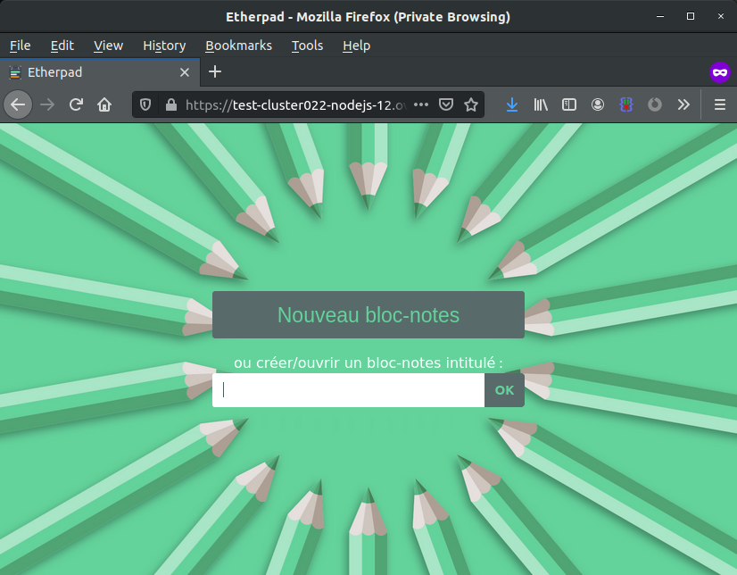

<style>
 pre {
     font-size: 14px;
 }
 pre.console {
   background-color: #300A24; 
   color: #ccc;
   font-family: monospace;
   padding: 5px;
   margin-bottom: 5px;
 }
 pre.console code {
   border: solid 0px transparent;
   font-family: monospace !important;
 }
 .small {
     font-size: 0.75em;
 }
</style>

**Dernière mise à jour le 03/02/2021**

## Objectif

Vous avez souscrit à un hébergement web POWER Node.js et vous souhaitez y installer un outil de production de texte collaboratif en ligne. [Etherpad](https://etherpad.org/){.external} est l'outil idéal.

**Découvrez comment installer Etherpad sur votre hébergement web POWER**

## Prérequis

- Disposer de l'offre d'hébergement web POWER [Node.js](https://labs.ovh.com/managed-nodejs).
- Être connecté à votre [espace client OVHcloud](https://www.ovh.com/auth/?action=gotomanager&from=https://www.ovh.com/fr/&ovhSubsidiary=fr){.external}.

Si vous n'êtes pas encore familier avec l'utilisation de votre hébergement web POWER, nous vous conseillons de consulter notre guide « [Premiers pas avec un hébergement web POWER](/pages/labs/web-power/getting-started) » avant de poursuivre la lecture de ce guide.

## En pratique

Supposons que vous avez la configuration normale pour un hébergement web POWER :

- Moteur : nodejs 14
- Point d'entrée : index.js
- Dossier racine : www

> [!primary]
>
> Vous pouvez appeler l'API OVHcloud pour [visualiser la configuration active](/pages/labs/web-power/getting-started#api-get-active-configuration).


[Accédez via SSH](/pages/labs/web-power/getting-started#ssh) à votre hébergement web POWER et récupérez les sources d'Etherpad dans le répertoire `www` :

```sh
cd www
git init
git remote add origin https://github.com/ether/etherpad-lite.git
git pull origin release/1.8.6
```

> [!alert]
>
> Etherpad 1.8.7 n'est pas compatible avec l'hébergement web POWER car [nous ne supportons  actuellement pas l'option "experimental-worker"](https://github.com/ether/etherpad-lite/wiki/Running-Etherpad-on-Phusion-Passenger#phusion-passenger-for-apache){.external}.

Installez les dépendances d'Etherpad et configurez le point d'entrée :

```sh
bash bin/installDeps.sh
ln -fs node_modules/ep_etherpad-lite/node/server.js index.js
```

[Redémarrez votre instance](/pages/labs/web-power/getting-started#restart), votre Etherpad sera alors en ligne.

{.thumbnail}

Sortie du terminal :

<pre class="console"><code>~ $ node -v
v14.15.4
~ $ rm -rf www
~ $ mkdir www
~ $ cd www
~/www $ git init
~/www $ git remote add origin https://github.com/ether/etherpad-lite.git
~/www $ git pull origin release
remote: Enumerating objects: 2, done.
remote: Counting objects: 100% (2/2), done.
remote: Compressing objects: 100% (2/2), done.
remote: Total 36100 (delta 1), reused 0 (delta 0), pack-reused 36098
Receiving objects: 100% (36100/36100), 16.57 MiB | 14.04 MiB/s, done.
Resolving deltas: 100% (25484/25484), done.
From https://github.com/ether/etherpad-lite
 * branch            release/1.8.6     -> FETCH_HEAD
 * [new branch]      release/1.8.6     -> origin/master
Checking out files: 100% (492/492), done.
~/www $ bash bin/installDeps.sh
Copy the settings template to settings.json...
Ensure that all dependencies are up to date...  If this is the first time you have run Etherpad please be patient.

> wd@1.12.1 install /home/powerlp/www/src/node_modules/wd
> node scripts/build-browser-scripts

added 799 packages in 11.642s
Clearing minified cache...
~/www $ ln -fs node_modules/ep_etherpad-lite/node/server.js index.js
~/www $ mkdir -p tmp
~/www $ touch tmp/restart.txt</code></pre>

## Aller plus loin

Échangez avec notre communauté d'utilisateurs sur <https://community.ovh.com/>.

**Pour discuter avec les autres utilisateurs du lab et avec l'équipe POWER Web Hosting, venez sur [notre room Gitter](https://gitter.im/ovh/power-web-hosting).**
