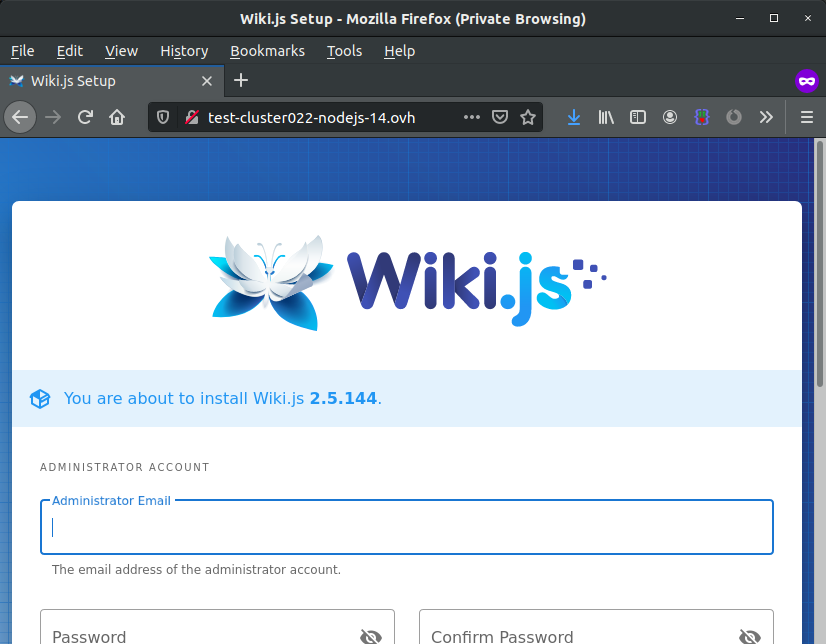

<style>
 pre {
     font-size: 14px;
 }
 pre.console {
   background-color: #300A24; 
   color: #ccc;
   font-family: monospace;
   padding: 5px;
   margin-bottom: 5px;
 }
 pre.console code {
   border: solid 0px transparent;
   font-family: monospace !important;
 }
 .small {
     font-size: 0.75em;
 }
</style>

**Dernière mise à jour le 03/02/2021**

## Objectif

Vous avez souscrit à un hébergement web POWER Node.js et vous souhaitez y déployer une base de connaissances basée sur [Wiki.JS](https://wiki.js.org/){.external}.

**Découvrez comment installer Wiki.JS sur votre hébergement web POWER**

## Prérequis

- Disposer de l'offre d'hébergement web POWER [Node.js](https://labs.ovh.com/managed-nodejs).
- Être connecté à votre [espace client OVHcloud](https://www.ovh.com/auth/?action=gotomanager&from=https://www.ovh.com/fr/&ovhSubsidiary=fr){.external}.

Si vous n'êtes pas encore familier avec l'utilisation de votre hébergement web POWER, nous vous conseillons de consulter notre guide « [Premiers pas avec un hébergement web POWER](../premiers-pas-avec-hebergement-web-POWER/) » avant de poursuivre la lecture de ce guide.

## En pratique

Supposons que vous avez la configuration normale pour un hébergement web POWER :

- Moteur : nodejs 14
- Point d'entrée : index.js
- Dossier racine : www

> [!primary]
>
> Vous pouvez appeler l'API OVHcloud pour [visualiser la configuration active](../premiers-pas-avec-hebergement-web-POWER/#api-get-active-configuration).

[Accédez via SSH](../premiers-pas-avec-hebergement-web-POWER/#ssh) à votre hébergement web POWER.

Allez dans le dossier `www` et téléchargez le fichier d'installation de Wiki.JS :

```sh
cd www
wget https://github.com/Requarks/wiki/releases/download/2.5.170/wiki-js.tar.gz
tar xzf wiki-js.tar.gz
rm -f wiki-js.tar.gz
```

Créez un fichier de configuration `config.yml`.

```yaml
port: 3000
db:
  type: sqlite
  storage: database.sqlite
logLevel: info
dataPath: ./data
```

Recompilez le module `sqlite3`.

```sh
npm rebuild sqlite3
```

Établissez un lien symbolique pour le point d'entrée.

```sh
ln -fs server/index.js index.js
```

[Redémarrez votre instance](../premiers-pas-avec-hebergement-web-POWER/#restart), votre Wiki.JS sera alors en ligne.

{.thumbnail}

Sortie de la console:

<pre class="console"><code> ~ $ cd  www

~/www $ wget https://github.com/Requarks/wiki/releases/download/2.5.170/wiki-js.tar.gz
--2021-02-03 14:50:23--  https://github.com/Requarks/wiki/releases/download/2.5.170/wiki-js.tar.gz
Resolving github.com (github.com)… 140.82.121.4
Connecting to github.com (github.com)|140.82.121.4|:443… connecté.
TTP request sent, awaiting response... 200 OK
Length: 65010291 (62M) [application/octet-stream]
Saving to: « wiki-js.tar.gz »

wiki-js.tar.gz                100%[===============================================>]  62,00M  19,9MB/s    ds 3,1s

2021-02-03 14:50:28 (19,9 MB/s) — « wiki-js.tar.gz » saved [65010291/65010291]

~/www $ tar xzf wiki-js.tar.gz

~/www $ rm -f wiki-js.tar.gz

~/www $ vi config.yml
port: 3000
db:
  type: sqlite
  storage: database.sqlite
logLevel: info
dataPath: ./data
 
~/www $ npm rebuild sqlite3 
> sqlite3@5.0.0 install /home/user/www/node_modules/sqlite3
> node-pre-gyp install --fallback-to-build 
node-pre-gyp WARN Using request for node-pre-gyp https download
[sqlite3] Success: "/home/user/www/node_modules/sqlite3/lib/binding/napi-v3-linux-x64/node_sqlite3.node" already installed
Pass --update-binary to reinstall or --build-from-source to recompile
sqlite3@5.0.0 /home/user/www/node_modules/sqlite3 
 
~/www $ ln -fs server/index.js index.js

~/www $ mkdir -p tmp

~/www $ touch tmp/restart.txt
</code></pre>

## Aller plus loin

Échangez avec notre communauté d'utilisateurs sur <https://community.ovh.com/>.

**Pour discuter avec les autres utilisateurs du lab et avec l'équipe POWER Web Hosting, venez sur [notre room Gitter](https://gitter.im/ovh/power-web-hosting).**
