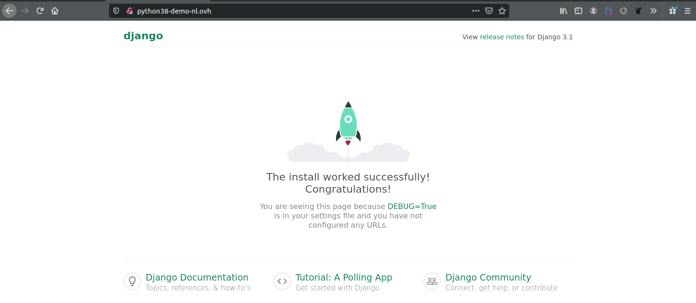

<style>
 pre {
     font-size: 14px;
 }
 pre.console {
   background-color: #300A24; 
   color: #ccc;
   font-family: monospace;
   padding: 5px;
   margin-bottom: 5px;
 }
 pre.console code {
   border: solid 0px transparent;
   font-family: monospace !important;
 }
 .small {
     font-size: 0.75em;
 }
</style>

**Last updated 5th January 2023**

## Objective

You've subscribed to a Web POWER web hosting plan to deploy **Python** applications, and you want to deploy [Django](https://www.djangoproject.com/){.external} on it.

This guide will explain how to do it.


**Find out how to install Django on your POWER web hosting plan.**


## Requirements

- A [Node.js](https://labs.ovh.com/managed-nodejs) POWER web hosting plan
- access to the [OVHcloud Control Panel](https://www.ovh.com/auth/?action=gotomanager&from=https://www.ovh.co.uk/&ovhSubsidiary=GB)

If you have just started to use your Web POWER web hosting plan, we suggest to have a look at our [Getting started with a POWER web hosting plan](../getting-started-with-power-web-hosting/) guide before going further.

## Instructions


Let's suppose you have the default configuration for Python hosting:

- Runtime: Python 3.8   
- Entrypoint: app.py 
- DocumentRoot: www

> [!primary]
>
> To verify your configuration, you can use the [Retrieve active configuration](../getting-started-with-power-web-hosting/#api-get-active-configuration) API endpoint.


To use [Python WSGI](https://www.fullstackpython.com/wsgi-servers.html) frameworks, using [virtualenv](https://pypi.org/project/virtualenv/) is the simplest choice. 

[Connect via SSH](../getting-started-with-power-web-hosting/#ssh) to your POWER web hosting and activate `virtualenv`:


```sh
~$ cd www
~/www$ virtualenv venv
~/www$ source venv/bin/activate
```

Update `pip`:

```sh
~/www$ pip install --upgrade pip
```

Install Django:

```sh
~/www$ pip install django
```

Create the new Django project:

```sh
~/www$ django-admin startproject config
```

By default, Django's wsgi application is located in `config/wsgi.py`. As our configured hosting entrypoint is `app.py`, we can create the following symlink:

```sh
~/www$ ln -s config/wsgi.py app.py
```

As Django is installed inside a `virtualenv`, we should tell the app to use it. We can do so by adding these 2 lines in `app.py` before Django import:


```python
this_file = "venv/bin/activate_this.py"
exec(open(this_file).read(), {'__file__': this_file})
```

The complete `app.py` file:

```python
"""
WSGI config for config project.
 
It exposes the WSGI callable as a module-level variable named ``application``.
 
For more information on this file, see
https://docs.djangoproject.com/en/3.1/howto/deployment/wsgi/
"""
 
import os
 
this_file = "venv/bin/activate_this.py"
exec(open(this_file).read(), {'__file__': this_file})
 
from django.core.wsgi import get_wsgi_application
 
os.environ.setdefault('DJANGO_SETTINGS_MODULE', 'config.settings')
 
application = get_wsgi_application()
```

Django needs to declare the allowed hosts used for the website. It's configured in `config/settings.py`, for example:

```python
ALLOWED_HOSTS = ['yourdomainname', 'www.yourdomainname', 'yourFTPuser.cluster022.hosting.ovh.net']
```


Then [restart your instance](../getting-started-with-power-web-hosting/#restart) and your Django will be online.


{.thumbnail}

Terminal output:

<pre class="console"><code>~ $ cd www

~/www $ virtualenv venv
created virtual environment CPython3.8.7.final.0-64 in 1273ms
  creator CPython3Posix(dest=/home/powerlp/www/venv, clear=False, global=False)
  seeder FromAppData(download=False, pip=bundle, setuptools=bundle, wheel=bundle, via=copy, app_data_dir=/home/powerlp/.local/share/virtualenv)
    added seed packages: pip==20.2.2, setuptools==49.6.0, wheel==0.35.1
  activators BashActivator,CShellActivator,FishActivator,PowerShellActivator,PythonActivator,XonshActivator

~/www $ source venv/bin/activate

~/www $ pip install --upgrade pip
Collecting pip
  Using cached pip-21.0.1-py3-none-any.whl (1.5 MB)
Installing collected packages: pip
  Attempting uninstall: pip
    Found existing installation: pip 20.2.2
    Uninstalling pip-20.2.2:
      Successfully uninstalled pip-20.2.2
Successfully installed pip-21.0.1

~/www $ pip install django
Collecting django
  Downloading Django-3.1.6-py3-none-any.whl (7.8 MB)
     |████████████████████████████████| 7.8 MB 13.0 MB/s
Collecting pytz
  Downloading pytz-2021.1-py2.py3-none-any.whl (510 kB)
     |████████████████████████████████| 510 kB 65.6 MB/s
Collecting asgiref<4,>=3.2.10
  Downloading asgiref-3.3.1-py3-none-any.whl (19 kB)
Collecting sqlparse>=0.2.2
  Downloading sqlparse-0.4.1-py3-none-any.whl (42 kB)
     |████████████████████████████████| 42 kB 1.2 MB/s
Installing collected packages: sqlparse, pytz, asgiref, django
Successfully installed asgiref-3.3.1 django-3.1.6 pytz-2021.1 sqlparse-0.4.1

~/www $ django-admin startproject config .

~/www $ ln -s config/wsgi.py app.py

~/www $ cat app.py
"""
WSGI config for config project.

It exposes the WSGI callable as a module-level variable named ``application``.

For more information on this file, see
https://docs.djangoproject.com/en/3.1/howto/deployment/wsgi/
"""

import os

from django.core.wsgi import get_wsgi_application

os.environ.setdefault('DJANGO_SETTINGS_MODULE', 'config.settings')

application = get_wsgi_application()

~/www $ cat config/settings.py
"""
Django settings for config project.

Generated by 'django-admin startproject' using Django 3.1.6.

For more information on this file, see
https://docs.djangoproject.com/en/3.1/topics/settings/

For the full list of settings and their values, see
https://docs.djangoproject.com/en/3.1/ref/settings/
"""

from pathlib import Path

# Build paths inside the project like this: BASE_DIR / 'subdir'.
BASE_DIR = Path(__file__).resolve().parent.parent


# Quick-start development settings - unsuitable for production
# See https://docs.djangoproject.com/en/3.1/howto/deployment/checklist/

# SECURITY WARNING: keep the secret key used in production secret!
SECRET_KEY = '83sh7zk*@1w#z3&oa@%5b-@iejc_4tl5))@niu1u882k*8h7kp'

# SECURITY WARNING: don't run with debug turned on in production!
DEBUG = True

ALLOWED_HOSTS = [ 'power.lostinbrittany.dev', 'xxxx.xxxx.hosting.ovh.net' ]

[...]


~/www $ mkdir -p tmp

~/www $ touch tmp/restart.txt
</code></pre>


### More information on Django

To get more information on Django, go to the [official documentation site](https://docs.djangoproject.com/fr/3.1/).


## Go further

Join our community of users on [https://community.ovh.com/en/](https://community.ovh.com/en/).

**Join [our Gitter room](https://gitter.im/ovh/power-web-hosting) to discuss directly with the POWER Web Hosting team and the other users of this lab.**