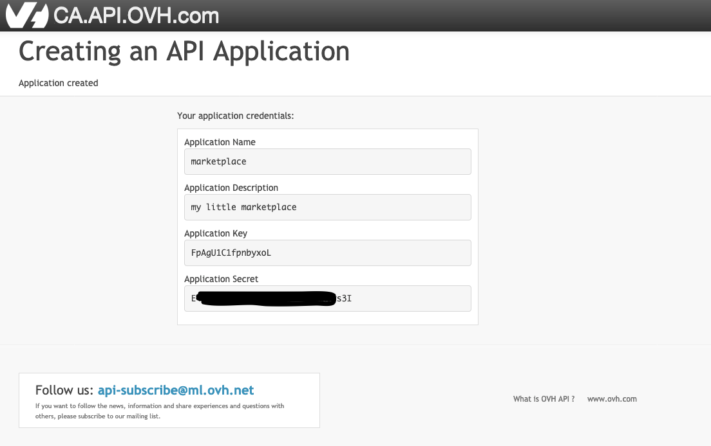
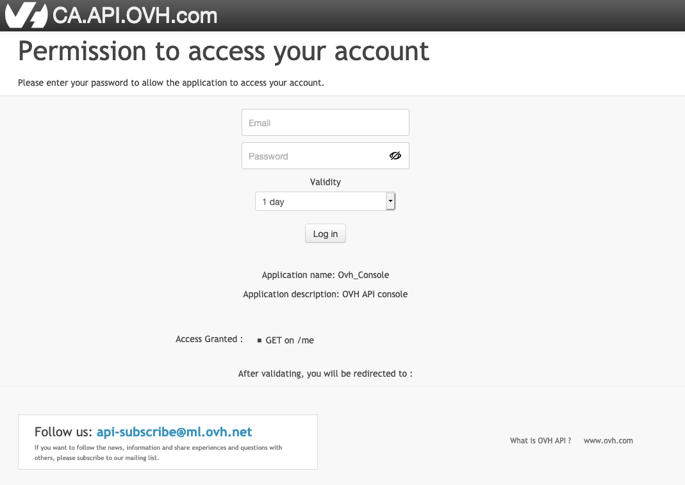

## Objectif
Dans ce guide, vous apprendrez à utiliser l'API OVHcloud pour gérer les services et les ressources du compte d'une autre personne.

Par exemple, supposons que vous voulez créer un marché dans lequel vous, en tant que fournisseur de services, pouvez installer et configurer les ressources d'autres clients OVHcloud.

## Prérequis

- un compte OVHcloud

## En pratique

### Enregistrement de l'application

La première partie, en tant que développeur d'applications, consiste à enregistrer votre application sur OVHcloud.

Pour ce faire, accédez à l'[API OVHcloud](https://ca.api.ovh.com/createApp/){.external}

Vous devrez vous connecter et définir un nom et une description de l'application.


Une fois connecté, vous obtiendrez votre "Application Key" et "Application Secret", plus tard appelés "AK" et "AS".



L'"AK" identifie votre application. Il peut être partagé publiquement.

L'"AS" est une clé utilisée pour signer les demandes d'API qui seront faites ultérieurement par votre application. Il **doit** être gardé secret.

#### Sommaire


### Déployer votre application

Pour illustrer cette partie, supposons que vous avez déployé votre code d'application sur un serveur.

Votre application peut accéder à la valeur "AK" et "AS" et affiche une liste des logiciels ou de services disponibles pour l'installation par les clients.

### Délégation des droits

Supposons qu'un client naviguant sur votre marché sélectionne un service à déployer sur son compte OVHcloud. Jusqu'à présent, vous n'avez aucun droit sur l'API du client. Vous devez demander leur permission pour gérer ses ressources.

### Créer une demande d'autorisation

La première étape consiste pour votre application à demander des autorisations sur l'API du client.

Pour ce faire, votre application demandera des informations d'identification en appelant https://ca.api.ovh.com/console/#/auth/credential#POST et en transmettant comme argument une liste de points de terminaison auxquels l'application doit avoir accès.

<!--
Application Name: maketplace
Application Description: my little marketplace
Application Key: FpAgU1C1fpnbyxoL
Application Secret: UsNmaE8iqvAV6qT0VieCNVrSys9a5hkr
 -->

<!-- https://webhook.site/586c652e-061e-453f-bd71-51912e33419d -->

Exemple avec curl avec une demande d'accès à "GET /me".

```sh
export AK=FpAgU1C1fpnbyxoL
export REDIRECT_URL=https://webhook.site/586c652e-061e-453f-bd71-51912e33419d # usefull for debug

curl -H "Content-type: application/json" -H "X-Ovh-Application: $AK" -d '{"redirection": "$REDIRECT_URL", "accessRules": [{"method": "GET", "path": "/me"}]}' https://ca.api.ovh.com/1.0/auth/credential
```

Le résultat de cet appel sera un dictionnaire JSON

```json
{
  "state":"pendingValidation",
  "consumerKey":"5DU984kYxyoAe4lRaevZCGnmt9FVnKT2",
  "validationUrl":"https://ca.api.ovh.com/auth/?credentialToken=RAXoRq9FvUQFI1S6hE0HmkySyVp8aDWwIqBA3fYrOr0vVSMdpjqxFqp3IjyjGAfu"
```

En tant que développeur, vous devez enregistrer la "ConsumerKey", plus tard appelée "CK". Cette clé sera utilisée pour signer les demandes d'API OVHcloud pour le compte de votre client.

La demande a été faite et vous avez besoin que votre client l'accepte en le redirigeant vers "validationUrl"

### Formulaire de connexion client

Après avoir redirigé le client vers "validationUrl", il sera invité à confirmer la délégation de droits.

{.thumbnail}

En cas de succès, le client sera redirigé vers l'URL précédemment spécifiée par "REDIRECT_URL" dans la commande curl.

### Accès à l'API du client

A ce stade, vous devriez avoir trois jetons :

- la clé d'application "AK"
- le secret de demande "AS"
- la clé de consommation "CK"

À partir de là, en fonction des autorisations demandées, vous pouvez commencer à gérer les ressources de vos clients.

Bonne développement!

## Aller plus loin

Échangez avec notre communauté d'utilisateurs sur <https://community.ovh.com/>.
