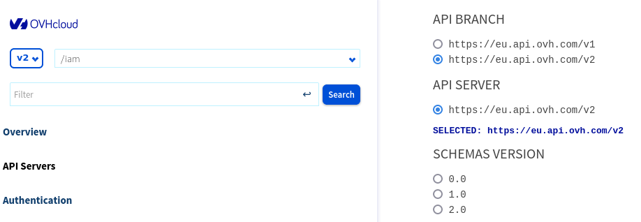

## Objectif

Les API disponibles sur [https://ca.api.ovh.com/](https://ca.api.ovh.com/){.external} vous permettent d'acheter, gérer, mettre à jour et configurer des produits OVHcloud sans utiliser une interface graphique comme l'espace client.

Historiquement, les API d'OVHcloud sont disponibles sous la branche **/1.0** correspondant à la première version de l'API que nous avons publiée. 

Une nouvelle branche des API OVHcloud est disponible sous le préfixe **/v2** sur [https://ca.api.ovh.com/v2](https://ca.api.ovh.com/console-preview/?branch=v2){.external}. 

Cette nouvelle branche regroupera des nouvelles routes d'API, retravaillées sous un nouveau format, et deviendra la branche d'API principale pour les nouveaux développements de fonctionnalités de produits OVHcloud.<br>
La branche **/1.0** continuera d'exister en parallèle de la branche **/v2** mais ne contiendra pas la même fonctionnalité. En tant que client, vous pourrez consommer des API de la branche **/1.0** et **/v2** simultanément dans vos programmes, tout en conservant la même authentification et les mêmes outils pour appeler l'API. Afin de standardiser le nommage de nos branches d'API, la branche **/1.0** est également disponible à travers l'alias **/v1**.

La branche **/v2** introduit des nouveaux principes d'exposition et de consommation (qui diffèrent de la branche **/v1**), ce guide a pour vocation de vous les présenter.

## Principes

### Gestion des versions

La branche */v2* de l'API utilise un système de versionnement pour la gestion de ses spécifications. Cela signifie que chaque modification dans les routes d'API (paramètres d'entrées, retour attendus, ...) fera l'objet d'une nouvelle version.
Ces versions (qui sont différentes de la version contenue dans le nom de branche de l'API) contiendront deux numéros qui s'incrémentent: la version majeure et la version mineure. Cela permet de distinguer les changements mineurs des changements majeurs/cassants dans les schémas de l'API. Les changements mineurs (non-cassants) incrémentent la version mineure tandis que les changements cassants incrémentent la version majeure.

Un résumé des changements (*changelog*) accompagne la publication de chaque nouvelle version afin d'avoir une vue détaillée des modifications apportées.

La branche *v2* de l'API est conçue pour pouvoir exposer plusieurs versions majeures en parallèle. Cela signifie que des applications utilisant une version spécifique de l'API continueront de fonctionner après la sortie d'une nouvelle version majeure.

En tant que client, vous aurez la responsabilité de choisir la version que vous utiliserez. Vous devrez indiquer quelle version majeure de la spécification sera utilisée avec votre compte.

Au moment de la publication d'une nouvelle version majeure, la version majeure précédente restera active pendant une période définie dans le *changelog* afin de vous laisser le temps d'adapter vos applications.
Avant la fin de la période de disponibilité de la version majeure précédente, vous devrez vous assurer que vos applications utilisant l'API OVHcloud sont toujours compatibles, et faire le changement de version majeure dans votre espace client. Si vous ne le faites pas, vous serez migré automatiquement sur la dernière version majeure à la fin de la période de disponibilité de votre version majeure courante. 

#### Sélectionner une version majeure spécifique de l'API

Une page spécifique sera prochainement disponible dans l'espace client OVHcloud pour sélectionner la version majeure de l'API utilisée.

Vous aurez probablement besoin de tester vos applications avec la nouvelle version majeure avant de faire le changement dans votre espace client.
Pour cela, vous pouvez indiquer la version majeure à utiliser avec l'en-tête `X-Schemas-Version` dans vos appels API :

```bash
curl -X GET -H "X-Schemas-Version: 1.0" https://ca.api.ovh.com/v2/iam/policy
```

Si cet en-tête n'est pas fourni lors d'un appel à l'API, la version majeure de votre compte est utilisée par défaut.

Nous conseillons de n'utiliser cet en-tête que lors de vos phases de validation. En effet, son utilisation dans vos applications en production nécessitera une maintenance de votre côté le jour où cette version majeure ne sera plus disponible.<br>
Lors de la sortie d'une nouvelle version majeure, nous ferons une évaluation de l'impact de cette nouvelle version sur votre utilisation de l'API, un rapport détaillé vous sera envoyé. Si vous n'êtes pas concerné par les changements cassants, nous vous proposerons de basculer directement sur la nouvelle version majeure. Dans ce cas, si vous utilisez l'en-tête dans vos applications, la bascule ne pourra être effectuée sans maintenance sur votre application.

#### Récupérer les versions disponibles via la console

Il est possible de voir la liste des versions disponible sur la console de l'API OVHcloud. Pour cela, ouvrez la [console](https://ca.api.ovh.com/console-preview/?section=%2Fiam&branch=v2#servers){.external}.

Les différentes versions sont affichées dans la section **SCHEMAS VERSION**. Vous pouvez ensuite sélectionner une version pour voir les schémas d'API associés.

{.thumbnail}

### Vision as-code

Deux approches opposées existent pour voir l'état courant d'une ressource à travers une API et changer son état :

- **Approche centrée sur le processus** : l'API expose l'état courant des ressources (par exemple une instance Public Cloud) et offre des opérations pour les modifier (par exemple, changer la taille d'un disque).
- **Approche centrée sur les ressources** : l'API expose à la fois l'état courant des ressources ainsi que l'état souhaité. Les modifications se font directement en mettant à jour l'état souhaité des ressources. Dans ce cas, l'API effectue elle-même les actions nécessaires pour atteindre l'état ciblé.

La première approche est celle utilisée par l'API actuelle : [https://ca.api.ovh.com/v1](https://ca.api.ovh.com/v1){.external}.

L'APIv2 utilise l'approche centrée sur les ressources, qui la rend plus facilement utilisable « *as-code* », notamment à travers des outils tels que [Terraform](https://www.terraform.io){.external}. Ce fonctionnement permet également d'abstraire toute la complexité du processus de transformation d'une ressource d'un état à un autre puisqu'il est à la charge de l'API et non du client.

### Gestion asynchrone et évènements

Comme expliqué dans la section précédente, l'APIv2 prend en charge les actions à effectuer pour atteindre l'état cible d'une ressource lorsque ses spécifications ont été modifiées. Dans certains cas, ces actions peuvent entraîner des tâches de longue durée, dont la résolution se fera de manière asynchrone.

Dans le cas de ressources pour lesquelles des tâches asynchrones peuvent être exécutées, une route `/task` est exposée pour récupérer la liste des tâches liées à une ressource. La liste des tâches en cours est également disponible dans les informations de la ressource elle-même.

Voici un exemple de tâche retournée par l'API :

```json
{
  "createdAt": "2023-03-21T15:40:05.213Z",
  "startedAt": "2023-03-21T15:41:05.213Z",
  "updatedAt": "2023-03-21T15:42:05.213Z",
  "finishedAt": "2023-03-21T15:43:05.213Z",
  "errors": [],
  "id": "18704d69-7fd0-4000-808f-7e3d8bb42380",
  "progress": [
    {
      "name": "Restart",
      "status": "DONE"
    }
  ],
  "status": "DONE",
  "type": "CloudRestartInstance"
}
```

Une liste d'évènements est également exposée pour les ressources concernées par des tâches asynchrones. Cela permet de dresser un historique des évènements affectant la ressource comme, par exemple, les modifications demandées par les utilisateurs, les opérations asynchrones, ou bien les maintenances effectuées sur la ressource. Ces évènements sont listés via le chemin `/event`.

Voici un exemple d'évènement retourné par l'API :

```json
{
  "createdAt": "2023-03-21T15:50:08.823Z",
  "message": "Task 18704d69-7fd0-4000-808f-7e3d8bb42380 started",
  "type": "TaskStart"
}
```

Le type de l'évènement peut par exemple être `TargetSpecUpdate` en cas de changement de l'état cible d'une ressource, `TaskSuccess` en cas de tâche terminée sans erreur, etc.

Dans certains cas, un évènement peut aussi contenir un lien vers la ressource concernée par la tâche ainsi qu'un message.

> [!primary]
>
> Les exemples d'évènement et de tâche présentés ci-dessus peuvent varier selon la section d'API. Veuillez vous référer à la [console](/pages/manage_and_operate/api/console-preview) pour visualiser la définition exacte relative à chaque section.
>

### Pagination

La pagination permet de segmenter les réponses d'API contenant une liste d'éléments en plusieurs pages.

Les avantages principaux de la pagination sont :

- une réduction de l'utilisation de la bande passante pour les clients de l'API ;
- des temps de réponse de l'API plus courts ;
- des corps de réponse moins volumineux, ce qui permet une exploitation moins coûteuse des données retournées du côté du client.

L'APIv2 expose une pagination par curseur, dans laquelle les curseurs sont transmis dans les en-têtes des requêtes et des réponses. Il est également possible de contrôler le nombre d'éléments retournés.

Les en-têtes utilisés sont les suivants :

- `X-Pagination-Size` : cet en-tête optionnel permet de contrôler la taille des pages retournées ;
- `X-Pagination-Cursor-Next` : en-tête retourné par l'API qui contient la valeur à utiliser dans la prochaine requête pour récupérer la page suivante ;
- `X-Pagination-Cursor` : en-tête à envoyer dans une requête pour récupérer la page suivante.

Par exemple, l'appel suivant retournera les 5 premiers éléments ainsi que le curseur à utiliser pour récupérer la page suivante :

```bash
curl https://ca.api.ovh.com/v2/iam/policy -H "X-Pagination-Size: 5"
# Si le nombre de ressources à retourner est supérieur à 5, l'en-tête suivant
# sera disponible dans la réponse : "X-Pagination-Cursor-Next: xxxyyyzzz"
```

La page suivante peut être récupérée en fournissant le curseur renvoyé dans la réponse de l'appel précédent :

```bash
curl https://ca.api.ovh.com/v2/iam/policy -H "X-Pagination-Size: 5" -H "X-Pagination-Cursor: xxxyyyzzz"
```

L'absence de l'en-tête `X-Pagination-Cursor-Next` dans une réponse d'API contenant une liste d'éléments signifie que la dernière page est atteinte et que tous les éléments disponibles on été retournés.

## Clients officiels

Plusieurs bibliothèques sont disponibles pour utiliser les API OVHcloud :

- Go : [https://github.com/ovh/go-ovh](https://github.com/ovh/go-ovh){.external}
- Python : [https://github.com/ovh/python-ovh](https://github.com/ovh/python-ovh){.external}
- PHP : [https://github.com/ovh/php-ovh](https://github.com/ovh/php-ovh){.external}

## Aller plus loin <a name="gofurther"></a>

[Exploration des API OVHcloud](/pages/manage_and_operate/api/console-preview)

[Using Terraform with OVHcloud](/pages/manage_and_operate/terraform/terraform-at-ovhcloud) (guide en anglais)

Échangez avec notre communauté d'utilisateurs sur [https://community.ovh.com](https://community.ovh.com).
