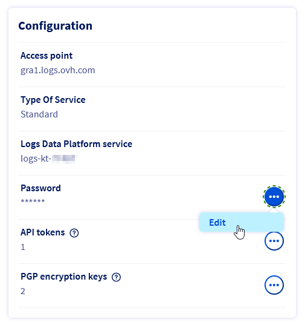

## Objectif

Dans ce guide, vous apprendrez à transformer vos événements de compte client OVHcloud en données exploitables grâce à Logs Data Platform, une solution entièrement gérée qui vous aide à stocker, archiver, interroger et visualiser vos logs.

Pour découvrir Logs Data Platform avant de poursuivre ce guide, référez-vous à [cette documentation](/pages/manage_and_operate/observability/logs_data_platform/getting_started_introduction_to_LDP).

## Prérequis

- Disposer d'un [compte client OVHcloud](/pages/account_and_service_management/account_information/ovhcloud-account-creation).
- Disposer d'un compte Logs Data Platform (LDP) au sein de votre compte OVHcloud avec au moins un flux actif configuré. [Ce guide](/pages/manage_and_operate/observability/logs_data_platform/getting_started_quick_start) vous guidera dans toutes les étapes nécessaires.

## Glossaire

**Logs Data Platform** : Plateforme de gestion de logs entièrement gérée et sécurisée proposée par OVHcloud. Retrouvez plus d'informations sur la [Logs Data Platform service page](https://www.ovhcloud.com/fr-ca/logs-data-platform/).

**Flux de données** : partition logique de logs que vous créez dans un compte LDP et que vous utiliserez lors de l'ingestion, la visualisation ou l'interrogation de vos logs. Plusieurs sources peuvent être stockées dans le même flux de données, et il s’agit de l’unité de définition d’un pipeline de logs (politique de rétention, archivage, streaming live, etc.), de droits d’accès et de politiques d’alertes.

**Redirection de logs** : Fonctionnalité intégrée à un produit OVHcloud pour ingérer les logs de ses services vers un flux de données d'un compte LDP dans le même compte OVHcloud. La fonctionnalité doit être activée par le client pour chaque service.

**Abonnement au transfert de logs** : Lors de l'activation du transfert de logs pour un service OVHcloud donné vers un flux de données LDP donné, un abonnement est créé et attaché au flux de données pour une gestion ultérieure par le client.

## En pratique

### Types de logs des comptes OVHcloud

Le compte OVHcloud propose 3 niveaux de logs :

- **Journaux d'audit** : Fournit un ensemble chronologique d'enregistrements pertinents pour la sécurité, documentant la séquence d'actions dans votre compte OVHcloud (connexions, changement de mot de passe, etc.).
- **Journaux d'activité** : Fournit tous les enregistrements des actions de votre compte OVHcloud à partir des appels API et des actions effectuées dans l'espace client.
- **Logs de politique d'accès** : Fournit tous les enregistrements d'évaluation d'accès dans votre compte OVHcloud, y compris les actions d'intégration tierce (c'est-à-dire les actions autorisées ou non autorisées par les politiques IAM).

### Activer le transfert de logs

Vous pouvez activer la redirection des logs des comptes OVHcloud via API. Vous devrez cibler un flux de l’un de vos comptes LDP. Les logs seront transférés vers ce flux. L'activation du transfert créera un abonnement pour cet ID de flux.

Notez que l'activation du transfert est gratuite, mais vous serez facturé pour l'utilisation de votre service Logs Data Platform selon le tarif standard. Pour la tarification du LDP, consultez la [Logs Data Platform product page](https://www.ovhcloud.com/fr-ca/logs-data-platform/).

Pour activer la redirection, utilisez les API suivantes :

|**Méthode**|**Type de journal**|**Chemin**|**Description**|
| :-: | :-: | :-: | :-: |
POST|Journaux d'audit|/me/logs/audit/forward|Transfère les journaux d'audit des comptes|
POST|Journaux d'activité|/me/api/log/subscription|Journaux de l'API de transfert et des comptes du Panneau de configuration|
POST|Accéder aux journaux de stratégie|/iam/logs/forward|Transfère les journaux IAM du compte vers un flux de journaux dédié|

Par exemple, pour les journaux d'audit :

```json
POST /me/logs/audit/forward
{
    "streamId": "ab51887e-0b98-4752-a514-f2513523a5cd"
}
```

L'API nécessite un `streamId`, qui correspond au flux de données cible de votre compte LDP vers lequel vos journaux de compte OVHcloud seront transférés. Vous obtiendrez en réponse un `operationId` afin de pouvoir l'utiliser pour récupérer le `subscriptionId`. Ceci à des fins de gestion ultérieure à l'aide du point de terminaison de l'[opération de lecture de Logs Data Platform](https://ca.api.ovh.com/console-preview/?section=%2Fdbaas%2Flogs&branch=v1#get-/dbaas/logs/-serviceName-/operation).

> [!primary]
> Vous pouvez retrouver votre `streamId` dans la partie `Logs Data Platform`{.action} de l'espace client OVHcloud :
>
> - Rendez-vous sur la page `Flux de données`{.action} de votre compte Logs Data Platform. Dans le tableau qui s'affiche, cliquez sur le bouton `...`{.action} à droite du flux de donnés cible puis cliquez sur `Modifier`{.action}.
>   
> {.thumbnail}
> 
> - Copiez la page `streamId` de votre compte Logs Data Platform.
>   
> {.thumbnail}

Vous pouvez également récupérer vos flux à l'aide de l'API Logs Data Platform :

> [!api]
>
> @api {GET} /dbaas/logs/{serviceName}/output/graylog/stream
> @api {GET} /dbaas/logs/{serviceName}/output/graylog/stream/{streamId}
>

### Accès aux logs des comptes OVHcloud

Maintenant que vos logs de compte OVHcloud sont ingérés et stockés dans votre flux Logs Data Platform, vous pouvez interroger vos logs et construire des tableaux de bord pour avoir une représentation graphique à l'aide de l'interface utilisateur web de Graylog.

- Récupérez l'utilisateur admin (nom du service Logs Data Platform) et le mot de passe sur la page d'accueil de votre compte Logs Data Platform.
  
{.thumbnail}

- Ouvrez Graylog `web-ui`. Vous pouvez récupérer le lien depuis la page d'accueil de votre compte ou utiliser votre point d'accès en fonction de la région de votre compte (par exemple, la région de Gravelines : <https://gra1.logs.ovh.com/>).

- Connectez-vous à Graylog en utilisant votre **nom de service Logs Data Platform** et **mot de passe**.

{.thumbnail}

- Parcourez vos logs dans le flux de données de votre compte Logs Data Platform. Consultez la [documentation de Graylog Writing Search Queries](https://go2docs.graylog.org/4-x/making_sense_of_your_log_data/writing_search_queries.html?tocpath=Searching%20Your%20Log%20Data%7C____1) pour plus de détails sur la syntaxe de recherche.

{.thumbnail}

Pour plus de détails sur l'utilisation de vos logs avec Logs Data Platform, reportez-vous à la documentation [Logs Data Platform - Visualisation, interrogation et exploitation de vos logs](/products/observability-logs-data-platform-visualizing-querying-exploiting). Cela comprend :

- Comment mettre en place les alertes.
- Comment consulter les logs en temps réel via un WebSocket.
- Comment créer une visualisation avec les tableaux de bord OpenSearch.
- Comment intégrer l'API OpenSearch.
- Comment se connecter avec Grafana.

### Détails des logs générés

#### Audit logs

Pour chaque action liée à la sécurité du compte OVHcloud, une entrée est générée.
Les logs générés sont :

- **Pour la connexion**

{.thumbnail}

|**Champ**|**Valeur**|**Description**|
| :-: | :-: | :-: |
|account|String|Compte OVHcloud concerné par l'action|
|authDetails_userDetails_type|ACCOUNT, PROVIDER ou USER|Indiquez si l'utilisateur est un compte racine (ACCOUNT), un utilisateur local (USER) ou un utilisateur issu d'un SSO (PROVIDER)|
|authDetails_userDetails_user|String|Nom de l'utilisateur|
|client_ip|String|IP de l'utilisateur qui a effectué l'action|
|client_ip_geolocation|String|Géolocalisation de l'utilisateur qui a effectué l'action|
|client_ip_city_name|String|Nom de la ville de l'utilisateur qui a effectué l'action (si disponible)|
|client_ip_country_code|String|Code pays de l'utilisateur qui a effectué l'action|
|loginSuccessDetails_mfaType|String|Indiquez le type d'utilisation de l'authentification multifacteur : BACKUP_COD, MAIL, NONE, SMS, TOTP, U2F, UNKNOWN|
|loginSuccessDetails_userAgent|String|Agent utilisateur de l'utilisateur|
|source|String|iam.ovhcloud|
|type|String|LOGIN_SUCCESS|

- **Pour le changement de mot de passe**

{.thumbnail}

|**Champ**|**Valeur**|**Description**|
| :-: | :-: | :-: |
|account|String|Compte OVHcloud concerné par l'action|
|client_ip|String|IP de l'utilisateur qui a effectué l'action|
|client_ip_geolocation|String|Géolocalisation de l'utilisateur qui a effectué l'action|
|client_ip_city_name|String|Nom de la ville de l'utilisateur qui a effectué l'action (si disponible)|
|client_ip_country_code|String|Code pays de l'utilisateur qui a effectué l'action|
|source|String|iam.ovhcloud|
|type|String|ACCOUNT_PASSWORD_CHANGED, USER_PASSWORD_CHANGED|
|userPasswordChangedDetails|String|Connexion de l'utilisateur affecté par la modification du mot de passe|

#### Activity logs

Pour chaque action effectuée par les utilisateurs via l'API ou l'espace client, une entrée est générée avec les données suivantes :

{.thumbnail}

|**Champ**|**Valeur**|**Description**|
| :-: | :-: | :-: |
|account|String|Compte OVHcloud concerné par l'action|
|client_ip|String|IP de l'utilisateur qui a effectué l'action|
|client_ip_geolocation|String|Géolocalisation de l'utilisateur qui a effectué l'action|
|client_ip_city_name|String|Nom de la ville de l'utilisateur qui a effectué l'action (si disponible)|
|client_ip_country_code|String|Code pays de l'utilisateur qui a effectué l'action|
|identities_array|Array of String|Liste des identités de l'utilisateur qui a effectué l'action (URN utilisateur et URN groupes utilisateur)|
|method|GET, POST, PUT ou DELETE|Method of the API|
|path|String|Appel d'API concerné par l'action|
|request_id|String|ID unique de la demande|
|service_name|String|Services OVHcloud concernés par l'action|
|source|manager ou api|Si l'action a été effectuée via le Panneau de configuration (manager) ou l'API (api)|
|status_int|Number|Code HTTP du résultat de la demande|
|url|String|URL appelée sur l'action|
|user_agent|String|Agent utilisateur de l'utilisateur qui a effectué l'action|
|username|String|Nom d'utilisateur de l'utilisateur qui a effectué l'action|

#### Access Policies logs

Pour chaque action évaluée par l’IAM d’OVHcloud, une entrée est générée avec les données suivantes :

{.thumbnail}

|**Champ**|**Valeur**|**Description**|
| :-: | :-: | :-: |
|account|String|Compte OVHcloud concerné par l'action
|identities_array|Array of String|Liste des identités de l'utilisateur qui a effectué l'action (URN utilisateur et URN groupes utilisateur)|
|requested_actions_array|Array of String|Liste des actions demandées par l'utilisateur|
|resource|String|URN de la ressource OVHcloud concernée par l'action|
|authorized_actions_array|Array of String|Liste des actions autorisées après l'évaluation de la stratégie|
|authorized_actions_array|Array of String|Liste des actions non autorisées après l'évaluation de la stratégie|

### Gérer les abonnements

À tout moment, vous pouvez récupérer les abonnements attachés à votre flux Logs Data Platform et choisir de désactiver la redirection en annulant votre abonnement sur votre flux. Afin que votre flux Logs Data Platform ne reçoive plus vos logs d'audit.

Notez que cela ne supprime pas les journaux qui ont été stockés avant la résiliation de l'abonnement, car les données stockées dans un flux de journaux sont immuables sauf si vous supprimez le flux entier.

Actuellement, vous ne pouvez gérer vos abonnements que via l'API de Logs Data Platform.

Les trois routes API Logs Data Platform suivantes vous permettent respectivement de :

- Récupérer une liste de `subscriptionId`s associés à un flux de logs spécifique en fonction de son `streamId`.

> [!api]
>
> @api {GET} /dbaas/logs/{serviceName}/output/graylog/stream/{streamId}/subscription
>

- Récupérer les informations (telles que *type de ressource*, ici **api-compte**, **iam-compte** et **audit-compte**, et *nom de ressource* - nom du compte OVHcloud) du service associé à l'abonnement basé sur son `subscriptionId`.

> [!api]
>
> @api {GET} /dbaas/logs/{serviceName}/output/graylog/stream/{streamId}/subscription/{subscriptionId}
>

- Supprimer un abonnement basé sur son `subscriptionId`.

> [!api]
>
> @api {DELETE} /dbaas/logs/{serviceName}/output/graylog/stream/{streamId}/subscription/{subscriptionId}
>

## Aller plus loin

Échangez avec notre communauté d'utilisateurs sur <https://community.ovh.com/>.
