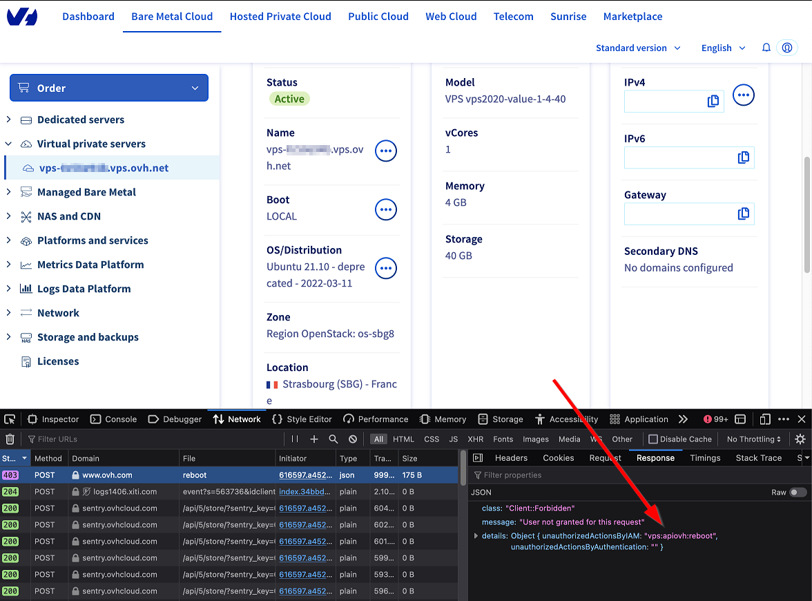
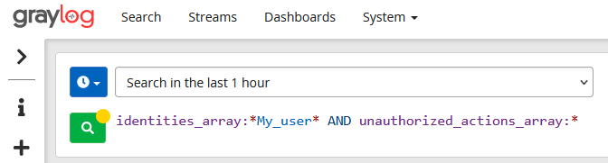

## Objective

The purpose of this guide is to present the different methods available for identifying missing actions in IAM policies.

## Requirements

- You have an [OVHcloud customer account](/pages/account_and_service_management/account_information/ovhcloud-account-creation).
- You know how to configure [access policies via the OVHcloud Control Panel](/pages/account_and_service_management/account_information/iam-policy-ui) or [access policies via API](/pages/account_and_service_management/account_information/iam-policies-api).
- You know how [send IAM policy logs to Logs Data Platform](/pages/manage_and_operate/iam/iam-logs-forwarding).

## Instructions

### In HTTP responses

During API calls, you can get the name of the missing action in the HTTP request response: via the `unauthorizedActionsByIAM` field.
In the following example, the missing action is "*vps:apiovh:reboot*"

```json
{
  "class": "Client::Forbidden",
  "message": "User not granted for this request",
  "details": {
    "unauthorizedActionsByAuthentication": "",
    "unauthorizedActionsByIAM": "vps:apiovh:reboot"
  }
}
```

From the OVHcloud Control Panel, based entirely on our API, it is also possible to access this information through the web browser development tools. This is done by analysing the errors of type 403.

To do this, go to the `Network`{.action} tab, and select the query that returns a status **403**, then go to the `Response`{.action} tab.

{.thumbnail}

### In Logs Data Platform (LDP)

If [transmission of OVHcloud account logs to LDP](/pages/manage_and_operate/iam/iam-logs-forwarding) is enabled, you can find the information in the access policy logs.

In the Graylog interface, search for the login of the user concerned and logs containing `unauthorized_actions_array` with the `identities_array:*My_user* AND unauthorized_actions_array:*` request.

{.thumbnail}

The logs filtered in this way show the actions refused by the OVHcloud IAM for the user.

{.thumbnail}

Here for example, the user *Ines* tried to perform the action *vps:apiovh:reboot* without success.

You can also filter the search on `authorized_actions_array` to list the actions authorised by the OVHcloud IAM.

## Go further

Join our community of users on <https://community.ovh.com/en/>.