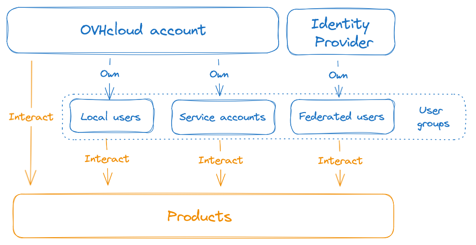

## Objectif

L'objectif de ce guide est de présenter les différents types d'identités pouvant être gérées dans le compte OVHcloud.

## Prérequis

- Disposer d'un [compte client OVHcloud](/pages/account_and_service_management/account_information/ovhcloud-account-creation).

## En pratique

### Présentation des identités

Il existe plusieurs types d'identités pouvant interagir avec les produits OVHcloud :

{.thumbnail}

### Compte OVHcloud

Il s'agit de l'identité principale vous servant à vous connecter sur l'espace client OVHcloud. Vous utilisez le compte OVHcloud lorsque vous vous connectez avec votre adresse email ou votre identifiant client (ex : xx1111-ovh) sur l'espace client.

Cette identité agit comme un compte root et ne peut pas voir ses droits restreints, quelles que soient les politiques d'accès mises en oeuvre.

Le compte OVHcloud peut être aussi référencé sous le nom de NIC ou NIC-handle dans la documentation.

### Utilisateurs locaux

Les utilisateurs locaux sont des identités associées à votre compte OVHcloud. Ces comptes sont conçus pour les **interactions humaines** avec les produits OVHcloud car basés sur une authentification de type login/password, et dont les droits d'accès dépendent des [politiques IAM](/pages/account_and_service_management/account_information/iam-policy-ui) mises en oeuvre.

La configuration des utilisateurs locaux est détaillée dans la [documentation dédiée](/pages/account_and_service_management/account_information/ovhcloud-users-management).

Il est aussi possible de les utiliser pour la connexion sur les API OVHcloud en [générant un token associé à l'utilisateur](/pages/manage_and_operate/api/first-steps). Les droits de ce token peuvent être limités à un périmètre précis en complément des politiques IAM.

Pour qu'une application basée sur un token lié à un utilisateur local puisse utiliser une API OVHcloud, il est donc nécessaire que le token l'intègre dans son périmètre **ET** que l'utilisateur à l'origine de la création du token dispose des droits sur cette API.

Les utilisateurs locaux peuvent être aussi référencés sous le nom de *sub-user* dans la documentation.

À des fin de traçabilité, nous vous recommandons de mettre en place des utilisateurs locaux dès que plus d'une personne doit se connecter sur votre compte OVHcloud.

### Comptes de services

Les comptes de services sont des identités associés à votre compte OVHcloud. Ces comptes sont conçus pour les **interactions machines** avec les produits OVHcloud car basés sur une authentification de type client/token et dont les droits d'accès dépendent des [politiques IAM](/pages/account_and_service_management/account_information/iam-policy-ui) mises en oeuvre.

La création des comptes de services est abordée dans la [documentation dédiée](/pages/manage_and_operate/api/manage-service-account).

Un compte de service peut ensuite être utilisé pour la [connexion sur les APIs OVHcloud](/pages/account_and_service_management/account_information/authenticate-api-with-service-account) ainsi que sur des API tierces comme celles exposées par [OpenStack](/pages/manage_and_operate/iam/authenticate-api-openstack-with-service-account).

### Utilisateurs fédérés

Ce sont les comptes utilisateurs provenant d'une [fédération d'identité](/products/manage-operate-user-federation). Ces utilisateurs proviennent d'un annuaire tiers et ne sont donc pas gérés directement par OVHcloud. Leurs droits d'accès dépendent des [politiques IAM](/pages/account_and_service_management/account_information/iam-policy-ui) mises en oeuvre.

Les utilisateurs fédérés sont représentés par des groupes utilisateurs au niveau de la gestion des droits.

Nous vous recommandons de mettre en place une fédération d'identité dès que le nombre de personnes se connectant à votre compte OVHcloud devient suffisament conséquent, ou si vous souhaitez centraliser les accès sur un annuaire tiers utilisé pour d'autres services que OVHcloud.

### Groupes d'utilisateurs

Les différentes identités peuvent être associées dans des groupes d'utilisateurs afin d'en faciliter la manipulation.
La configuration des groupes d'utilisateurs est abordée dans la documentation de gestion des [utilisateurs locaux](/pages/account_and_service_management/account_information/ovhcloud-users-management).

### Utilisateurs des produits OVHcloud

Certains produits mis à disposition par OVHcloud peuvent proposer leurs propres utilisateurs en complément, comme OpenStack, VMware vSphere ou Object Storage.
Ces utilisateurs sont indépendants du compte OVHcloud et sont gérés directement à travers les produits concernés.

Pour les produits permettant d'utiliser soit une identité OVHcloud (utilisateur local, compte de service, utilisateur fédéré) ou soit un utilisateur spécifique du produit, nous vous recommandons d'utiliser ces utilisateurs spécifiques si vous souhaitez maintenir la réversibilité de votre produit et limiter la dépendance à OVHcloud.
A l'inverse, si vous souhaitez disposer d'une gestion centralisée à travers tout vos produits, nous vous recommandons d'utiliser des identités OVHcloud.

## Aller plus loin

La gestion des identités peut être automatisée via les [API OVHcloud](/pages/manage_and_operate/api/first-steps) ou via le [provider Terraform OVHcloud](/pages/manage_and_operate/terraform/terraform-at-ovhcloud).

Échangez avec notre [communauté d'utilisateurs](/links/community).