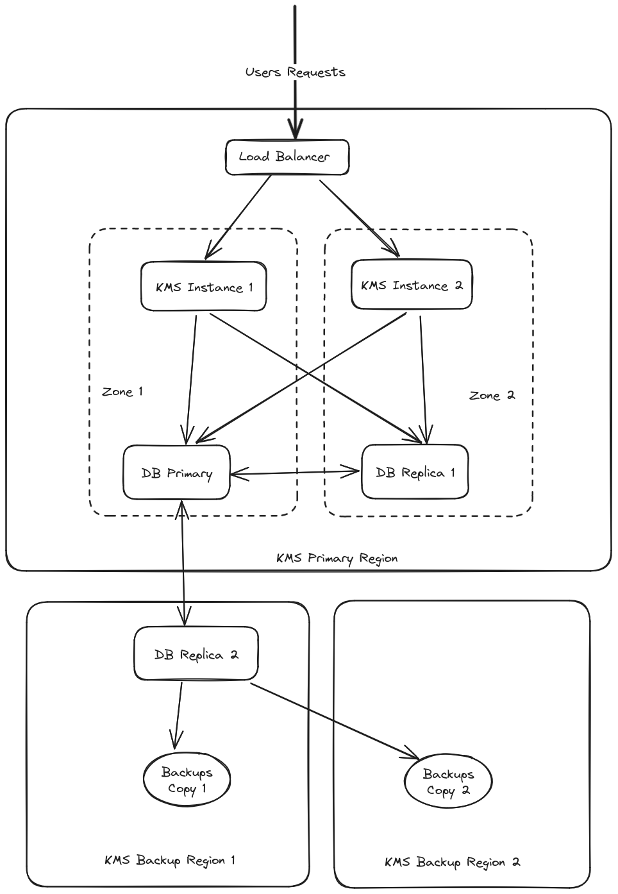

> [!warning]
>
> OVHcloud KMS will be open soon in beta. This guide may be incomplete and will be updated during the beta phase.
> Do not hesitate to provide us with feedback on the dedicated Discord channel : <https://discord.gg/ovhcloud>.
>

## Objective

This guide explains how we handle the resilience of the OVHcloud KMS (Key Management Service).

## Instructions

The OVHcloud KMS architecture has 3 main objectives:

- **Confidentiality** : Assure that no one exept you can access to your key.
- **Disponibility** : Offering a high level of resilience and therefore high availability.
- **Integrity** : Making sure that keys cannot be lost or altered.

### Access Management

Access to the keys are controlled by the [OVHcloud IAM](/pages/account_and_service_management/account_information/iam-policy-ui)
Only the users allowed by an IAM policy can manage the keys or use them to encrypt or sign data.

Even the OVHcloud employees cannot access your keys.

### KMS architecture

The OVHcloud KMS is by design replicated accross multiple datacenters.

{.thumbnail}

### KMS components location

Each KMS Region consists of several hosts in a single OVHcloud Region.

These hosts are partitioned into two different zones, so that any single hardware failure is as unlikely as possible to take out both zones at once.

#### Data resilience

- **DB Replication**

The KMS will not return a success status for the creation or import of key material unless that data was successfully replicated to both zones. This is to ensure that in the event where one of the database is lost, no key will be lost. As a consequence, if one zone becomes unavailable, the KMS will refuse to create new keys. However, existing keys will still be available to perform cryptographic operations.

The key material is also replicated to a third database, in a different region. Because replication to a remote region has a higher latency, we do not wait for that replication to be complete before returning a success status to the user. Replication to the remote region will typically lag a few seconds at most behind the main region.

- **DB Backups**

Regular backups are taken from the replica every 5 minutes. Each backup is stored in two regions, different from the main KMS region. 
These backups are kept for 30 days.

#### Data security

All customer data are always stored encrypted in the databases and in the backups.

#### Backup location

Backup location depends on the location of the OVHcloud KMS.

- **EU_WEST_RBX**
    - KMS Backup Region 1 : EU_WEST_SBG
    - KMS Backup Region 2 : EU_WEST_GRA
- **EU_WEST_SBG**
    - KMS Backup Region 1 : EU_WEST_RBX
    - KMS Backup Region 2 : EU_WEST_GRA

### Disaster scenarios

#### What happens if one host in a zone is lost?

Keys remain available and traffic is redirected to the other zone. 
Requests in flight can timeout or return errors. 
If the database is down, the KMS will refuse to create or import new keys.

#### What happens if a zone is lost?

Keys remain available. 
The other zone stays available to serve user queries but will refuse to create or import new keys.

#### What happens if the primary region is lost?

The keys created in the last seconds can be lost and the KMS becomes unavailable. 
Database replica will be used at region rebuilt to retrieve stored keys.

#### What happens if the primary region and the remote replica are lost?

The keys created in the last 5 minutes can be lost and the KMS becomes unavailable. 
Database backup will be used at region rebuilt to retrieve stored keys.

## Go further

Join our [community of users](/links/community).