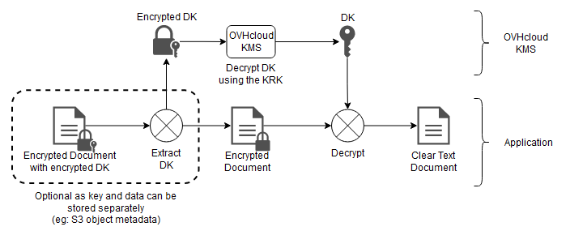

> [!warning]
>
> The OVHcloud KMS is currently in beta phase. This guide may be incomplete, and will be updated during the beta period.
> Feel free to send us feedback on the dedicated Discord channel: <https://discord.gg/ovhcloud>.
>

## Objective

The purpose of this guide is to show you the steps to interact with the OVHcloud KMS to encrypt or sign your data.

## Requirements

- An [OVHcloud customer account](/pages/account_and_service_management/account_information/ovhcloud-account-creation).
- [An OVHcloud KMS ordered and an access certificate created](/pages/manage_and_operate/kms/quick-start)

## Instructions

### Contacting the KMS

Communication with the KMS, except for key creation, is only available via API.

Since the KMS is regionalized, you can access the API directly in its region: `https://my-region.ovh.com.net`.

For example, for a KMS created in the **eu-west-rbx** region: <https://eu-west-rbx.okms.ovh.net>.

It's also possible to use the Golang SDK with the documentation available here : <https://pkg.go.dev/github.com/ovh/okms-sdk-go>.

### Using the KMS API via the Swagger UI

You can access the KMS Swagger UI by clicking on the link in the [OVHcloud Control Panel](/links/manager), in your KMS dashboard.

{.thumbnail}

You will land on the non-authenticated version of the Swagger UI, that is meant for API documentation purposes. If you want to use the Swagger UI to make requests on your own KMS, you will need to switch to the authenticated version, whose link is in the description section:

{.thumbnail}

The next steps will guide you on how to authenticate.

#### Importing your KMS credentials into the browser

To access the authenticated Swagger UI, you need to load your KMS access certificate into the browser Certificate Manager.

For that, it is required to convert it to PKCS#12 format. PKCS#12 is a binary format for storing a certificate chain and private key in a single, encrypted file. It is commonly used for importing and exporting certificates and private keys, especially in environments that require secure transport of these items, such as web servers and client applications.

To convert your KMS credentials (assuming you saved them into files named `ID_certificate.pem` and `ID_privatekey.pem`) to PKCS#12 with the openssl Command Line Interface, use the following command:

```bash
openssl pkcs12 -export -in ID_certificate.pem  -inkey ID_privatekey.pem -out client.p12
```

You will be prompted to enter a password that will be used for the symmetrical encryption of the file content.
Then, you need to import it into your web browser.

##### On Firefox

- Type `about:preferences#privacy` into the address bar.
- Scroll down until reaching a section named `Certificates`{.action}.

{.thumbnail}

- Click `View Certificates...`{.action} to open the Certificate Manager.
- Go to the tab named `My Certificates`{.action}, then `Import...`{.action} and select the location of your `client.p12` file.
- You will be prompted to enter the password you used during the PKCS#12 file creation.
- After entering the password, your certificate will be imported and ready for use.

##### On Chrome/Chromium

- Type `chrome://settings/certificates` into the address bar.
- Go to the `Your certificates`{.action} tab. Click `Import`{.action} and select your `client.p12` file.
- You will be prompted to enter the password you used during the PKCS#12 file creation.
- After entering the password, your certificate will be imported and ready for use.

{.thumbnail}

#### Accessing the authenticated Swagger UI

Once your certificate is loaded into your browser, you can go to the authenticated Swagger UI.

You will be prompted to identify yourself with a certificate. Select the previously imported PKCS#12 certificate in the drop-down list.

{.thumbnail}

You can now use the Swagger UI interactively.

### Creating an encryption key via API

Key creation can be performed either through the [OVHcloud API](https://eu.api.ovh.com/console/?section=%2Fokms&branch=v2) or on the specific OVHcloud KMS API. There is no difference on the result from the creation method.

In the case of the specific OVHcloud KMS API, you can create a key using the following API:

|**Method**|**Path**|**Description**|
| :-: | :-: | :-: |
|POST|/v1/servicekey|Create or import a CMK|

The API expects the following values:

|**Field**|**Value**|**Description**|
| :-: | :-: | :-: |
|name|string|Key name|
|context|string|Additional credential to verify key authenticity|
|type|oct, RSA, EC|Key type: Byte sequence (oct) for symmetric keys, RSA (RSA), Elliptic Curve (EC)|
|size|Integer|Key size - see lookup below|
|operations|Array|Key Usage - see lookup below|
|crv|P-256, P-384, P-521|(optional) Cryptographic curve for EC type keys|

**Example of symmetric key creation:**

```json
{
  "name": "My first AES key",
  "context": "project A",
  "type": "oct",
  "size": 256,
  "operations": [
    "encrypt",
    "decrypt"
  ]
}
```

**Example of asymmetric key creation:**

```json
{
  "name": "My first RSA key",
  "context": "project A",
  "type": "RSA",
  "size": 4096,
  "operations": [
    "sign",
    "verify"
  ]
}
```

**Example of EC key creation:**

```json
{
  "name": "My first EC key",
  "context": "project A",
  "type": "EC",
  "operations": [
    "sign",
    "verify"
  ],
  "crv": "P-256"
}
```

Depending on the key type, the possible sizes and operations are:

- **Oct**:
    - size: 128, 192, 256
    - operations:
        - encrypt, decrypt
        - wrapKey, unwrapKey
- **RSA**:
    - size: 2048, 3072, 4096
    - operations: sign, verify
- **EC**:
    - size: do not specify
    - curve: P-256, P-384, P-521
    - operations: sign, verify

#### Importing an encryption key

When you create a key, you can import an existing key.

To do this, you can add an additional **keys** field in the body of the request:

```json
{
  "name": "My imported key",
  "keys": [
    {
      "kid": "string",
      "use": "string",
      "key_ops": [
        "string"
      ],
      "alg": "string",
      "kty": "oct",
      "n": "string",
      "e": "string",
      "k": "string",
      "crv": "string",
      "x": "string",
      "y": "string",
      "d": "string",
      "dp": "string",
      "dq": "string",
      "p": "string",
      "q": "string",
      "qi": "string"
    }
  ]
}
```

The key must be in JSON Web Key (JWK) format. The values of the fields contained in the table follow the documentation in [RFC 7518](https://www.rfc-editor.org/rfc/rfc7518.html).

#### Managing encryption keys

In order to manage encryption keys, several APIs are available:

|**Method**|**Path**|**Description**|
| :-: | :-: | :-: |
|GET|/v1/servicekey|Lists the available encryption keys|
|DELETE|/v1/servicekey/{keyId}/delete|Deletes an encryption key|
|POST|/v1/servicekey/{keyId}/activate|Activates an encryption key|
|POST|/v1/servicekey/{keyId}/deactivate|Deactivates an encryption key|

Disabling an encryption key means that it will no longer be usable, even though the key remains in the KMS.<br>
Deleting an encryption key is only possible on a key that has been previously disabled.

> [!warning]
>
> Deleting an encryption key is permanent. All data encrypted using it will be permanently inaccessible.
>

### Encrypting data with the KMS

#### KMS encryption

The OVHcloud KMS has a dedicated encryption API for encrypting small volumes of data (less than 4 kB).<br>
This is the easiest method, but it does not have the best performance.

|**Method**|**Path**|**Description**|
| :-: | :-: | :-: |
|POST|/v1/servicekey/{keyId}/encrypt|Data encryption with a CMK|

The API expects the following values:

|**Field**|**Value**|**Description**|
| :-: | :-: | :-: |
|plaintext|string|Data to encrypt|
|context|string|Additional identification data to verify data authenticity|

**Encryption example**

```json
{
  "plaintext": "My secret data",
  "context": "Project A"
}
```

The API then returns the encrypted data in a **ciphertext** field:

```json
{
  "ciphertext": "Encrypted data",
}
```

The decryption of the data is done in reverse via the API:

|**Method**|**Path**|**Description**|
| :-: | :-: | :-: |
|POST|/v1/servicekey/{keyId}/decrypt|Decrypting data with a CMK|

The API expects the following values:

|**Field**|**Value**|**Description**|
| :-: | :-: | :-: |
|ciphertext|string|Data to decrypt|
|context|string|Additional identification data to verify data authenticity|

The **context** field must have the same value as the one given during encryption.

#### Encryption with a Data Key (DK)

For better performance, you can generate a Data Key (DK) from a Symmetric Key (AES) to use from your application.

{.thumbnail}

You can generate a DK using the following API:

|**Method**|**Path**|**Description**|
| :-: | :-: | :-: |
|POST|/v1/servicekey/{keyId}/datakey|Generates a DK derived from a CMK|

The API expects the following values:

|**Field**|**Value**|**Description**|
| :-: | :-: | :-: |
|name|string|Key name|
|size|Integer|Key Size (64-4096)|

**Data Key generation example:**

```json
{
  "name": "My Data Key",
  "size": 4096
}
```

The API will then return the Data Key:

```json
{
  "key": "string",
  "plaintext": "string"
}
```

- **key** : encrypted key encoded in base64. This information must be stored with the encrypted data and will be used for decryption by the KMS.
- **plaintext**: plain key encoded in base64. This information must be deleted once the encryption is complete and must not be backed up.

The use of the Data Key is then done through encryption algorithms like AES-GCM. This is not covered by this documentation.

{.thumbnail}

Conversely, you can retrieve the decrypted version of a Data Key via the following API:

|**Method**|**Path**|**Description**|
| :-: | :-: | :-: |
|POST|/v1/servicekey/{keyId}/datakey/decrypt|Decrypting a DK|

The API expects the following values:

|**Field**|**Value**|**Description**|
| :-: | :-: | :-: |
|key|string|Encrypted Data Key|

And it returns the decrypted Data Key in a **plaintext** field.

### Signing with the KMS

File signing is done using the private key of an asymmetric key pair.

#### Supported algorithms

The OVHcloud KMS supports the following list of signing algorithms:

- **RSASSA-PKCS1 v1.5**

|**Name**|**Digital Signature Algorithm**|
| :-: | :-: |
|RS256|RSASSA-PKCS1-v1_5 using SHA-256|
|RS384|RSASSA-PKCS1-v1_5 using SHA-384|
|RS512|RSASSA-PKCS1-v1_5 using SHA-512|

Following the documentation in [RFC 7518](https://www.rfc-editor.org/rfc/rfc7518#section-3.3).

- **ECDSA**

|**Name**|**Digital Signature Algorithm**|
| :-: | :-: |
|ES256|ECDSA using P-256 and SHA-256|
|ES384|ECDSA using P-384 and SHA-384|
|ES512|ECDSA using P-521 and SHA-512|

Following the documentation in [RFC 7518](https://www.rfc-editor.org/rfc/rfc7518#section-3.4).

- **RSASSA-PSS**

|**Name**|**Digital Signature Algorithm**|
| :-: | :-: |
|PS256|RSASSA-PSS using SHA-256 and MGF1 with SHA-256|
|PS384|RSASSA-PSS using SHA-384 and MGF1 with SHA-384|
|PS512|RSASSA-PSS using SHA-512 and MGF1 with SHA-512|

Following the documentation in [RFC 7518](https://www.rfc-editor.org/rfc/rfc7518#section-3.5).

#### Message signature

Since the private key cannot be extracted from the KMS, the signature can only be done directly with the KMS.

|**Method**|**Path**|**Description**|
| :-: | :-: | :-: |
|POST|/v1/servicekey/{keyId}/sign|File signature|

The API expects the following values:

|**Field**|**Value**|**Description**|
| :-: | :-: | :-: |
|message|string|Message to sign in base64 format|
|alg|string|Signature algorithm|
|isdigest|boolean|Whether the message is already hashed|

**Signature example:**

```json
{
  "message": "SGVsbG8gV29ybGQ=",
  "alg": "RS256",
  "isdigest": false
}
```

The API will then return the file signature:

```json
{
  "signature": "EmUGXC6rsFTWtmFn77y6NS/U6IuhThApVKWTZdXjE7rDMonRPPxbjTo01HQN62J3Dxqyw=="
}
```

#### Checking a file

You can check a file either directly with the KMS, or by using the public key.

With the KMS, you can use the following API:

|**Method**|**Path**|**Description**|
| :-: | :-: | :-: |
|POST|/v1/servicekey/{keyId}/verify|Verifying a signature|

The API expects the following values:

|**Field**|**Value**|**Description**|
| :-: | :-: | :-: |
|message|string|Message to sign|
|signature|string|Signature associated with the message|
|alg|string|Signature algorithm|
|isdigest|boolean|Whether the message is already hashed|

**Verification example**

```json
{
  "message": "SGVsbG8gV29ybGQ=",
  "signature": "EmUGXC6rsFTWtmFn77y6NS/U6IuhThApVKWTZdXjE7rDMonRPPxbjTo01HQN62J3Dxqyw==",
  "alg": "RS256",
  "isdigest": false
}
```

The API will then return the result of the verification:

```json
{
  "result": true
}
```

## Go further

Join our [community of users](/links/community).
