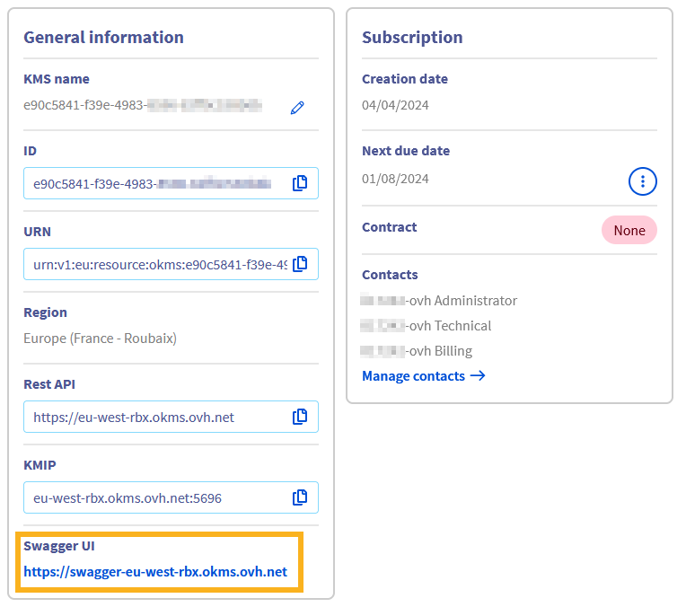
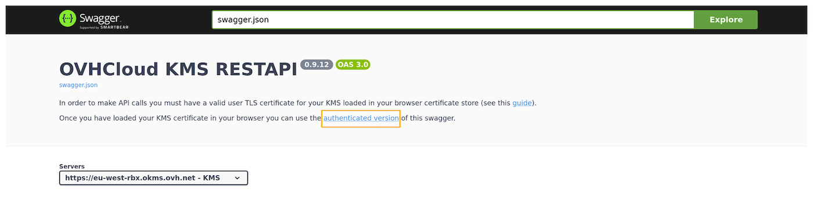
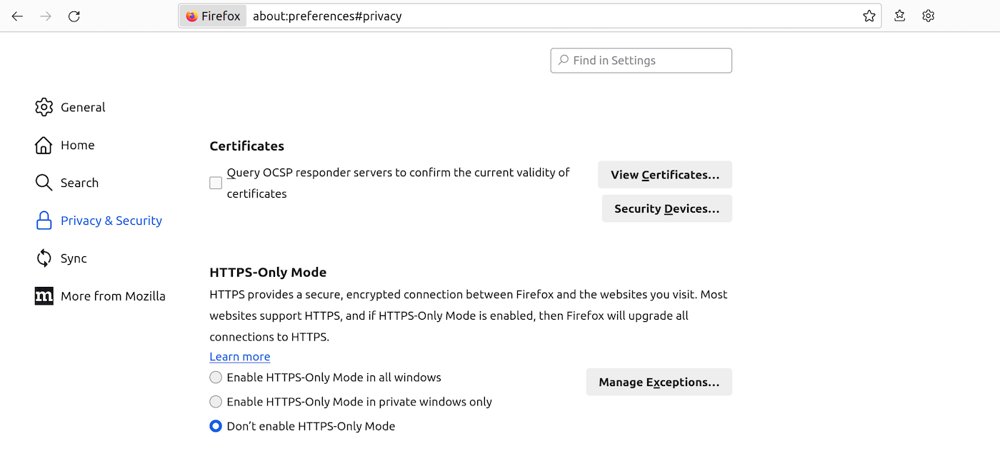
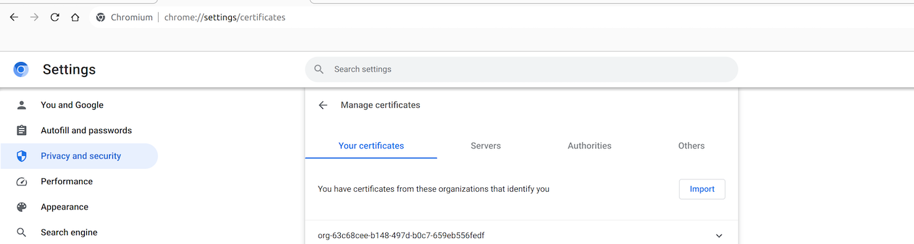
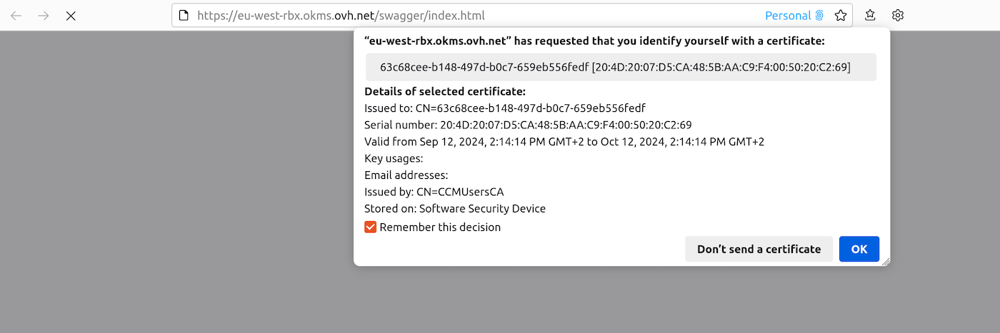
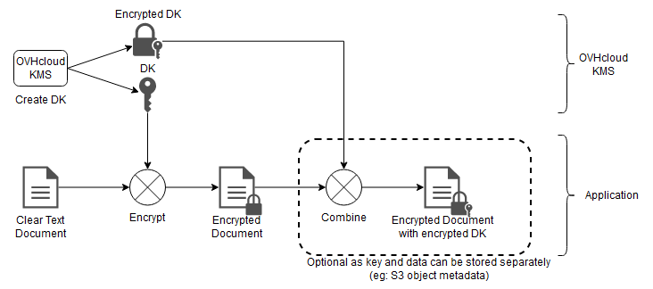
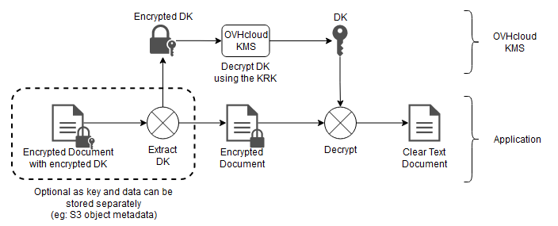

> [!warning]
>
> Le KMS OVHcloud est actuellement en phase bêta. Ce guide peut donc être incomplet et sera mis à jour lors de la bêta.
> N’hésitez pas à nous faire des retours sur le canal Discord dédié : <https://discord.gg/ovhcloud>.
>

## Objectif

L'objectif de ce guide est de présenter les différentes étapes pour interagir avec le KMS OVHcloud pour chiffrer ou signer vos données.

## Prérequis

- Disposer d'un [compte client OVHcloud](/pages/account_and_service_management/account_information/ovhcloud-account-creation).
- Avoir [commandé un KMS OVHcloud et créer un certificat d'accès](/pages/manage_and_operate/kms/quick-start)

## En pratique

### Communiquer avec le KMS

La communication avec le KMS pour les actions de chiffrement et de signature est disponible uniquement par API.

Le KMS étant régionalisé, l'accès à l'API se fait directement sur la région de celui-ci : <https://my-region.okms.ovh.net>

Par exemple, pour un KMS créé sur la région **eu-west-rbx** : <https://eu-west-rbx.okms.ovh.net>

Il est aussi possible d'utiliser le SDK en Golang dont la documentation est accessible sur le lien suivant : <https://pkg.go.dev/github.com/ovh/okms-sdk-go>

### Utilisation de l'API KMS via l'interface utilisateur Swagger

Il est possible d'accéder au swagger correspondant à votre KMS en cliquant sur le lien présent dans l'espace client au niveau du dashboard de votre KMS.

{.thumbnail}

Vous atterrirez sur la version non authentifiée de l'interface utilisateur Swagger, qui est destinée à la documentation de l'API. Si vous souhaitez utiliser la Swagger UI pour effectuer des requêtes sur votre propre KMS, vous devrez basculer vers la version authentifiée, dont le lien se trouve dans la section description:

{.thumbnail}

Les étapes suivantes vous guideront sur la façon de vous authentifier.

#### Importation de vos informations d'identification KMS dans le navigateur

Pour accéder à l'interface utilisateur Swagger authentifiée, vous devez charger votre certificat d'accès KMS dans le gestionnaire de certificats du navigateur.

Pour cela, il faut le convertir au format PKCS#12. PKCS#12 est un format binaire permettant de stocker une chaîne de certificats et une clé privée dans un seul fichier chiffré. Il est couramment utilisé pour importer et exporter des certificats et des clés privées, en particulier dans les environnements qui nécessitent un transport sécurisé de ces éléments, tels que les serveurs Web et les applications clientes.

Pour convertir vos informations d'identification KMS (normalement nommés `ID_certificate.pem` et `ID_privatekey.pem`) en PKCS#12 avec la CLI openssl, utilisez la commande suivante:

```bash
openssl pkcs12 -export -in ID_certificate.pem  -inkey ID_privatekey.pem -out client.p12
```

Vous serez invité à entrer un mot de passe qui sera utilisé pour le chiffrement symétrique du contenu du fichier.
Ensuite, vous devez l'importer dans votre navigateur Web.

##### Sur Firefox

- Tapez `about:preferences#privacy` dans la barre d'adresse.
- Faites défiler vers le bas jusqu'à atteindre une section intitulée `Certificates`{.action}.

{.thumbnail}

- Cliquez sur `View Certificates...`{.action} pour ouvrir le gestionnaire de certificats.
- Accédez à l'onglet intitulé `My Certificates`{.action}, puis `Import...`{.action} et sélectionnez l'emplacement de votre fichier `client.p12`.
- Vous serez invité à entrer le mot de passe que vous avez utilisé lors de la création du fichier PKCS#12.
- Après avoir entré le mot de passe, votre certificat sera importé et prêt à l'emploi.

##### Sur Chrome/Chromium

- Tapez `chrome://settings/certificates` dans la barre d'adresse.
- Accédez à l'onglet `Your certificates`{.action}. Cliquez sur `Import`{.action} et sélectionnez votre fichier `client.p12`.
- Vous serez invité à entrer le mot de passe que vous avez utilisé lors de la création du fichier PKCS#12.
- Après avoir entré le mot de passe, votre certificat sera importé et prêt à l'emploi.

{.thumbnail}

#### Accès à l'interface utilisateur Swagger authentifiée

Une fois votre certificat chargé dans votre navigateur, vous pouvez accéder à l'interface utilisateur Swagger authentifiée.

Vous serez invité à vous identifier avec un certificat. Sélectionnez le certificat PKCS#12 précédemment importé dans la liste déroulante.

{.thumbnail}

Vous pouvez maintenant utiliser l'interface utilisateur Swagger de manière interactive.

### Créer une clé de chiffrement par API

La création d'une clé peut être faite soit à travers les [API OVHcloud](https://eu.api.ovh.com/console/?section=%2Fokms&branch=v2) soit sur les API spécifiques au KMS OVHcloud. Il n'y a pas de différences sur le résultat selon la méthode de création.

Dans le cas des API spécifiques au KMS OVHcloud, la création d'une clé se fait par l'API suivante :

|**Méthode**|**Chemin**|**Description**|
| :-: | :-: | :-: |
|POST|/v1/servicekey|Créer ou importer une CMK|

L'API attend les valeurs suivantes :

|**Champ**|**Valeur**|**Description**|
| :-: | :-: | :-: |
|name|string|Nom de la clé|
|context|string|Donnée d'identification complémentaire permettant de vérifier l'authenticité de la clé|
|type|oct, RSA, EC|Type de la clé : Octet sequence (oct) for symmetric keys, RSA (RSA), Elliptic Curve (EC)|
|size|Integer|Taille de la clé - voir table de correspondance ci-dessous|
|operations|Array|Usage de la clé - voir table de correspondance ci-dessous|
|crv|P-256, P-384, P-521|(optionnel) Courbe cryptographique pour les clés de type EC|

**Exemple de création de clé symétrique :**

```json
{
  "name": "My first AES key",
  "context": "project A",
  "type": "oct",
  "size": 256,
  "operations": [
    "encrypt",
    "decrypt"
  ]
}
```

**Exemple de création de clé asymétrique :**

```json
{
  "name": "My first RSA key",
  "context": "project A",
  "type": "RSA",
  "size": 4096,
  "operations": [
    "sign",
    "verify"
  ]
}
```

**Exemple de création de clé EC :**

```json
{
  "name": "My first EC key",
  "context": "project A",
  "type": "EC",
  "operations": [
    "sign",
    "verify"
  ],
  "crv": "P-256"
}
```

Les tailles et opérations possibles en fonction du type de clé sont les suivantes :

- **oct** :
    - taille : 128, 192, 256
    - opérations :
        - encrypt, decrypt
        - wrapKey, unwrapKey
- **RSA** :
    - taille : 2048, 3072, 4096
    - opérations : sign, verify
- **EC** :
    - taille : ne pas spécifier
    - curve : P-256, P-384, P-521
    - opérations : sign, verify

#### Importer une clé de chiffrement

A la création d'une clé, il est possible d'importer une clé existante.

Pour cela il est possible d'ajouter un champ complémentaire **keys** dans le corps de la requête :

```json
{
  "name": "My imported key",
  "keys": [
    {
      "kid": "string",
      "use": "string",
      "key_ops": [
        "string"
      ],
      "alg": "string",
      "kty": "oct",
      "n": "string",
      "e": "string",
      "k": "string",
      "crv": "string",
      "x": "string",
      "y": "string",
      "d": "string",
      "dp": "string",
      "dq": "string",
      "p": "string",
      "q": "string",
      "qi": "string"
    }
  ]
}
```

La clé doit être au format JSON Web Key (JWK). La valeur des champs contenus dans le tableau suit la documentation de la [RFC 7518](https://www.rfc-editor.org/rfc/rfc7518.html).

#### Gérer les clés de chiffrement

Afin de gérer les clés de chiffrement, plusieurs API sont disponibles :

|**Méthode**|**Chemin**|**Description**|
| :-: | :-: | :-: |
|GET|/v1/servicekey|Liste les clés de chiffrement disponibles|
|DELETE|/v1/servicekey/{keyId}/delete|Supprime une clé de chiffrement|
|POST|/v1/servicekey/{keyId}/activate|Active une clé de chiffrement|
|POST|/v1/servicekey/{keyId}/deactivate|Désactive une clé de chiffrement|

La désactivation d'une clé de chiffrement implique que celle-ci ne sera plus utilisable, bien que la clé reste présente dans le KMS.<br>
La suppression d'une clé de chiffrement n'est possible que sur une clé préalablement désactivée.

> [!warning]
>
> La suppression d'une clé de chiffrement est définitive. Toutes les données chiffrées à l'aide de celle-ci seront définitivement inaccessibles.
>

### Chiffrer une donnée avec le KMS

#### Chiffrement sur le KMS

Le KMS OVHcloud dispose d'une API de chiffrement dédiée pour le chiffrement de petits volumes de données (moins de 4 kB).<br>
Il s'agit de la méthode la plus simple, mais qui ne présente pas les meilleures performances.

|**Méthode**|**Chemin**|**Description**|
| :-: | :-: | :-: |
|POST|/v1/servicekey/{keyId}/encrypt|Chiffrement de données avec une CMK|

L'API attend les valeurs suivantes :

|**Champ**|**Valeur**|**Description**|
| :-: | :-: | :-: |
|plaintext|string|Donnée à chiffrer|
|context|string|Donnée d'identification complémentaire permettant de vérifier l'authenticité de la donnée|

**Exemple de chiffrement**

```json
{
  "plaintext": "My secret data",
  "context": "Project A"
}
```

L'API renvoyant ensuite la donnée chiffrée dans un champ **ciphertext** :

```json
{
  "ciphertext": "Encrypted data",
}
```

Le déchiffrement de la donnée se faisant à l'inverse via l'API :

|**Méthode**|**Chemin**|**Description**|
| :-: | :-: | :-: |
|POST|/v1/servicekey/{keyId}/decrypt|Déchiffrement de données avec une CMK|

L'API attend les valeurs suivantes :

|**Champ**|**Valeur**|**Description**|
| :-: | :-: | :-: |
|ciphertext|string|Donnée à déchiffrer|
|context|string|Donnée d'identification complémentaire permettant de vérifier l'authenticité de la donnée|

Le champ **context** devant avoir la même valeur que celle donnée lors du chiffrement.

#### Chiffrement avec une Data Key (DK)

Pour plus de performances, il est possible de générer une Data Key (DK) depuis une clé symétrique (AES) pour l'utiliser depuis votre application.

{.thumbnail}

La génération d'une DK se fait par l'API suivante :

|**Méthode**|**Chemin**|**Description**|
| :-: | :-: | :-: |
|POST|/v1/servicekey/{keyId}/datakey|Générer une DK dérivée d'une CMK|

L'API attend les valeurs suivantes :

|**Champ**|**Valeur**|**Description**|
| :-: | :-: | :-: |
|name|string|Nom de la clé|
|size|Integer|Taille de la clé (64-4096)|

**Exemple de génération de Data Key :**

```json
{
  "name": "My Data Key",
  "size": 4096
}
```

L'API renverra ensuite la Data Key :

```json
{
  "key": "string",
  "plaintext": "string"
}
```

- **key** : clé chiffrée encodée en base64. Cette information doit être stockée avec la donnée chiffrée et sera utilisée pour le déchiffrement par le KMS.
- **plaintext** : clé en clair encodée en base64. Cette information doit être supprimée une fois le chiffrement effectué et ne doit pas être sauvegardée.

L'utilisation de la Data Key se fait ensuite à travers des algorithmes de chiffrement comme AES-GCM qui n'est pas couvert par cette documentation.

{.thumbnail}

Inversement, il est possible de récupérer la version déchiffrée d'une Data Key via l'API suivante :

|**Méthode**|**Chemin**|**Description**|
| :-: | :-: | :-: |
|POST|/v1/servicekey/{keyId}/datakey/decrypt|Déchiffrement d'une DK|

L'API attend les valeurs suivantes :

|**Champ**|**Valeur**|**Description**|
| :-: | :-: | :-: |
|key|string|Data Key chiffrée|

Et renvoie la Data Key déchiffrée dans un champ **plaintext**.

### Signer avec le KMS

La signature de fichier se fait à l'aide de la clé privée d'une paire de clés asymétriques.

#### Algorithmes supportés

Le KMS OVHcloud supporte la liste d'algorithmes de signature suivante :

- **RSASSA-PKCS1 v1.5**

|**Nom**|**Digital Signature Algorithm**|
| :-: | :-: |
|RS256|RSASSA-PKCS1-v1_5 using SHA-256|
|RS384|RSASSA-PKCS1-v1_5 using SHA-384|
|RS512|RSASSA-PKCS1-v1_5 using SHA-512|

Suivant la documentation de la [RFC 7518](https://www.rfc-editor.org/rfc/rfc7518#section-3.3).

- **ECDSA**

|**Nom**|**Digital Signature Algorithm**|
| :-: | :-: |
|ES256|ECDSA using P-256 and SHA-256|
|ES384|ECDSA using P-384 and SHA-384|
|ES512|ECDSA using P-521 and SHA-512|

Suivant la documentation de la [RFC 7518](https://www.rfc-editor.org/rfc/rfc7518#section-3.4).

- **RSASSA-PSS**

|**Nom**|**Digital Signature Algorithm**|
| :-: | :-: |
|PS256|RSASSA-PSS using SHA-256 and MGF1 with SHA-256|
|PS384|RSASSA-PSS using SHA-384 and MGF1 with SHA-384|
|PS512|RSASSA-PSS using SHA-512 and MGF1 with SHA-512|

Suivant la documentation de la [RFC 7518](https://www.rfc-editor.org/rfc/rfc7518#section-3.5).

#### Signature d'un message

Etant donné que la clé privée ne peut être extraite du KMS, la signature ne peut se faire que directement auprès du KMS.

|**Méthode**|**Chemin**|**Description**|
| :-: | :-: | :-: |
|POST|/v1/servicekey/{keyId}/sign|Signature d'un ficher|

L'API attend les valeurs suivantes :

|**Champ**|**Valeur**|**Description**|
| :-: | :-: | :-: |
|message|string|Message à signer en format base64|
|alg|string|Algorithme de signature|
|isdigest|boolean|Indique si le message est déjà hashé|

**Exemple de signature :**

```json
{
  "message": "SGVsbG8gV29ybGQ=",
  "alg": "RS256",
  "isdigest": false
}
```

L'API renverra ensuite la signature du fichier :

```json
{
  "signature": "EmUGXC6rsFTWtmFn77y6NS/U6IuhThApVKWTZdXjE7rDMonRPPxbjTo01HQN62J3Dxqyw=="
}
```

#### Vérification d'un fichier

La vérification d'un fichier peut se faire soit directement auprès du KMS, soit en utilisant la clé publique.

Auprès du KMS, il est possible d'utiliser l'API suivante :

|**Méthode**|**Chemin**|**Description**|
| :-: | :-: | :-: |
|POST|/v1/servicekey/{keyId}/verify|Vérification d'une signature|

L'API attend les valeurs suivantes :

|**Champ**|**Valeur**|**Description**|
| :-: | :-: | :-: |
|message|string|Message à signer|
|signature|string|Signature associée au message|
|alg|string|Algorithme de signature|
|isdigest|boolean|Indique si le message est déjà hashé|

**Exemple de vérification**

```json
{
  "message": "SGVsbG8gV29ybGQ=",
  "signature": "EmUGXC6rsFTWtmFn77y6NS/U6IuhThApVKWTZdXjE7rDMonRPPxbjTo01HQN62J3Dxqyw==",
  "alg": "RS256",
  "isdigest": false
}
```

L'API renverra ensuite le résultat de la vérification :

```json
{
  "result": true
}
```

## Aller plus loin

Échangez avec notre [communauté d'utilisateurs](/links/community).
