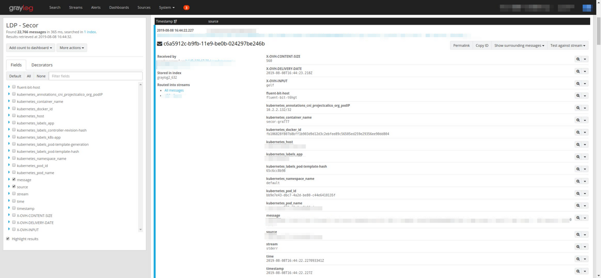

## Objective

In this tutorial, you will learn how to collect logs from pods in a Kubernetes cluster and send them to Logs Data Platform.

[Kubernetes](https://kubernetes.io/){.external} is the de facto standard to manage containerized applications on cloud platforms. It is open source, has a large ecosystem, and has an ever-growing community. Kubernetes is great but once your containers go live in the cloud, you still want to monitor their behavior. The more containers you have, the more difficult it can be to navigate through the logs and have a clear picture of what's happening. How can you centralize all your Kubernetes pods logs in one place and analyze them easily ? By using Logs Data Platform with the help of Fluent Bit. [Fluent Bit](https://fluentbit.io/) is a fast and lightweight log processor and forwarder. It is open source, cloud oriented and a part of the [Fluentd](https://fluentd.org/){.external} ecosystem. This tutorial will help you to configure it for Logs Data Platform, you can of course apply it to our [fully managed Kubernetes offer](https://www.ovhcloud.com/asia/public-cloud/kubernetes/){.external}.

## Requirements

Note that in order to complete this tutorial, you should have at least:

- [Activated your Logs Data Platform account.](https://www.ovh.co.uk/order/express/#/new/express/resume?products=~%28~%28planCode~%27logs-account~productId~%27logs%29){.external}
- [Created at least one Stream and get its token.](/pages/manage_and_operate/observability/logs_data_platform/getting_started_quick_start)
- A working kubernetes cluster with some pods already logging to stdout.
- 15 minutes.

## Preparation

Before we dive into this tutorial, it is important to understand how we will deploy Fluent Bit. The configuration of Fluent Bit will be similar to the one you can find in the [official documentation](https://docs.fluentbit.io/manual/installation/kubernetes). Fluent Bit will be deployed as a *DaemonSet* in every node of the kubernetes cluster through a [Helm installation](https://helm.sh). Helm is a package manager for Kubernetes which can simplify the deployment of applications on Kubernetes. Fluent Bit will read, parse and ship every log of every pod of your cluster by default. It will also enrich each log with precious metadata like pod name and id, container name and ids, labels and annotations. As stated in the Fluent Bit documentation, a built-in Kubernetes filter will use Kubernetes API to gather some of this information. This configuration has been tested with kubernetes 1.30 and Fluent Bit image 2.2.2

## Instructions

We will configure Fluent Bit with these steps:

- Create the logging namespace where the Fluent Bit deployment will live.
- Define the Helm values which will be used in the Fluent Bit configuration
- Install the DaemonSet with Helm to launch Fluent Bit

### Namespace

Run the following commands to create the namespace of Fluent Bit

```bash
kubectl create namespace logging
```

### Configuration

Once the namespace is created, we can proceed to the next steps: define a secret for the *X-OVH-TOKEN* value of your stream token.

#### Token Secret creation

There are several methods to create a secret in Kubernetes. For brevity's sake, we will use the one-liner version of secret creation.

```bash
kubectl --namespace logging create secret generic ldp-token --from-literal=ldp-token=<your-token-value>
```

We create a *ldp-token* secret with only one key named *ldp-token* as the value of our token. Replace the *your-token-value* value with the value of your token.

#### Helm Values

The Helm installation is documented here: [https://docs.fluentbit.io/manual/installation/](https://docs.fluentbit.io/manual/installation/kubernetes). We will customize the values used by the Helm installation in order to change the configuration of Fluent Bit before its deployment.

The default values in the configuration file of the Helm package are located here: [https://github.com/fluent/helm-charts/blob/main/charts/fluent-bit/values.yaml](https://github.com/fluent/helm-charts/blob/main/charts/fluent-bit/values.yaml).

For brevity's sake, we will just detail the part where we change the default values. Make sure to check the default values in the whole file to adapt it to your Kubernetes configuration.

Look for the *env:* configuration in the file and add the following values to use your secret as an environment variable.

```yaml
env:
   - name: FLUENT_LDP_TOKEN
     valueFrom:
         secretKeyRef:
             name: ldp-token
             key: ldp-token
```

We now need to add several filters in order to add the token and format logs records for the GELF output of Fluent Bit.


```yaml
  filters: |
    [FILTER]
        Name kubernetes
        Match kube.*
        Merge_Log On
        Keep_Log Off
        K8S-Logging.Parser On
        K8S-Logging.Exclude On

    [FILTER]
        Name record_modifier
        Match *
        Record X-OVH-TOKEN ${FLUENT_LDP_TOKEN}

    [FILTER]
        Name nest
        Match *
        Wildcard pod_name
        Operation lift
        Nested_under kubernetes
        Add_prefix kubernetes_

    [FILTER]
        Name modify
        Match *
        Copy kubernetes_pod_name host

    [FILTER]
        Name modify
        Match *
        Add log "none"
```

- The first filter parses the incoming messages and add all metadata information (pod, container, images).
- The second filter adds the **X-OVH-TOKEN** by using the environment variable we configured earlier.
- The third filter ensures all kubernetes metadata are flattened on the first level of the record so that they could be used as fields.
- The fourth filter copies the name of the pod in the key **host** so that this value is properly set. You are free to use any other metadata value that will suit your needs here.
- The final filter ensures there is always a value for the field log. This field will be used as the *short_message* key for the GELF output and thus cannot be empty. Some softwares might have their log messages in another field than *log*. This will prevent these log messages from being lost.

Now we can provide the output configuration that will send logs to Logs Data Platform in GELF format.

```yaml
    [OUTPUT]
        Name gelf
        Match kube.*
        Host graX.logs.ovh.com
        Port 12202
        Mode tls
        tls On
        Compress False
        Gelf_Short_Message_Key log
```

In this [GELF output configuration](https://docs.fluentbit.io/manual/pipeline/outputs/gelf) we use the address **graX.logs.ovh.com**. Please change it to the actual address of your Logs Data Platform account. The port used is the one for GELF and *tls* is activated. Note that *Gelf_Short_Message_Key* is put to **log**, because that's where the main kubernetes log field is.

### Launch Fluent Bit

You must first add the Helm repository with the following command:

```bash
helm repo add fluent https://fluent.github.io/helm-charts
```

Then use the following helm command to deploy Fluent Bit on your platform:

```bash
helm upgrade --install --namespace logging  -f values.yaml fluent-bit fluent/fluent-bit
```

**values.yaml** is the file that contains the modified configuration.

Verify that the pods are running correctly with the command:

```bash
kubectl get pods --namespace logging
```

You can now fly to the stream interface to witness your beautifully structured logs.

{.thumbnail}

And that's it. Your kubernetes activity is now perfectly logged in one place. Happy Logging !!

## Go further

- Getting Started: [Quick Start](/pages/manage_and_operate/observability/logs_data_platform/getting_started_quick_start)
- Documentation: [Guides](/products/observability-logs-data-platform)
- Community hub: [https://community.ovh.com](https://community.ovh.com/en/c/Platform/data-platforms){.external}
- Create an account: [Try it!](https://www.ovh.com/fr/order/express/#/express/review?products=~(~(planCode~'logs-account~productId~'logs))){.external}
