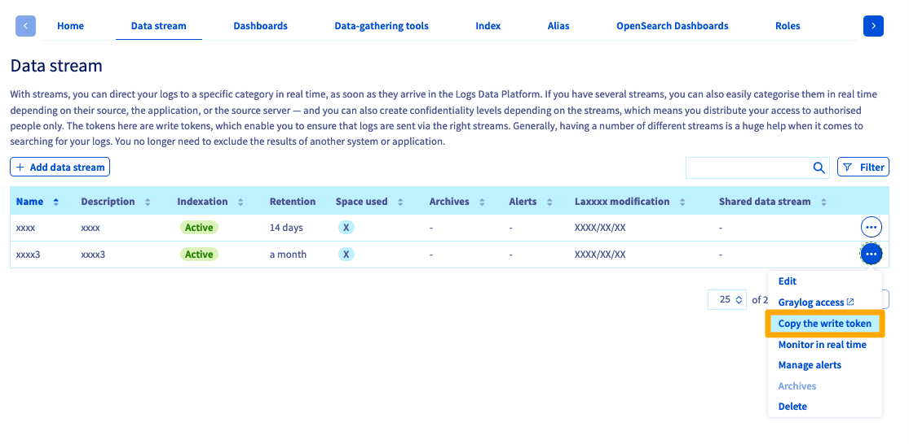

## Objective

This guide will help you understand how to use the mutualized inputs of Logs Data Platform to ingest your logs to the platform.
 
*Inputs* are the components from Logs Data Platform that you connect to ingest your logs in the platform. In this guide, we focus specifically on the mutualized inputs that are available to everyone by default.

## Prerequisites

Before reading this documentation, you should:

- Have read the [introduction to Logs Data Platform](/pages/manage_and_operate/observability/logs_data_platform/getting_started_introduction_to_LDP)
- Have read the [quick start to Logs Data Platform](/pages/manage_and_operate/observability/logs_data_platform/getting_started_quick_start)
- Have created and configured a Logs Data Platform account
- Have created a Logs Data Platform stream

## Instructions

### Why different inputs?

Logs Data Platform imposes a few [constraints](/pages/manage_and_operate/observability/logs_data_platform/getting_started_field_naming_convention) as to how your logs are structured to guarantee an efficient and optimal indexation of the logs you are sending to us. The different inputs are responsible for enforcing those constraints regardless of the compatible format that you give to your logs and converting them to a common format before storing them in the platform.

The log formats that are accepted by Logs Data Platform are the following:

- **GELF**: This is the native format of logs used by Graylog. This JSON format allows you to send logs really easily. See the [GELF Payload Specification](https://go2docs.graylog.org/4-x/getting_in_log_data/gelf.html?tocpath=Getting%20in%20Log%20Data%7CLog%20Sources%7CGELF%7C_____0#GELFPayloadSpecification){.external}. The GELF input only accepts a null (`\0`) delimiter.
- **LTSV**: This simple format is very efficient and human readable. You can learn more about it [here](http://ltsv.org){.external}. LTSV has two inputs that accept a line delimiter or a null delimiter.
- **RFC 5424**: This format is commonly used by logs utilities such as syslog. It is extensible enough to allow you to send all your data. More information about it can be found [here](https://tools.ietf.org/html/rfc5424){.external}.
- **Cap'n'Proto**: The most efficient log format. This is a binary format that allows you to maintain a low footprint and high speed performance. For more information, check out the official website: [Cap'n'Proto](https://capnproto.org/){.external}.
- **Beats**: A secure and reliable protocol used by the beats family in the Elasticsearch ecosystem (Ex: [Filebeat](/pages/manage_and_operate/observability/logs_data_platform/ingestion_filebeat), [Metricbeat](https://www.elastic.co/beats/metricbeat){.external}, [Winlogbeat](https://www.elastic.co/beats/winlogbeat){.external}).

### Mutualized vs Dedicated inputs

This guide describes how the mutualized inputs that are by default included in the platform work. Before going on with the guide, here is a reminder of the few characteristics of dedicated inputs that differentiate them from the mutualized ones:

- They are optional, and charged on a *per-input* basis.
- You can choose which port they listen to.
- You can filter IP addresses that are allowed to send logs.
- You can choose to run Logstash or Flowgger. You can configure their sources as well as transform the logs they ingest before storing them in Logs Data Platform.

As you can see, mutualized inputs allow you more flexibility in how you handle your logs at ingestion as well as more security features. If you need any of these features, you should look at the documentation for [dedicated inputs](/pages/manage_and_operate/observability/logs_data_platform/ingestion_logstash_dedicated_input).

### Ingesting Logs

There are two main ways to ingest the logs generated by your systems or applications in Logs Data Platform:

- Use logs exporter softwares that parse log files that are locally stored on your filesystem, format the logs if necessary and connect to Logs Data Platform's inputs to send the logs. You will find separate documentations for such widely-used softwares: [Filebeat](/pages/manage_and_operate/observability/logs_data_platform/ingestion_filebeat), [syslog-ng](/pages/manage_and_operate/observability/logs_data_platform/ingestion_syslog_ng), [NXLog](/pages/manage_and_operate/observability/logs_data_platform/ingestion_windows_nxlog), and the following documentation should allow you to configure any other similar software.
- Use libraries in your own software that can directly send logs to Logs Data Platform. We have some documentation that can help you through this process if you use [Python 2](/pages/manage_and_operate/observability/logs_data_platform/ingestion_python_2_djehouty),[Python 3](/pages/manage_and_operate/observability/logs_data_platform/ingestion_python_3_logging_ldp) or [Rust](/pages/manage_and_operate/observability/logs_data_platform/ingestion_rust_loggers) though any other library that is compatible with the [OpenSearch API](/pages/manage_and_operate/observability/logs_data_platform/ingestion_opensearch_api_mutualized_input) can be used.

Whatever the choice you make, you will have to properly configure your software or libraries to send your logs to Logs Data Platform. The following section will help you find the information relevant to that purpose.

### Configuring your software

To configure your software, you need the following information:

- *Input endpoint URL*: the endpoint URL has the form *XXX.logs.ovh.com*, *XXX* corresponding to the cluster you are assigned to. It can be found in your OVHcloud Control Panel on the home page of your Logs Data Platform account.

- *Input endpoint port*: the port to which your software must connect to depends on the format of your logs, and whether or not you use a secured transport layer. The table below describes the matching between port and log format, but you will also find this information in your OVHcloud Control Panel.

||Syslog RFC5424|Gelf|LTSV line|LTSV nul|Cap’n’Proto|Beats|
|---|---|---|---|---|---|---|
|TCP/TLS|6514|12202|12201|12200|12204|5044|
|TCP|514|2202|2201|2200|2204|---|
|UDP|514|2202|2201|2200|2204|---|

- *Certificate*: if you use a secured transport layer, the certificates can also be found in the OVHcloud Control Panel.

- *X-OVH-TOKEN*: the X-OVH-token is used to dispatch the logs you ingest into Logs Data Platform to the correct log stream. You can find the X-OVH-TOKEN corresponding to your stream in the in the *Data stream* section of the OVHcloud Control Panel.

If your software interacts directly with the OpenSearch API, please follow [this documentation](/pages/manage_and_operate/observability/logs_data_platform/ingestion_opensearch_api_mutualized_input).

You should now have every information you need to configure your software to ingest logs in Logs Data Platform.

## Go Further

[Ingest your logs with Filebeat](/pages/manage_and_operate/observability/logs_data_platform/ingestion_filebeat)   
[Ingest your logs with syslog-ng](/pages/manage_and_operate/observability/logs_data_platform/ingestion_syslog_ng)   
[Ingest your logs with NXLog](/pages/manage_and_operate/observability/logs_data_platform/ingestion_windows_nxlog)  
[Push your logs with the OpenSearch API](/pages/manage_and_operate/observability/logs_data_platform/ingestion_opensearch_api_mutualized_input)  
[Python 2 SDK](/pages/manage_and_operate/observability/logs_data_platform/ingestion_python_2_djehouty) 
[Python 3 SDK](/pages/manage_and_operate/observability/logs_data_platform/ingestion_python_3_logging_ldp)  
[Rust SDK](/pages/manage_and_operate/observability/logs_data_platform/ingestion_rust_loggers)  
[Ingest the logs from your Kubernetes cluster](/pages/manage_and_operate/observability/logs_data_platform/ingestion_kubernetes_fluent_bit)  

