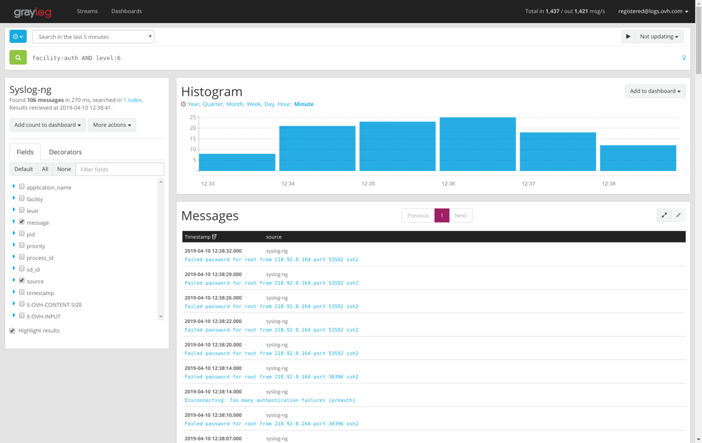

## Objective

You have a server, a raspberry pi, a cloud instance or something else running on **Linux** and you want to follow your Logs, the easy way? You have never installed a log collector and you're new to Graylog?

Then this tutorial is for you!

In this tutorial will show you how to send Logs from your Linux instance to Logs Data Platform. Don't be afraid, it will be easier than you think.

## Requirements

- A **Linux** based instance (server, VPS, Cloud instance, Raspberry Pi, ...). Command lines will be for **DEBIAN 12** in this tutorial
- A root access to this instance
- [Activated your Logs Data Platform account](https://www.ovh.com/fr/order/express/#/new/express/resume?products=~%28~%28planCode~%27logs-account~productId~%27logs%29){.external}
- [To create at least one Stream and get its token](/pages/manage_and_operate/observability/logs_data_platform/getting_started_quick_start)

## Instructions

### Why?

On Linux, logs are generated automatically, for a variety of actions. Excessive resource usage, file downloads, login attempts, network failure, ... almost everything. But logs can be difficult to read without proper tools. With this platform, you'll be able to sort logs and create useful (or fancy) dashboards.

### What are logs?

Here are some example logs from an OVHcloud Public Cloud instance on **Debian 12**:

```text
 Jan 27 12:21:15 server syslog-ng[29512]: syslog-ng starting up; version='3.8.1'
 Jan 27 12:21:15 server syslog-ng[29512]: Syslog connection established; fd='10', server='AF_INET(51.38.195.65:6514)', local='AF_INET(0.0.0.0:0)'
 Jan 29 15:32:23 server sshd[9563]: Received disconnect from 211.110.82.180: 11: Bye Bye [preauth]
 Jan 29 18:39:24 server sshd[29694]: Failed password for root from 59.45.79.51 port 39827 ssh2
```

Conclusion: lot of info, with a date, a process, a description. but hard to follow.

### Configure your Account

First thing to do is to configure your Logs Data Platform account: [create your user](https://www.ovh.com/fr/order/express/#/express/review?products=~(~(planCode~'logs-account~productId~'logs)){.external}, a stream and a dashboard. Verify that everything works already perfectly. We wrote an independent guide for this, please read it and come back here after : [Quick start.](/pages/manage_and_operate/observability/logs_data_platform/getting_started_quick_start) Read it? Let's go to the next step then !

### Install and configure a log collector

So let's assume you have your Linux. This tutorial **DOES NOT** fully cover how to configure other flavors of syslog nor other OSs. Please refer to their own documentation to know how to setup a source, filter and an external destination for the logs. You can still read this entire document to have a grasp on how the configuration is built. However this configuration should work on any syslog-ng version above 3.12.1.

We will install a log collector. What is it? It's a tool that collects logs from any source, processes them and delivers them to various destinations, like the Logs Data Platform.

In this section we will install Syslog-ng:

- Log in your Linux
- Install syslog-ng and the last certificates
- Check that your syslog-ng version is above 3.12.1 (use **syslog-ng --version** to confirm it).

```shell-session
$ debian@server:~$ sudo apt-get install syslog-ng ca-certificates
```

- Once it's done we will configure it to deliver logs to the platform
- Create a new syslog-ng configuration file ldp.conf with a text editor (here we use nano for example)

```shell-session
$ debian@server:~$ sudo nano /etc/syslog-ng/conf.d/ldp.conf
```

- Copy-paste this configuration. Don't forget to replace the **<YOUR X-OVH-TOKEN VALUE>** with your stream write token and **<YOUR LDP CLUSTER>** with your Logs Data Platform cluster address.

```console
rewrite ovh-token {
    # This will add X-OVH-TOKEN as custom structured data specified by the RFC 5424.
    # change <YOUR X-OVH-TOKEN VALUE> by the value of your X-OVH-TOKEN.
    set("<YOUR X-OVH-TOKEN VALUE>", value(".SDATA.token@29084.X-OVH-TOKEN"));
};

destination ovhPaaSLogs {
    # Change <YOUR LDP CLUSTER> by your Logs Data Platform cluster address.
    # The Adress can be found in your Logs Data Platform Manager
    # Your LDP Cluster address has the following form: <RegionX>.logs.ovh.com
    network("<YOUR LDP CLUSTER>"
        port(6514)
        transport("tls")
        flags(syslog-protocol)
        ts_format("iso")
        frac-digits(6)
        tls(peer-verify("required-trusted") ca_dir("/etc/ssl/certs/"))
        keep-alive(yes)
        so_keepalive(yes)
    );
};

## you can use this destination for debugging purpose
#destination debugfile {
#    file("/var/log/debugpaaslogs.log"
#      flags(syslog-protocol)
#    );
#};

log { source(s_src); rewrite(ovh-token); destination(ovhPaaSLogs); };
#log { source(s_src); rewrite(ovh-token); destination(debugfile); };
```

> [!warning]
>
> If you push your syslog-ng logs to one of your **dedicated data gathering tool**, you will need to perform an extra step.
>
> - Copy the **data-gathering tools certificate** from the manager Home page in SSL Configuration section, and paste it in file "/usr/local/share/ca-certificates/ldp.pem"
> - Ensure the permission on this file is 644
> 
> <pre class="highlight language-console"><code class="language-console">$ debian@server:~$ sudo chmod 644 /usr/share/ca-certificates/ldp.pem</code></pre>
> 
> - Import this certificate to your system's trusted CA repository
> 
> <pre class="highlight language-console"><code class="language-console">$ debian@server:~$ sudo update-ca-certificates</code></pre>
> 

Let's review this configuration.

**REWRITE**: this will set your X-OVH-TOKEN as an RFC 5424 structured data. You can retrieve your stream write token by going to `Stream page`{.action} in the OVHcloud Control Panel and select **Copy the write token** from the desired stream.

**DESTINATION**: This is where we will deliver logs in nearly real time. Here, we have two destinations: The first is the remote endpoint in Logs Data Platform, the second one in comment is a local file for debugging purpose only. You can find your Logs Data Platform cluster address by going to `Home page`{.action} in the OVHcloud Control Panel in **access point** configuration. For debugging purposes, you can uncomment the "debugfile" section to check if the whole pipeline is working properly. It will write to local file destination. Since local file writing might consume a lot of I/O resources, we recommend to not use this debugging output in production.

**LOG**: This directive specifies the whole pipeline: "s_src" => "ovh-token" => "ovhPaasLogs".


- Save the file, close nano and restart syslog-ng.

```shell-session
$ debian@server:~$ sudo systemctl restart syslog-ng.service
```

### Let's play with Graylog Dashboards

Let's recap: you have a Linux instance, and it's sending log locally and remotely, thanks to the syslog-ng log collector. We send two types of flows: internal() and system()

The last step is to create a dashboard displaying the results:

- Connect to the Logs Data Platform manager, ensure that you have a Stream and that the token in the syslog configuration file is OK. Ensure that you have a Dashboard created.
- Head to your stream by using the button `Graylog access`{.action} located in the **...** menu of your stream, or head directly to the graylog access of your cluster.
- Once in Graylog, Go in Stream Tab, click on your stream. In the top-left corner, chose a 1 Day range and click on the green button to search.
- You should have some results like this:

{.thumbnail}

- On the top right corner of the histogram, click on `Add to dashboard`{.action}.

Alright, you just created the first widget in your dashboard. Now, let's create a Pie chart:

- On the left, click on the small blue triangle before "facility"
- Click on "Quick Values"
- A pie chart will appear, you can also add it to your dashboard

Well done, second Widget added!

The best feature is the ability to mix criteria, based on what is important to you. For example, `facility:auth AND level:6`. Why not [create an alert](/pages/manage_and_operate/observability/logs_data_platform/alerting_stream) on this condition?

## Go further

- Getting Started: [Quick Start](/pages/manage_and_operate/observability/logs_data_platform/getting_started_quick_start)
- Documentation: [Guides](/products/observability-logs-data-platform)
- Community hub: [https://community.ovh.com](https://community.ovh.com/en/c/Platform/data-platforms){.external}
- Create an account: [Try it!](https://www.ovh.com/fr/order/express/#/express/review?products=~(~(planCode~'logs-account~productId~'logs))){.external}
